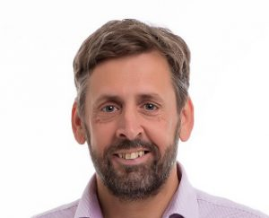

Jakob is a current  [Microsoft Azure MVP](https://mvp.microsoft.com/en-us/PublicProfile/4039620?fullName=Jakob%20Ehn) (former Visual Studio/ALM MVP) and also a [Visual Studio ALM Ranger](http://blogs.msdn.com/b/willy-peter_schaub/archive/2011/11/10/introducing-the-visual-studio-alm-rangers-jakob-ehn.aspx). Jakob has over 15 years of experience in the IT industry, and currently works as a senior developer and cloud solution architect at [Active Solution](http://activesolution.se) in Stockholm, Sweden, specializing in Cloud Archicture and DevOps.

Jakob has published several books on the topic of DevOps on the Microsoft stack, read more about them [here](http://blog.ehn.nu/books/).

He has also spoken on several different conferences and user groups, including DevSum, TechDays, WinOps and NDC. Read about upcoming and past speaking engagement [here](http://blog.ehn.nu/speaking/)
