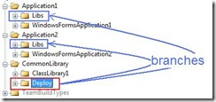
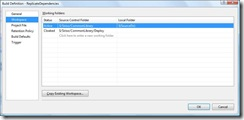

A very common question from people is how to handle dependencies between projects/applications/team projects in TFS source control. A typical scenario is that you a common library/framework tucked away nicely somewhere in TFS source control, and now you have some applications that, in some way, needs to reference this project.

My colleague [Terje](http://geekswithblogs.net/terje) has written an article on what he calls “Subsystem branching”, in which he talks about different ways to organize your source code in order to solve the above problem. Ther article can be found here: \
[http://geekswithblogs.net/terje/archive/2008/11/02/article-on-subsystem-branching.aspx](http://geekswithblogs.net/terje/archive/2008/11/02/article-on-subsystem-branching.aspx "http://geekswithblogs.net/terje/archive/2008/11/02/article-on-subsystem-branching.aspx")

I won’t go through all the different scenarios again, but thought that I’d show how we do it. We normally use Terje’s solution 3 and 3b, namely **Binary deployment branching** with or without merging. Shortly, this means that we setup a team build for our common library that we start manually when we have checked in changes that need to be replicated to the applications that are dependent on the library. This build (in addition to compiling, testing and versioning) checks in the library outputs (typically *.dll and *.pdb) into a Deploy folder. This folder is branched to all dependent applications. After the checkin, we merge the folder to the application(s) that will be built against the new version of the library.

As Terje mentions, another approach to this problem is the [TFS Dependency Replicator](http://tfsdepreplicator.codeplex.com/) which is a very nice tool that automates copying the dependencies between different parts of the source control tree. The main objective that we have with that approach is that using copying gives you no traceability. You have no easy way to see which applications use which version of which library.

In this post, I thought I would show how to implement this using TFS Team Build. We will implement solution 3b from Terje’s post, which means that efter we check in the binaries from the library build, we will automatically merge those binaries to the dependent projects.

**\
Custom Task or “plain” <Exec>? \**I considered implementing a custom task to implement this kind of dependency replication. The problem however, is that once you start wrapping functionality in the TFS source control API, you find that you often end up reimplementing lots of stuff to not make the task to simplistic. There are myriads of options for the tf.exe commands, and different scenarios often require different usage of the commands. So to keep it flexible, I suggest that you use the command line tool tf.exe instead when you are working against TFS source control.  On the downside, you need to learn a bit more MSBuild…. :-)

**Sample Scenario**

[](http://gwb.blob.core.windows.net/jakob/WindowsLiveWriter/ImplementingDependencyReplicationwithTFS_C65D/BranchScenario_6.jpg)

We have one CommonLibrary project, which just contains a ClassLibrary1 project. In addition, we have the *Deploy* folder that is used for the resulting binary. Then we have two applications (Application1 and Application2) that each simple contains a WpfApplication project.In addition, each application has a *Libs* folder that is a branch from the Deploy folder. (The Deploy/Libs names have become a naming convention for us).So, we want a release build for CommonLibrary that builds the ClassLibrary1 assembly and checks it in to the Deploy folder, and then merges it to Application1Libs and Application2Libs.\
**\
Workspace Mappings**\
Now, before starting to go all MSbuild crazy, we need to discuss what the workspace for this build definition should look like. First of all, the workspace for the CommonLibrary build should not include anything from the dependent applications. This means that we must dynamically include the Libs folders into the build workspace as part of the build, to be able to perform the merge. Also,we really don’t want the Deploy folder to be part of the workspace for the build. If it is, the changesets that are created by the build will show up as associated changesets for the build, which is really not relevant since they contain the *outputs* of the build. So, the workspace mapping for our build definition looks like this: \



**Implementing the Build** \
The steps that we need to implement in our team build is:

1. Decloak the Deploy folder into the current workspace and peform a check out
2. Copy the build output to the Deploy folder and check it back in
3. Add the Libs folders to the current workspace
4. Merge the Deploy folder to the Application1/2Libs and check everything in

All these steps uses the [Team Foundation Source Control Command-Line](http://msdn.microsoft.com/en-us/library/cc31bk2e(VS.80).aspx) tool (tf.exe) to perform operations on TFS source control.

We start off by defining some properties and items for the source and destination folders:

```
<PropertyGroup>
```

```bash
  <TF>"$(TeamBuildRefPath)..tf.exe"</TF>
  <ReplicateSourceFolder>$(SolutionRoot)Deploy</ReplicateSourceFolder>
</PropertyGroup>
```

```
<ItemGroup>
  <ReplicateDestinationFolder Include="$(BuildProjectFolderPath)/../../Application1/Libs">
    <LocalMapping>$(SolutionRoot)Destination1</LocalMapping>
  </ReplicateDestinationFolder>
  <ReplicateDestinationFolder Include="$(BuildProjectFolderPath)/../../Application2/Libs">
    <LocalMapping>$(SolutionRoot)Destination2</LocalMapping>
  </ReplicateDestinationFolder>
</ItemGroup>
```

Note the *LocalMapping* metadata that we define for each ReplicateDestinationFolder item. This will be used later on when modifying the workspace. \
**Step 1:**

```
<Target Name="AfterEndToEndIteration">
```

```
  <!-- Get and checkout deploy folder-->
  <MakeDir Directories="$(ReplicateSourceFolder)"/>
  <Exec Command="$(TF) workfold /decloak ." WorkingDirectory="$(ReplicateSourceFolder)" />
  <Exec Command="$(TF) get "$(ReplicateSourceFolder)" /recursive"/>
  <Exec Command="$(TF) checkout "$(ReplicateSourceFolder)" /recursive" />
```

We put the logic in the *AfterEndToEndIteration* target, which is executed when

**Step 2:**

```
<!-- Copy build output to deploy folder and check in -->
   <Copy SourceFiles="@(CompilationOutputs)" DestinationFolder="$(ReplicateSourceFolder)"/>
   <Exec Command="$(TF) checkin /comment:"Checking in file from build" "$(ReplicateSourceFolder)" /recursive"/>
```

We use the nice *CompilationOutputs* item group that was added in TFS 2008, which contains all output from every configuration that is built. Note that this won’t give you the *.pdb though. \
**Step 3:**

```
<!-- Add destination folders to current workspace -->
    <Exec Command="$(TF) workfold /workspace:$(WorkspaceName) "%(ReplicateDestinationFolder.Identity)" "%(ReplicateDestinationFolder.LocalMapping)""/>
```

Here we use MSBuild batching to add a workspace mapping for each destination folder into the current workspace. We pass the *%(ReplicationDestinationFolder.Identity)* as the source parameter to the merge command, and we send the *%(ReplicationDestinationFolder.LocalMapping)* as the destination parameter, which we defined previously´ \
**Step 4:**

```
<!-- Merge to destinations and check in-->
<Exec Command="$(TF) merge "$(ReplicateSourceFolder)" "%(ReplicateDestinationFolder.LocalMapping)" /recursive"/>
<Exec Command="$(TF) checkin /comment:"Checking in merged files from build" @(ReplicateDestinationFolder->'"%(LocalMapping)"', ' ') /recursive"/>
```

So, every build will result in two checkins, first the check-in of the file(s) to the Deploy folder, and the a check-in for all merged binaries. \
**Note:** I haven’t added any error handling. Typically you would add a OnError to the target that performs a *tf.exe undo /recursive* to undo any checkouts.

---

## Comments

*Imported from the original WordPress site. Closed for new replies.*

> **Johannes Urke** — 29 Apr 2009
>
> Originally posted on: <http://geekswithblogs.net/jakob/archive/2009/03/05/implementing-dependency-replication-with-tfs-team-build.aspx#469838>
>
> Awesome post Jakob. We are setting up automatic dependency publishing for a customer using team build, and you pointed out a lot of things we hadn't thought of. (Setting workspace during build, using branch/merge instead of file copy, etc.)\
> \
> Thank you very much for sharing!

> **Ryan Feagley** — 03 Jun 2010
>
> Originally posted on: <http://geekswithblogs.net/jakob/archive/2009/03/05/implementing-dependency-replication-with-tfs-team-build.aspx#522513>
>
> Great Post!! I'm very interested in using the 3b strategy. At this point I'm using TFS 2010. I'm hoping you might be interested in updating this post to incorporate the new WF 4 format in 2010. Thanks for the excellent blogging!!

> **Christian Jacob** — 05 Sep 2010
>
> Originally posted on: <http://geekswithblogs.net/jakob/archive/2009/03/05/implementing-dependency-replication-with-tfs-team-build.aspx#536476>
>
> I second this! Awesome post. However, as Ryan already asked, could you write an update that shows up how to achieve something like that using Workflow Activities on Team Build 2010?

> **Saif** — 21 Sep 2010
>
> Originally posted on: <http://geekswithblogs.net/jakob/archive/2009/03/05/implementing-dependency-replication-with-tfs-team-build.aspx#539271>
>
> Excellent post. Can you please update this for TFS 2010.

> **Hassan** — 06 Apr 2011
>
> Originally posted on: <http://geekswithblogs.net/jakob/archive/2009/03/05/implementing-dependency-replication-with-tfs-team-build.aspx#572515>
>
> Great Post, but when can we get some update of this for tfs2010?

> **villecoder** — 10 Jun 2011
>
> Originally posted on: <http://geekswithblogs.net/jakob/archive/2009/03/05/implementing-dependency-replication-with-tfs-team-build.aspx#581512>
>
> For those of you landing here looking for a solution to TFS 2010, he has one posted. The URL is http://geekswithblogs.net/jakob/archive/2010/12/08/dependency-replication-with-tfs-2010-build.aspx .
