VSTS 2010 Beta 1 is finally available. Beta 1 is a huge release a contains tons of new functionality in almost all areas of Team System. We at [Osiris Data](http://www.osiris.no) have been using Team System since the first beta, and we also help our customers how to adopt TFS in their organization. So for us VSTS 2010 is a very exciting release.

I am planning to post several blog entries about the new functionality of VSTS 2010, in particular I will focus on Team Foundation Server (TFS) and Team Build. I have been working a lot with Team Build 2005 and 2008 and have been looking forward to the 2010 release. VSTS 2008 was a minor release for TFS, so a lot of missing features and change requests haven’t been implemented until now.

So, in this blog post I will run through the new functionality in Team Build 2010, and then I will follow up with several blog posts that go into more detail on the different areas.

**Build Controllers lets you pool your builds \**In TFS 2005/2008 you could only assign a team build to one build agent. In 2010, you assign a team build to a *Build Controller* instead. The Build Controller will now be responsible for managing a custom pool of *Build Agents* and will select aBuild Agent to run the Team Build The following screenshot show the Manage Build Controllers dialog which in this case show one build controller that contains two build agents.

[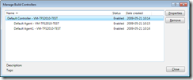](http://gwb.blob.core.windows.net/jakob/WindowsLiveWriter/TFSTeamBuild2010WhatsNew_145CB/image_2.png)

Often you need to have several different build agents that have different configurations. For example, you might need .NET 3.5 SP1 on one build agent to be able to build applications that rely on SP1, but then you have apps that still need to be built *without* SP1 installed. In 2010, you can use *tags* to tell Team Build which build agent to choose. You create the tags in the Build Agent Properties dialog:

[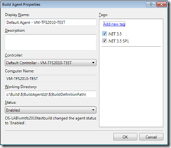](http://gwb.blob.core.windows.net/jakob/WindowsLiveWriter/TFSTeamBuild2010WhatsNew_145CB/image_4.png)

To assign a build definition to one or more tags, you use the *Agent Requirements* property in the process tab of the build definition:

[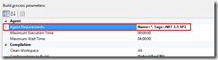](http://gwb.blob.core.windows.net/jakob/WindowsLiveWriter/TFSTeamBuild2010WhatsNew_145CB/image_8.png)

**Build Process are defined using Windows Workflow 4.0 \**Team Build 2005 and 2008 relies solely upon MSBuild to drive the build process. MSBuild is a powerful language designed for building applications. It is also lets you extend the build process by using *tasks* which are .NET classes that implement a certian interface.

The problem with MSBuild is that the learning curve is rather steep, it is quite unintuitive for most people. In addition, Team Build 2005/2008 hides the entire build process in a separate targets file. Although this does hide all the hairy details from the user from , it also makes customizing a team build very complex. The order in which the team build targets are executed is very hard to visualize by just looking at the MSBuild file. One of the most common questions from team build users is *I want to run my things after my project is built/tested/dropped, how do I do it?*

2010 to the resuce! The build process of a team build is now completely driven by Windows Workflow 4.0. This means a whole new UI for editing your build process, and you need to learn how to write/use workflow activities when you need to extend your builds instead of MSBuild. Here is a snapshot of parts of a build process in the workflow designer in VSTS 2010, and also the Toolbos with some of the available team build activities:

[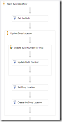](http://gwb.blob.core.windows.net/jakob/WindowsLiveWriter/TFSTeamBuild2010WhatsNew_145CB/image_10.png)            [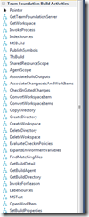](http://gwb.blob.core.windows.net/jakob/WindowsLiveWriter/TFSTeamBuild2010WhatsNew_145CB/image_12.png)

You should recognize most of the activities from the corresponding team build tasks in Team Build 2005/2008. The default build process is still the same, get the sources, label the sources, build the projects, test the projects etc.

So now the entire build process is visible when extending a team build. For most times, you don’t have to change the build process itself, but just modify the build properties to fit your needs. There are several new build properties that lets you customize the build that previously was quite difficult/cumbersome:

[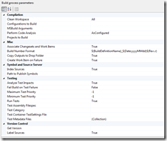](http://gwb.blob.core.windows.net/jakob/WindowsLiveWriter/TFSTeamBuild2010WhatsNew_145CB/image_24.png)

I will go into more detail on these properties in an upcoming blog post.

**Reusing Build Definitions using Build Process Templates \**When creating builds for a larger system, you often find yourself defining a set of builds (CI, Nightly, Release etc) for the different applications. These builds are often defined using the exact same (or very similar) build definition process. In TFS 2005/2008, there is no way to easily resuse build definitions as templates for new builds.

TFS 2010 supports this by adding a feature called *Build Process Templates.* When creating a new build, you select from a list of build process templates that contain the actual build process. These templates are workflow XAML files that are located in source control  in the TeamBuildProcessTemplates folder:

[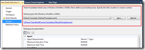](http://gwb.blob.core.windows.net/jakob/WindowsLiveWriter/TFSTeamBuild2010WhatsNew_145CB/image_22.png)

By default, there are two build process templates when you create a new team project, *DefaultTemplate* and *UpgradeTemplate*. DefaultTemplate is the standard build process that performs a complete build of your app. The UpgradeTemplate is a sort of placeholder build template that is used to execute legacy TFSBuild.proj files. This means that you can still use your existing team build definitions when upgrading to TFS 2010.

In a later post, I will show how you can create new build process templates for your particular scenarios, and how to share them between team projects.

**The Build Summary and Log is now readable! \**The Build summary screen has also been completely rewritten and lets you find the problem with the build much faster than in previous versions of Team Build. It also contains much more information, such as build times compared to the 9 previous builds and the list of properties that were sent into the build. Here is a screenshot of the Build Summary and the Activity Log:

[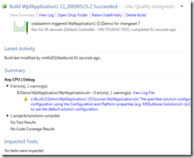](http://gwb.blob.core.windows.net/jakob/WindowsLiveWriter/TFSTeamBuild2010WhatsNew_145CB/image_14.png)         [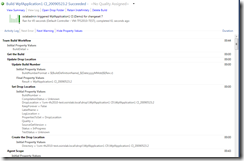](http://gwb.blob.core.windows.net/jakob/WindowsLiveWriter/TFSTeamBuild2010WhatsNew_145CB/image_16.png)

For more info about these screens, check out Jason Prickett’s blog: [http://blogs.msdn.com/jpricket/archive/2009/05/12/tfs-2010-beta1-build-details-view-summary-section.aspx](http://blogs.msdn.com/jpricket/archive/2009/05/12/tfs-2010-beta1-build-details-view-summary-section.aspx "http://blogs.msdn.com/jpricket/archive/2009/05/12/tfs-2010-beta1-build-details-view-summary-section.aspx"), [http://blogs.msdn.com/jpricket/archive/2009/05/18/tfs-2010-beta1-build-details-view-log-view-section.aspx](http://blogs.msdn.com/jpricket/archive/2009/05/18/tfs-2010-beta1-build-details-view-log-view-section.aspx "http://blogs.msdn.com/jpricket/archive/2009/05/18/tfs-2010-beta1-build-details-view-log-view-section.aspx")

**Gated Checkins, a.k.a No More Broken Builds \**The gated checkin is a feature that has been requested for a long time and exisst in other build labs. The idea is very simple, when a checkin occurs, you want to ensure that that checkin does not break the build. At certain stages in a project, such as in the stabilization phase, broken builds cause lots of grief with people trying to fix the build to be able to push out a new version of the application to the testers. Team Build 2010 implements this by performing whats known as a *Private Build* in isolation from the source control system. This means that if the private build is succesful, the checkin will be executed. But if the build fails, the checkin will **not** be executed.

You turn on Gated checkin for a build by modifying the trigger of the build definition: \

[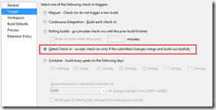](http://gwb.blob.core.windows.net/jakob/WindowsLiveWriter/TFSTeamBuild2010WhatsNew_145CB/image_18.png)

When a user tries to check in something that will trigger this build (e.g. inside the workspace of the build), the following dialog is shown: \

[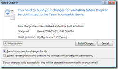](http://gwb.blob.core.windows.net/jakob/WindowsLiveWriter/TFSTeamBuild2010WhatsNew_145CB/image_20.png)

If the checkin affects several builds with the Gated Checkin trigger turned on, the user have to choose one of these builds.

Btw, there is an open source project on CodePlex that implements a variation of this for TFS 2008 called *Buddy Build*: [http://www.codeplex.com/BuddyBuild](http://www.codeplex.com/BuddyBuild "http://www.codeplex.com/BuddyBuild")

----------------------------------

Alright, I think that is enough for a summary post of the new features of Team Build 2010. As I mentioned previously, I will write several posts where I go into more detail on these new features and how they compare to the existing functionality in TFS 2005/2008.

Happy building!

---

## Comments

*Imported from the original WordPress site. Closed for new replies.*

> **Leo Kushnir** — 19 Jan 2010
>
> Originally posted on: <http://geekswithblogs.net/jakob/archive/2009/05/23/tfs-team-build-2010-whatrsquos-new.aspx#502483>
>
> Very Nice,\
> Thanks

> **Derik Whittaker** — 08 Mar 2010
>
> Originally posted on: <http://geekswithblogs.net/jakob/archive/2009/05/23/tfs-team-build-2010-whatrsquos-new.aspx#508344>
>
> How do you get the the WWF setup screens when creating a build? I cannot find them anyplace.

> **rrr** — 31 May 2010
>
> Originally posted on: <http://geekswithblogs.net/jakob/archive/2009/05/23/tfs-team-build-2010-whatrsquos-new.aspx#521917>
>
> I have installed VS2010 ultimate and tried to create a new build definition using TFS 2010. However, I cannot find the "process tab". The Project file is still present, although i cannot create new .proj file. pls healp me,regarding this issue. I suspects, that I have not installed it properly. Or is there anything more i should do, other than just installing the visual studio 2010.

> **Hao** — 06 Jun 2010
>
> Originally posted on: <http://geekswithblogs.net/jakob/archive/2009/05/23/tfs-team-build-2010-whatrsquos-new.aspx#522985>
>
> i have the same problem with rrr. When i create a new build definition. no "process" tab, instead there is "project file" tab.

> **Jeremy** — 20 Jul 2010
>
> Originally posted on: <http://geekswithblogs.net/jakob/archive/2009/05/23/tfs-team-build-2010-whatrsquos-new.aspx#529186>
>
> Thanks dude, the info on the Build Agent Tags hit the spot.

> **Scott** — 03 Aug 2010
>
> Originally posted on: <http://geekswithblogs.net/jakob/archive/2009/05/23/tfs-team-build-2010-whatrsquos-new.aspx#531331>
>
> Jim,\
> \
> Our company has a central source repository using TFS2008. We would like to perhaps use our company's central source repository, however we also would like to use Team Build 2010. Is there anyway to somehow get the source out of TFS2008 and still use TFS build 2010 on a separate machine?\
> \
> Thanks,\
> \
> Scott

> **Jakob Ehn** — 03 May 2011
>
> Originally posted on: <http://geekswithblogs.net/jakob/archive/2009/05/23/tfs-team-build-2010-whatrsquos-new.aspx#576603>
>
> @Bill You can install Team Build using the TFS installer. See this link for info: \
> http://msdn.microsoft.com/en-us/library/ms181712.aspx\
> \
> /Jakob

> **SivaKumar** — 12 Oct 2011
>
> Originally posted on: <http://geekswithblogs.net/jakob/archive/2009/05/23/tfs-team-build-2010-whatrsquos-new.aspx#596628>
>
> Nice post, its very useful

> **Ashu :)** — 09 Feb 2012
>
> Originally posted on: <http://geekswithblogs.net/jakob/archive/2009/05/23/tfs-team-build-2010-whatrsquos-new.aspx#607475>
>
> Exactly what I was looking for...Thanks for the info :)
