*Disclaimer: This blog post discusses features in the TFS 2010 Beta 1 release. Some of these  features might be changed in the RTM release. \*\
In my [last post](http://geekswithblogs.net/jakob/archive/2009/05/23/tfs-team-build-2010-whatrsquos-new.aspx) I talked about the new major features of Team Build in TFS 2010. This time, I will go into more detail on how you work with build definitions. In TFS 2010, the whole build process is now implemented on top of Windows Workflow Foundation 4.0 (WF4). This means that everything that has to do with creating and customizing builds in TFS 2010 is now done using a workflow designer UI. This means that you no longer have to remember all the different MSBuild targets when you want to insert some custom logic in your build. On the other hand, you obviously need to understand how a default team build process is implemented, which activities does what, what WF properties and variables that exist. And eventually you might also have to learn how to implement custom workflow activites when you need more functionality than what is included in the standard team build activities.

Note that MSBuild is still used to actually compile all the projects. The output from the compilations are available in a separate log file that is available from the build summary view.

So, lets create a new build definition. When you select the New Build Definition menu item, you get a dialog that looks very much like the one in TFS 2008.

**General \**This tab just contains the name and the description of your build. There is also a checkbox that lets you disable the build definition, in case you want to work on it more before making it enabled.

[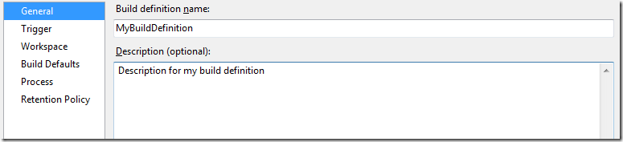](http://gwb.blob.core.windows.net/jakob/WindowsLiveWriter/WorkingwithBuildDefinitionsinTFSTeamBuil_C591/image_19.png)

**Trigger \**Here you define how this build should be queued. The only new option here in 2010 is *Gated Check-in*, which is a very cool feature that will stop you from check in in anything that breaks the build.

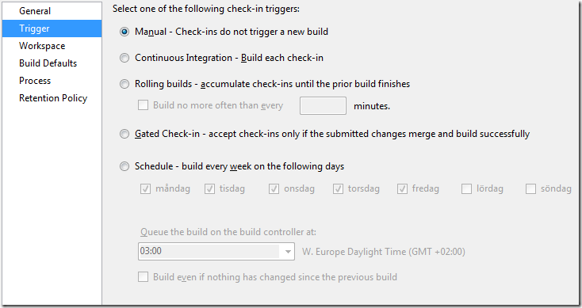

**Workspace** \
This tab has not changed since 2008. Here you define the workspace for the build, i.e. what part of the source control tree that should be downloaded as part of the build. Here I set the $/Demo/WpfApplication1 as my workspace root. You always want to make your workspace as small as possible to speed up build time.

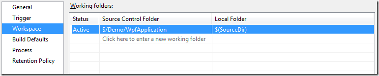

**Build Defaults \**In the previous version of Team Build you select which build agent that should run the build. In 2010, you now select a *Build Controller.* The build controller manages a pool of build agents that will be selected by an algorithm that takes into account the queue length on each build agent, in a round-robin fashion (although this algorithm is not yet documented, and it is not clear if you can implement your own algorithm)

In addition to must enter the drop location for the build.

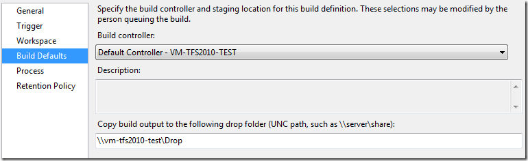

**Process**

Now we come to the interesting part! Here you select the *Build process file*, which is a Windows Workflow XAML file that must be located somewhere in your TFS source control repository. By default for all new team projects, there are two build process files created automatically, *DefaultTemplate* and *UpgradeTemplate.* The default template is the standard Team Build process, with the get, label, compile etc.. The UpgradeTemplate process file can be used to execute legacy builds, i.e. TFSBuild.proj files.

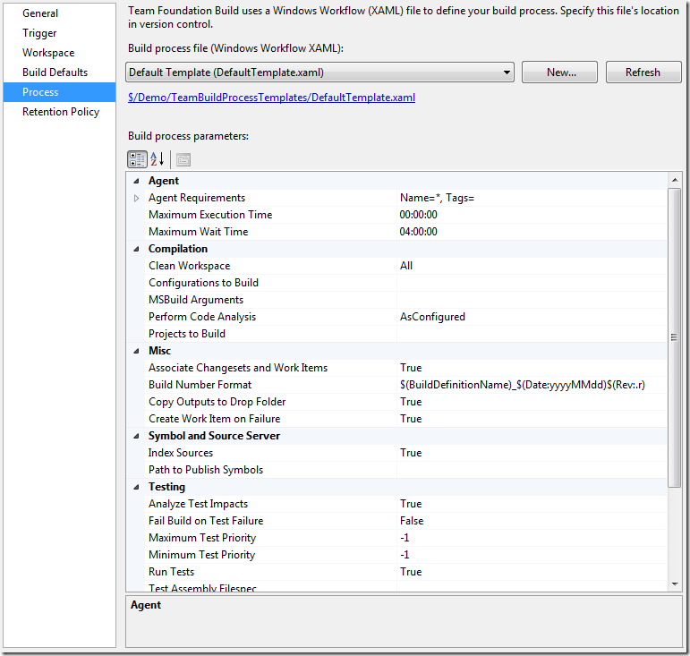

This functionality, e.g. selecting a build process template from a list, is in itself a nice improvement from earlier versions where you always had to create a standard build process and the modify the TFSBuild.proj accordingly. (Lots of people instead wrote applications that create TFSBuild.proj programattically to simplify the process).

However, you should not use the default template as the process file for your builds. Instead you should create a new template from the default template and use this one instead. You do this by clicking on the *New* button:

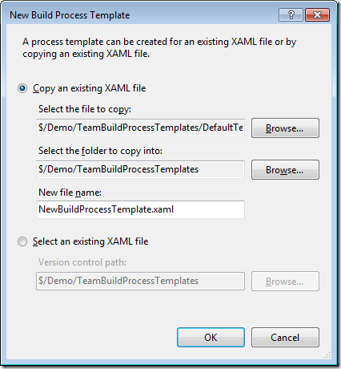

This mechanism lets you create a set of build process templates (for example you can have one template for CI builds, one for nightly builds, one for relase builds etc… These templates can be stored in a dedicated location in source control and any changes to them should only be allowed for the build managers. Application developers can then setup new builds from the existing templates and should only need to modify the parameters (see below) which are not part of the template but stored together with the build definition.

You can view and/or edit the build process file by clicking the link which takes you to the source control explorer, then double-click the xaml file to open it up in the workflow designer. The following (slightly MSPaint hacked) screen shot show you the top level process of the DefaultTemplate build process:

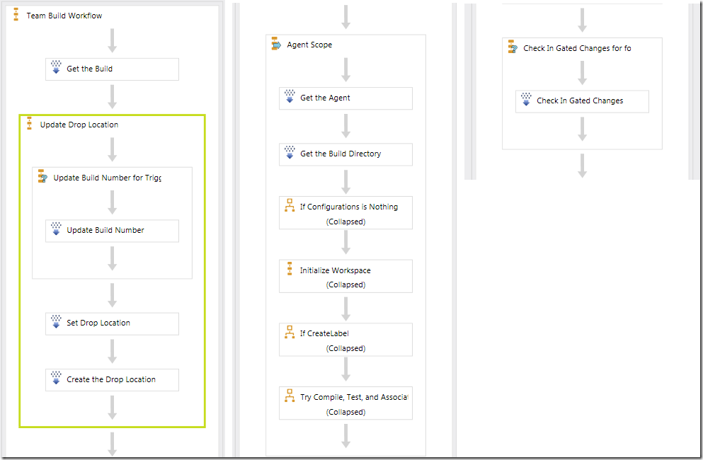

You can drill-down into the different activities to see how the process is designed. In my next post I will show how to customize the build process by adding new activities to it.

When you have selected the build process template, you then go through the parameters of the build. The properties are defined in the build process as *arguments* to the workflow and corresponds to the MSBuild properties in the previous versions. If you have used team build before, you’ll definitely recognize many of the properties. The most important ones are:

|  |  |  |
| --- | --- | --- |
| **Build Process Parameter** | **Meaning** | **Sample** |
| Projects to Build | The list of build projects |  |
| Configurations to Build | The list of configurations to build, on the format configuration|platform | Debug|Any CPU, Release|Any CPU |
| Build Number Format | The format of the unique build number that is generated for each build | $(BuildDefinitionName)_$(Date:yyyyMMdd)$(Rev:.r) |
| Clean Workspace | Controls what artifacts that should be deleted before the build starts. | **All** – Deletes both sources and outputs (Full rebuild)   **Outputs** – Deletes outputs, and get only the sources that have changed (Incremental Get)   **None** = Leave existing outputs and sources in place (Incremental Build) |
| MSBuild Arguments | Additional command line arguments to pass to MSBuild.exe. | /p:Configuration=Debug |
| Associate Changesets and Work Items | Control if Team Build should associate changesets and work items with the build | True/False. Consider False for continuous builds to speed them up. |

**Retention Policy \**In this tab you select how builds should be retained. Note that you now can select a different configuration for manual/triggered builds and private build.Private here means builds with the Gated Check-in trigger enabled. You will typically want to retain fewer private builds compared with the manual/triggered builds:

Ok, you are done! Save the build definition and queue a build in the team explorer. When the build finishes, double click it to see the Build summary view:

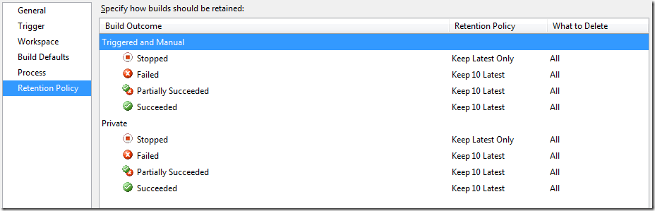

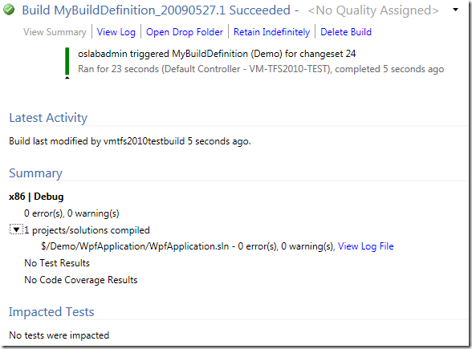

For a detailed view of the build, click the *View Log* link:

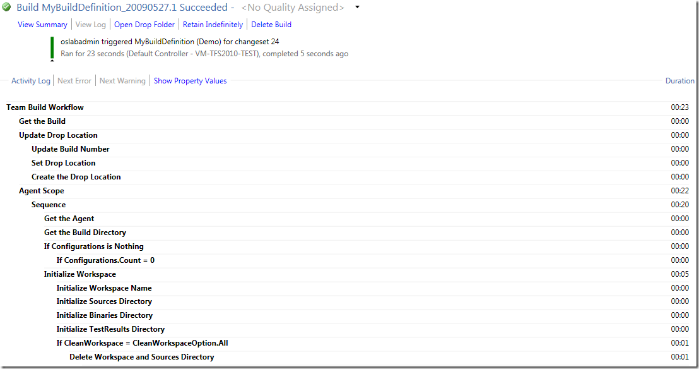

A nice feature here is the *Show Property Values* link. This show the log, but in addiotn it shows each in/out property for each activity. This is very useful when trying to troubleshoot a failing build:

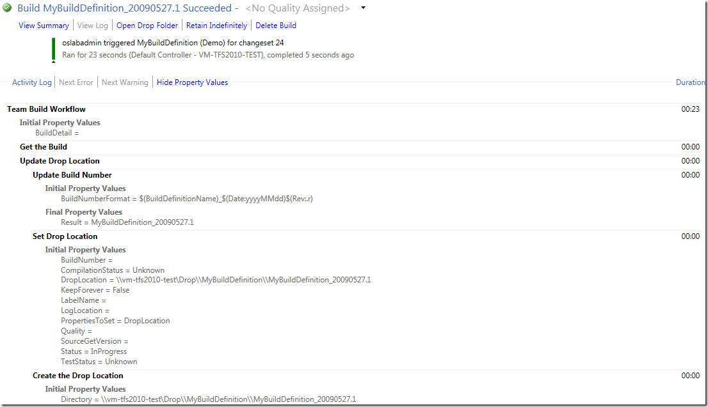

OK, this was a quick walkthrough of how to create a basic build definition in Team Build 2010. In my next post, I will show how to customize the build process using the workflow designer!

---

## Comments

*Imported from the original WordPress site. Closed for new replies.*

> **Bob Hardister** — 09 Jun 2009
>
> Originally posted on: <http://geekswithblogs.net/jakob/archive/2009/05/27/working-with-build-definitions-in-tfs-team-build-2010.aspx#476671>
>
> Nice start! Would love to see a clean mapping of activity parameters to TFS MS build properties from prior TFS versions.

> **Craig Tadlock** — 26 Dec 2009
>
> Originally posted on: <http://geekswithblogs.net/jakob/archive/2009/05/27/working-with-build-definitions-in-tfs-team-build-2010.aspx#500274>
>
> Nice site! I've done a lot of work on customizing the TFS 2010 build process as well...\
> \
> http://www.tadlockenterprises.com/?s=tfs+2010+build\
> \
> CT

> **Andr&#233; Gustavo Poffo** — 14 May 2010
>
> Originally posted on: <http://geekswithblogs.net/jakob/archive/2009/05/27/working-with-build-definitions-in-tfs-team-build-2010.aspx#519569>
>
> "In my next post I will show how to customize the build process by adding new activities to it."\
> \
> Where's it? :)

> **Hesheng Bao** — 15 Jul 2010
>
> Originally posted on: <http://geekswithblogs.net/jakob/archive/2009/05/27/working-with-build-definitions-in-tfs-team-build-2010.aspx#528617>
>
> Do you have any idea how to launch an external process right after a build completes successfully?

> **Buildy** — 29 Jul 2010
>
> Originally posted on: <http://geekswithblogs.net/jakob/archive/2009/05/27/working-with-build-definitions-in-tfs-team-build-2010.aspx#530407>
>
> My upgradetemplate.xaml is not opening in the workflow designer. It is throwing about 50 errors that it does not have reference to system.common and other dlls. is it a common issue.

> **Marilou** — 02 Feb 2011
>
> Originally posted on: <http://geekswithblogs.net/jakob/archive/2009/05/27/working-with-build-definitions-in-tfs-team-build-2010.aspx#560792>
>
> Hi - Great info. I look forward to digging in some more. I'm interested in how to let the builder specify a Label to build. So the code ready for release can be labeled, then they can build just the release files. (so changes made to code after the label are excluded). Do you have info on that? The "What do you want to build?" field is disabled for me.

> **murali** — 21 Feb 2011
>
> Originally posted on: <http://geekswithblogs.net/jakob/archive/2009/05/27/working-with-build-definitions-in-tfs-team-build-2010.aspx#563844>
>
> There is any way to view the build definition change log. Since some one change my definition of build and i want to know what changes have made and by whom.

> **Anil** — 11 Aug 2011
>
> Originally posted on: <http://geekswithblogs.net/jakob/archive/2009/05/27/working-with-build-definitions-in-tfs-team-build-2010.aspx#589461>
>
> This Explanation is very good for the beginner in the field of VS 2010. I will say it GOOD WORK

> **shashank kulkarni** — 17 Jan 2012
>
> Originally posted on: <http://geekswithblogs.net/jakob/archive/2009/05/27/working-with-build-definitions-in-tfs-team-build-2010.aspx#605808>
>
> This Explanation is very good for the beginner in the field of VS 2010. Thank you.

> **Abhijeet** — 01 Feb 2012
>
> Originally posted on: <http://geekswithblogs.net/jakob/archive/2009/05/27/working-with-build-definitions-in-tfs-team-build-2010.aspx#606902>
>
> Hi, Actaully i am trying to create a Continous Integration(CI) server. The above article was really helpful and only problem i am facing is how to create a 'Build process file' from scratch. This is first time i am setting a CI server. And have no template file to make a copy of it. Can i get a existing Build process file so that i can customize it as per my requirment

> **Peter Thelander** — 27 Mar 2012
>
> Originally posted on: <http://geekswithblogs.net/jakob/archive/2009/05/27/working-with-build-definitions-in-tfs-team-build-2010.aspx#611053>
>
> Hi, and thanks for the info. Can you tell me how it is possible to read/write a build definition from the command line, eg using the tf command or similar? Because in our dev environment we have many build definitions, and so working on them through the UI is too time consuming. We need to write a script to make bulk changes to many build definitions. Is it checked in to TFS like other files? or how can it be accessed? Thanks!

> **Jakob Ehn** — 18 Apr 2012
>
> Originally posted on: <http://geekswithblogs.net/jakob/archive/2009/05/27/working-with-build-definitions-in-tfs-team-build-2010.aspx#612206>
>
> @Peter: If you need to do bulk operations on buildsm check out the Community TFS Build Manager which is perfect for this.\
> \
> http://geekswithblogs.net/jakob/archive/2011/12/30/introducing-community-tfs-build-manager.aspx\
> \
> /Jakob

> **Prakash Mishra** — 28 May 2014
>
> Originally posted on: <http://geekswithblogs.net/jakob/archive/2009/05/27/working-with-build-definitions-in-tfs-team-build-2010.aspx#638031>
>
> Nice and Easy explanation. I have one question regarding the logging of the activities it loads very slow in the TFS. Is there any way to improve it for a good tracing experience or is there any way to save this log details into a text file that will easily help us in tracing the build through log.
