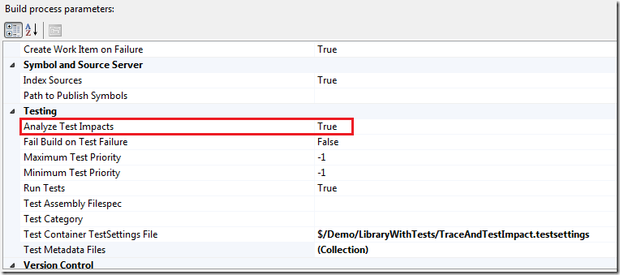
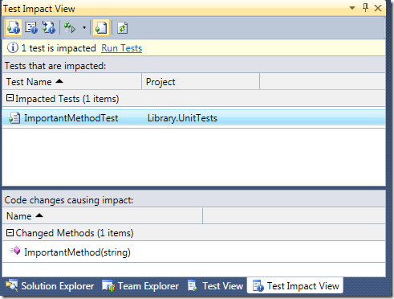
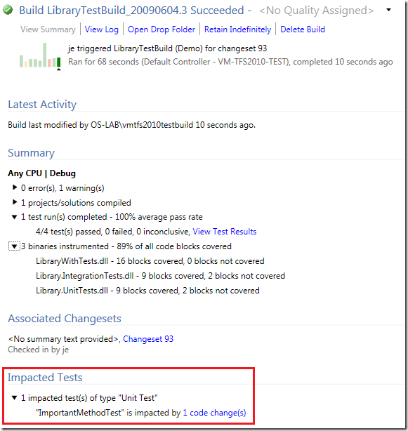
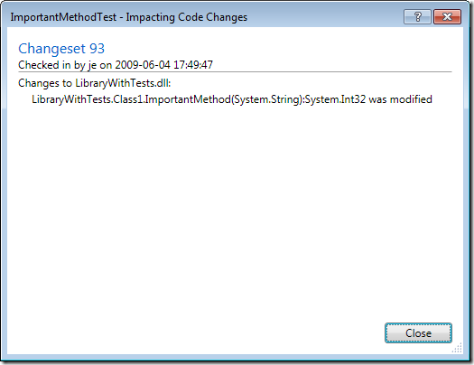

A really cool new feature in VSTS 2010 is *Test Impact Analysis* which let developers view what tests that are affected by the current code changes. Pieter Gheysens wrote a [blog post](http://intovsts.net/2009/02/05/test-impact-analysis/) on how to set this up in the CTP, but things have changed a bit in Beta 1 so I thought that I would show how it is done. Since it still is a bit unintuitive to enable it, it might change once again in the RTM. The reason that it is a bit unintuitive to set it up, is because you need to have the following things:

- You must use Test Metadata files when running your tests. You can’t use Test Assemblies \
- You must have code coverage enabled in your test settings. VSTS use the code coverage information from a test run to determine which tests that are impacted by a code change. \
- You must setup a team build in TFS with test impact analysis enabled. The build will publish the test results including the code coverage information and VSTS will read information from this build.

So, lets set it up:

1. First you will (obviously) need a solution containing some tests. Note that I don’t explicitly write unit tests here, because it might as well for example web tests. Check in your solution. \
2. Enable Code Coverage for you current test settings. See my [previous post](http://geekswithblogs.net/jakob/archive/2009/06/03/tfs-team-build-2010-running-unit-tests.aspx) on how to do this \
3. Create a new team build and select your solution. Then set the *Analyze Test Impacts* parameter to true \
    \
4. Select the *Test Container TestSettings File* and make sure that it is the one in which you have enabled code coverage. In the figure above, I have selected *$/Demo/LibraryWithTests/TraceAndTestImpact.testsettings \
   \*
5. Save the build definition and queue a new build. Make sure it finishes successfully and that the tests were executed \
6. Now, change some code that you know is called by one or more tests. \
7. Switch to the *Test Impact View,* that is located in the Test –> Windows submenu. First off you can select the button on the top left, called  *Show Impacted Tests*, that will show all tests that are impacted by all your current code changes.In this case, one test was impacted (ImportedMethodTest). When you select the test, you can see in the bottom part of view what code changes that caused the impact \
    \
   The next button  is called *Show Code Changes* and shows the opposite information, e.g. what code changes that has been done, and for each code change it lists the affected test. \
   Note that there is *Run Tests* link in the view. This is also available as a button. This lets you run all the tests that are affected by your code change. This is a very nice feature, that will speed up your development considerably (at least if you have many tests….) \
8. Check in your code change and queue a new build. When the build finishes, open the build summary. This will show you, in addition to the test and code coverage information, what tests that were impacted. \
    \
   If you click the *1 code change(s)* link next to the test, a dialog that lists all the methods that had impact on that test is shown \
    \

---

## Comments

*Imported from the original WordPress site. Closed for new replies.*

> **Subodh Sohoni** — 24 Jul 2009
>
> Originally posted on: <http://geekswithblogs.net/jakob/archive/2009/06/04/vsts-2010-enabling-test-impact-analysis.aspx#482747>
>
> Great posts on TFS 2010 Build and its new features!

> **Murthy** — 28 Aug 2009
>
> Originally posted on: <http://geekswithblogs.net/jakob/archive/2009/06/04/vsts-2010-enabling-test-impact-analysis.aspx#485979>
>
> Thnks for the info..it was very useful for me

> **kidney stones symptoms** — 28 Oct 2009
>
> Originally posted on: <http://geekswithblogs.net/jakob/archive/2009/06/04/vsts-2010-enabling-test-impact-analysis.aspx#492061>
>
> Thnks for the info..it was very useful for me

> **Blackie** — 13 Dec 2009
>
> Originally posted on: <http://geekswithblogs.net/jakob/archive/2009/06/04/vsts-2010-enabling-test-impact-analysis.aspx#498727>
>
> how about having it only run tests which have been impacted by the code changes?

> **Chris Kirschke** — 07 Apr 2010
>
> Originally posted on: <http://geekswithblogs.net/jakob/archive/2009/06/04/vsts-2010-enabling-test-impact-analysis.aspx#514407>
>
> What about calling external test tools such as Ounce Labs (now IBM) for a source code security review? We're evaluating TFS 2010 but also leverage Ounce as part of our Secure SDLC process

> **kidney stones symptoms** — 27 Aug 2010
>
> Originally posted on: <http://geekswithblogs.net/jakob/archive/2009/06/04/vsts-2010-enabling-test-impact-analysis.aspx#535180>
>
> Thanks for these useful tips. It is really helpful.

> **symptoms of gallbladder problems** — 30 Dec 2010
>
> Originally posted on: <http://geekswithblogs.net/jakob/archive/2009/06/04/vsts-2010-enabling-test-impact-analysis.aspx#555131>
>
> Thanks for the useful info!

> **Colorado Springs Painter** — 30 Dec 2010
>
> Originally posted on: <http://geekswithblogs.net/jakob/archive/2009/06/04/vsts-2010-enabling-test-impact-analysis.aspx#555132>
>
> Awesome detailed information. Thank you.

> **Me Too Shoes** — 07 Apr 2011
>
> Originally posted on: <http://geekswithblogs.net/jakob/archive/2009/06/04/vsts-2010-enabling-test-impact-analysis.aspx#572702>
>
> Nice of you to explain it in great details. Thanks.

> **bladder infection symptoms** — 07 Apr 2011
>
> Originally posted on: <http://geekswithblogs.net/jakob/archive/2009/06/04/vsts-2010-enabling-test-impact-analysis.aspx#572759>
>
> That's a really cool features thanks for sharing.

> **admirals cove** — 10 Nov 2011
>
> Originally posted on: <http://geekswithblogs.net/jakob/archive/2009/06/04/vsts-2010-enabling-test-impact-analysis.aspx#599522>
>
> I can't view you website well. I am using firefox and it is having trouble with alignment.
