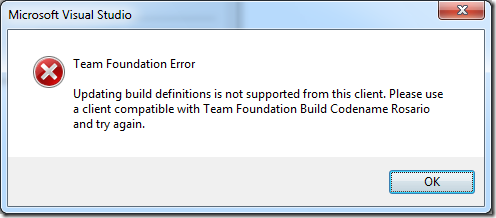
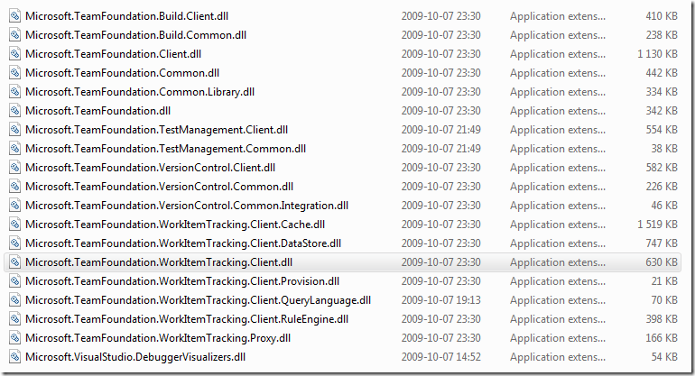

We are in the process of upgrading the entire company to TFS 2010 Beta 2, and in preparing for that we have done some test upgrades to make sure that all things work as expected after the upgrade. As expected, most issues that turned up had to do with builds. This is one of the areas that has changed the most compared to TFS 2008. I thought that I would use this post to run through some of the issues that we found.

First of all, when upgrading a TFS 2008 to TFS 2010 Beta 2, all build definitions will be upgraded. They will all be redefined to use the **UpgradeProcessTemplate** build process template in the new Windows Workflow based build engine. Jim Lamb has a good post that describes this here [http://blogs.msdn.com/jimlamb/archive/2009/11/03/upgrading-tfs-2008-build-definitions-to-tfs-2010.aspx](http://blogs.msdn.com/jimlamb/archive/2009/11/03/upgrading-tfs-2008-build-definitions-to-tfs-2010.aspx "http://blogs.msdn.com/jimlamb/archive/2009/11/03/upgrading-tfs-2008-build-definitions-to-tfs-2010.aspx")

A nice feature is that you can still use Visual Studio 2008 to create new build definitions in a TFS 2010 server. Under the surface, this will create a build definition using the UpgradeBuildProcess template and it will check in the TFSBuild.proj/rsp files for you. So it will actually be easier to use VS2008 to do this rather than VS 2010, when creating builds targeting legacy MSBuild builds.

So, what issues did we run into after the upgrade?

**Microsoft.TeamFoundation.Build.Client.BuildServerException: Updating build information is not supported from this client. Please use a client compatible with Team Foundation Build Codename Rosario and try again**

When running our release builds, most of them failed after the upgrade with this error message. It happened in several different custom build tasks that we have developed inhouse. The thing they had in common was that they were trying to update the running build. For example when adding/updating build steps using the InformationNodeConverter.AddBuildStep method. Also when attaching custom build data using the IBuildInformationNode interface we got the same error.

Actually this error message is the same that you get when trying to work against a TFS 2010 Beta 2 instance from a VS2008 client that does not have the [VSTS 2008 SP1 Forward Compatibility Update](http://www.microsoft.com/downloads/details.aspx?FamilyID=CF13EA45-D17B-4EDC-8E6C-6C5B208EC54D&displaylang=en) installed. Even with the upgrade installed there are still things that can’t be done using VSTS 2008. For example you can create a new build definition from a VSTS 2008 client, but you can’t edit it. Try and you will get this dialog:

The problem for our build tasks are of course that they were still compiled against the old 9.0 version of the TFS API assemblies. You need to reference the 10.0 version of these assemblies, and the only place that I have been able to locate them at so far is at: %PROGRAMFILES%Microsoft Visual Studio 10.0Common7IDEReferenceAssembliesv2.0:

The version of these assembies are 10.0.21006.1. I would assume that these assemblies was installed somewhere when installing the Forward Compatibility Upgrade but I haven’t found them anywhere so far.

**The command ""....Common7IDEtf.exe" checkout /recursive xxxxxx exited with code 3 \**This was another problem that turned up after the upgrade. We use the tf.exe command line tool a lot during builds. For example we check out and in files, we create and modify workspaces etc. In our 2008 build definitions we define a property that contains the full path to tf.exe like this:

*<TF>&quot;$(TeamBuildRefPath)..tf.exe&quot;</TF>*

TeamBuildRefPath is a Team Build property that provides the path to Team Build binaries (the logger, tasks, etc.).  Typically %ProgramFiles%Microsoft Visual Studio 9.0Common7IDEPrivateAssemblies. But in TFS 2010 Beta 2 this property has been changed which of course breaks the builds using it like this. We can see where this change is done by looking at the file TFSBuild.rsp that is generated on the fly by Team Build and is located in the BuildType folder. This file contains all the properties that are used when running MSBuild on the TFSBuild.proj file and is a miz of generated properties and the ones that you can define in your own TFSBuild.rsp file in source control. Here is a sample of this file:

### Begin Team Build Generated Arguments ###

/dl:BuildLogger,"C:Program FilesMicrosoft Team Foundation Server 2010ToolsMicrosoft.TeamFoundation.Build.Server.Logger.dll";"BuildUri=vstfs:///Build/Build/43;TFSUrl=<http://tfsrtm08:8080/tfs/DefaultCollection;TFSProjectFile=C:Builds2project>xxxxBuildTypeTFSBuild.proj;InformationNodeId=2769;LogFilePerProject=False;"*BuildForwardingLogger,"C:Program FilesMicrosoft Team Foundation Server 2010ToolsMicrosoft.TeamFoundation.Build.Server.Logger.dll";"BuildUri=vstfs:///Build/Build/43;TFSUrl=<http://tfsrtm08:8080/tfs/DefaultCollection;TFSProjectFile=C:Builds2project>xxxBuildTypeTFSBuild.proj;InformationNodeId=2769;" \
/fl /flp:"logfile=C:Builds2projectxxxxBuildTypeBuildLog.txt;encoding=Unicode;verbosity=normal;" \
/p:ProjectFileVersion="3" \
/p:BuildDefinition="xxxx" \
/p:BuildDefinitionId="5" \
/p:DropLocation="\TFSRTM08Drop" \
/p:BuildProjectFolderPath="%24/project/xxxxxx/Main/Build/Test" \
/p:BuildUri="vstfs:///Build/Build/43" \
/p:TeamFoundationServerUrl="<http://tfsrtm08:8080/tfs/DefaultCollection"> \
/p:TeamProject="project" \
/p:BuildAgentName="TFSRTM08 - Agent1" \
/p:MachineName="TFSRTM08" \
/p:BuildAgentUri="vstfs:///Build/Agent/2" \
/p:BuildDirectory="C:Builds2projectxxxxx" \
/p:BuildAgentId="2" \
/p:SourceGetVersion="C10" \
/p:LastGoodBuildLabel="xxxxx” \
/p:LastBuildNumber="xxxxx_20091116.4" \
/p:LastGoodBuildNumber="xxxxx_20091110.4" \
/p:NoCICheckInComment="%2a%2a%2aNO_CI%2a%2a%2a" \
/p:IsDesktopBuild="False" \
*/p:TeamBuildRefPath="C:Program FilesMicrosoft Team Foundation Server 2010Tools\" \*/t:EndToEndIteration

### End Team Build Generated Arguments ###

### Begin Checked In TfsBuild.rsp Arguments ###

# This is a response file for MSBuild \
# Add custom MSBuild command line options in this file

### End Checked In TfsBuild.rsp Arguments ###

So the TeamBuildRefPath now points to the Tools folder below the TFS 2010 install folder. But tf.exe is typically installed at *C:Program FilesMicrosoft Visual Studio 10.0Common7IDE.* At the moment, we have resorted to redefining our TF property by using the full path which of course is not a very good solution. But it works, until we find what other MSBuild property we can use to reference to the 10.0 path

**Work Items are not associated with builds \**When running builds, we noticed that sometimes the workitems that had been associated with the changesets for the build were not associated with build. When looking more closely on the build log, this warning were generated:

*C:Program FilesMSBuildMicrosoftVisualStudioTeamBuildMicrosoft.TeamFoundation.Build.targets (1162): TF42093: The work item xxx could not be updated with build information. The field Microsoft.VSTS.Build.IntegrationBuild is not available on this work item.*

This turned out to be a [known bug](http://social.msdn.microsoft.com/Forums/en-US/tfsprerelease/thread/66882c4c-1818-45c9-8562-433e1b6af6eb) in TFS Beta 2 and affects all work item types that do not have the Microsoft.VSTS.Build.IntegrationBuild field. At the moment there is no work around for this problem than to add this field to all your work item types.

Aside from these problems, the upgraded builds works fine in TFS 2010 Beta 2, which is reassuring because we can still use our investments in the TFS 2008 build process. WE are about to migrate our build process to 2010, using Windows Workflow instead of MSBuild, but this means that we don’t have to do this immediately.

---

## Comments

*Imported from the original WordPress site. Closed for new replies.*

> **Nilesh** — 04 Jan 2010
>
> Originally posted on: <http://geekswithblogs.net/jakob/archive/2009/11/24/tfs-2010-beta-2-ndash-upgrading-builds-from-tfs-2008.aspx#500888>
>
> I have one question regarding TFS migration.\
> We have TFS 2008 installed on Windows Server 2003 with domain xyz.com. Now we want to migrate our Database from TFS 2008 to TFS 2010 Beta2 but on a different domain named abc.com.\
> \
> Is it possible to migrate TFS database from One domain to another?\
> \
> Can you please help me how to perform it.
