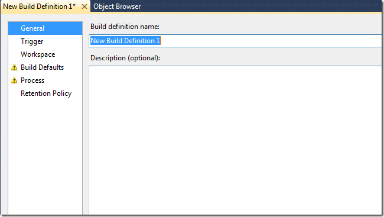

*** UPDATE 2010-08-17 ** Several people have asked me for a complete sample application, so I have put this together and it is available here: \
[http://cid-ee034c9f620cd58d.office.live.com/self.aspx/BlogSamples/CreateTFSBuildDefinition.zip](http://cid-ee034c9f620cd58d.office.live.com/self.aspx/BlogSamples/CreateTFSBuildDefinition.zip "http://cid-ee034c9f620cd58d.office.live.com/self.aspx/BlogSamples/CreateTFSBuildDefinition.zip")

****

In this post I will show how to create a new build definition in TFS 2010 using the TFS API. When creating a build definition manually, using Team Explorer, the necessary steps are lined \
out in the New Build Definition Wizard:

[](http://gwb.blob.core.windows.net/jakob/WindowsLiveWriter/CreatingaBuildDefinitionusingtheTFS2010A_12F55/image_4.png)

So, lets see how the code looks like, using the same order. To start off, we need to connect to TFS and get a reference to the IBuildServer object:

TfsTeamProjectCollection server = newTfsTeamProjectCollection(newUri("http://<tfs>:<port>/tfs")); \
server.EnsureAuthenticated(); \
IBuildServer buildServer = (IBuildServer) server.GetService(typeof (IBuildServer));

```javascript
General
First we create a IBuildDefinition object for the team project and set a name and description for it:

var buildDefinition = buildServer.CreateBuildDefinition(teamProject);
buildDefinition.Name = "TestBuild";
buildDefinition.Description = "description here...";
```

**Trigger \**Next up, we set the trigger type. For this one, we set it to individual which corresponds to the *Continuous Integration - Build each check-in* trigger option \
buildDefinition.ContinuousIntegrationType = ContinuousIntegrationType.Individual;

**Workspace \**For the workspace mappings, we create two mappings here, where one is a cloak. Note the user of $(SourceDir) variable, which is expanded by Team Build into the sources directory when running the build. \
buildDefinition.Workspace.AddMapping("$/Path/project.sln", "$(SourceDir)", WorkspaceMappingType.Map); \
buildDefinition.Workspace.AddMapping("$/OtherPath/", "", WorkspaceMappingType.Cloak);


```
Build Defaults
In the build defaults, we set the build controller and the drop location. To get a build controller, we can (for example) use the GetBuildController method to get an existing build controller by name:

buildDefinition.BuildController = buildServer.GetBuildController(buildController);
buildDefinition.DefaultDropLocation = @\SERVERDropTestBuild;
```

**Process \**So far, this wasy easy. Now we get to the tricky part. TFS 2010 Build is based on Windows Workflow 4.0. The build process is defined in a separate .XAML file called a *Build Process Template*. By default, every new team team project containtwo build process templates called *DefaultTemplate* and *UpgradeTemplate*. In this sample, we want to create a build definition using the default template. We use te *QueryProcessTemplates* method to get a reference to the default for the current team project

//Get default template \
var defaultTemplate = buildServer.QueryProcessTemplates(teamProject).Where(p => p.TemplateType == ProcessTemplateType.Default).First(); \
buildDefinition.Process = defaultTemplate;

There are several build process templates that can be set for the default build process template. Only one of these are required, the *ProjectsToBuild* parameters which contains the solution(s) and configuration(s) that should be built. To set this info, we use the *ProcessParameters* property of thhe IBuildDefinition interface. The format of this property is actually just a serialized dictionary (*IDictionary<string, object>*) that maps a key (parameter name) to a value which can be any kind of object. This is rather messy, but fortunately, there is a helper class called *WorkflowHelpers* inthe *Microsoft.TeamFoundation.Build.Workflow* namespace, that simplifies working with this persistence format a bit. The following code shows how to set the BuildSettings information for a build definition:

```
//Set process parameters
varprocess = WorkflowHelpers.DeserializeProcessParameters(buildDefinition.ProcessParameters);

//Set BuildSettings properties
BuildSettings settings = newBuildSettings();
settings.ProjectsToBuild = newStringList("$/pathToProject/project.sln");
settings.PlatformConfigurations = newPlatformConfigurationList();
settings.PlatformConfigurations.Add(newPlatformConfiguration("Any CPU", "Debug"));
process.Add("BuildSettings", settings);

buildDefinition.ProcessParameters = WorkflowHelpers.SerializeProcessParameters(process);
```

The other build process parameters of a build definition can be set using the same approach

**Retention  Policy \**This one is easy, we just clear the default settings and set our own:

buildDefinition.RetentionPolicyList.Clear(); \
buildDefinition.AddRetentionPolicy(BuildReason.Triggered, BuildStatus.Succeeded, 10, DeleteOptions.All); \
buildDefinition.AddRetentionPolicy(BuildReason.Triggered, BuildStatus.Failed, 10, DeleteOptions.All); \
buildDefinition.AddRetentionPolicy(BuildReason.Triggered, BuildStatus.Stopped, 1, DeleteOptions.All); \
buildDefinition.AddRetentionPolicy(BuildReason.Triggered, BuildStatus.PartiallySucceeded, 10, DeleteOptions.All);

**Save It! \**And we’re done, lets save the build definition:

buildDefinition.Save();

That’s it!

---

## Comments

*Imported from the original WordPress site. Closed for new replies.*

> **Bob Hardister** — 16 Aug 2010
>
> Originally posted on: <http://geekswithblogs.net/jakob/archive/2010/04/26/creating-a-build-definition-using-the-tfs-2010-api.aspx#533317>
>
> Hi Jokob, can you post an example of a working solution/project that can be downloaded?

> **Y.B** — 16 Sep 2010
>
> Originally posted on: <http://geekswithblogs.net/jakob/archive/2010/04/26/creating-a-build-definition-using-the-tfs-2010-api.aspx#538205>
>
> //Set BuildSettings properties \
>  var settings = GenerateBuildSettings();\
>  process.Add("BuildSettings", settings);\
>  process.Add("TestSpecs", new TestSpecList());\
>  process.Add("RunCodeAnalysis", CodeAnalysisOption.Never);\
>  process.Add("SourceAndSymbolServerSettings", new SourceAndSymbolServerSettings());\
>  process.Add("CreateWorkItem", false);\
>  process.Add("PerformTestImpactAnalysis", false);\
>  process.Add("DisableTests", true);\
>  process.Add("Verbosity", BuildVerbosity.Minimal);

> **Shmil** — 11 Oct 2010
>
> Originally posted on: <http://geekswithblogs.net/jakob/archive/2010/04/26/creating-a-build-definition-using-the-tfs-2010-api.aspx#542320>
>
> How can I run private Build (based on Shelveset) through the API?\

> **Wouter van Vugt** — 08 Apr 2011
>
> Originally posted on: <http://geekswithblogs.net/jakob/archive/2010/04/26/creating-a-build-definition-using-the-tfs-2010-api.aspx#572863>
>
> The WorkflowHelpers class is inside a private assembly to Visual Studio. You are not allowed to use it. Fallback is to use the XamlServices.Save method in the System.Xaml assembly.

> **Willow Wagner** — 17 May 2011
>
> Originally posted on: <http://geekswithblogs.net/jakob/archive/2010/04/26/creating-a-build-definition-using-the-tfs-2010-api.aspx#578226>
>
> How can I pass paramters through the build definition? Would adding a couple fields to dynamically created build definition be the best way to make that happen?

> **Cristian Casanova** — 12 Nov 2012
>
> Originally posted on: <http://geekswithblogs.net/jakob/archive/2010/04/26/creating-a-build-definition-using-the-tfs-2010-api.aspx#621435>
>
> Is there another link to download the complete sample application? The mentioned one above is broken.\
> Thanks

> **John Bruno** — 04 Apr 2013
>
> Originally posted on: <http://geekswithblogs.net/jakob/archive/2010/04/26/creating-a-build-definition-using-the-tfs-2010-api.aspx#626691>
>
> Hi, thanks so much for post this. Everything is working great except 1 thing. This code only works the first time I run it. Subsequent attempts result in the followwing error: Sequence contains no elements.\
> So it finds the template the first time, but that's it. \
> \
> var defaultTemplate = buildServer.QueryProcessTemplates(teamProject).Where(p => p.TemplateType == ProcessTemplateType.Default).First(); \
> \
> Thanks, John\

> **Tobi** — 11 Aug 2014
>
> Originally posted on: <http://geekswithblogs.net/jakob/archive/2010/04/26/creating-a-build-definition-using-the-tfs-2010-api.aspx#639428>
>
> Hi,\
> thanks for your post, its very helpfull. But I still got a question.\
> I want to add a RetentionPolicy, but i want to add multiple DeleteOptions, but i don't see a way to do this.\
> For example the delete options should be set to DropLocation, Label AND Symbols.\
> Thanks for your help.\
> Tobi

> **Tom Harrison** — 17 Aug 2015
>
> Originally posted on: <http://geekswithblogs.net/jakob/archive/2010/04/26/creating-a-build-definition-using-the-tfs-2010-api.aspx#645831>
>
> Hi there. Great post.\
> Your link to the build sample app is broken. Can you please transfer this example to github?\
> \
> Thanks!
