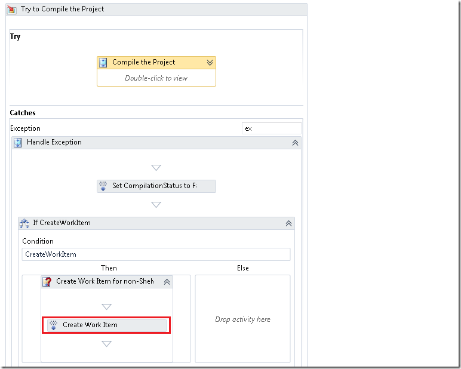
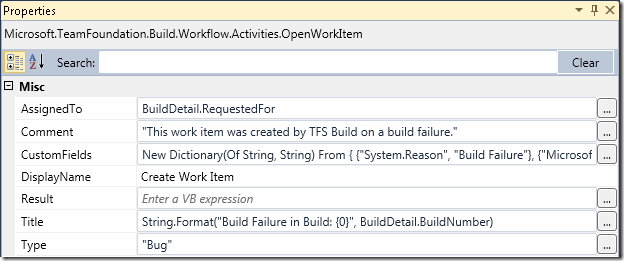

The default behaviour in TFS Team Build (all versions) is to create a bug work item when a build fails. This main benefit of this is that you get a work item for something that needs to be done, namely to fix the build!. When the developer responsible for the build failure has fixed the problem, he/she can associated that check-in with the work item that was created from the previous build failure.

In TFS 2005/2008 you could modify the information in the created work item by changing some predefined properties in the TFSBuild.proj file:

```
    <!--  WorkItemType
     The type of the work item created on a build failure.
     -->
    <WorkItemType>Bug</WorkItemType>

    <!--  WorkItemFieldValues
     Fields and values of the work item created on a build failure.

     Note: Use reference names for fields if you want the build to be resistant to field name
     changes. Reference names are language independent while friendly names are changed depending
     on the installed language. For example, "System.Reason" is the reference name for the "Reason"
     field.
     -->
    <WorkItemFieldValues>System.Reason=Build Failure;System.Description=Start the build using Team Build</WorkItemFieldValues>

    <!--  WorkItemTitle
     Title of the work item created on build failure.
     -->
    <WorkItemTitle>Build failure in build:</WorkItemTitle>

    <!--  DescriptionText
     History comment of the work item created on a build failure.
     -->
    <DescriptionText>This work item was created by Team Build on a build failure.</DescriptionText>

    <!--  BuildLogText
     Additional comment text for the work item created on a build failure.
     -->
    <BuildlogText>The build log file is at:</BuildlogText>

    <!--  ErrorWarningLogText
     Additional comment text for the work item created on a build failure.
     This text will only be added if there were errors or warnings.
     -->
    <ErrorWarningLogText>The errors/warnings log file is at:</ErrorWarningLogText>
```

In TFS 2010, with Windows Workflow, you change this by modifying the properties on the *OpenWorkItem* activity. The hardest part of this is to actually find where this activity is located in the build process workflow. If you open the build definition in XAML you can just search for OpenWorkItem. If you use the designer you need to click your way down to the Catch section of the *Try to Compile the Project* sequence:

[](http://gwb.blob.core.windows.net/jakob/WindowsLiveWriter/ModifyBuildFailureWorkIteminTFS2010Build_138E8/image_2.png)

To change the default values of the created work item, select the *Created Work Item* activity and look at the Properties window:

[](http://gwb.blob.core.windows.net/jakob/WindowsLiveWriter/ModifyBuildFailureWorkIteminTFS2010Build_138E8/image_4.png)

Note the *CustomFields* property which is a dictionary with key (work item field name) and value. If you add custom fields to your work item you can add a value for it here by adding a new entry in the dictionary.

---

## Comments

*Imported from the original WordPress site. Closed for new replies.*

> **betty** — 03 Apr 2011
>
> Originally posted on: <http://geekswithblogs.net/jakob/archive/2010/04/28/modify-build-failure-work-item-in-tfs-2010-build.aspx#571948>
>
> Can you either make it reuse the same bug over and over or automatically close bugs once the build passes?

> **Slartibartfast81** — 12 Jul 2011
>
> Originally posted on: <http://geekswithblogs.net/jakob/archive/2010/04/28/modify-build-failure-work-item-in-tfs-2010-build.aspx#585346>
>
> I have a couple of questions:\
> Are you using the DefaultTemplate.xaml build template here?\
> Should the the activity shown be added to the template? I can't find it at the indicated position, which I have found, and I wonder if the template shown is actually part of the MS Agile proces template 5.0 definition.
