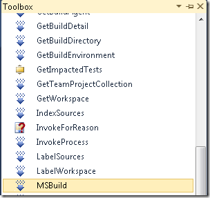
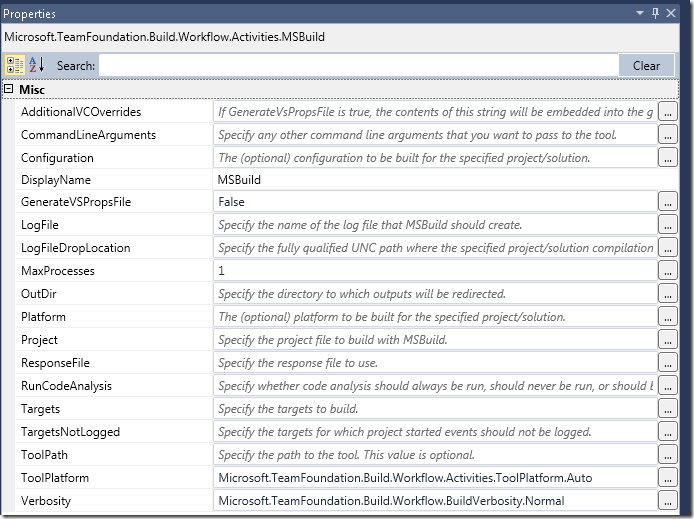
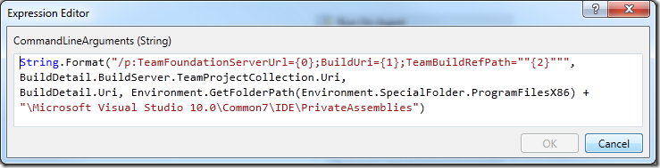
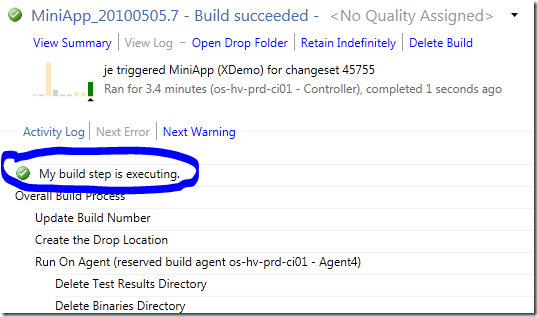

When upgrading from TFS 2008 to TFS 2010, all builds are “upgraded” in the sense that a build definition with the same name is created, and it uses the *UpgradeTemplate*  build process template to execute the build. This template basically just runs MSBuild on the existing TFSBuild.proj file. The build definition contains a property called *ConfigurationFolderPath* that points to the TFSBuild.proj file.

So, existing builds will run just fine after upgrade. But what if you want to use the new workflow functionality in TFS 2010 Build, but still have a lot of MSBuild scripts that maybe call custom MSBuild tasks that you don’t have the time to rewrite? Then one option is to keep these MSBuild scrips and call them from a TFS 2010 Build workflow. This can be done using the MSBuild workflow activity that is avaiable in the toolbox in the *Team Foundation Build Activities* section:

[](http://gwb.blob.core.windows.net/jakob/WindowsLiveWriter/ExecutingMSBuildscriptsinTFS2010Build_7E8D/image_2.png)

This activity wraps the call to MSBuild.exe and has the following parameters:

[](http://gwb.blob.core.windows.net/jakob/WindowsLiveWriter/ExecutingMSBuildscriptsinTFS2010Build_7E8D/image_6.png)

Most of these properties are only relevant when actually compiling projects, for example C# project files. When calling custom MSBuild project files, you should focus on these properties:

|  |  |  |
| --- | --- | --- |
| **Property** | **Meaning** | **Example** |
| CommandLineArguments | Use this to send in/override MSBuild properties in your project | “/p:MyProperty=SomeValue”    or    MSBuildArguments (this will let you define the arguments in the build definition or when queuing the build) |
| LogFile | Name of the log file where MSbuild will log the output | “MyBuild.log” |
| LogFileDropLocation | Location of the log file | BuildDetail.DropLocation + “log” |
| Project | The project to execute | SourcesDirectory + “BuildExtensions.targets” |
| ResponseFile | The name of the MSBuild response file | SourcesDirectory + “BuildExtensions.rsp” |
| Targets | The target(s) to execute | New String() {“Target1”, “Target2”} |
| Verbosity | Logging verbosity | Microsoft.TeamFoundation.Build.Workflow.BuildVerbosity.Normal |

**Integrating with Team Build**

If your MSBuild scripts tries to use Team Build tasks, they will most likely fail with the above approach. For example, the following MSBuild project file tries to add a build step using the BuildStep task:

> ```xml
> <?xml version="1.0" encoding="utf-8"?>
>
> <Project ToolsVersion="4.0" xmlns="http://schemas.microsoft.com/developer/msbuild/2003">
>
>   <Import Project="$(MSBuildExtensionsPath)MicrosoftVisualStudioTeamBuildMicrosoft.TeamFoundation.Build.targets" />
>   <Target Name="MyTarget">
>     <BuildStep TeamFoundationServerUrl="$(TeamFoundationServerUrl)" BuildUri="$(BuildUri)" Name="MyBuildStep" Message="My build step executed" Status="Succeeded"></BuildStep>
>   </Target>
> </Project>
> ```

When executing this file using the MSBuild activity, calling the *MyTarget*, it will fail with the following message:

> *The "Microsoft.TeamFoundation.Build.Tasks.BuildStep" task could not be loaded from the assembly PrivateAssembliesMicrosoft.TeamFoundation.Build.ProcessComponents.dll. Could not load file or assembly 'file:///D:PrivateAssembliesMicrosoft.TeamFoundation.Build.ProcessComponents.dll' or one of its dependencies. The system cannot find the file specified. Confirm that the <UsingTask> declaration is correct, that the assembly and all its dependencies are available, and that the task contains a public class that implements Microsoft.Build.Framework.ITask.*

You can see that the path to the ProcessComponents.dll is incomplete. This is because in the *Microsoft.TeamFoundation.Build.targets* file the task is referenced using the $(TeamBuildRegPath) property. Also note that the task needs the *TeamFounationServerUrl* and *BuildUri* properties. One solution here is to pass these properties in using the Command Line Arguments parameter:

[](http://gwb.blob.core.windows.net/jakob/WindowsLiveWriter/ExecutingMSBuildscriptsinTFS2010Build_7E8D/image_4.png)

Here we pass in the parameters with the corresponding values from the curent build. The build log shows that the build step has in fact been inserted:

[](http://gwb.blob.core.windows.net/jakob/WindowsLiveWriter/ExecutingMSBuildscriptsinTFS2010Build_7E8D/image_10.png)

The problem as you probably spted is that the build step is insert at the top of the build log, instead of next to the MSBuild activity call. This is because we are using a legacy team build task (BuildStep), and that is how these are handled in TFS 2010.
You can see the same behaviour when running builds that are using the UpgradeTemplate, that cutom build steps shows up at the top of the build log.

---

## Comments

*Imported from the original WordPress site. Closed for new replies.*

> **gsogol** — 23 Jun 2010
>
> Originally posted on: <http://geekswithblogs.net/jakob/archive/2010/05/05/executing-legacy-msbuild-scripts-in-tfs-2010-build.aspx#525316>
>
> What happens when one builds customs tasks off of TFS 2005 build dlls. Do you have to copy all of those dlls to the TFS 2010 server?

> **Ryan** — 07 Jul 2010
>
> Originally posted on: <http://geekswithblogs.net/jakob/archive/2010/05/05/executing-legacy-msbuild-scripts-in-tfs-2010-build.aspx#527288>
>
> For some reason, when using this method, I always get the message that "the project file ... was not found", where "..." is the exact correct path to the project file that I created. I checked on the server, and the file is definitely there! What's going on?

> **RIyer** — 06 Jan 2011
>
> Originally posted on: <http://geekswithblogs.net/jakob/archive/2010/05/05/executing-legacy-msbuild-scripts-in-tfs-2010-build.aspx#556257>
>
> Thanks a bunch, Jakob!

> **Bharath** — 29 Nov 2011
>
> Originally posted on: <http://geekswithblogs.net/jakob/archive/2010/05/05/executing-legacy-msbuild-scripts-in-tfs-2010-build.aspx#601318>
>
> Will this solution work in case, Powershell scripts have been called from MSBuild script?

> **ahmad** — 14 Jun 2015
>
> Originally posted on: <http://geekswithblogs.net/jakob/archive/2010/05/05/executing-legacy-msbuild-scripts-in-tfs-2010-build.aspx#644765>
>
> very useful, thanks
