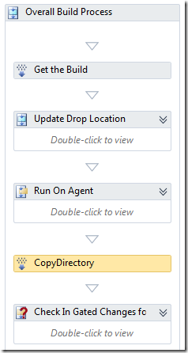
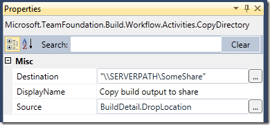

By default, TFS Team Build creates a new folder in the drop location for every build. I have seen request from people that wonder how to always have team build put the output in the same folder every time, effectively overwriting the results from the last build. This is easy to accomplish by adding an activity that copies the drop folder to a fixed location.

To copy the result of the build to a fixed location, you need to modify the build process template:

1. Open the build process template XAML file in the workflow designer. \
2. Click on the *Collapse All* link in the upper right corner so that only the top level activities are shown \
3. Open the Toolbox window and locate the *CopyDirectory* activity (it is located in the *Team Foundation Build Activities* tab) \
4. Drag the *CopyDirectory* activity onto the design surface and drop it between the *Run On Agent* and the *Check In Gated Changes for CheckInShelveset Builds* activity: \
      \
5. Right click on the CopyDirectory activity and select *Properties.* Fill out the properties, you will of course need to modify the path for the destination accordingly: \
    \
6. Save the build definition and check it in. **NB: Remember to check in the build process template file after modifying it, a lot of times people forget this step!** \
7. Queue a new build and, after the build has succeeded, verify that the build output has been copied to the corresponding output path

To make this build process template more generic, you proabably want to create a process parameter that lets you define the path either when you create a new build definition, or when you queue the build (or both). This will let you you reuse the build process template for builds with different output paths

---

## Comments

*Imported from the original WordPress site. Closed for new replies.*

> **Tim** — 11 Nov 2010
>
> Originally posted on: <http://geekswithblogs.net/jakob/archive/2010/09/01/tfs-team-build-2010-how-to-place-the-build-output.aspx#547050>
>
> I am getting "Access Denied" errors using this CopyDirectory task. Essentially the task is unable to write to the other server in my case. Is this a result of the TFSBuildServiceHost running under 'Network Service' account? What security settings are required on the \ServerPathSomeShare folder?

> **Jakob Ehn** — 14 Nov 2010
>
> Originally posted on: <http://geekswithblogs.net/jakob/archive/2010/09/01/tfs-team-build-2010-how-to-place-the-build-output.aspx#547402>
>
> You must give the build service account permission to write to the share. Normal Write/Modify ACL permissions is enough

> **tikra** — 08 Feb 2011
>
> Originally posted on: <http://geekswithblogs.net/jakob/archive/2010/09/01/tfs-team-build-2010-how-to-place-the-build-output.aspx#561618>
>
> Thanks. Exactly what I was looking for. :)

> **shamsheer** — 25 Mar 2011
>
> Originally posted on: <http://geekswithblogs.net/jakob/archive/2010/09/01/tfs-team-build-2010-how-to-place-the-build-output.aspx#570159>
>
> We are using WIX which creats an MSI cabinate that contains all dll's and files that copies to DROP Location. Now my need is to copy the same content of the MSI file to the drop location (Not as a cabinate) when the build get succeded.\
> \
> Any help wolud be appriciated.. \
> Thanks in Advance. :)

> **gout symptoms** — 02 May 2011
>
> Originally posted on: <http://geekswithblogs.net/jakob/archive/2010/09/01/tfs-team-build-2010-how-to-place-the-build-output.aspx#576434>
>
> It was very well laid out and helpful. Thanks Jakob!

> **Ananya** — 06 Sep 2011
>
> Originally posted on: <http://geekswithblogs.net/jakob/archive/2010/09/01/tfs-team-build-2010-how-to-place-the-build-output.aspx#592643>
>
> I tried this, but did not work, only log file was available at the drop location I specified, the buildversionlabel.xml file was in C:Builds5productproduct_NightlySourcesA3CommonComponentsRemoteServerSourceA3.Common.Components.RemoteServer

> **Naveen Sharma** — 20 Mar 2012
>
> Originally posted on: <http://geekswithblogs.net/jakob/archive/2010/09/01/tfs-team-build-2010-how-to-place-the-build-output.aspx#610659>
>
> You are the man! Was looking for some guidance on this, where can I get better build guidance than here :)\
> Worked for us!!!

> **Andrey** — 14 Sep 2012
>
> Originally posted on: <http://geekswithblogs.net/jakob/archive/2010/09/01/tfs-team-build-2010-how-to-place-the-build-output.aspx#619023>
>
> Why can't i set a normal physical path (e.g. D:WebSitesMyWebSite) for the build output? I have TFS and web sites on the same machine and i need to copy my build output files just to another directory on the same machine. But i can't make it because i can set my drop directory only in the Visual Studio project properties that accepts only UNC paths...Do i need to use some custom publishing actions to copy my build output from default build folder to the www root of my IIS web sites?

> **Jakob Ehn** — 14 Sep 2012
>
> Originally posted on: <http://geekswithblogs.net/jakob/archive/2010/09/01/tfs-team-build-2010-how-to-place-the-build-output.aspx#619028>
>
> @Andrey: You must enter a share as the output path, Team Build won't accept anything else. I suggest that you just create a share on the server that points to the web site folder in IIS\
> \
> /Jakob

> **Andrey** — 14 Sep 2012
>
> Originally posted on: <http://geekswithblogs.net/jakob/archive/2010/09/01/tfs-team-build-2010-how-to-place-the-build-output.aspx#619032>
>
> @Jakob - ok, i've shared a website root and set it as a drop folder for the TFS build configuration. Is it enough to "publish" a build output on my web site (ASP.NET MVC project)

> **Jakob Ehn** — 14 Sep 2012
>
> Originally posted on: <http://geekswithblogs.net/jakob/archive/2010/09/01/tfs-team-build-2010-how-to-place-the-build-output.aspx#619033>
>
> @Andrey: No, team build will create a new drop folder beneath the drop location on every build. This post describe how you can take the output from the drop folder and copy it to a fixed location, which basically is what you need.\
> \
> Another option for you, since you are developing web apps, is to use web deploy to publish your web application. If you are using VS2012, create a publish profile and check it in, then add this to the MSBuild Arguments parameter in your build definition:\
> \
> /p:DeployOnBuild=true;PublishProfile="MyPublishProfileName"\
> \
> Hope that helps\

> **Andrey** — 14 Sep 2012
>
> Originally posted on: <http://geekswithblogs.net/jakob/archive/2010/09/01/tfs-team-build-2010-how-to-place-the-build-output.aspx#619054>
>
> @Jakob - thanks a lot, it works. \
> \
> Although i can't guess why TFS doesnt support a simple copying of the build output to the any folder on the local file system...\
> \
> Thanks again, you really helper me!

> **Ancc** — 18 Oct 2012
>
> Originally posted on: <http://geekswithblogs.net/jakob/archive/2010/09/01/tfs-team-build-2010-how-to-place-the-build-output.aspx#620341>
>
> Jakob,\
> I am trying to deloy WCF service of .net in TFS2012 using build defination and useed below args in msbuild in the arguments \
> \
> /p:DeployOnBuild=True /p:DeployTarget=MsDeployPublish /p:MSDeployPublishMethod=InProc /p:MSDeployServiceUrl=win-gs9gmujits8 /p:DeployIISAppPath="Sites/Website name"\
> \
> but thi is not deplying the published folder on iis virtual shared directoy although there is no error reported . so i used your copydietcory approach to manually copy it to shared IIS virtual directory after build , but is there more smart way to do it rathet tahn creating new template for this for diffrent build ?\
> \
> also i dont want all files under _PublishedWebsites folder as thet are web.config and other xml files also which are created and i want to exlude them and coply only bin and servrice folder to IIS , so do i need as many diffrent copydirectot task in defination to give source as _PublishedWebsitesbin, _PublishedWebsitesXXXX and ,_PublishedWebsitesYYYY folder separtely or is there much easier and better way to achive this ?\
> \
> Any help is well appreciated .

> **Jan Sokoly** — 25 Oct 2012
>
> Originally posted on: <http://geekswithblogs.net/jakob/archive/2010/09/01/tfs-team-build-2010-how-to-place-the-build-output.aspx#620747>
>
> Appreciate your post, it's exactly what I've been looking for.\
> I've made a slight modification though. As we use multiple build definitions, I use\
> BuildDetail.DropLocationRoot + "latest"\
> as the Destination to keep the latest source with appropriate build definition outputs.

> **Shota Giorgobiani** — 26 Nov 2012
>
> Originally posted on: <http://geekswithblogs.net/jakob/archive/2010/09/01/tfs-team-build-2010-how-to-place-the-build-output.aspx#621941>
>
> I can't even express how graceful I am! I spent several days to overcome this problem and at last got your solution. Thank's a lot!

> **Abraham Dhanyaraj** — 01 Mar 2013
>
> Originally posted on: <http://geekswithblogs.net/jakob/archive/2010/09/01/tfs-team-build-2010-how-to-place-the-build-output.aspx#625611>
>
> Amazing,... Thanks a lot for this.. :)

> **Vikas Gupta** — 26 Jul 2013
>
> Originally posted on: <http://geekswithblogs.net/jakob/archive/2010/09/01/tfs-team-build-2010-how-to-place-the-build-output.aspx#631003>
>
> How about simply modifying the BuildNumberFormat vallue From: $(BuildDefinitionName)_$(Date:yyyyMMdd)$(Rev:.r)\
> To: $(BuildDefinitionName) or any other fixed name. So, every time the build runs it will dump the final output to the same folder under the UNC drop location path

> **Vikas Gupta** — 26 Jul 2013
>
> Originally posted on: <http://geekswithblogs.net/jakob/archive/2010/09/01/tfs-team-build-2010-how-to-place-the-build-output.aspx#631004>
>
> Sorry, the above solution will not work as the build engine needs a unique name for every build.

> **Steve** — 13 Sep 2013
>
> Originally posted on: <http://geekswithblogs.net/jakob/archive/2010/09/01/tfs-team-build-2010-how-to-place-the-build-output.aspx#632027>
>
> As mentioned in a previous post (for which I didn't see a reply), I need to exclude the web.config from CopyDirectory. "Exclude" was supported in the TFSBuild.proj AfterDropBuild script. Why doesn't CopyDirectory support exclusion?

> **Ganesh** — 05 Feb 2014
>
> Originally posted on: <http://geekswithblogs.net/jakob/archive/2010/09/01/tfs-team-build-2010-how-to-place-the-build-output.aspx#635477>
>
> Very nice and Helped a lot

> **Hardy** — 27 Jun 2014
>
> Originally posted on: <http://geekswithblogs.net/jakob/archive/2010/09/01/tfs-team-build-2010-how-to-place-the-build-output.aspx#638567>
>
> I am looking for the same and this post helped, Thanks.\
> In addition to this, I am looking to create 4 sub-folders at the destination for my 8 projects in the solution. What is the recommended way to do this. Based on it, I have two question:\
> 1. Should I use CreateDirectory and CopyDirectory activities. OR use arguments in MSBuild. \
> 2. In the example source of Copy is the DropLocation. As per my understanding build server makes a copy of source and build files. So isn't it a good idea to copy files directly from Build Server (something like $build folderbin) to \ServerPathSomeShare. Currently, I don't know how to do this, but if kindly provide info if you know how to do it.\
> \
> Thanks\
> Hardy

> **Jonathan Siqueira** — 12 Jul 2014
>
> Originally posted on: <http://geekswithblogs.net/jakob/archive/2010/09/01/tfs-team-build-2010-how-to-place-the-build-output.aspx#638786>
>
> Hi Everyone,\
> \
>  I am trying an TFS autobuild continous integration. When a developer checks in the code, the build definition executes the code and Drops the publish files to a Location with build numbers incrementally. once the Code is checked in, i would like the build defination to delete the old publish files and deploy the new publish file to the same location of the drop location, Am doing this because my drop location is mapped to iis virtual directory, does any one have a better solution.\
> \

> **Jonathan Siqueira** — 14 Jul 2014
>
> Originally posted on: <http://geekswithblogs.net/jakob/archive/2010/09/01/tfs-team-build-2010-how-to-place-the-build-output.aspx#638824>
>
> Hi,\
> \
>  After I do a new build using the build definition, I get the _PublishWebsite folder created. i want to get rid of the _Publishwebsite folder and directly copy all the dll and cshtml files to the Root folder.\
> Please suggest

> **Abin** — 25 Jun 2015
>
> Originally posted on: <http://geekswithblogs.net/jakob/archive/2010/09/01/tfs-team-build-2010-how-to-place-the-build-output.aspx#644958>
>
> Hi ,\
> I am not able to copy the files to another server path (UAC).. Even that shared folder has full permission for everyone. I am getting some user name and password is incorrect error. Is there any option to provide credentials in CopyDirectory property.\
> \
> I tried to copy to another folder in the build server and it is working fine.\
> \
> please check the build log;\
> \
> \
> \
> Drop Files to Drop Location\
> \
> 00:00\
> CopyPublish\
>  Exception Message: The user name or password is incorrect.\
>  (type IOException)\
> Exception Stack Trace: at Microsoft.TeamFoundation.Build.Workflow.Activities.WindowsDropProvider.EndCopyDirectory(IAsyncResult result)\
>  at Microsoft.TeamFoundation.Build.Workflow.Activities.CopyDirectory.EndExecute(AsyncCodeActivityContext context, IAsyncResult result)\
>  at System.Activities.AsyncCodeActivity.CompleteAsyncCodeActivityData.CompleteAsyncCodeActivityWorkItem.Execute(ActivityExecutor executor, BookmarkManager bookmarkManager)\
