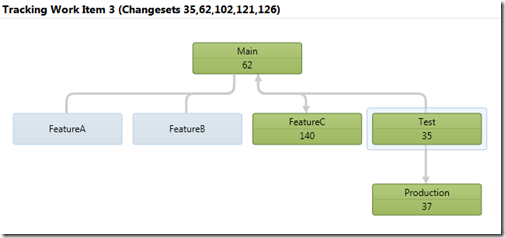
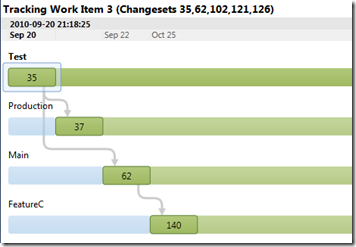
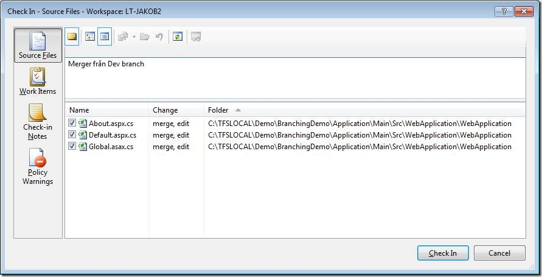
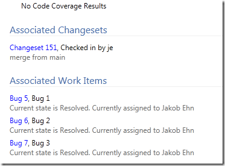

In TFS 2010, branching and merging have been greatly improved with support for branch visualization and tracking of changesets and work items across branches. A simple example of this looks like this: \

Here we track Work Item nr 3 which was originally resovled in the Test branch (with changeset 35). We can also see that the work item has been merged into the Production branch (as changeset 37), back to Main (62) and finally to FeatureC (140). \
If we switch to the Timeline view, we get a nice view of the order of these merges, together with the dates.

Unfortunately, this does not solve one of the bigger problems when it comes to branches and work items. When you merge your changes into another branch, you must remember to asociated the corresponding work item **again**, otherwise that information is lost and the work item will not show up in the build report from the builds running off the target branches. A typical example is that we have 3 bugs in the Test branch, and we perform (at least) 3 changesets and each changeset is associated to the corresponding work item. When it is time to merge the bug fixes to the Production branch, we must manually associated the merge with the work item again**.** If we peform one merge operation that brings all changes from Test to Main, we must associate all 3 work items. There is really no support for “merging” work items across branches in TFS, only changesets can be merged.

What you really want is to have the tool automatically assign the work items that were associated with the changesets that you are merging. One way to implement this is with a checkin policy, which we have done at our company. The reason for choosing a checkin policy as the tool of choice is because it is executed on the client at the time of the checkin, and we can display the work items to the developers before they check in.

So, how does it work? Lets look at an example: \
In my development branch, I have 3 bugs (Bug1, Bug2 and Bug3) that I need to fix. I fix each one in a changeset that gets checked in and associated with the corresponding work item. Then it is time to merge the fixes to the Main branch (trunk). \
I perform a merge by just using the normal Merge operation from source control. This leaves me with the following pending merge:

Now, I would normally go to the Work Items tab and link to the work items that I *know* were resolved by the changes that I am currently merging. But now I don’t need to do this but instead I just click on the Check In button. This will evaluate all checkin policies, and one of them is the Merge Work Items policy that pops up the following dialog:

[![clip_image002[5]](clip_image0025_thumb.jpg "clip_image002[5]")](http://gwb.blob.core.windows.net/jakob/Windows-Live-Writer/Merging-Work-Items-in-TFS-2010_12A4F/clip_image0025.jpg)

This dialog shows me a list of the work items that were associated with the changesets that I am currently merging in. The checkin policy uses the TFS Version Control API to locate the merge sources of each pending merge item and basically shows the union of these work items (several changesets can be associated with the same work item). If I check in now, the changeset will **automatically** be associated with these 3 work items! The beauty of this comes when running the builds off the Main branch, the build summary show me that these 3 work items have been resolved in this build:

In another post I will show the interesteing parts of the implementation

---

## Comments

*Imported from the original WordPress site. Closed for new replies.*

> **Ed Blankenship** — 27 Oct 2010
>
> Originally posted on: <http://geekswithblogs.net/jakob/archive/2010/10/27/merging-work-items-in-tfs-2010.aspx#544831>
>
> You could also create a workflow activity that will look at the associated changesets and check to see which changesets were merged into it and grab those work items. You can do it recursively even across multiple branches if you wanted to.\
> \
> I have done this to create release notes in the MAIN branch's build to get the original changesets with the original work items that were associated with them. This prevents you from having to associate merge changesets with the original work items.\
> \
> Also - Track Changes on the Work Item (right-click work item form and choose Track Work Item) works correctly without having to associate merge changesets with the work item as well.

> **Jakob Ehn** — 27 Oct 2010
>
> Originally posted on: <http://geekswithblogs.net/jakob/archive/2010/10/27/merging-work-items-in-tfs-2010.aspx#544912>
>
> Cheers Ed, I have actually included this functionality in a custom build activity as well. I wanted to try to use a checkin policy first to see how it works, but we might move to a solution where this is done by the build instead. What I like about this solution is that you get confirmation about the changes that you are currently merging before checkin in. Often the changeset information is not enough.

> **Russell** — 02 Dec 2010
>
> Originally posted on: <http://geekswithblogs.net/jakob/archive/2010/10/27/merging-work-items-in-tfs-2010.aspx#550432>
>
> This is EXACTLY what I am looking for.\
> Can you share the source for this policy?? or zip it and mail it to me?

> **Michael Dang** — 08 Dec 2010
>
> Originally posted on: <http://geekswithblogs.net/jakob/archive/2010/10/27/merging-work-items-in-tfs-2010.aspx#551335>
>
> This is great. Could I get the policy or source too please? Email?

> **Mike Paterson** — 13 Dec 2010
>
> Originally posted on: <http://geekswithblogs.net/jakob/archive/2010/10/27/merging-work-items-in-tfs-2010.aspx#552163>
>
> I agree. Where's the source code and/or assemblies for this gem?\
> \
> Mike

> **Aaron** — 21 Dec 2010
>
> Originally posted on: <http://geekswithblogs.net/jakob/archive/2010/10/27/merging-work-items-in-tfs-2010.aspx#553617>
>
> Do you plan to share the implementation details for this policy?

> **Ed Blankenship** — 23 Dec 2010
>
> Originally posted on: <http://geekswithblogs.net/jakob/archive/2010/10/27/merging-work-items-in-tfs-2010.aspx#554032>
>
> If you are interested in a "release notes" activity as mentioned in the comments, feel free to vote on the activity request backlog item included in the Community TFS Build Extensions CodePlex project: http://tfsbuildextensions.codeplex.com/workitem/6382

> **Brandon** — 26 Jan 2011
>
> Originally posted on: <http://geekswithblogs.net/jakob/archive/2010/10/27/merging-work-items-in-tfs-2010.aspx#559658>
>
> How can I use this?

> **Jon** — 10 May 2011
>
> Originally posted on: <http://geekswithblogs.net/jakob/archive/2010/10/27/merging-work-items-in-tfs-2010.aspx#577387>
>
> I would like to see this check in policy as well. Looks very useful.

> **Jay** — 11 May 2011
>
> Originally posted on: <http://geekswithblogs.net/jakob/archive/2010/10/27/merging-work-items-in-tfs-2010.aspx#577506>
>
> Nice job posting what you did without explaining HOW you did it.

> **Atila Arel** — 13 Jun 2011
>
> Originally posted on: <http://geekswithblogs.net/jakob/archive/2010/10/27/merging-work-items-in-tfs-2010.aspx#581786>
>
> You have to enable the policy on the team project, you can do this by right clicking the team project in the Team Explorer and select Source Control. Then download and install the Team Foundation Power Tools and you are good to go.

> **Peter Heasler** — 12 Jul 2011
>
> Originally posted on: <http://geekswithblogs.net/jakob/archive/2010/10/27/merging-work-items-in-tfs-2010.aspx#585358>
>
> If you're looking for the subsequent post, it's here: http://geekswithblogs.net/jakob/archive/2011/05/17/automatically-merging-work-items-in-tfs-2010.aspx

> **Atul** — 03 Feb 2013
>
> Originally posted on: <http://geekswithblogs.net/jakob/archive/2010/10/27/merging-work-items-in-tfs-2010.aspx#624657>
>
> Hi Jakob,\
> \
> After searching the net for a long time,most of the links are pointing to your blog so I here I am requesting for your help in similar scenario.\
> \
> We have a Development branch \
> - Group1 branch created from Development \
> - Group2 branch created from Development \
> \
> Now when I am trying to merge my changes i.e. Source as Group1 I get 2 options to select Target location which is Group2 and Development\
> \
> I want to create some custom check in policy or something like that which will restrcit to merge in Development from Group1 I want to force the user to merge into Group2 only and from Group2 to Development.\
> \
> I have crated the structure of my check in policy but not sure what condition to write to get this check..Any help is really appreciated.\
> \

> **Bruno Bertechini** — 18 Sep 2015
>
> Originally posted on: <http://geekswithblogs.net/jakob/archive/2010/10/27/merging-work-items-in-tfs-2010.aspx#646270>
>
> \
> Hello there, well done fantastic job!\
> \
> I cant find the Track Work Item feature.\
> \
> Only Track Changeset\
> \
> Where can I find it please !\
> \
> Thank you very much\
> \
> Bruno
