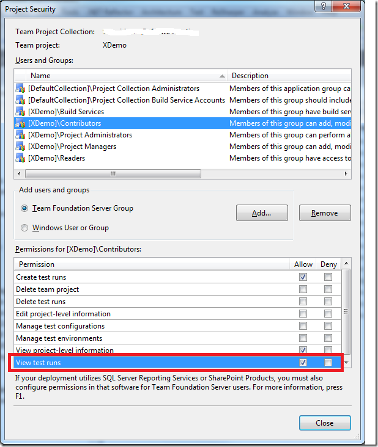

In TFS 2010, I have been asked this question several times: I have a build setup with tests and (possibly) code coverage, but in the build summary report it only shows **No Test Results** and **No Code Coverage Results**

What’s more interesting is that when I log in and view the build, I can see the test results!

This does of course imply that it is a one of those annoying security issues, and of course it is. \
To be able to see test results you must have the **View Test Runs** permission, which can be assigned/revoked at the security group level per team project:

So make sure that you set this permission for your developers, if you want them to be able to see the test results (tip: you want that!)

---

## Comments

*Imported from the original WordPress site. Closed for new replies.*

> **Stefano Torelli** — 01 Dec 2010
>
> Originally posted on: <http://geekswithblogs.net/jakob/archive/2010/10/06/why-canrsquot-i-see-test-results-in-the-tfs-2010.aspx#550254>
>
> I have the same problem even if I am a full administrator of TFS 2010 so the "View test runs" permission is granted by default. By the way if I use the link provided by the email alert (automatically sent by the system, if it is configured to do so) I can access the web report of the given build which contains either the test results report and the code coverage report.\
> Any one have solved the problem while dealing with the visual studio report?

> **Toby** — 16 Dec 2010
>
> Originally posted on: <http://geekswithblogs.net/jakob/archive/2010/10/06/why-canrsquot-i-see-test-results-in-the-tfs-2010.aspx#552687>
>
> Thanks for posting!
