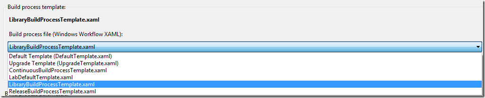
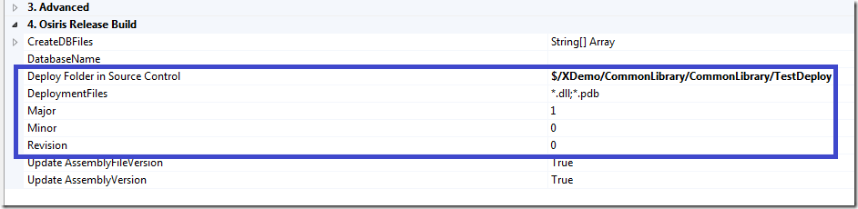
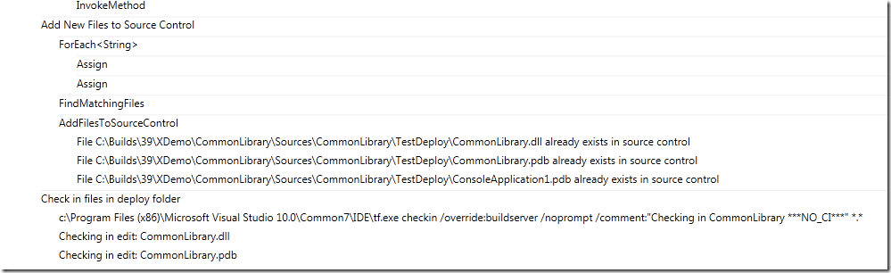
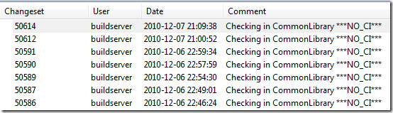

Some time ago, I wrote a [post](http://geekswithblogs.net/jakob/archive/2009/03/05/implementing-dependency-replication-with-tfs-team-build.aspx) about how to implement dependency replication using TFS 2008 Build. We use this for *Library builds*, where we set up a build definition for a common library, and have the build check the resulting assemblies back into source control. The folder **is** then branched to the applications that need to reference the common library. See the above post for more details.

Of course, we have reimplemented this feature in TFS 2010 Build, which results in a much nicer experience for the developer who wants to setup a new library build. Here is how it looks: \
There is a separate build process template for library builds registered in all team projects \



The following properties are used to configure the library build: \

[](http://gwb.blob.core.windows.net/jakob/Windows-Live-Writer/Dependency-Replication-with-TFS-2010-Bui_11F08/image_4.png)

**Deploy Folder in Source Control** is the server path where the assemblies should be checked in \
**DeploymentFiles** is a list of files and/or extensions to what files to check in. Default here is *.dll;*.pdb which means that all assemblies and debug symbols will be checked in. We can also type for example *CommonLibrary.*;SomeOtherAssembly.dll* in order to exclude other assemblies \
You can also see that we are versioning the assemblies as part of the build. This is important, since the resulting assemblies will be deployed together with the referencing application.

When the build executes, it will see of the matching assemblies exist in source control, if not, it will add the files automatically:

[](http://gwb.blob.core.windows.net/jakob/Windows-Live-Writer/Dependency-Replication-with-TFS-2010-Bui_11F08/image_8.png)

After the build has finished, we can see in the history of the TestDeploy folder that the build service account has in fact checked in a new version: \

[](http://gwb.blob.core.windows.net/jakob/Windows-Live-Writer/Dependency-Replication-with-TFS-2010-Bui_11F08/image_6.png)

Nice! 🙂

The implementation of the library build process template is not very complicated, it is a combination of customization of the build process template and some custom activities. \
We use the generic TFActivity ([http://geekswithblogs.net/jakob/archive/2010/11/03/performing-checkins-in-tfs-2010-build.aspx](http://geekswithblogs.net/jakob/archive/2010/11/03/performing-checkins-in-tfs-2010-build.aspx "http://geekswithblogs.net/jakob/archive/2010/11/03/performing-checkins-in-tfs-2010-build.aspx")) to check in and out files, but for the part that checks if a file exists \
and adds it to source control, it was easier to do this in a custom activity:

```json
Code highlighting produced by Actipro CodeHighlighter (freeware)
http://www.CodeHighlighter.com/

    public sealed class AddFilesToSourceControl : BaseCodeActivity
    {
        // Files to add to source control
        [RequiredArgument]
        public InArgument<IEnumerable<string>> Files { get; set; }

        [RequiredArgument]
        public InArgument<Workspace> Workspace { get; set; }

        // If your activity returns a value, derive from CodeActivity<TResult>
        // and return the value from the Execute method.
        protected override void Execute(CodeActivityContext context)
        {
            foreach (var file in Files.Get(context))
            {
                if (!File.Exists(file))
                {
                    throw new ApplicationException("Could not locate " + file);
                }

                var ws = this.Workspace.Get(context);
                string serverPath = ws.TryGetServerItemForLocalItem(file);
                if( !String.IsNullOrEmpty(serverPath))
                {
                    if (!ws.VersionControlServer.ServerItemExists(serverPath, ItemType.File))
                    {
                        TrackMessage(context, "Adding file " + file);
                        ws.PendAdd(file);
                    }
                    else
                    {
                        TrackMessage(context, "File " + file + " already exists in source control");
                    }
                }
                else
                {
                    TrackMessage(context, "No server path for " + file);
                }
            }
        }
    }
```

This build template is a very nice tool that makes it easy to do dependency replication with TFS 2010. Next, I will add funtionality for automatically merging the assemblies (using ILMerge) as part of the build, we do this to keep the number of references to a minimum.

---

## Comments

*Imported from the original WordPress site. Closed for new replies.*

> **Thomas Eyde** — 11 Dec 2010
>
> Originally posted on: <http://geekswithblogs.net/jakob/archive/2010/12/08/dependency-replication-with-tfs-2010-build.aspx#551935>
>
> How can we automate the merge when we are ready to consume a newer library version? I know there is a command line option, but I keep forgetting what it is. Are there other options?

> **Jakob Ehn** — 13 Dec 2010
>
> Originally posted on: <http://geekswithblogs.net/jakob/archive/2010/12/08/dependency-replication-with-tfs-2010-build.aspx#552275>
>
> @Thomas This can be done using the tf merge command or by implementing a custom activity using the API. The syntax for tf merge is for example:\
> \
> tf merge   /recursive

> **Luc** — 28 Feb 2011
>
> Originally posted on: <http://geekswithblogs.net/jakob/archive/2010/12/08/dependency-replication-with-tfs-2010-build.aspx#565269>
>
> Is your template available for download?

> **Simon** — 28 Nov 2011
>
> Originally posted on: <http://geekswithblogs.net/jakob/archive/2010/12/08/dependency-replication-with-tfs-2010-build.aspx#601183>
>
> Confused, is this developed from the Default Template, u state "There is a separate build process template for library builds", but I only have Default, Upgrade and Lab tempates available to me. Where do you get the library template from?

> **Timon** — 13 Dec 2011
>
> Originally posted on: <http://geekswithblogs.net/jakob/archive/2010/12/08/dependency-replication-with-tfs-2010-build.aspx#602598>
>
> Hi Jakob. I do actually have the same question as Luc and Simon. Your post looks like the perfect solution for my problem and it would be highly appreciated if you could offer your LibraryBuildProcessTemplate for download! I assume you created it by yourself because it can't find it in my environment either. Cheers

> **Magnus Timner** — 14 Dec 2011
>
> Originally posted on: <http://geekswithblogs.net/jakob/archive/2010/12/08/dependency-replication-with-tfs-2010-build.aspx#602715>
>
> Hi Jakob,\
> This looks as the perfect solution for me as well! Could you please post your custom template.\
> /Magnus

> **Ken** — 12 Apr 2012
>
> Originally posted on: <http://geekswithblogs.net/jakob/archive/2010/12/08/dependency-replication-with-tfs-2010-build.aspx#611856>
>
> Others have requested a custom template. Can we actually get a FULL solution for this? You completely skip over so many things (how to create the template, how to create the custom activity, how to compile and then reference the activity in order for the template to use it, etc.). Yes, I did follow the link to the TFActivity and read that and downloaded the .zip file, and again...no instructions on how to actually compile and reference the activity. I can't add it to a new solution and get it to actually build it because Microsoft.TeamFoundation.Build.Workflow is not an option to add through VS2010 even though I know it's on my computer. Even then, I'm not sure how to hook up new WorkFlow activities in a template.\
> \
> If I understood TFS Build well enough to apply your solution as it stands on this blog post, I would have been able to write the solution myself and wouldn't have needed to read it.\
> \
> This is one of those things where I need a quick solution that I can understand how to use without needing to understand how it was made. If you want to teach people how you came up with it, you're missing out on vital parts.
