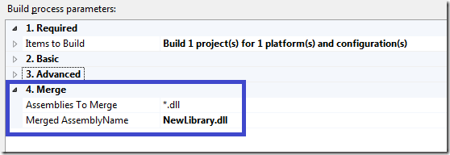
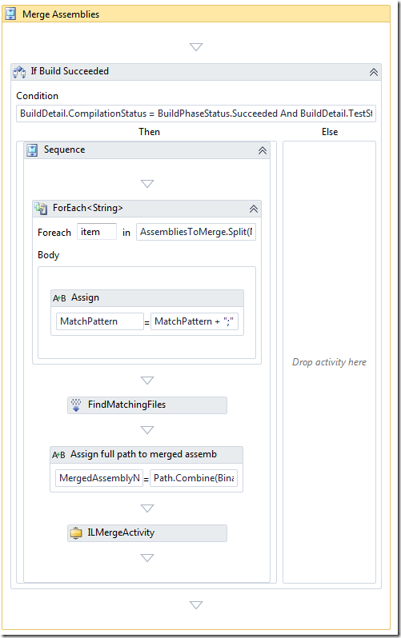
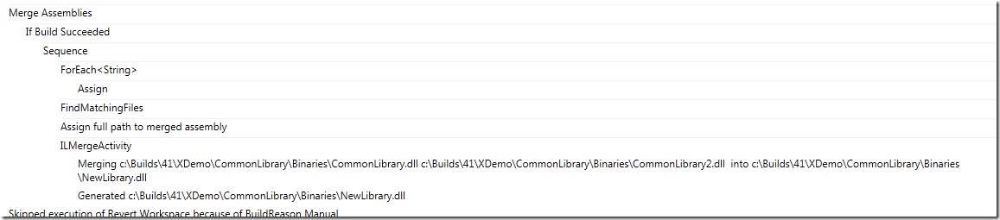
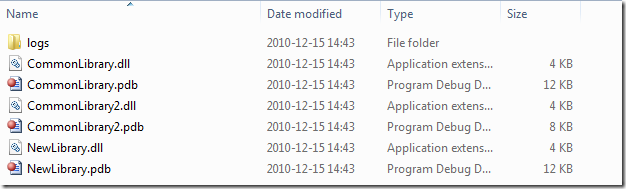

*** The sample build process template discussed in this post is available for download from here: [http://cid-ee034c9f620cd58d.office.live.com/self.aspx/BlogSamples/ILMerge.xaml](http://cid-ee034c9f620cd58d.office.live.com/self.aspx/BlogSamples/ILMerge.xaml "http://cid-ee034c9f620cd58d.office.live.com/self.aspx/BlogSamples/ILMerge.xaml") ***

In my [previous post](http://geekswithblogs.net/jakob/archive/2010/12/08/dependency-replication-with-tfs-2010-build.aspx) I talked about *library builds* that we use to build and replicate dependencies between applications in TFS. This is typically used for common libraries and tools that several other application need to reference.

When the libraries grow in size over time, so does the number of assemblies. So all solutions that uses the common library must reference all the necessary assemblies that they need, and if we for example do a refactoring and extract some \
code into a new assembly, all the clients must update their references to reflect these changes, otherwise it won’t compile.

To improve on this, we use a tool from Microsoft Research called *ILMerge* (Download [from here](http://www.microsoft.com/downloads/en/details.aspx?familyid=22914587-b4ad-4eae-87cf-b14ae6a939b0&displaylang=en)). It can be used to merge several assemblies into one assembly that contains all types. If you haven’t used this tool before, you should check it out. \
Previously I have implemented this in builds using a simple batch file that contains the full command, something like this: \
**"%ProgramFiles(x86)%microsoftilmergeilmerge.exe" /target:library /attr:ClassLibrary1.bl.dll /out:MyNewLibrary.dll ClassLibrary1.dll ClassLibrar2.dll ClassLibrary3.dll**

This merges 3 assemblies (ClassLibrary1, 2 and 3) into a new assembly called MyNewLibrary.dll. It will copy the attributes (file version, product version etc..) from ClassLibrary1.dll, using the /attr switch. For more info on ILMerge command line tool, see the above link.

This approach works, but requires a little bit too much knowledge for the developers creating builds, therefor I have implemented a custom activity that wraps the use of ILMerge. This makes it much simpler to setup a new build definition and have the build automatically do the merging. \
The usage of the activity is then implemented as part of the Library Build process template mentioned in the previous post. For this article I have just created a simple build process template that only performs the ILMerge operation.

Below is the code for the custom activity. To make it compile, you need to reference the ILMerge.exe assembly.

```
Code highlighting produced by Actipro CodeHighlighter (freeware)
http://www.CodeHighlighter.com/

    /// <summary>
    /// Activity for merging a list of assembies into one, using ILMerge
    /// </summary>
    public sealed class ILMergeActivity : BaseCodeActivity
    {
        /// <summary>
        /// A list of file paths to the assemblies that should be merged
        /// </summary>
        [RequiredArgument]
        public InArgument<IEnumerable<string>> InputAssemblies { get; set; }
        /// <summary>
        /// Full path to the generated assembly
        /// </summary>
        [RequiredArgument]
        public InArgument<string> OutputFile { get; set; }
        /// <summary>
        /// Which input assembly that the attibutes for the generated assembly should be copied from.
        /// Optional. If not specified, the first input assembly will be used
        /// </summary>
        public InArgument<string> AttributeFile { get; set; }
        /// <summary>
        /// Kind of assembly to generate, dll or exe
        /// </summary>
        public InArgument<TargetKindEnum> TargetKind { get; set; }

        // If your activity returns a value, derive from CodeActivity<TResult>
        // and return the value from the Execute method.
        protected override void Execute(CodeActivityContext context)
        {
            string message = InputAssemblies.Get(context).Aggregate("", (current, assembly) => current + (assembly + " "));
            TrackMessage(context, "Merging " + message + " into " + OutputFile.Get(context));
            ILMerge m = new ILMerge();
            m.SetInputAssemblies(InputAssemblies.Get(context).ToArray());
            m.TargetKind = TargetKind.Get(context) == TargetKindEnum.Dll ? ILMerge.Kind.Dll : ILMerge.Kind.Exe;
            m.OutputFile = OutputFile.Get(context);
            m.AttributeFile = !String.IsNullOrEmpty(AttributeFile.Get(context)) ? AttributeFile.Get(context) : InputAssemblies.Get(context).First();
            m.SetTargetPlatform(RuntimeEnvironment.GetSystemVersion().Substring(0,2), RuntimeEnvironment.GetRuntimeDirectory());
            m.Merge();

            TrackMessage(context, "Generated " + m.OutputFile);
        }
    }
    [Browsable(true)]
    public enum TargetKindEnum
    {
        Dll,
        Exe
    }
```

**NB**: The activity inherits from a BaseCodeActivity class which is an internal helper class which contains some methods and properties useful for moste custom activities. In this case, it uses the TrackeMessage method for writing
to the build log. You either need to remove the TrackMessage method calls, or implement this yourself (which is not very hard… 🙂)

The custom activity has the following input arguments:

|  |  |
| --- | --- |
| **InputAssemblies** | A list with the (full) paths to the assemblies to merge |
| **OutputFile** | The name of the resulting merged assembly |
| **AttributeFile** | Which assembly to use as the template for the attribute of the merged assembly. This argument is optional and if left blank, the first assembly in the input list is used |
| **TargetKind** | Decides what type of assembly to create, can be either a dll or an exe |

Of course, there are more switches to the ILMerge.exe, and these can be exposed as input arguments as well if you need it.

To show how the custom activity can be used, I have attached a build process template (see link at the top of this post) that merges the output of the projects being built (CommonLibrary.dll and CommonLibrary2.dll) into a merged assembly (NewLibrary.dll).
The build process template has the following custom process parameters:

[](http://gwb.blob.core.windows.net/jakob/Windows-Live-Writer/TFS-2010-Build-Custom-Activity-for-Mergi_CBA1/image_2.png)

The Assemblies To Merge argument is passed into a FindMatchingFiles activity to located all assemblies that are located in the BinariesDirectory folder after the compilation has been performed by Team Build.
Here is the complete sequence of activities that performs the merge operation. It is located at the end of the Try, Compile, Test and Associate… sequence:

[](http://gwb.blob.core.windows.net/jakob/Windows-Live-Writer/TFS-2010-Build-Custom-Activity-for-Mergi_CBA1/image_4.png)

It splits the AssembliesToMerge parameter and appends the full path (using the BinariesDirectory variable) and then enumerates the matching files using the FindMatchingFiles activity.

When running the build, you can see that it merges two assemblies into a new one:

[](http://gwb.blob.core.windows.net/jakob/Windows-Live-Writer/TFS-2010-Build-Custom-Activity-for-Mergi_CBA1/image_6.png)

And the merged assembly (and associated pdb file) is copied to the drop location together with the rest of the assemblies:

[](http://gwb.blob.core.windows.net/jakob/Windows-Live-Writer/TFS-2010-Build-Custom-Activity-for-Mergi_CBA1/image_8.png)

---

## Comments

*Imported from the original WordPress site. Closed for new replies.*

> **Michael Baarz** — 12 Jun 2011
>
> Originally posted on: <http://geekswithblogs.net/jakob/archive/2010/12/15/tfs-2010-build-custom-activity-for-merging-assemblies.aspx#581605>
>
> Hey,\
> \
> nice article. We have a similar hughe heavily used shared libraries which the half is binary and the the other one in solution format. By using TFS 2010 and several team project collections which merging in these libraries we have an heavy payload on referencing needed assemblies. I will try over this weekend your solution with ILMerge, until now it sounds very useful! Great postings, keep on going ...\
> \
> Regards, Michael
