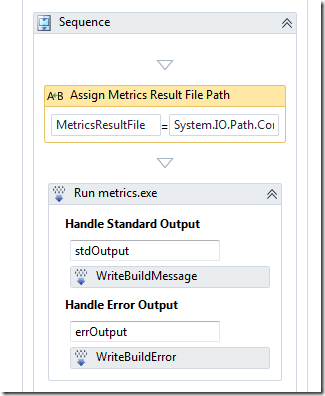
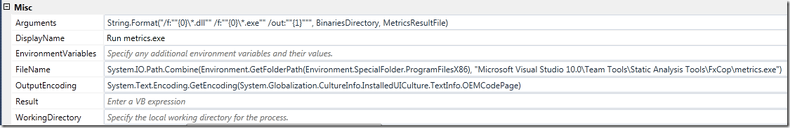
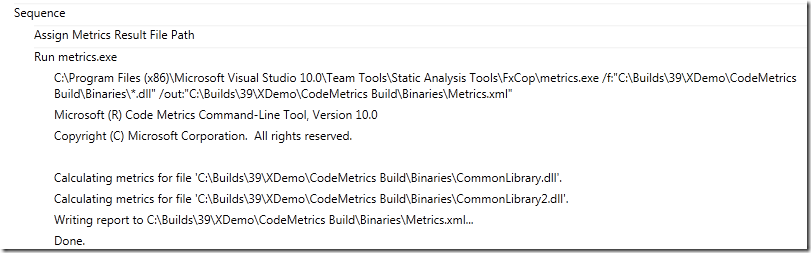
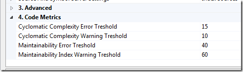

The build process template and custom activity described in this post is available here: \
[http://cid-ee034c9f620cd58d.office.live.com/self.aspx/BlogSamples/Inmeta%20TFS%20Build%20Sample.zip](http://cid-ee034c9f620cd58d.office.live.com/self.aspx/BlogSamples/Inmeta%20TFS%20Build%20Sample.zip "http://cid-ee034c9f620cd58d.office.live.com/self.aspx/BlogSamples/Inmeta%20TFS%20Build%20Sample.zip")

Running code metrics has been available since VS 2008, but only from inside the IDE. Yesterday Microsoft finally released [Visual Studio Code Metrics Power Tool 10.0](http://www.microsoft.com/downloads/en/details.aspx?FamilyID=edd1dfb0-b9fe-4e90-b6a6-5ed6f6f6e615), a command line tool that lets you run code metrics on your applications.  This means that it is now possible to perform code metrics analysis on the build server as part of your nightly/QA builds. In this post I will show how you can run the metrics command line tool from a build, and also a custom activity that reads the output and appends the results to the build log, and fails the build if the metric values exceeds certain (configurable) treshold values.

The code metrics tool analyzes all the methods in the assemblies, measuring cyclomatic complexity, class coupling, depth of inheritance and lines of code. Then it calculates a M*aintainability Index* from these values that is a measure of how maintanable this method is, between 0 (worst) and 100 (best). For information on how this value is calculated, see <http://blogs.msdn.com/b/codeanalysis/archive/2007/11/20/maintainability-index-range-and-meaning.aspx>. After this it aggregates the information and present it at the class, namespace and module level as well.

**\
Running Metrics.exe in a build definition \**Running the actual tool is easy, just use a InvokeProcess activity last in the *Compile the Project* sequence, reference the metrics.exe file and pass the correct arguments and you will end up with a result XML file in the drop directory. Here is how it is done in the attached build process template:

In the above sequence I first assign the path to the code metrics result file ([BinariesDirectory]result.xml) to a variable called *MetricsResultFile*, which is then sent to the InvokeProcess activity in the Arguments property. \
Here are the arguments for the InvokeProcess activity:

Note that we tell metrics.exe to analyze all assemblies located in the Binaries folder. You might want to do some more intelligent filtering here, you probably don’t want to analyze all 3rd party assemblies for example. \
Note also the path to the metrics.exe, this is the default location when you install the Code Metrics power tool. You must of course install the power tool on all build servers. \
Using the standard output logging (in the Handle Standard Output/Handle Error Output sections), we get the following output when running the build:

**Integrating Code Metrics into the build** \
Having the results available next to the build result is nice, but we want to have results integrated in the build result itself, and also to affect the outcome of the build. The point of having QA builds that measure, for example, code metrics is to make it very clear how the code being built measures up to the standards of the project/company. Just having a XML file available in the drop location will not cause the developers to improve their code, but a (partially) failing build will! 🙂

To do this, we need to write a custom activity that parses the metrics result file, logs it to the build log and fails the build if the values frfom the metrics is below/above some predefined treshold values.

The custom activity performs the following steps

1. Parses the XML. I’m using [Linq 2 XSD](http://linqtoxsd.codeplex.com/) for this. Since the XML schema for the result file is available with the power tool, it is vey easy to generate code that lets you query the structure using standard Linq operators. \
2. Runs through the metric result hierarchy and logs the metrics for each level and also verifies maintainability index and the cyclomatic complexity against the treshold values. The treshold values are defined in the build process template and are sent in as arguments to the custom activity **\**
3. If the treshold limits are exceeded, the activity either fails or partially fails the current build.

For more information about the structure of the code metrics result file, read [Cameron Skinner's post about it](http://blogs.msdn.com/b/camerons/archive/2011/01/28/code-metrics-from-the-command-line.aspx). It is very simple and easy to understand. I won’t go through the code of the custom activity here, since there is nothing special about it and it is available for download so you can look at it and play with it yourself.

The treshold values for Maintainability Index and Cyclomatic Complexity is defined in the build process template, and can be modified per build definition: \

I have chosen the default values for these settings based on a post from my colleague [Terje Sandström](http://geekswithblogs.net/terje/Default.aspx) - [Code Metrics - suggestions for approriate limits](http://geekswithblogs.net/terje/archive/2008/11/25/code-metrics---suggestions-for-appropriate-limits.aspx). When you think about it, this is quite an improvement compared to using code metrics inside the IDE, where the Red/Yellow/Green limits are fixed (and the default values are somewhat strange, see Terjes post for a discussion on this)

This is the first version of the code metrics integration with TFS 2010 Build, I will probably enhance the functionality and the logging (the “tree view” structure in the log becomes quite hard to read) soon. \
I will also consider adding it to the [Community TFS Build Extensions](http://tfsbuildextensions.codeplex.com/) site when it becomes a bit more mature.

Another obvious improvement is to extend the data warehouse of TFS and push the metric results back to the warehouse and make it visible in the reports.

---

## Comments

*Imported from the original WordPress site. Closed for new replies.*

> **Rick** — 31 Jan 2011
>
> Originally posted on: <http://geekswithblogs.net/jakob/archive/2011/01/30/integrating-code-metrics-in-tfs-2010-build.aspx#560235>
>
> Hi,\
> \
> Great start, however the sample code appears to be missing some things, such as the definition of the Metric class as well as the CodeMetricsReport.Load methods. Are you missing files?\
> \

> **Jakob Ehn** — 31 Jan 2011
>
> Originally posted on: <http://geekswithblogs.net/jakob/archive/2011/01/30/integrating-code-metrics-in-tfs-2010-build.aspx#560270>
>
> @Rick: Sorry about that, I uploaded the full project now instead of the separate source files

> **kidambi** — 01 Feb 2011
>
> Originally posted on: <http://geekswithblogs.net/jakob/archive/2011/01/30/integrating-code-metrics-in-tfs-2010-build.aspx#560542>
>
> Thanks a lot for this. However when I try to run my build process, I get could not find XML.Schema.Linq.dll eventhough I installed it in GAC. Would you please tell me what I'm missing? Any help would be much appreciated.

> **Jakob Ehn** — 01 Feb 2011
>
> Originally posted on: <http://geekswithblogs.net/jakob/archive/2011/01/30/integrating-code-metrics-in-tfs-2010-build.aspx#560563>
>
> @Kidambi: You should not install it in the GAC, add it to source control, next to the custom activities assembly

> **Antony** — 20 Apr 2011
>
> Originally posted on: <http://geekswithblogs.net/jakob/archive/2011/01/30/integrating-code-metrics-in-tfs-2010-build.aspx#574734>
>
> Err, I've downloaded the sample, built it, but how do I deploy it to the build server so that I can set up a build to use it?

> **Jason Cornwall** — 10 May 2011
>
> Originally posted on: <http://geekswithblogs.net/jakob/archive/2011/01/30/integrating-code-metrics-in-tfs-2010-build.aspx#577403>
>
> Thanks for the sample, got it up and running, although I'm curious why you are processing metrics on all the levels, for example the cyclomatic value for the module, which is a aggregation of the namespaces. My particular assembly that is being evaluated has a module cyclomatic value of 111, which exceeds the threshold therefore the build fails. However, the members in the module don't exceed the threshold which my understanding is the only part that actually matters?

> **karthik** — 28 Sep 2011
>
> Originally posted on: <http://geekswithblogs.net/jakob/archive/2011/01/30/integrating-code-metrics-in-tfs-2010-build.aspx#595378>
>
> Thanks Jakob. The instructions are very clear and I've setup the metrics with help of your post and http://blogs.microsoft.co.il/blogs/shair/archive/2011/02/07/integrating-code-metrics-in-tfs-2010-build-wf-4-0.aspx\
> \
> I got the outputs.xml file created but stuck in parsing the output into a readable format as part of Build log.\
> \
> Could you please point me somewhere where I can get some more details on it.

> **Thorsten** — 24 Oct 2012
>
> Originally posted on: <http://geekswithblogs.net/jakob/archive/2011/01/30/integrating-code-metrics-in-tfs-2010-build.aspx#620686>
>
> Do you have some additional advice how to push the data into warehouse?\
> \
> best regards\
> Thorsten

> **Kidambi** — 04 Apr 2014
>
> Originally posted on: <http://geekswithblogs.net/jakob/archive/2011/01/30/integrating-code-metrics-in-tfs-2010-build.aspx#636888>
>
> Hi,\
> This is great. Exactly what I was looking for. However I'm looking to download the source code and I could not get to it. Would you please point me from where I can download the code?\
> \
> Thanks a lot.\
> \
> Regards,\
> \
> Kidambi

> **Jakob Ehn** — 07 Apr 2014
>
> Originally posted on: <http://geekswithblogs.net/jakob/archive/2011/01/30/integrating-code-metrics-in-tfs-2010-build.aspx#636947>
>
> @Kidimbi: This activity is now part of the Community TFS Build Extensions, and has been worked on since this blog post. Please check it out over at http://tfsbuildextensions.codeplex.com/\
> \
> /Jakob

> **Luis** — 08 Apr 2014
>
> Originally posted on: <http://geekswithblogs.net/jakob/archive/2011/01/30/integrating-code-metrics-in-tfs-2010-build.aspx#636991>
>
> Hey,\
> Could you share the XSD you are using? I generated one from a sample report using the XSD tool, however when I try to deserialize using C#, the System.xml code throws an exception.
