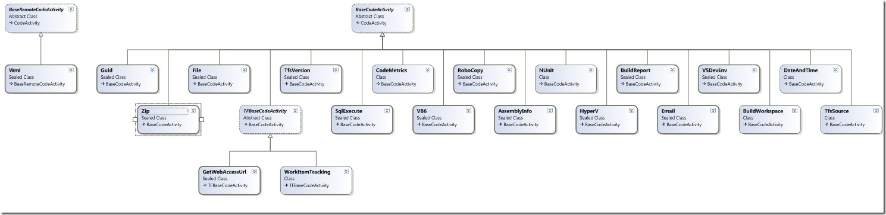

Today the first stable release of the [Community TFS 2010 Build Extensions](http://tfsbuildextensions.codeplex.com/) shipped on the CodePlex site. Visual Studio ALM MVP [Mike Fourie](http://freetodev.com/) (aka Mr [MSBuild Extension Pack](http://msbuildextensionpack.codeplex.com/)) has been the leader of this project and has done a tremendous job, both in contributing functionality as well as coordinating the work for the first release. Great work Mike! I (as well as several others) have contributed a small part of the activities, I plan to be working on the upcoming releases as well.

The build extensions contain approximately 100 custom activities that covers several different areas, such as IIS7, Hyper-V, StyleCop, NUnit, Powershell etc, as well as some core functionality (Assembly versionig, file management, compression, email etc etc). In addition to more activities in upcoming releases, the plan is to include build process templates for different scenarios.

Please download the release and try it out, and give us feedback!

To give you a hint of the content, here is a class diagram that shows the content of the “Core” activities project (there are several other projects included as well):

