The latest release of the [Community TFS Build Extensions](http://tfsbuildextensions.codeplex.com/) include a brand new tool called *Community TFS Build Manager* and has been created for two reasons:

1. An implementation of the Team Foundation Build API which is referenced by the Rangers Build Customization Guidance V2 (available H1 2012) \
2. Provide a solution to a real problem. The Community TFS Build Manager is intended to ease the management of builds in medium to large Team Foundation Server environments, though it does provide a few features which all users may find useful.

The first version of the tool has been implemented by myself and [Mike Fourie](http://www.freetodev.com/). You can download the extension from the Visual Studio Gallery here: \
[http://visualstudiogallery.msdn.microsoft.com/16bafc63-0f20-4cc3-8b67-4e25d150102c](http://visualstudiogallery.msdn.microsoft.com/16bafc63-0f20-4cc3-8b67-4e25d150102c "http://visualstudiogallery.msdn.microsoft.com/16bafc63-0f20-4cc3-8b67-4e25d150102c")

**\
Note 1:** The full source is available at the Community TFS Build Extension site

**Note 2:** The tool is still considered alpha, so you should be a bit careful when running commands that modify or delete information in live environments, e.g. try it out first in a non-critical environment.

**Note 3**: The tool is also available as a stand alone WPF application. To use it, you need to download the source from the CodePlex site and build it.

**Getting Started**

You can either install the extension from the above link, or just open the Visual Studio Extension Manager and go to the Online gallery and search for TFS Build: \

[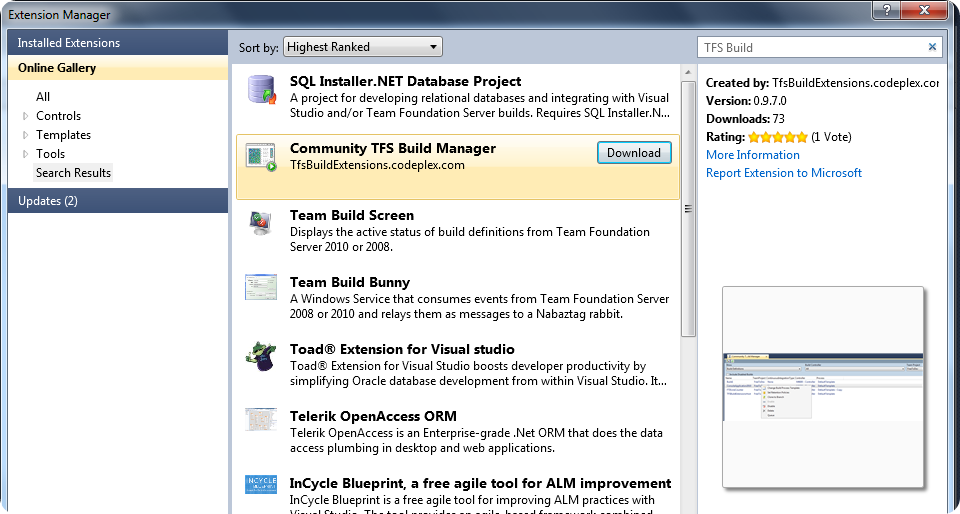](http://gwb.blob.core.windows.net/jakob/Windows-Live-Writer/Introducing-Community-TFS-Build-Manager_14F14/image_26.png)

After installing the build manager, you can start it either from the Tools menu or from the Team Explorer by right-clicking on the Builds node on any team project:

[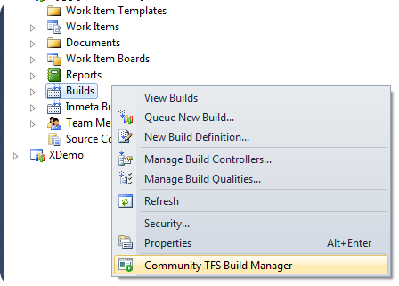](http://gwb.blob.core.windows.net/jakob/Windows-Live-Writer/Introducing-Community-TFS-Build-Manager_14F14/image_6.png)

This will bring up a new tool window that will by default show all build definition in the currently selected team project.

**\
View and sort Builds and Build Definitions across multiple Build Controllers and Team Projects \**This has always been a major limitation when working with builds in Team Explorer, they are always scoped to a team project. It is particularly annoying when viewing queued builds and you \
have no idea what other builds are running on the same controller. In the TFS Build Manager, you can filter on one/all build controllers and one/all team projects:

[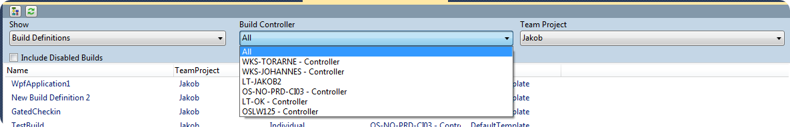](http://gwb.blob.core.windows.net/jakob/Windows-Live-Writer/Introducing-Community-TFS-Build-Manager_14F14/image_2.png)

The same filters apply when you switch between Build Definitions and Builds. In the following screen shot, you can see that three builds from three different team projects are running on the same controller:

You can easily filter on specific team projects and/or build controllers. Note that all columns are sortable, just click on the header column to sort it ascending or descending. \
This makes it easy to for example locate all build definitions that use a particular build process template, or group builds by team project etc.

[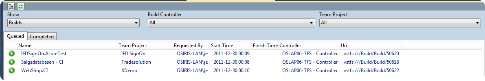](http://gwb.blob.core.windows.net/jakob/Windows-Live-Writer/Introducing-Community-TFS-Build-Manager_14F14/image_4.png)

**Bulk operations on Build Definitions**

The main functionality that this tool brings in addition to what Team Explorer already offers, is the ability to perform bulk operations on multiple build definitions/builds. Often you need to modify or \
delete several build definitions in TFS and there is no way to do this in Team Explorer.

In the TFS Build Manager, just select one or more builds or build definitions in the grid and right-click. The following context menu will be shown for build definitions:

[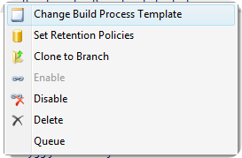](http://gwb.blob.core.windows.net/jakob/Windows-Live-Writer/Introducing-Community-TFS-Build-Manager_14F14/image_8.png)

**Change Build Process Templates**

This command lets you change the build process template for one or more build definitions. It will show a dialog with all existing build process templates in the corresponding team projects: \

[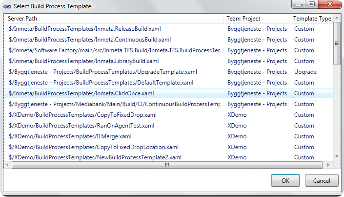](http://gwb.blob.core.windows.net/jakob/Windows-Live-Writer/Introducing-Community-TFS-Build-Manager_14F14/image_10.png)

**Queue**

This will queue a “default” build for the the selected build definitions. This means that they will be queued with the default parameters.

**Enable/Disable**

Enables or disables the selected build definitions. Note that disabled build definitions are by default now shown. To view disabled build definitions, check the *Include Disabled Builds* checkbox:

[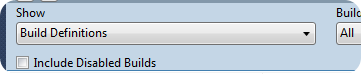](http://gwb.blob.core.windows.net/jakob/Windows-Live-Writer/Introducing-Community-TFS-Build-Manager_14F14/image_12.png)

**Delete**

This lets you delete one ore more build definitions in a single click. In Team Explorer this is not possible, you must first delete all builds and then delete the build definition. Annoying! 🙂

TFS Build Manager will prompt you with the same delete options as in Team Explorer, so no functionality is lost: \

[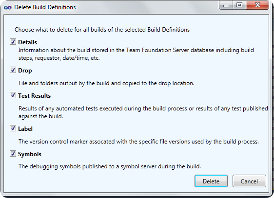](http://gwb.blob.core.windows.net/jakob/Windows-Live-Writer/Introducing-Community-TFS-Build-Manager_14F14/image_14.png)

**Set Retention Policies**

Allows you to set retentions policies to several build definitions in one go. Note that only retention policies for Triggered and Manual build definitions can be updated, not private builds.  \
This feature also gives you the same options as in Team Explorer: \

[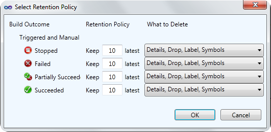](http://gwb.blob.core.windows.net/jakob/Windows-Live-Writer/Introducing-Community-TFS-Build-Manager_14F14/image_16.png)

**Clone to Branch**

My favorite feature 🙂 Often the reason for cloning a build definition is that you have created a new source code branch and now you want to setup a matching set of builds for the new branch. When using the Clone build definition feature of the TFS Power Tools, you must update several of the parameters of the build definition after, including:

- Name
- Workspace mappings
- Source control path to Items to builds (solutions and/or projects)
- Source control path to test settings file
- Drop location
- Source control path to TFSBuild.proj for UpgradeTemplate builds

All this is done automagically when using the Clone to Branch feature! When you select this command, the build manager will look at the Items to build path (e.g. solution/projects) and find all child branches to this path and display them in a dialog: \

[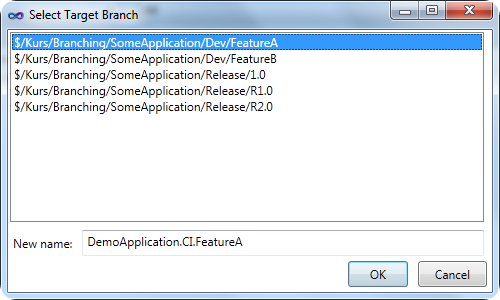](http://gwb.blob.core.windows.net/jakob/Windows-Live-Writer/Introducing-Community-TFS-Build-Manager_14F14/image_18.png)

When select one of the target branches, the new name will default to the source build definition with the target branch name appended. Of course you can modify the name in the dialog. After pressing OK, a new build definition will be created and all the parameters listed above will be modified accordingly to the new branch.

**Bulk operations on Builds**

You can also perform several actions on builds, and more will be added shortly. In the first release, the following features are available:

**Delete**

This will delete all artifacts of the build (details, drops, test results etc..). It should show the same dialog as the Delete Build Definition command, but currently it will delete everything.

**Open Drop Folders**

Allows you to open the drop folder for one or more builds

**Retain Indefinitely**

Set one or more builds to be retained indefinitely.

**Bonus Feature – Generate DGML for your build environment**

This feature was outside spec, but since I was playing around with generating DGML it was easy to implement this feature and it is actually rather useful. It quickly gives you an overview of your build resources, e.g. which build controllers and build agents that exist for the current project collection, and on what hosts they are running. The command is available in the small toolbar at the top, next to the refresh button:

[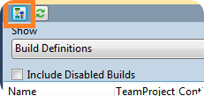](http://gwb.blob.core.windows.net/jakob/Windows-Live-Writer/Introducing-Community-TFS-Build-Manager_14F14/image_24.png)

Here is an example from our lab environment:

[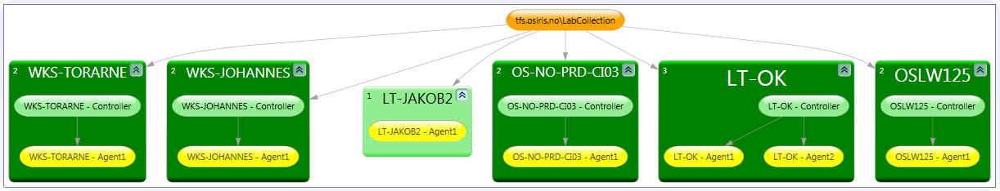](http://gwb.blob.core.windows.net/jakob/Windows-Live-Writer/Introducing-Community-TFS-Build-Manager_14F14/image_22.png)

The dark green boxes are the host machine names and the controller and agents are contained within them.

**Note:** Currently the only way to view DGML files are with Visual Studio 2010 Premium and Ultimate.

I hope that many of you will find this tool useful, please report issues/feature requests to the Community TFS Build Extensions CodePlex site!

---

## Comments

*Imported from the original WordPress site. Closed for new replies.*

> **SG** — 09 Dec 2014
>
> Originally posted on: <http://geekswithblogs.net/jakob/archive/2011/12/30/introducing-community-tfs-build-manager.aspx#641828>
>
> Why dont I see the Community Build Manager as an option when I connect my VS 2013 to a TFS-Git Repo? I'm trying to get to the "Clone Buid" option but no luck.

> **Jakob Ehn** — 22 Dec 2014
>
> Originally posted on: <http://geekswithblogs.net/jakob/archive/2011/12/30/introducing-community-tfs-build-manager.aspx#642033>
>
> If you have installed the extension (and restarted Visual Studio) you should see it both in the Tools menu and also if you right-click on the Builds hub in Team Explorer\
> \
> /Jakob

> **Alfred Poon** — 08 Jun 2015
>
> Originally posted on: <http://geekswithblogs.net/jakob/archive/2011/12/30/introducing-community-tfs-build-manager.aspx#644654>
>
> Is there a way to configure the "Delete Build Definition" dialog to have a different default versus deleting all. We wanted to set the default to not delete any Labels.

> **[Soujanya Naganuri](https://tekslate.com/)** — 15 Jun 2017
>
> Thanks for sharing info on Introducing: Community TFS Build Manager

> **Shane Grant** — 21 Jul 2022
>
> Can the default to load build definitions be configured?
