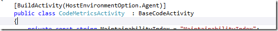
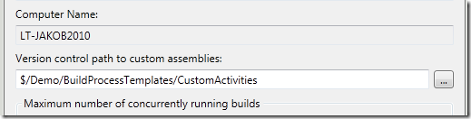
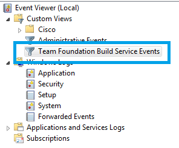

Anyone working with developing custom activities in TFS 2010 Build has run into the following dreadful error message when running the build:

**TF215097: An error occurred while initializing a build for build definition TeamProjectMyBuildDefinition: Cannot create unknown type '{clr-namespace:[namespace];assembly=[assembly]}Activity**

What the error means is that when the TFS build service loads the build process template XAML for the build definition, it can’t create an instance of the customer workflow activity that is referenced from it.

The problem here is that there are several steps that all need to be done correctly for this process to work.

Make sure that:

- When developing custom workflow, you keep the XAML builds template workflows in one project, and the custom activities in another project. The template workflow project shall reference the custom activities project. \
  This setup also makes sure that your custom activities show up in the toolbox when designing your workflow. \
- You have checked in the modified version of the XAML workflow (easy to forget) \
- Your custom activity has the the **BuildActivityAttribute**: \
  [](http://gwb.blob.core.windows.net/jakob/Windows-Live-Writer/2ea22155b985_DADF/image_4.png) \
- Your custom activity is **public** (common mistake…) \
- You have configured your build controller with the path in source control where the custom activities are located \
  [](http://gwb.blob.core.windows.net/jakob/Windows-Live-Writer/2ea22155b985_DADF/image_6.png) \
- Verify that all dependencies for the custom activity assembly/assemblies have been checked into the same location as the assembly \
  **NB**: You don’t need to check in TFS assemblies and other references that you know will be in the GAC on the build servers. \
- The reference to the custom activity assembly in the XAML workflow is correct:
```
xmlns:obc="clr-namespace:Inmeta.Build.CustomActivities;assembly=Inmeta.Build.CustomActivities"
```

But, even if you have all these step done right, you can still get the error. I had this problem recently when working with the code metrics activities for the [http://tfsbuildextensions.codeplex.com/](http://tfsbuildextensions.codeplex.com/ "http://tfsbuildextensions.codeplex.com/") community project.
The thing that saved me that time was the **Team Foundation Build Service Events** eventlog. This is a somewhat hidden “feature” that is very useful when troubleshooting build problems. You find it under Custom View
in the event log on the build servers

[](http://gwb.blob.core.windows.net/jakob/Windows-Live-Writer/2ea22155b985_DADF/image_2.png)

In this case I had the following message there:

***Service 'LT-JAKOB2010 - Agent1' had an exception:
Exception Message: Problem with loading custom assemblies: Method 'get_BuildAgentUri' in type 'TfsBuildExtensions.Activities.Tests.MockIBuildDetail' from assembly 'TfsBuildExtensions.Activities.Tests, Version=1.0.0.0, Culture=neutral, PublicKeyToken=null' does not have an implementation. (type Exception)***

Which made me realize that I had by accident checked in one of the test assemblies into the custom activity source control folder in TFS.

Unfortunately this whole process with developing you own custom activities is problematic and error prone, hopefully this will be better in future versions of TFS. Once you have your setup working however, changing and adding new custom activities is easy. And deployment is a breeze thanks to the automatic downloading and recycling of build agents that the build controller handles.

---

## Comments

*Imported from the original WordPress site. Closed for new replies.*

> **Sylvain Lavoie** — 28 Feb 2012
>
> Originally posted on: <http://geekswithblogs.net/jakob/archive/2011/12/08/tfs-2010-build---troubleshooting-the-tf215097-error.aspx#609009>
>
> Hi Jacob, \
> Very great post. He helped me a lot to solve custom activity issues.\
> Owever, I have a similar problem with an Activity I writen to execute Visual Build Pro using is the com dll. Maybe you could give me some hint. The activity run fine on x86 xp. On Windows 7 64, the only thing I have in the log is Exception Message: Problem with loading custom assemblies: Could not load file or assembly 'file:///C:UsersusernameAppDataLocalTempBuildAgent30VisBuildSvr.dll' or one of its dependencies. The module was expected to contain an assembly manifest. (type Exception)\
> \
> When I try to attach the debugger I saw an exception :\
> A first chance exception of type 'System.IO.FileNotFoundException' occurred in mscorlib.dll\
> \
> Additional information: Could not load file or assembly 'Interop.VisBuildSvr, Version=1.0.0.0, Culture=neutral, PublicKeyToken=d64ea679b6fd0408' or one of its dependencies. The system cannot find the file specified.\
> \
> Thanks

> **pavel** — 16 May 2012
>
> Originally posted on: <http://geekswithblogs.net/jakob/archive/2011/12/08/tfs-2010-build---troubleshooting-the-tf215097-error.aspx#613783>
>
> Great post! along with other articles on TFS build.. Thanks!

> **Subrat** — 29 May 2013
>
> Originally posted on: <http://geekswithblogs.net/jakob/archive/2011/12/08/tfs-2010-build---troubleshooting-the-tf215097-error.aspx#629007>
>
> Hello,\
> \
> I am getting a same error, while I am importing a Powershell Workflow activity into toolbox. Its imported successfully but while executing it gives the below error.\
> TF215097: An error occurred while initializing a build for build definition Exception Message: Cannot create unknown type '{clr-namespace:StopService;assembly=StopService}StopService'. (type XamlObjectWriterException)Exception Stack Trace: \
> \
> The Activities has been created by using the steps in http://msdn.microsoft.com/en-us/library/hh852743(v=vs.85).aspx\
> \
> The DLL is created and successfully imported into workflow toolbox, but while using it in a build its giving the above error.

> **Jakob Ehn** — 29 May 2013
>
> Originally posted on: <http://geekswithblogs.net/jakob/archive/2011/12/08/tfs-2010-build---troubleshooting-the-tf215097-error.aspx#629008>
>
> @Subrat: Did you remember to check in the assembly in the custom assembly version control path (bullet nr 5 above)?\
> \
> /Jakob
