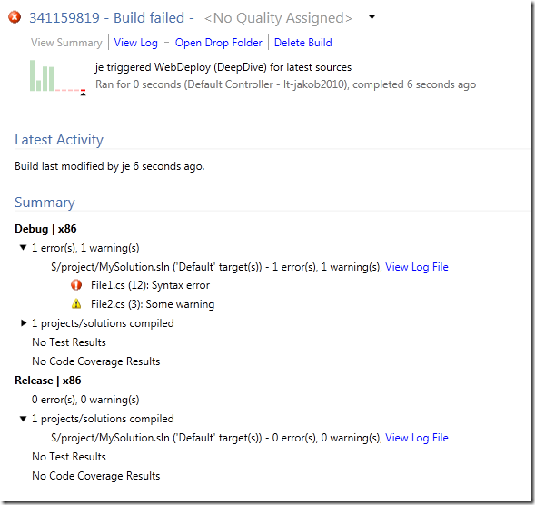

We have been using TFS 2010 build for distributing a build in parallel on several agents, but where the actual compilation is done by a bunch of external tools and compilers, e.g. no MSBuild involved. We are using the [ParallelTemplate.xaml template](http://blogs.msdn.com/b/jimlamb/archive/2010/09/14/parallelized-builds-with-tfs2010.aspx) that Jim Lamb blogged about previously, which distributes each configuration to a different agent. We developed custom activities for running these external compilers and collecting the information and errors by reading standard out/error and pushing it back to the build log.

But since we aren’t using MSBuild we don’t the get nice configuration summary section on the build summary page that we are used to. We would like to show the result of each configuration with any errors/warnings as usual, together with a link to the log file.

TFS 2010 API to the rescue! What we need to do is adding information to the InformationNode structure that is associated with every TFS build. The log that you normally see in the Log view is built up as a tree structure of [IBuildInformationNode](http://msdn.microsoft.com/en-us/library/microsoft.teamfoundation.build.client.ibuildinformationnode.aspx) objects. This structure can we accessed by using the [InformationNodeConverters](http://msdn.microsoft.com/en-us/library/microsoft.teamfoundation.build.client.informationnodeconverters.aspx) class. This class also contain some helper methods for creating BuildProjectNode, which contain the information about each project that was build, for example which configuration, number of errors and warnings and link to the log file.

Here is a code snippet that first creates a “fake” build from scratch and the add two BuildProjectNodes, one for Debug|x86 and one for Release|x86 with some release information:

```
Code highlighting produced by Actipro CodeHighlighter (freeware)
http://www.CodeHighlighter.com/

TfsTeamProjectCollection collection = TfsTeamProjectCollectionFactory.GetTeamProjectCollection(new Uri("http://lt-jakob2010:8080/tfs"));
IBuildServer buildServer = collection.GetService<IBuildServer>();

var buildDef = buildServer.GetBuildDefinition("TeamProject", "BuildDefinition");

//Create fake build with random build number
var detail = buildDef.CreateManualBuild(new Random().Next().ToString());

// Create Debug|x86 project summary
IBuildProjectNode buildProjectNode = detail.Information.AddBuildProjectNode(DateTime.Now, "Debug", "MySolution.sln", "x86", "$/project/MySolution.sln", DateTime.Now, "Default");
buildProjectNode.CompilationErrors = 1;
buildProjectNode.CompilationWarnings = 1;

buildProjectNode.Node.Children.AddBuildError("Compilation", "File1.cs", 12, 5, "", "Syntax error", DateTime.Now);
buildProjectNode.Node.Children.AddBuildWarning("File2.cs", 3, 1, "", "Some warning", DateTime.Now, "Compilation");

buildProjectNode.Node.Children.AddExternalLink("Log File", new Uri(@"\serversharelogfiledebug.txt"));
buildProjectNode.Save();

// Create Releaes|x86 project summary
buildProjectNode = detail.Information.AddBuildProjectNode(DateTime.Now, "Release", "MySolution.sln", "x86", "$/project/MySolution.sln", DateTime.Now, "Default");
buildProjectNode.CompilationErrors = 0;
buildProjectNode.CompilationWarnings = 0;

buildProjectNode.Node.Children.AddExternalLink("Log File", new Uri(@"\serversharelogfilerelease.txt"));
buildProjectNode.Save();

detail.Information.Save();
detail.FinalizeStatus(BuildStatus.Failed);
```

When running this code, it will a create a build that looks like this:

[](http://gwb.blob.core.windows.net/jakob/Windows-Live-Writer/Adding-Fake-Build-Information_126EC/image_2.png)

As you can see, it created two configurations with error and warning information and a link to a log file. Just like a regular MSBuild would have done.

This is very useful when using TFS 2010 Build in heterogeneous environments. It would also be possible to do this when running compilations completely outside TFS build, but then push the results of the into TFS for easy access. You can push all information, including the compilation summary, drop location, test results etc using the API.

---

## Comments

*Imported from the original WordPress site. Closed for new replies.*

> **Victor** — 31 Jul 2014
>
> Originally posted on: <http://geekswithblogs.net/jakob/archive/2012/03/30/adding-fake-build-information-in-tfs-2010.aspx#639209>
>
> Hi, i have been looking for that template do you by chance have a copy of it, i can't find it on the blog link. \
> Thanks
