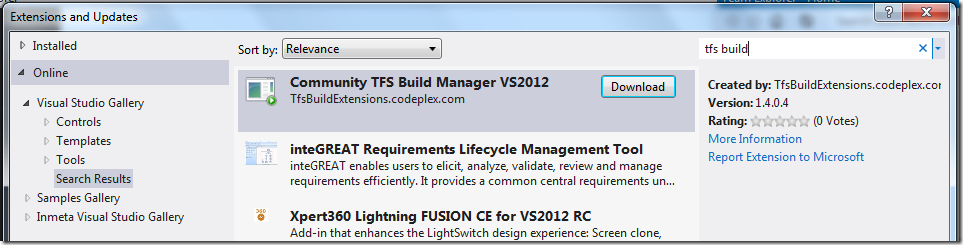
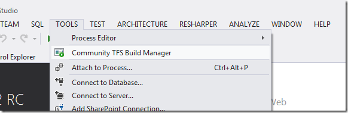
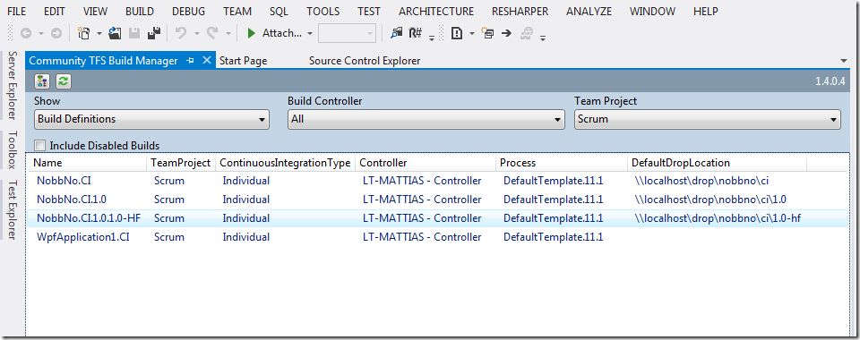

I finally got around to push out a version of the Community TFS Build Manager that is compatible with Visual Studio 2012 RC. Unfortunately I had to do this as a separate extension, \
it references different versions of the TFS assemblies and also some properties and methods that the 2010 version uses are now obsolete in the TFS 2012 API.

To download it, just open the Extension Manager, select Online and search for TFS Build:

You can also download it from this link: \
[http://visualstudiogallery.msdn.microsoft.com/cfdb84b4-285e-4eeb-9fa9-dad9bfe2cd10](http://visualstudiogallery.msdn.microsoft.com/cfdb84b4-285e-4eeb-9fa9-dad9bfe2cd10 "http://visualstudiogallery.msdn.microsoft.com/cfdb84b4-285e-4eeb-9fa9-dad9bfe2cd10")

The functionality is identical to the 2010 version, the only difference is that you can’t start it from the Team Explorer Builds node (since the TE has been completely rewritten and the \
extension API’s are not yet published). So, to start it you must use the Tools menu:

We will continue shipping updates to both versions in the future, as long as it functionality that is compatible with both TFS 2010 and TFS 2012.

You might also note that the color scheme used for the build manager doesn’t look as good with the VS2012 theme….

Hope you will enjoy the tool in Visual Studio 2012 as well. I want to thank all the people who have downloaded and used the 2010 version! \
For feedback, feature requests, bug reports please post this to the CodePlex site: <http://tfsbuildextensions.codeplex.com>

---

## Comments

*Imported from the original WordPress site. Closed for new replies.*

> **samaa tv** — 08 Sep 2012
>
> Originally posted on: <http://geekswithblogs.net/jakob/archive/2012/07/02/community-tfs-build-manager-available-for-visual-studio-2012-rc.aspx#618811>
>
> I think we must appreciate those who do something especial. Keep it up, thanks\
