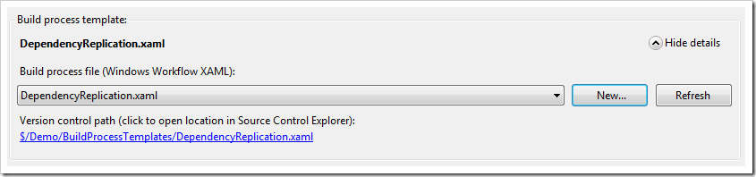
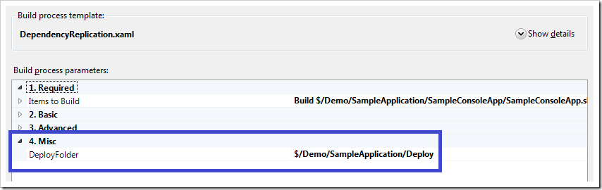
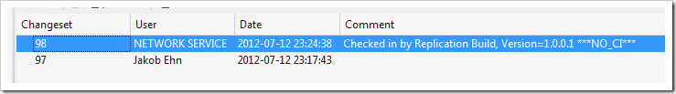

\
I have posted before on how to implement dependency replication using TFS Build, [once for TFS 2008 using MSBuild](http://geekswithblogs.net/jakob/archive/2009/03/05/implementing-dependency-replication-with-tfs-team-build.aspx) and then for [TFS 2010 using Windows Workflow](http://geekswithblogs.net/jakob/archive/2010/12/08/dependency-replication-with-tfs-2010-build.aspx). The last post was not complete (I could not post all implementation details back then for various reasons), so I decided that I should post a new solution for this, but this time using the [Community TFS Build Extensions](http://tfsbuildextensions.codeplex.com/) library.

If it is a good idea to store your dependencies in source control or not is a question that is well debated. I’m not going to argue pros and cons here, but for those of you that want to go this way here is a build process template that will get you started.

An interesting fact is that Microsoft actually have added this feature as part of the hosted TFS (TFS Services) running on Windows Azure, but decided post-Beta that this feature was not to be included in the on-premise version of TFS. The feature might reappear in the on-premise version at some point in the future but nothing is confirmed yet. For hosted TFS, this feature is a must since users would not be able to access the network shares that TFS Build normally use as drop location.

**Features of the DependencyReplication.xaml build process template** \
I have added a new Build Process template called *DependencyReplication.xaml* to the TFS Build Extensions that performs the following steps, in addition to the common default template:

- Accepts a source control folder input parameter where the binaries should be stored (DeployFolder) \
- Versions all assemblies, using the TfsVersion activity \
- Copies to binaries to the the deploy folder \
- Check in the binaries. The check-in comment includes the version number (using the TfsSource activity) \
- If any errors occurs as part of the replication, it will undo any pending changes as part of the build

I have uploaded the build process template to the CodePlex site, so it is available at *$/teambuild2010contrib/CustomActivities/MAIN/Source/BuildProcessTemplates/DependencyReplication.xaml*. \
 **\
Note**: The build process template uses the [latest version](http://tfsbuildextensions.codeplex.com/SourceControl/changeset/changes/78108) of the activities, so make sure that you download the latest source and compile it. I had to make some additions to the library to support the functionality of the build process template. The changes will be included in the next official release, but until then you must download the latest bits and build it yourself.

**\
How to use the Build Process Template**

1. Add the *DependencyReplication.xaml* file to source control. You can add it wherever you like. This sample assumes that you add it to *$/Demo/BuildProcessTemplates/ \*
2. Make sure that you have added the necessary TFSBuildExtension assemblies to the Version Control path for Custom assemblies. See [this link](http://tfsbuildextensions.codeplex.com/wikipage?title=How%20to%20integrate%20the%20extensions%20into%20a%20build%20template&referringTitle=Documentation) for how to do this. \
   Since this template only uses a few of the build activities, you only need to add the following assemblies: \
   - TfsBuildExtensions.Activites.dll \
   - TfsBuildExtensions.TfsUtilities.dll \
   - Ionic.Zip.dll \
3. Create a new build definition. \
4. In the process tab, click the Show Details button \
5. Click *New* and then the *Select an existing XAML file* radio button and browse to the *DependencyReplication.xaml* file that you just added: \
    \
6. Note that you will now have an additional, required, process parameter called *DeployFolder*, located in the *Misc* category. \
   Enter the source control folder path where you want the binaries to be stored. \
   **Note:** This path must exist in source control, and must also be a part of the workspace for the current build definition otherwise the build will fail. This is a limitation of the current implementation. It can be implemented by modifying the workspace at build time, as I did in my first post on dependency replication. \
    \
7. You must also change the *Build Number Format* parameter to be ***$(BuildDefinitionName)_1.0.0$(Rev:.r)***  \
   **Note**: This build process template uses the built-in functionality for incrementing the build number, so the version number will be a part of the build number itself which gives you a nice traceability between the build and the generated assemblies. It then parses the version number from the Build number, so you need to have the four-part version number as part of the build number format. If you have some other way of managing version numbers, you will need to change the build process template correspondingly. \
   The 1.0.0 part above can obviously have any value, it will represent your Major.Minor.Revision part of the generated version number. \
8. Save the build definition and queue a build

After the build has finished, you should see that the binaries have been added to source control in the given path. \
Note that all files in the binaries folder will be added to source control. If this is not what you want, you need to modify the build process template. An option here would be to add the filter expression (*.*) as a process parameter to make it configurable per build definition. \
If you download the binaries you should see that they have the same version number that was included in the build number for that particular build. \
If you view history of the folder, you will see that the build service account (in my case the Network service) have checked in the files with a comment containing the version number: \

If you have check-in policies enabled for the team project, they will be overridden as part of the check-in with a comment.

I hope that you will find this build process template useful. It is by no means a full solution, it lacks some error checking and also it should handle the case where the DeployFolder path is outside the workspace for the build definition. Let me know if you really need this feature and I will consider adding it to the template 🙂. Of course, you can add it yourself and post it back to the community.

---

## Comments

*Imported from the original WordPress site. Closed for new replies.*

> **Jonathan** — 30 Jul 2012
>
> Originally posted on: <http://geekswithblogs.net/jakob/archive/2012/07/15/tfs-build-dependency-replication-using-community-tfs-build-extensions.aspx#617170>
>
> I can't get it to work when I download from CodePlex. I get the following error in my Build:\
> \
> TF215097: An error occurred while initializing a build for build definition STRFrameworkSTR Framework Library Build: Cannot set unknown member 'Microsoft.TeamFoundation.Build.Workflow.Activities.MSBuild.AllowUntrustedCertificate'.

> **Derek M** — 31 Jul 2012
>
> Originally posted on: <http://geekswithblogs.net/jakob/archive/2012/07/15/tfs-build-dependency-replication-using-community-tfs-build-extensions.aspx#617250>
>
> Thanks for the update to the Dependency topic.\
> \
> I think I followed your instructions, but I am wondering if the template (DependencyReplication.xaml) is built for TFS2012 or 2010? I am seeing a bunch of items that can't find references and I think that may be it.\
> \
> Thanks!

> **Jakob Ehn** — 10 Aug 2012
>
> Originally posted on: <http://geekswithblogs.net/jakob/archive/2012/07/15/tfs-build-dependency-replication-using-community-tfs-build-extensions.aspx#617703>
>
> @Derek: The template is built for TFS2012. The custom activities however exist for both TFS2010 and TFS2012 so you should be able to convert it pretty easily

> **samaa tv** — 08 Sep 2012
>
> Originally posted on: <http://geekswithblogs.net/jakob/archive/2012/07/15/tfs-build-dependency-replication-using-community-tfs-build-extensions.aspx#618805>
>
> Good work! I always like to leave comments whenever I see something unusual or impressive. I think we must appreciate those who do something especial. Keep it up, thanks

> **JosephJ** — 16 Apr 2013
>
> Originally posted on: <http://geekswithblogs.net/jakob/archive/2012/07/15/tfs-build-dependency-replication-using-community-tfs-build-extensions.aspx#627937>
>
> If the folder is part of the workspace how do you keep the check in from triggering another build? We are doing this, and currently have to cloak the folder in the current workspace.

> **Jakob Ehn** — 17 Apr 2013
>
> Originally posted on: <http://geekswithblogs.net/jakob/archive/2012/07/15/tfs-build-dependency-replication-using-community-tfs-build-extensions.aspx#627944>
>
> @Joseph: As you can see on the last screenshot of the post, the checkin is done with the string ***NO_CI*** in the comment. This will cause TFS to not trigger new CI builds.\
> \
> Thanks\
> /Jakob

> **Nathan** — 09 Feb 2015
>
> Originally posted on: <http://geekswithblogs.net/jakob/archive/2012/07/15/tfs-build-dependency-replication-using-community-tfs-build-extensions.aspx#642885>
>
> Thank you for this. I do have one question. How well does this work with a Java project? We are trying to have a Java package build, via ANT/build.xml, on the TFS server, and then move the build output(.jar file) to the staging area. Is there any issues that you can think of that would prevent this solution/template from working with a Java package?\
> \
> Thanks for all of the info you've provided, this is very helpful.
