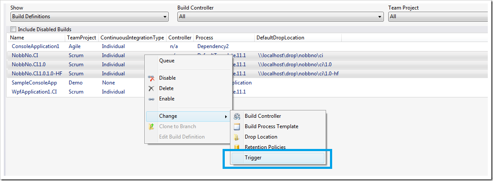
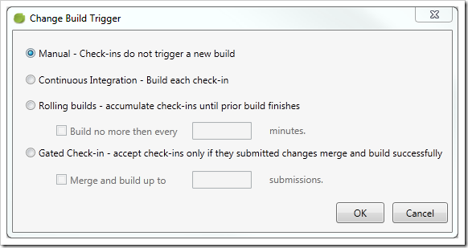
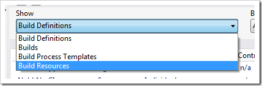
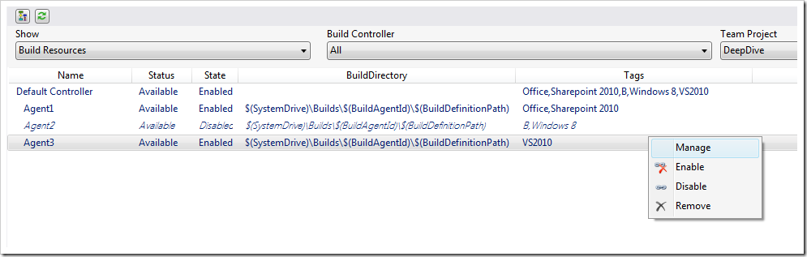

Yesterday we pushed out a new release (August 2012) of the [Community TFS Build Extension](http://tfsbuildextensions.codeplex.com/), including a new version of the [Community TFS Build Manager](http://visualstudiogallery.msdn.microsoft.com/cfdb84b4-285e-4eeb-9fa9-dad9bfe2cd10) (1.0.4.6)

The two big new features in the Build Manager in this release are: \
**Set Triggers** \
It is now possible to select one or more build definitions and update the triggers for them in one simple operation: \

You’ll note that we have started collapsing the context menu a bit, the list of commands are getting long! 🙂

When selecting the Trigger command, you’ll see a dialog where the options should be self-explanatory: \

The only thing missing here is the Scheduled trigger option, you’ll have to do that using Team Explorer for now.

**Manage Build Resources** \
The other feature is that it is now possible to view the build controllers and agents in your current collection and also perform some actions against them. The new functionality is available by select the Build Resources item in the drop down menu: \

Selecting this, you’ll see a (sort of) hierarchical view of the build controllers and their agents:

In this view you can quickly see all the resources and their status. You can also view the build directory of each build agent and the tags that are associated with them. \
On the action menu, you can enable and disable both agents and controllers (several at a time), and you can also select to remove them. \
By selecting Manage, you’ll be presented with the standard Manage Controller dialog from Visual Studio where you can set the rest of the properties. Hopefully we’ll be able to implement most of the existing functionality so that we can remove that menu option 🙂 \
Our plan is to add more functionality to this view, such as adding new agents/controllers, restarting build service hosts, maybe view diagnostic information such as disk space and error logs.

Hope you’ll find the new functionality useful. Remember to log any bugs and feature requests on the CodePlex site.

Happy building!
