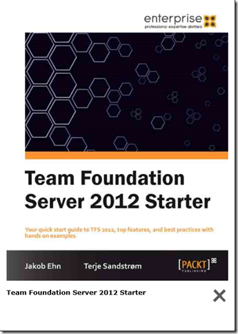

\
During the summer and fall this year, me and my colleague [Terje Sandstrøm](http://geekswithblogs.net/terje/Default.aspx) has worked together on a book project that has now finally hit the stores! \
The title of the book is **Team Foundation Server 2012 Starter** and is published by [Packt Publishing](http://www.packtpub.com/).

You can find it at [http://www.packtpub.com/team-foundation-server-2012-starter/book](http://www.packtpub.com/team-foundation-server-2012-starter/book "http://www.packtpub.com/team-foundation-server-2012-starter/book") or from Amazon [http://www.amazon.com/dp/1849688389](http://www.amazon.com/dp/1849688389 "http://www.amazon.com/dp/1849688389") 

 

The book is part of a concept that Packt have with starter-books, intended for people new to Team Foundation Server 2012 and who want a quick guideline to get it up and working. It covers the fundamentals, from installing and configuring it, and how to use it with source control, work items and builds. It is done as a step-by-step guide, but also includes best practices advice in the different areas. It covers the use of both the on-premises and the TFS Services version. It also has a list of links and references in the end to the most relevant Visual Studio 2012 ALM sites.

Our good friend and fellow ALM MVP [Mathias Olausson](http://msmvps.com/blogs/molausson/) have done the review of the book, thanks again Mathias!

We hope the book fills the gap between the different online guide sites and the more advanced books that are out. Check it out and please let us know what \
you think of the book!

#### Book Description

Your quick start guide to TFS 2012, top features, and best practices with hands on examples

**\
Overview**

- Install TFS 2012 from scratch
- Get up and running with your first project
- Streamline release cycles for maximum productivity

**\
In Detail**

Team Foundation Server 2012 is Microsoft's leading ALM tool, integrating source control, work item and process handling, build automation, and testing.

This practical "Team Foundation Server 2012 Starter Guide" will provide you with clear step-by-step exercises covering all major aspects of the product. \
This is essential reading for anyone wishing to set up, organize, and use TFS server.

This hands-on guide looks at the top features in Team Foundation Server 2012, starting with a quick installation guide and then moving into using it for your \
software development projects. Manage your team projects with Team Explorer, one of the many new features for 2012.

Covering all the main features in source control to help you work more efficiently, including tools for branching and merging, we will delve into the Agile Planning \
Tools for planning your product and sprint backlogs.

Learn to set up build automation, allowing your team to become faster, more streamlined, and ultimately more productive with this \
"Team Foundation Server 2012 Starter Guide".

**\
What you will learn from this book**

- Install TFS 2012 on premise
- Access TFS Services in the cloud
- Quickly get started with a new project with product backlogs, source control, and build automation
- Work efficiently with source control using the top features
- Understand how the tools for branching and merging in TFS 2012 help you isolate work and teams
- Learn about the existing process templates, such as Visual Studio Scrum 2.0
- Manage your product and sprint backlogs using the Agile planning tools

**\
Approach**

This Starter guide is a short, sharp introduction to Team Foundation Server 2012, covering everything you need to get up and running.

**\
Who this book is written for**

If you are a developer, project lead, tester, or IT administrator working with Team Foundation Server 2012 this guide will get you up to speed quickly \
and with minimal effort.
