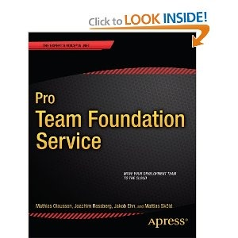

The last couple of months I have been working together with [Mathias Olausson](http://msmvps.com/blogs/molausson/), [Mattias Sköld](http://mskold.blogspot.se/) and [Joachim Rossberg](https://www.apress.com/index.php/author/author/view/id/2328) on a new book project for [Apress](http://www.apress.com/) that has just been published. The book is called **[Pro Team Foundation Service](http://www.apress.com/microsoft/workflow/9781430259954)** and covers all aspects of working with Team Foundation Service, Microsoft's hosted version of Team Foundation Server in the cloud. I have mainly worked on the chapter related to automated build and continuous deployment, but also with some of the other chapters.

It has been a quite hectic  project due to a tight schedule, but at the same time it has been a lot of fun to work on this book together with late night meetings and weekends filled with book writing and chapter editing.

During the project we’ve had great help from several people at Microsoft, Jamie Cool, Will Smythe, [Anutthara Bharadwaj](http://blogs.msdn.com/b/anutthara/), [Ed Blankenship](http://www.edsquared.com/) and Vijay Machiraju. Also a big thanks to [Brian Harry](http://blogs.msdn.com/b/bharry/) for writing the foreword to the book. In addition I’d like to thank my colleague [Terje Sandstrøm](http://geekswithblogs.net/terje/) for helping out with Technical Review of large parts of the book.

Here is some information about the book, you can find it on Amazon here: \
<http://www.amazon.com/Team-Foundation-Service-Mathias-Olausson/dp/1430259957#_>

Check it out and let us know what you think!

*Pro Team Foundation Service* gives you a jump-start into Microsoft’s cloud-based ALM platform, taking you through the different stages of software development. Every project needs to plan, develop, test and release software and with agile practices often at a higher pace than ever before. \
Microsoft's Team Foundation Service is a cloud-based platform that gives you tools for agile planning and work tracking. It has a code repository that can be used not only from Visual Studio but from Java platforms and Mac OS X. The testing tools allow testers to start testing at the same time as developers start developing. The book also covers how to set up automated practices such as build, deploy and test workflows.

This book:

· Takes you through the major stages in a software development project.

· Gives practical development guidance for the whole team.

· Enables you to quickly get started with modern development practices.

With Microsoft Team Foundation Service comes a collaboration platform that gives you and your team the tools to better perform your tasks in a fully integrated way.

**\
What you’ll learn**

· What ALM is and what it can do for you.

· Leverage a cloud-based ALM platform for quick improvements in your development process.

· Improve your agile development process using integrated tools and practices.

· Develop automated build, deployment and testing processes.

· Integrate different development tools with one collaboration platform.

· Get started with ALM best-practices first time round.

**\
Who this book is for**

*Pro Team Foundation Service* is for any development team that wants to take their development practices to the next level. Microsoft Team Foundation Service is an excellent platform for managing the entire application development lifecycle and being a cloud-based offering it is very easy to get started. *Pro Team Foundation Service* is a great guide for anyone in a team who wants to get started with the service and wants to get expert guidance to do it right.

**\
Table of Contents**

> 1. Introduction to Application Lifecycle Management
>
> 2. Introduction to Agile Planning, Development, and Testing
>
> 3. Deciding on a Hosted Service
>
> 4. Getting Started
>
> 5. Working with the Initial Product Backlog
>
> 6. Managing Team and Alerts
>
> 7. Initial Sprint Planning
>
> 8. Running the Sprint
>
> 9. Kanban
>
> 10. Engaging the Customer
>
> 11. Choosing Source Control Options
>
> 12. Working with Team Foundation Version Control in Visual Studio
>
> 13. Working with Git in Visual Studio
>
> 14. Working in Heterogeneous Environments
>
> 15. Configuring Build Services
>
> 16. Working with Builds
>
> 17. Customizing Builds
>
> 18. Continuous Deployment
>
> 19. Agile Testing
>
> 20. Test Management
>
> 21. Lab Management
