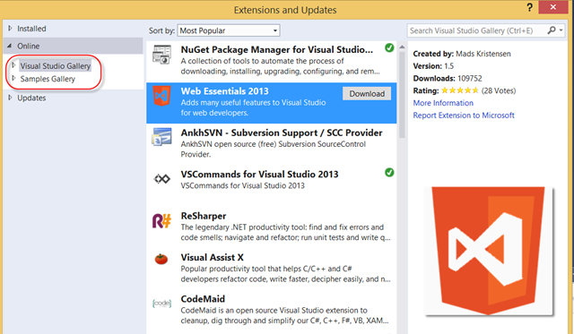
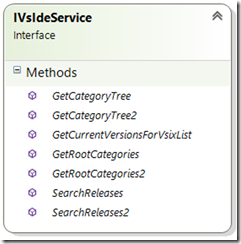
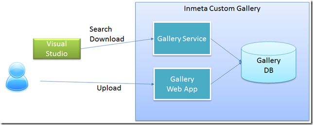
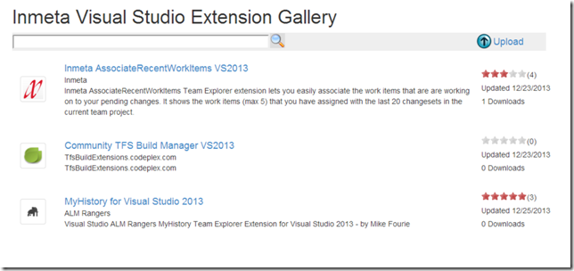
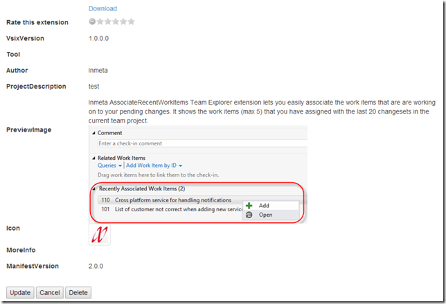
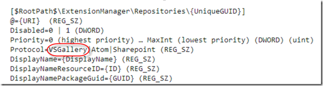

This year at the second MVP summit I presented a new solution for hosting a private extension gallery. Since then I have finished up the code and put it up on the CodePlex site so you can use it as you want to. \
In this blog post I will walk through the background and how you deploy and use the solution.

**\
Note: The sourcecode is available at [http://inmetavsgallery.codeplex.com/](http://inmetavsgallery.codeplex.com/ "http://inmetavsgallery.codeplex.com/") as a new 2.0 release. I have branched the original source code so that it is still available.**

**Background**

Little more than a year ago, I [blogged about](http://geekswithblogs.net/jakob/archive/2012/11/07/using-private-extension-galleries-in-visual-studio-2012.aspx) how to host your own private gallery for hosting Visual Studio extensions. The solution that I put up on CodePlex ([http://inmetavsgallery.codeplex.com/](http://inmetavsgallery.codeplex.com/ "http://inmetavsgallery.codeplex.com/")) was a ASP.NET web service that scans a folder or share and generates the corresponding Atom Feed XML that Visual Studio expects when browsing extensions, using the Extension Manager. See the blog post for details on how this works.

Although this solution works fine (we are using it internally at Inmeta) there are some things that have been nagging me:

- There is no easy way to upload or update extensions. \
- Since the file system is the data storage, the service rescanned the whole structure on every request, which could become a bottleneck when the number of clients and/or extensions increase \
- I miss some of the features that are available in the “real” Visual Studio Gallery, such as showing the number of downloads and the average rating of each extension

The last bullet is what made start looking at how this works in Visual Studio. As you know Visual Studio comes with two extension galleries by default, the **Visual Studio Gallery** and the **Samples Gallery**:

***The standard Visual Studio Gallery***

When selecting an extension here, Visual Studio shows among other things how many downloads this extension has, and the average rating together with the number of votes. Also it shows icons for the extension and a small preview image when selected. \
It is also possible to search on different metadata, such as popularity, number of downloads or most recent for example. All in all, this is a much nicer experience than what the was possible using the official private extension gallery mechanism.

When I dug into the details of how this works, it turns out that Visual Studio internally uses a completely different protocol for communicating with these two galleries. It uses a standard (but completely undocumented) WCF SOAP service with the following interface:

***The WCF SOAP interface that Visual Studio communicates with***

So basically, there are methods available for displaying the category tree (*GetRootCategories(2)* and *GetCategoryTree(2)*), checking for updates (*GetCurrentVersionsForVsixList*) and for searching available extensions (*SearchReleases(2)*). \
You can see how these methods matches to how the Visual Studio Extension Manager works when you browse, search and update your extensions.

So, with a (lot of) help from Fiddler I decrypted the protocol that was used and managed to implement a service that works in the same way that the Visual Studio Gallery does.

**Solution  \**The new version of the Inmeta Gallery is a ASP.NET web application that consists of three parts:

- A WCF service implementing the IVsIdeService interface
- An ASP.NET web application where you can upload and rate visual studio extensions
- A SQL database for storing the extensions.

***Inmeta Visual Studio Gallery overview***

This makes it easy to deploy, it is just one web application that contains both the service that VS communicates with and the web application where you can browse and upload the extensions.

The web application is simple, it shows the 10 most downloaded extensions together with the same information that you see in Visual Studio, and you can search extension by name or description. 

Here is a screenshot:

***Screenshot of the Inmeta Visual Studio Extension Gallery***

When select an extension you will see the full details of the extension, as shown below. Here you can download the extension, give it a rating and if desired delete it completely.

***Extension details page***

Note that if you rate it you need to press Update to store the new value.

**Deployment**

- **Server** \
  The CodePlex release for this solution is a simple web deploy package, that you can deploy to a local or remote IIS web server. I’ve attached the standard files from the Visual Studio publising wizard, so you’ll get the command files that simplifies the deployment, See [http://msdn.microsoft.com/en-us/library/dd465323(v=vs.110).aspx](http://msdn.microsoft.com/en-us/library/dd465323(v=vs.110).aspx "http://msdn.microsoft.com/en-us/library/dd465323(v=vs.110).aspx") for information on creating and deploying a Web Deploy Package using Visual Studio. \
  Note that the web application is using Entitiy Framework Code First which means that it will try to create the database the first time the code is executed. In order to do so, it must have proper permission on the target SQL server of course. If you need to deploy the database in any other manner, just download the source code take it from there. \
- **Client** \
  It is not possible to add a private extension gallery of this type using Visual Studio, it will always create a Atom Feed gallery extension point. Since these settings are stored in the registry, it is easy to do this using a .reg file. \
  The registry settings for a Visual Studio Gallery looks like this: \
   \
  Note the ***VSGallery*** string that is highlighted in te image above. This is the “secret” setting that causes Visual Studio to use the WCF protocol instead of the simple Atom Feed protocol \
  There is a .reg file available on the CodePlex site that you can use for registering the gallery for every client.

Hopefully you wil find this new version of the Inmeta Visual Studio Gallery service usable, please post any issues and/or suggestions to the CodePlex site!

---

## Comments

*Imported from the original WordPress site. Closed for new replies.*

> **zzz** — 11 Mar 2014
>
> Originally posted on: <http://geekswithblogs.net/jakob/archive/2013/12/26/inmeta-visual-studio-extension-gallery-ndash-version-2.0.aspx#636228>
>
> Try going to Tools Options Extension manager and add a Private Gallery. It will add a gallery to the Extension manager using VS' supported features.

> **Selvaraj** — 20 Feb 2018
>
> Hi All,
>
> I have created Private Gallery in VS2015 for to upload my own 40 numbers of VSIX extensions. In my current scenario I can see my VSIX extensions in my page. But with addition to that, I can see "Page Index" at bottom which is like 1 2 3.. All my VSIX extensions are shown in current page itself. Page numbers are showing unnecessarily. And clicking of that page number is just showing the duplicate of current page only. How to hide that Page index at bottom of my Private Gallery page? Please help me out of this. It happens only when we have more number of extensions in gallery. Above 30 extensions.
>
> Details:
>
> System : Win7
>
> VS Version : 2015
>
> VSIX Loading from : SQL Server 2014
>
> Private Gallery Mode : VSGallery
