Currently, Microsoft is working hard on a complete rewrite of the TFS Build system. They announced this, among other things, at the Connect event back in November and did a short demo of it. It is not yet available, but as part of the MVP program, a few of us has now been fortunate enough to get access to an early preview of the new build system.

**Note: This version is in pre-alpha state, meaning that a lot of things can and will change until the final version!**

Microsoft will enable a beta version to a broader public on Visual Studio Online later on this year, and it will RTM in TFS 2015. I will write a series of blog posts about Build vNext as it evolves. In this first post I will take a quick look at how to create and customize build definitions and running them in the new Web UI.

## Key Principals

The key principals of TFS Build vNext are:

- Customization should be dead simple. Users should not have to learn a new language (Windows Workflow anyone?) in order to just run some tool or script as part of the build process \
- Provide a simple Web UI for creating and customizing build definitions. No need for Visual Studio to customize builds anymore. \
- Support cross platform builds (Linux, MacOS…)  As in most other areas right now, Microsoft is serious about supporting other platforms than Windows, and TFS Build won’t be an exception. \
- Sharing build infrastructure. The concept of a build controller tied to a collection is gone, instead we will create agent pools at the deployment level and connect agents to those. \
- Don’t mess with the build output and keep my logs clean. One of the most frustrating things about the current version of TFS Build is that by default it doesn’t preserve the output structure of the compiled projects, but instead places them beneath a common Binaries directory. This causes all sort of problems, such as post build events that are dependent on relative path etc. \
  CI build == Dev build ! \
- Work side by side with the existing build system. All your existing XAML build definitions will continue to work just like before, and you will be able to create new ones. But don’t expect anything to be added in terms of functionality to the XAML builds

## Creating a build definition in vNext

In this post, I will show how easy it is to create a  new build definition in Build vNext, and customize it to update the version info in all the assembly files using a PowerShell task with a custom script.

**Note**: There will probably be a versioning task out of the box in the final release, but currently there isn’t.

Let’s get started:

1. From the dropdown, you can select from a list of build definition templates. These templates are created by saving an existing build definition as a template. Currently, they are scoped to the team project level:  \
   [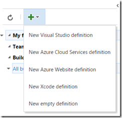](https://gwb.blob.core.windows.net/jakob/WindowsLiveWriter/TFSBuildvNextComingSoon_11441/image_2.png) \
   Here I’m going to select the Visual Studio definition template. \
2. This results in a build definition with two tasks, one that compiles the solution and one that runs all the unit tests using the Visual Studio test runner task \
   [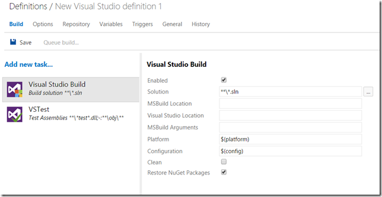](https://gwb.blob.core.windows.net/jakob/WindowsLiveWriter/TFSBuildvNextComingSoon_11441/image_30.png)  \
3. Selecting a task shows the properties of that task to the right, the properties of the Visual Studio Build task is shown above. Some of these properties are typed, meaning that for example the Solution property let’s you browse the current repository to select a solution. By default, it will locate all solution files and compile them (using the ***.sln pattern) \
   You can also see that the Platform and the Configuration property uses the variables $(platform) and $(config). We will come back to them shortly. \
4. The first thing we want to do typically is specifying which repository that the build will download the source from. To do this, select the Repository tab: \
   [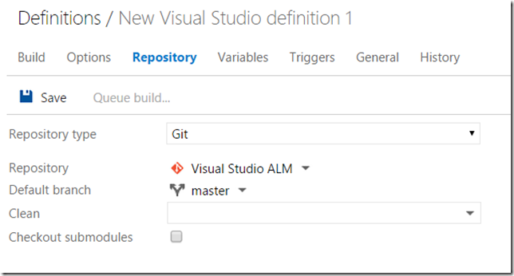](https://gwb.blob.core.windows.net/jakob/WindowsLiveWriter/TFSBuildvNextComingSoon_11441/image_32.png) \
   Looking at the Repository type field, since this is a Git team project it will let me choose either Git (which means a git repo in the current team project) or GitHub, which actually lets me choose any Git repo. In that case I will need to enter credentials as well. When selecting the Git repo type, i can then select the repo (Visual Studio ALM in this case) from the current team project, and then I can select the default branch in a drop down. \
5. If you want to add more tasks to the definition, go back to the Build tab and click on the Add new task link. This will display a list of all available tasks, shown below: \
   [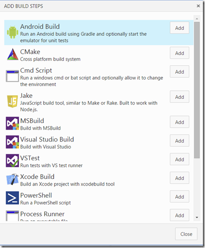](https://gwb.blob.core.windows.net/jakob/WindowsLiveWriter/TFSBuildvNextComingSoon_11441/image_26.png) \
   The list of tasks here are of course not complete, but as you can see there are a lot of cross platform tasks there already. To add a task to the build definition,  select it and press Add. \
   Here, I will select the PowerShell task that I will use to version all my assemblies: \
   [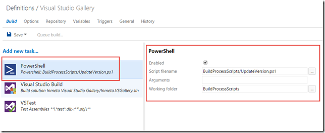](https://gwb.blob.core.windows.net/jakob/WindowsLiveWriter/TFSBuildvNextComingSoon_11441/image_28.png)  \
   When adding a new task it will end up at bottom of the task list, but you can easily reorder the tasks by using drag and drop. Since I must stamp the version information before i compile my solution, I have dragged the PowerShell task to the top. This task then requires me to select a PowerShell file to execute, and I also specified a working folder since the script I am using assumes this. All paths here are relative to the repository. \
   **Note:** *Although currently not possible,* **i***t will be possible to rename the build tasks* \
6. On the Triggers tab, the only option available right now is to trigger the build on every check-in (or push in the case of Git). I can also select to batch the changes, which is the same thing as the Rolling build trigger in the existing version of TFS build. \
   This means that all changes that are checked in during a running build will be batched up and processed in the next build as soon as the current build has completed. \
   In addition we can specify one or more branches that should trigger this build. \
    [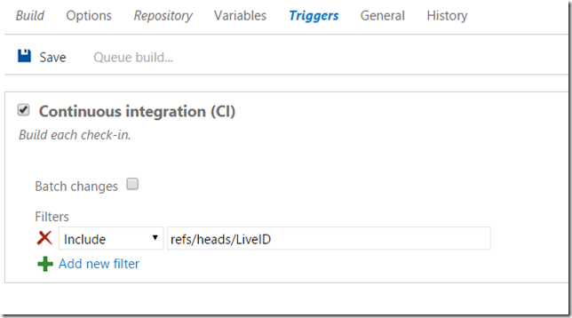](https://gwb.blob.core.windows.net/jakob/WindowsLiveWriter/TFSBuildvNextComingSoon_11441/image_36.png) \
   **Tip**: The filter strings can include * as a filter, which lets me for example specify *refs/heads/feature** as a filter that will trigger on any change on any branch that starts with the string feature. \
7. On the Variables tab, we can specify and add new variables for this build definition. Here you can see the *config* and *platform* variables that were referenced in the Build tab: \
   [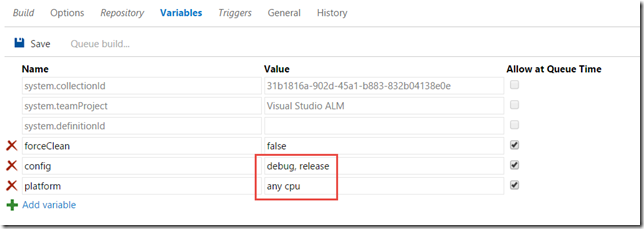](https://gwb.blob.core.windows.net/jakob/WindowsLiveWriter/TFSBuildvNextComingSoon_11441/image_38.png) \
8. Last, let’s take a look at the Options tab. The *MultiConfiguration* option enables us to build the selected solution(s) multiple times, each time for every combination of the variables that are specified here. By default, it will list the config and platform variables here. So, this means that the build will first build my solution using Debug | Any CPU, and the it will compile it using Release | Any CPU. \
   If I check the Parallel checkbox, it will run these combinations in parallel, if there are multiple agents available of course. \
   [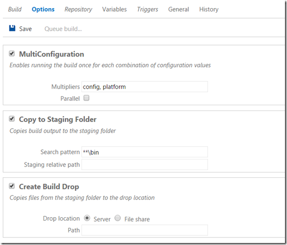](https://gwb.blob.core.windows.net/jakob/WindowsLiveWriter/TFSBuildvNextComingSoon_11441/image_40.png) \
   Also, we can enable copy to Staging and Drop location here. The build agent will copy everything that matches the Search pattern and place it in the staging folder \
9. Finally, let’s save the new build definition. Note that you can also add a comment every time you save a build definition: \
   [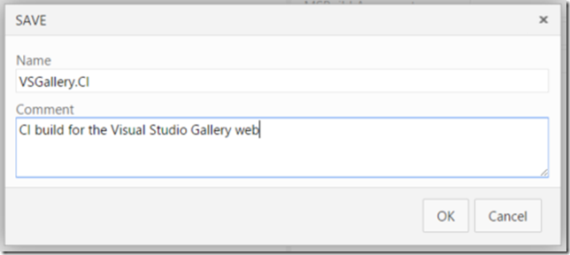](https://gwb.blob.core.windows.net/jakob/WindowsLiveWriter/TFSBuildvNextComingSoon_11441/image_34.png) \
   These comments are visible on the History tab, where you can view the history of all the changes to the build definition and view the changes between any of the changes. Nice!

## Running a Build

The build definition is complete, let’s kick off a build. Click on the Queue build.. button at the top to do this. This will show the live output of the build, both in a console output window and in an aggregated view where the status of each task is shown:

[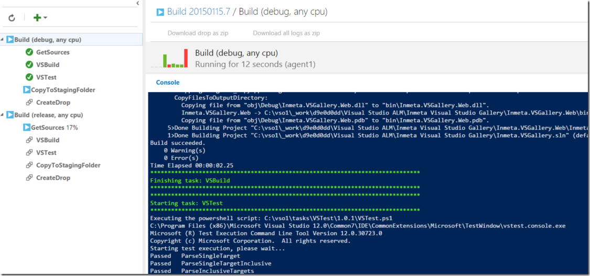](https://gwb.blob.core.windows.net/jakob/WindowsLiveWriter/TFSBuildvNextComingSoon_11441/image_44.png)

Here you can note several nice features of build vNext:

- The console output shoes the exact output from each task, just like it would if you ran the same command on your local machine \
- The aggregated view to the left shows the status and progress of every task which makes it very clear how far in the process the build is \
- This view also show parallel builds, in this case I have enabled the MultiConfiguration option and have two build agents configured, meaning that both *Debug|AnyCPU* and *Release|AnyCPU* are being processed in parallel on separate agents. \
- If you select one of the tasks to the left, you will see the build output for this particular task

When the build completes, you will see a build summary and you can also view a timeline of the build where the duration of each task is shown:

[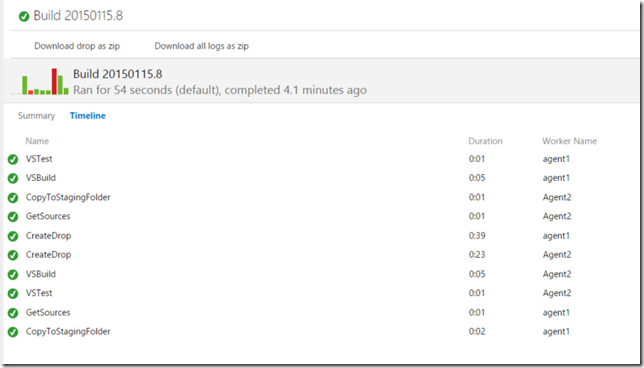](https://gwb.blob.core.windows.net/jakob/WindowsLiveWriter/TFSBuildvNextComingSoon_11441/image_46.png)

---

## Comments

*Imported from the original WordPress site. Closed for new replies.*

> **Tom** — 15 Jan 2015
>
> Originally posted on: <http://geekswithblogs.net/jakob/archive/2015/01/15/tfs-build-vnext-ndash-a-preview.aspx#642557>
>
> Does it still require that Visual Studio be installed on the build machine?

> **Jakob Ehn** — 18 Jan 2015
>
> Originally posted on: <http://geekswithblogs.net/jakob/archive/2015/01/15/tfs-build-vnext-ndash-a-preview.aspx#642580>
>
> @Tom: Probably, the build tools are not shipped with TFS Build and my guess is that that's not going to change.

> **Mike** — 19 Jan 2015
>
> Originally posted on: <http://geekswithblogs.net/jakob/archive/2015/01/15/tfs-build-vnext-ndash-a-preview.aspx#642598>
>
> I can't even begin to tell you how excited I am about this. I love the direction that TFS has been headed. That being said, I felt like Team Build was a sub-par option for builds/deployments. Could you share a link to the video in which the news was shared about the rewrite of Team Build?

> **Jakob Ehn** — 19 Jan 2015
>
> Originally posted on: <http://geekswithblogs.net/jakob/archive/2015/01/15/tfs-build-vnext-ndash-a-preview.aspx#642599>
>
> @Mike: I'm as excited as you are :-) The new was showed briefly during the Connect event. You can check it out here, it's about 36 minutes into the video:\
> \
> http://channel9.msdn.com/Events/Visual-Studio/Connect-event-2014/015\

> **daniel** — 23 Jan 2015
>
> Originally posted on: <http://geekswithblogs.net/jakob/archive/2015/01/15/tfs-build-vnext-ndash-a-preview.aspx#642658>
>
> "All your existing XAML build definitions will continue to work just like before"\
> Do you know if the TFS2010 build definitions will be still supported?

> **Jakob Ehn** — 25 Jan 2015
>
> Originally posted on: <http://geekswithblogs.net/jakob/archive/2015/01/15/tfs-build-vnext-ndash-a-preview.aspx#642681>
>
> @Daniel: Yes, they will continue to work without any changes

> **Natalia** — 20 Feb 2015
>
> Originally posted on: <http://geekswithblogs.net/jakob/archive/2015/01/15/tfs-build-vnext-ndash-a-preview.aspx#643063>
>
> Hei Jakob, do you know what are plans for version controling build definitions?\

> **Jakob Ehn** — 20 Feb 2015
>
> Originally posted on: <http://geekswithblogs.net/jakob/archive/2015/01/15/tfs-build-vnext-ndash-a-preview.aspx#643066>
>
> @Natalia: They will not be version controlled. They are however "versioned" in the sense that every change is audited and you can see the full history.

> **Krati** — 08 Apr 2015
>
> Originally posted on: <http://geekswithblogs.net/jakob/archive/2015/01/15/tfs-build-vnext-ndash-a-preview.aspx#643760>
>
> Can we use developer command prompt to queue builds in Build vNext? Or doing from the browser is the only option? Also, do you mean that the current build definitions we have in TFS2012 can be used as-is in Build vNext without any changes? There is no need to re-write definitions?

> **Jakob Ehn** — 08 Apr 2015
>
> Originally posted on: <http://geekswithblogs.net/jakob/archive/2015/01/15/tfs-build-vnext-ndash-a-preview.aspx#643761>
>
> @Krati: There will be a possiblity to run the entire build process on you local machine, but the details around this have not yet been published.\
> \
> And yes, all your existing build definitions will work as is, this new build system will be running side-by-side with the existing one.

> **Krati** — 08 Apr 2015
>
> Originally posted on: <http://geekswithblogs.net/jakob/archive/2015/01/15/tfs-build-vnext-ndash-a-preview.aspx#643763>
>
> Thanks Jakob. What I meant is, if I have to queue build using vNext, I'll have to write a new definition as the existing ones can't be migrated to work with vNext, right?\

> **Jakob Ehn** — 11 Apr 2015
>
> Originally posted on: <http://geekswithblogs.net/jakob/archive/2015/01/15/tfs-build-vnext-ndash-a-preview.aspx#643827>
>
> @Krati: Sorry, I think I don't exactly understand your question. You won't be able to automatically migrate the old XAML definitions to vNext ones. But you will be able to create, edit and queue XAML builds just like today. So if you have a lot of investments in XAML builds you don't have to migrate them all at once, but rather do this over time

> **Justin** — 22 Apr 2015
>
> Originally posted on: <http://geekswithblogs.net/jakob/archive/2015/01/15/tfs-build-vnext-ndash-a-preview.aspx#643967>
>
> Being able to run the entire build process on your local machine (with tweaks of course!) would be a big improvement, as you said CI build == Dev build! Currently there's no way to add custom steps before/after the solution build without going outside VS.\
> \
> I also hope they include a trigger based on updates to NuGets that the sln depends on.

> **Mick Letofsky** — 09 Jun 2015
>
> Originally posted on: <http://geekswithblogs.net/jakob/archive/2015/01/15/tfs-build-vnext-ndash-a-preview.aspx#644678>
>
> Hi All,\
> \
> Has anyone attempted to build an SSIS package with the new Build.Preview functionality using the Visual Studio build option? \
> \
> Thanks!\
> Mick

> **Cliff Harker** — 15 Jun 2015
>
> Originally posted on: <http://geekswithblogs.net/jakob/archive/2015/01/15/tfs-build-vnext-ndash-a-preview.aspx#644785>
>
> I got this for an SSIS package.....The build server had SSDTBI and SSDT installed as well as VS2013U4\
> \
> Project "e:TFS-Buildfc6fccd0SEUDataLoaderosCodePoint1osCodePoint1.sln" on node 1 (default targets).\
> ValidateSolutionConfiguration:\
>  Building solution configuration "Development|Default".\
> e:TFS-Buildfc6fccd0SEUDataLoaderosCodePoint1osCodePoint1osCodePoint1.dtproj.metaproj(0,0): Warning MSB4078: The project file "osCodePoint1osCodePoint1.dtproj" is not supported by MSBuild and cannot be built.\
> Project "e:TFS-Buildfc6fccd0SEUDataLoaderosCodePoint1osCodePoint1.sln" (1) is building "e:TFS-Buildfc6fccd0SEUDataLoaderosCodePoint1osCodePoint1osCodePoint1.dtproj.metaproj" (2) on node 1 (default targets).\
> e:TFS-Buildfc6fccd0SEUDataLoaderosCodePoint1osCodePoint1osCodePoint1.dtproj.metaproj : warning MSB4078: The project file "osCodePoint1osCodePoint1.dtproj" is not supported by MSBuild and cannot be built.\
> Done Building Project "e:TFS-Buildfc6fccd0SEUDataLoaderosCodePoint1osCodePoint1osCodePoint1.dtproj.metaproj" (default targets).\
> Done Building Project "e:TFS-Buildfc6fccd0SEUDataLoaderosCodePoint1osCodePoint1.sln" (default targets).\
> Build succeeded.\
> "e:TFS-Buildfc6fccd0SEUDataLoaderosCodePoint1osCodePoint1.sln" (default target) (1) ->\
> "e:TFS-Buildfc6fccd0SEUDataLoaderosCodePoint1osCodePoint1osCodePoint1.dtproj.metaproj" (default target) (2) ->\
> (Build target) -> \
>  e:TFS-Buildfc6fccd0SEUDataLoaderosCodePoint1osCodePoint1osCodePoint1.dtproj.metaproj : warning MSB4078: The project file "osCodePoint1osCodePoint1.dtproj" is not supported by MSBuild and cannot be built.\
>  1 Warning(s)\
>  0 Error(s)\
> Time Elapsed 00:00:00.09

> **Jakob Ehn** — 18 Jun 2015
>
> Originally posted on: <http://geekswithblogs.net/jakob/archive/2015/01/15/tfs-build-vnext-ndash-a-preview.aspx#644828>
>
> @Cliff: Yes, MSBuild still doesn't support the BI projects (SSIS, SSRS etc), you will need to use Visual Studio to build them. But it should be easy enough to write a short PowerShell script that launches devenv.exe to compile the solution and then run it using the PowerShell task

> **perreaultd** — 26 Jun 2015
>
> Originally posted on: <http://geekswithblogs.net/jakob/archive/2015/01/15/tfs-build-vnext-ndash-a-preview.aspx#645005>
>
> What's really missing is to be able to interact with the build past the Staging and Dropping build dont you think?\
> \
> It's way easy to launch scripts during the build process but it doesn't seem to be a way to launch scripts after the build is dropped in the DropFolder. For deployment for exemple.\
> \
> Just the way TfvcTemplate.12.2.xaml would allow with the Pre and PostDrop powershell scripts.\
> \
> Have you found a way to do so?

> **Jakob Ehn** — 26 Jun 2015
>
> Originally posted on: <http://geekswithblogs.net/jakob/archive/2015/01/15/tfs-build-vnext-ndash-a-preview.aspx#645006>
>
> @perreaultd: Actually, since I wrote this blog post the way drops are handles has changed. Now there is a separate build step for this called Publish Artifacts to Drop, where you can specify exactly what to drop and where (server of fileshare)\
> \
> Take a look at Visual Studio Online and you will see how this works

> **Jeff Raymond** — 29 Jun 2015
>
> Originally posted on: <http://geekswithblogs.net/jakob/archive/2015/01/15/tfs-build-vnext-ndash-a-preview.aspx#645039>
>
> As you said, the build definition template is "currently" scoped to the team project. It forces us to place all our build definition in a single "build" project (with the template) since we cannot create a build definition based on a template that is located into another team project or at the collection level (I thought it would).\
> For example, I have around 30 Vb6 projects that I would like to build using VNext (migrating from old Nant on Win2000 machine...). I've created a powershell template script in which I use the definition environment variables for the specifics of the project. I thought it could have been great that each vb6 project had its own tfs team project with its own build definition. But regarding the above, I don't think its doable.\
> Am I wrong ? Any ideas ?\
> Thanks :-)

> **perreaultd** — 29 Jun 2015
>
> Originally posted on: <http://geekswithblogs.net/jakob/archive/2015/01/15/tfs-build-vnext-ndash-a-preview.aspx#645054>
>
> @Jakob Ehn: Thank you for this specification. I guess this approch (managing Drop as a build step) is going to be available with TFS On-Prem someday. Hope to be RTM!\
> \
> You know where i could get this information? What's going to be released into the RTM version vs. the update 1 version?

> **jrummell** — 01 Jul 2015
>
> Originally posted on: <http://geekswithblogs.net/jakob/archive/2015/01/15/tfs-build-vnext-ndash-a-preview.aspx#645085>
>
> Thanks for sharing, Jakob! Any chance you could share your powershell script for updating AsseblyInfo?

> **Luke** — 09 Jul 2015
>
> Originally posted on: <http://geekswithblogs.net/jakob/archive/2015/01/15/tfs-build-vnext-ndash-a-preview.aspx#645216>
>
> @JRummel: You can find an example here https://msdn.microsoft.com/Library/vs/alm/Build/scripts/index\

> **Rathen** — 12 Jul 2015
>
> Originally posted on: <http://geekswithblogs.net/jakob/archive/2015/01/15/tfs-build-vnext-ndash-a-preview.aspx#645257>
>
> Do you guys have plans to add gated check-in trigger? We are really interested in that capability

> **Jakob Ehn** — 18 Jul 2015
>
> Originally posted on: <http://geekswithblogs.net/jakob/archive/2015/01/15/tfs-build-vnext-ndash-a-preview.aspx#645339>
>
> @Rathen: I think you need to direct that question to Microsoft :-)

> **guidway** — 07 Aug 2015
>
> Originally posted on: <http://geekswithblogs.net/jakob/archive/2015/01/15/tfs-build-vnext-ndash-a-preview.aspx#645700>
>
> Does the new TFS Build VNext Server have a dependency on the Window's Service - Remote Access Connection Manager - like the previous versions of TFS did?
