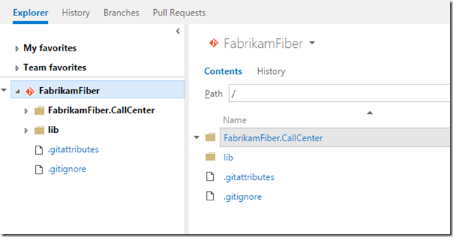
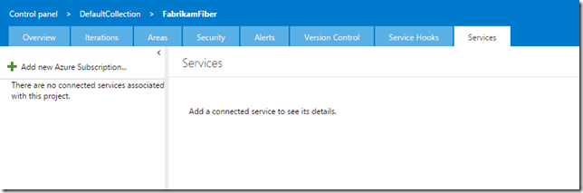
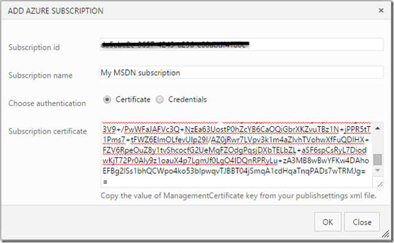
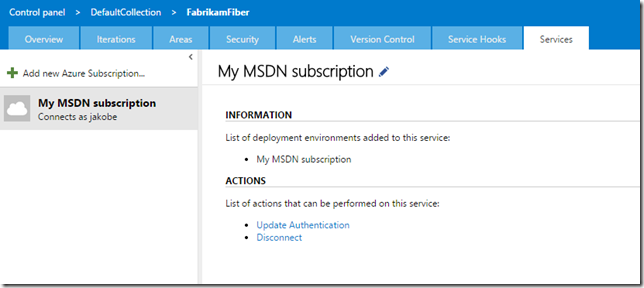
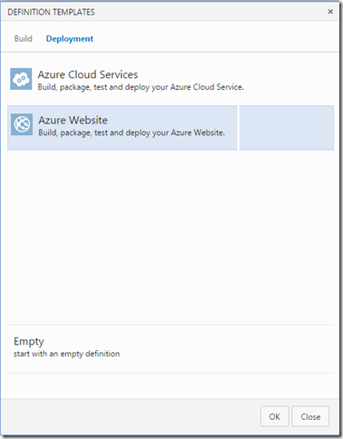
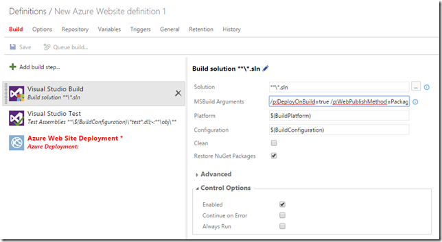
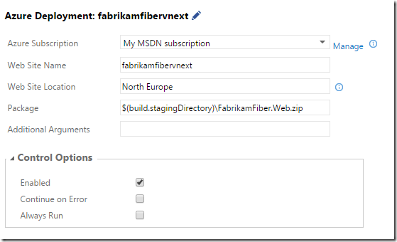
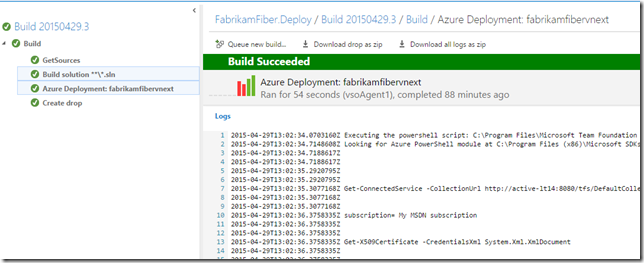
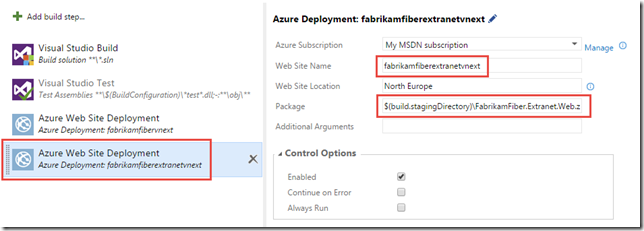

TFS 2015 is around the corner, and with it comes a [whole new build system](http://geekswithblogs.net/jakob/archive/2015/01/15/tfs-build-vnext-ndash-a-preview.aspx). All the biggest pain points from the existing build system (now called “XAML builds”) are gone and instead we get a light weight build system with a web UI that makes it very easy to customize our build processes and that doesn’t perform a lot of magic such as redirecting your build output for example.

In this post, I will show you just how easy it is to setup a build that builds a standard ASP.NET web application, generates a web deploy package as part of the build and then pick up this package and deploys it to a Azure web site. \
As part of this, you will also see how smooth the integration with Azure is when it comes to connecting your subscription.

### Sample Application

For this blog post I will use the common FabrikamFiber sample application, the full source for this is available at [https://fabrikam.codeplex.com/](https://fabrikam.codeplex.com/ "https://fabrikam.codeplex.com/")

I have created a new team project called FabrikamFiber on my local TFS 2015 instance, and pushed the source to the default Git repo in this team project:

So, let’s see how we can build, test and deploy this application to Azure.

### Register your Azure subscription in TFS

First of all, you need to add your Azure Subscription to TFS. You only need to this once of course (or at least one per subscription in case you have several).

This is done on the collection level, by using the Services tab:

Click the Add new Azure Subscription link on the top left. Now you need to enter the Subscription Id and the subscription certificate (you can use credential as well, but using the certificate option is more secure).  \
To get this information, follow these steps:

- Open a Windows PowerShell windows in administrative mode \
- Type  Get-AzurePublishSettingsFile \
- This will open a web browser and automatically download your subscription file \
- Open the subscription file (named <SubscriptionName>-<Date>-credentials.publishsettings \
- In this file, locate the Subscription Id and the ManagementCertificate fields

Now, copy these values into the *Add Azure Subscription* dialog:

Press OK. After it is saved, you should see your subscription to the left and some general information:

That’s it, now we can crate a build definition for our application.

###

### Create a Build Definition

Go to the team project where the source is located and click on the Build Preview tab. Click on the + button to create a new vNext definition: \
Now you can select a definition template for your build definition. Go to the Deployment tab and select the *Azure Website* template:

This will create a build definition with three steps, one for build the solution, one for running all the tests and one for deploying a web site to Azure. \
**Note**: For this post, I disabled the test step since not all tests pass in the default FabrikamFiber solution.

If you take a look at the Visual Studio Build step, you can see the arguments that are passed to MSBuild

**/p:DeployOnBuild=true /p:WebPublishMethod=Package /p:PackageAsSingleFile=true /p:SkipInvalidConfigurations=true /p:PackageLocation="$(build.stagingDirectory)"**

These are standard MSBuild parameters for triggering and configuration web deploy during compilation. These specific settings will create a web deploy package and put it in the staging directory of the build definition.

Now, over to the deployment step. Here you can see that you can select your Azure subscription that we registered before. In addition we give the web site a unique name, this name is what the public web site will be called,in this case \
it will be <http://fabrikamfibervnext.azurewebsites.net>.  We also need to specify the Web Site Location for this web site.

The final parameter that we need to specify is the Package. By default it will fetch all zip files located in the staging directory. I want to deploy the FabrikamFiber.Web application, so I change this to $(build.stagingDirectory)FabrikamFiber.Web.zip.

That’s it! Save the build definition and queue a new build.After it has completed, you should see a log that looks something like this and you should have a web sites published in Azure. \
As you can see, all steps in the process are shown to the left and you can easily see the output from each step.

### Deploying Multiple Web Sites

If you’re familiar with the FabrikamFiber sample solution, you know that it actually has two web applications in the same solution, *FabrikamFiber.Web* and *Fabrikamfiber.Extranet.Web*.

So, how do we go about to deploy both web sites as part of our build? Well, it couldn’t be easier really, just add a new *Azure Web Site Deployment* build step and reference the other web deploy package:

This will now first build the solution and then publish both web sites to Azure.

###

### Summary

Now you have seen how easy it is to build and deploy web applications using TFS Build vNext.

---

## Comments

*Imported from the original WordPress site. Closed for new replies.*

> **manik** — 06 May 2015
>
> Originally posted on: <http://geekswithblogs.net/jakob/archive/2015/04/29/deploying-an-azure-web-site-using-tfs-build-vnext.aspx#644162>
>
> This great post for us ,Thanks

> **manik** — 06 May 2015
>
> Originally posted on: <http://geekswithblogs.net/jakob/archive/2015/04/29/deploying-an-azure-web-site-using-tfs-build-vnext.aspx#644163>
>
> Very useful article and helps us.Thankkkks

> **David Allen** — 26 Jun 2015
>
> Originally posted on: <http://geekswithblogs.net/jakob/archive/2015/04/29/deploying-an-azure-web-site-using-tfs-build-vnext.aspx#645009>
>
> This was awesome! Thank you. \
> I published an alternate scenario, elaborating on how to use an on-premises build agent with the new VSO (Visual Studio Online) cloud-based build definitions.\
> [Article on TFS Build 2015](http://codecontracts.info/2015/06/26/tfs-build-2015-using-the-new-build-definition/)\

> **MattC** — 16 Jul 2015
>
> Originally posted on: <http://geekswithblogs.net/jakob/archive/2015/04/29/deploying-an-azure-web-site-using-tfs-build-vnext.aspx#645313>
>
> What are the pre-req to be installed on the build machine for deployment to azure using vnext?

> **Tiang** — 29 Jul 2015
>
> Originally posted on: <http://geekswithblogs.net/jakob/archive/2015/04/29/deploying-an-azure-web-site-using-tfs-build-vnext.aspx#645540>
>
> FYI, you can also get your Azure Management certificate details off the Azure portal:\
> \
> https://manage.windowsazure.com/publishsettings\
> \
> ...I don't know why that's not a visible link on the azure portal. :)\
> \
> Thanks for the info!

> **Arne Vandenberghe** — 21 Aug 2015
>
> Originally posted on: <http://geekswithblogs.net/jakob/archive/2015/04/29/deploying-an-azure-web-site-using-tfs-build-vnext.aspx#645910>
>
> I keep hitting an error\
> > \
> > ##[error]No files were found to deploy with search pattern 'C:acdb39f4cstagingPushHubApiService.zip'\
>
> \
> \
> I would also like to deploy a javascript SPA, produced by a gulp task. Again, I can't seem to locate the package to deploy, even though a zip should be available after an publish artifact step.\
