In the brave new world of Microsoft where a lot of the frameworks and languages that they build now are open sourced over at GitHub, it comes as no surprise that GitHub is nicely integrated into both \
Visual Studio and TFS Build vNext. This makes it very easy to setup builds that gets the source code from your GitHub repo but uses TFS Build vNext to build it. It also allows you to setup CI builds, that is  \
builds that trigger automatically when someone does a commit in the corresponding Git repo.

### Let’s see how this work:

1. First, you’ll need a GitHub repo of course. \
   **Note**: If you haven’t checked out the [GitHub for VisualStudio extension](https://visualstudio.github.com/) yet, try it out. Makes it easy to clone your existing repos as well as creating new \
   ones, right inside Visual Studio. \
   [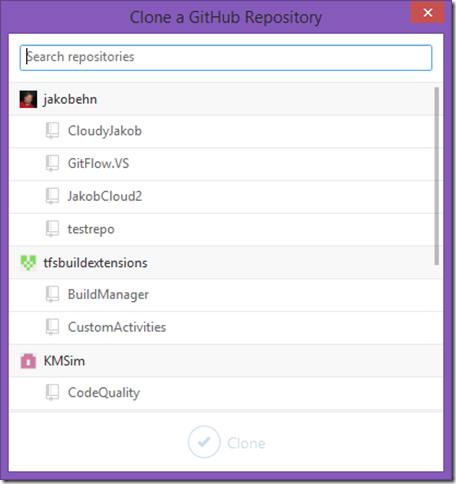](https://gwb.blob.core.windows.net/jakob/WindowsLiveWriter/BuildingGitHubrepositoriesinTFSBuildvNex_B51E/image_4.png)      [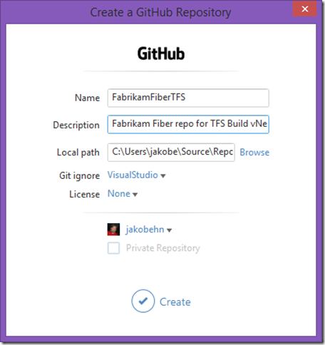](https://gwb.blob.core.windows.net/jakob/WindowsLiveWriter/BuildingGitHubrepositoriesinTFSBuildvNex_B51E/image_2.png)  \
   **Clone existing repos                                                                                       Create a new GitHub repo \
    \**
2. Here, I create a FabrikamFiberTFS repo on GitHub where I’ll upload the code to \
3. Now, to enable the TFS Build vNext integration, you need to create a *Personal Access Token* in GitHub. To do this, click the Settings link below your profile image in \
   GitHub, and then click on the *Personal Access Token* link: \
   [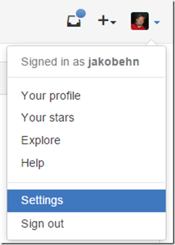](https://gwb.blob.core.windows.net/jakob/WindowsLiveWriter/BuildingGitHubrepositoriesinTFSBuildvNex_B51E/image_6.png)         [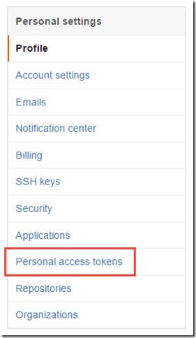](https://gwb.blob.core.windows.net/jakob/WindowsLiveWriter/BuildingGitHubrepositoriesinTFSBuildvNex_B51E/image_8.png) \
     \
4. Give the access token a name that you will remember(!), and then give it these permissions: \
   [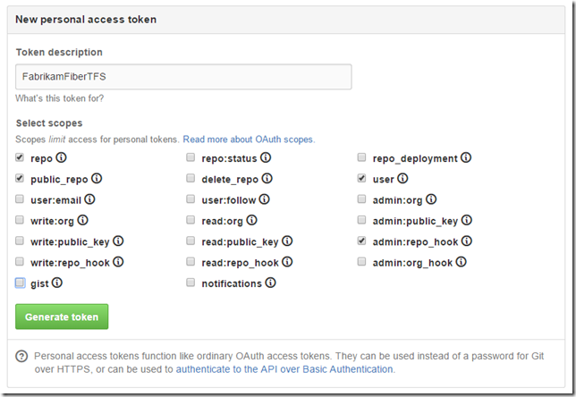](https://gwb.blob.core.windows.net/jakob/WindowsLiveWriter/BuildingGitHubrepositoriesinTFSBuildvNex_B51E/image_10.png) \
   **NOTE**: In order to configure triggering CI builds, you must have admin permissions on the GitHub repo. \
5. Save it, and the copy the access token that is displayed. \
   **NOTE**: Store this token somewhere safely, you will not be able to view it again. You probably want to setup a personal access token that works \
   for all your GitHub repos, if so you need to remember this access token. \
6. Now, create a new build definition in your Visual Studio Online/TFS team project. Head over to the Repository tab, and select GitHub as your repository tab: \
   [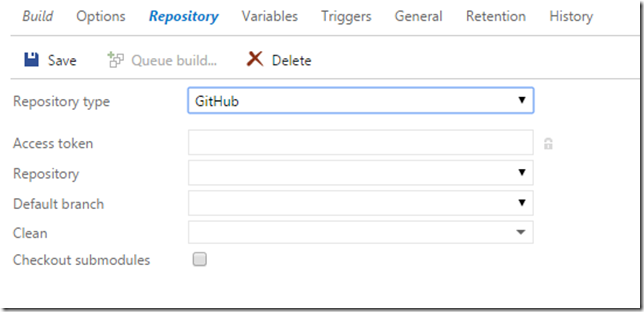](https://gwb.blob.core.windows.net/jakob/WindowsLiveWriter/BuildingGitHubrepositoriesinTFSBuildvNex_B51E/image_12.png) \
7. Paste your token in the Access Token field. This will populate the Repository drop down and let you select amongst your existing GitHub repositories: \
   [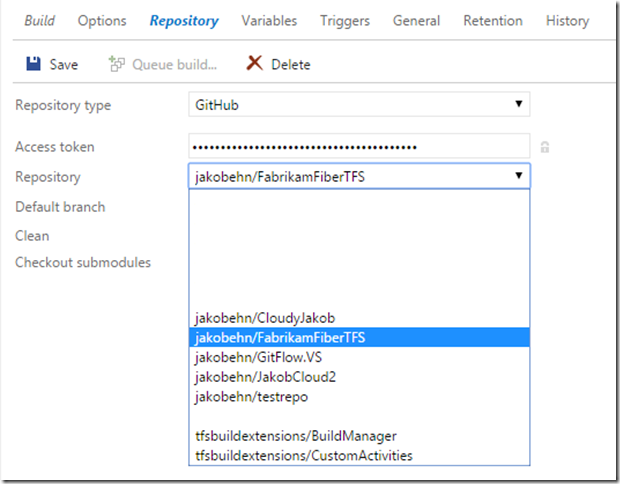](https://gwb.blob.core.windows.net/jakob/WindowsLiveWriter/BuildingGitHubrepositoriesinTFSBuildvNex_B51E/image_22.png) \
   You will also be able to select which branch that should be the default branch. \
8. To enable continuous integration for your build definition, go to the Trigger tab and check the Continuous Integration checkbox. When saved, this build \
   definition will now use the repo_hook permission against your GitHub repository to respond to commit events. \
9. Save you build definition, and commit a change to your GitHub repository. A new build should be queued almost immediately. \
10. When the build completes, you will see the associated commit as usual in the build summary. However, this commit link now points to the GitHub commit page instead: \
    [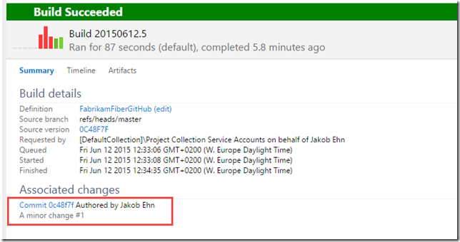](https://gwb.blob.core.windows.net/jakob/WindowsLiveWriter/BuildingGitHubrepositoriesinTFSBuildvNex_B51E/image_18.png) \
    Clicking the link shows the commit in GitHub: \
    [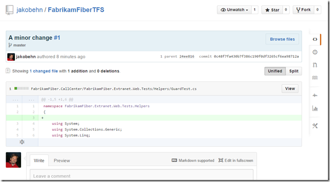](https://gwb.blob.core.windows.net/jakob/WindowsLiveWriter/BuildingGitHubrepositoriesinTFSBuildvNex_B51E/image_20.png) \
11. To round this up, we will add a Build Badge to our Welcome page to get an indication of the current status of the build. Go to the General tab, check \
    the Badge enabled checkbox and save the build definition. This will expose a link that shows you the public URL to a dynamically generated icon that \
    shows the status of the latest build for this particular build definition: \
    [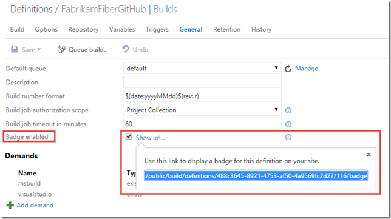](https://gwb.blob.core.windows.net/jakob/WindowsLiveWriter/BuildingGitHubrepositoriesinTFSBuildvNex_B51E/image_14.png) \
12. Go to the home page and then to the Welcome page tab. If you haven’t created a welcome page yet, do so. Then add the following markdown to the page: \
    # FabrikamFiberTFS Build Status \
     \
    In my case, the link looks like this:

    # FabrikamFiberTFS Build Status \
     \
13. Save it and you will see a nice little badge showing the status of the latest build: \
    [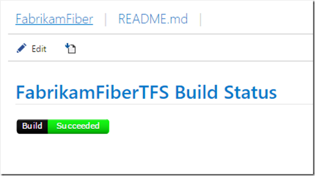](https://gwb.blob.core.windows.net/jakob/WindowsLiveWriter/BuildingGitHubrepositoriesinTFSBuildvNex_B51E/image_16.png) \

---

## Comments

*Imported from the original WordPress site. Closed for new replies.*

> **Giulio Vian** — 12 Jun 2015
>
> Originally posted on: <http://geekswithblogs.net/jakob/archive/2015/06/12/building-github-repositories-in-tfs-build-vnext.aspx#644742>
>
> One day I will move some CI from AppVeyor now that you worked out the details.

> **josh** — 10 Mar 2016
>
> Heya Jakob Ehn - thanks for the write up. Just to make sure i am not going nuts over here, this is only for VSO, and not on premise tfs, correct?
