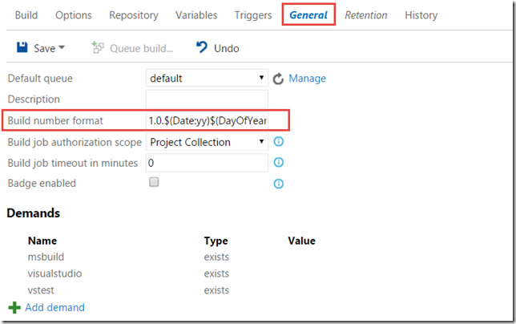
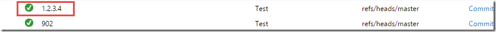

By now, many of you should have had the chance to at least play with the new build system that was released in TFS 2015 and Visual Studio Online. [Here is an introductory post I wrote about it](http://geekswithblogs.net/jakob/archive/2015/01/15/tfs-build-vnext-ndash-a-preview.aspx) when it entered public preview back in January.

Doing the basic stuff is very easy using the new build system, especially if you compare it with the old one, which is now referred to as XAML builds. Creating and customizing build definitions is just a matter of adding the tasks that you want to use and configure them properly, everything is done using the web interface that is part of the TFS Web Access.

### Build Number Format

There are (of course) still some things that are not completely obvious how to do. One of these things is how to generate a custom build number for a build. Every build definition has a build number format field where you can use some macros to dictate what the resulting build number should look like.

The build number format can contain a mix of text and macros, in the above example I have used some of the date macros to generate a build number that uses todays date plus an increment at the end.

### Generating a custom build number

Sometimes though you will have the requirement to generate a completely custom build number, based on some external criteria that is not available using these macros.

This can be done, but as I mentioned before, it is not obvious! TFS Build contains a set of logging commands that can be used to generate output from a task /typically a script) that is generated in a way so that TFS Build will interpret this as a command and perform the corresponding action. Let’s look at some examples:

***##vso[task.logissue type=error;sourcepath=someproject/controller.cs;linenumber=165;columnumber=14;code=150;]some error text here***

This logging command can be used to log an error or a warning that will be added to the timeline of the current task. To generate this command, you can for exampleuse the following 'PowerShell script:

***Write-Verbose –Verbose “##vso[task.logissue type=error;sourcepath=someproject/controller.cs;linenumber=165;columnumber=14;code=150;]some error text here”***

As you can see, there is a special format that is used for these commands:  ##vso[command parameters]text. This format allows the build agent to pick up this command and process it.

Now, to generate a build number, we can use the ***task.setvariable*** command and set the build number, like so:

**##vso[task.setvariable variable=build.buildnumber;]1.2.3.4**

This will change the build number of the current build to 1.2.3.4. Of course, you would typically generate this value from some other source combined with some logic to end up with a unique build number.

You can find the full list of logging commands at [https://github.com/Microsoft/vso-agent-tasks/blob/master/docs/authoring/commands.md](https://github.com/Microsoft/vso-agent-tasks/blob/master/docs/authoring/commands.md "https://github.com/Microsoft/vso-agent-tasks/blob/master/docs/authoring/commands.md")

---

## Comments

*Imported from the original WordPress site. Closed for new replies.*

> **Michael J. Prentice** — 04 Nov 2015
>
> Originally posted on: <http://geekswithblogs.net/jakob/archive/2015/10/15/generate-custom-build-numbers-in-tfs-build-vnext.aspx#646930>
>
> Thank you very much, just what I was looking for!\
> \
> Note, to update the build number within TFS or VSO, I had to add this on top of having it set the variable.\
> \
> Write-Verbose -Verbose "##vso[build.updatebuildnumber]1.2.3.4"

> > **Ryan** — 09 May 2016
> >
> > I get this:
> >
> > Unable to process logging event:##vso[build.updatebuildnumber]1.2.3.4
> >
> > This command works:\
> > ##vso[task.setvariable variable=build.buildnumber]1.2.3.4
> >
> > But that does not update the list of builds :|

> > **Zvi Moskovitz** — 16 May 2016
> >
> > Can you please show how the ps file is looks like, i'm not familier with PS.\
> > And how to run iyt in TFS v2015.\
> > Thanks\
> > Zvi

> > **Zvi** — 23 May 2016
> >
> > I did it and it works, but the $Rev didnt increased by one, what am i missing here?

> **[Ryan](https://www.surreyschools.ca)** — 09 May 2016
>
> I get this:
>
> Unable to process logging event:##vso[build.updatebuildnumber]1.2.3.4
>
> This command works:\
> ##vso[task.setvariable variable=build.buildnumber]1.2.3.4
>
> But that does not update the list of builds :|

> **dean** — 24 Aug 2017
>
> I had to use:
>
> "##vso[build.updatebuildnumber]1.2.3.4"
