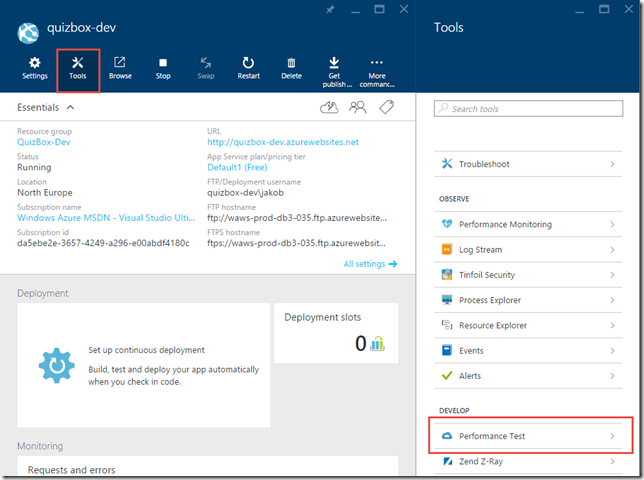
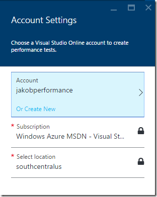
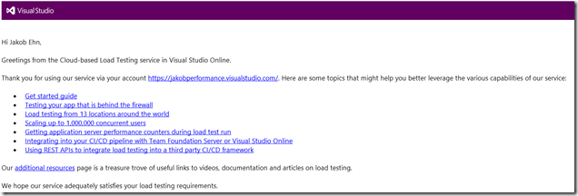
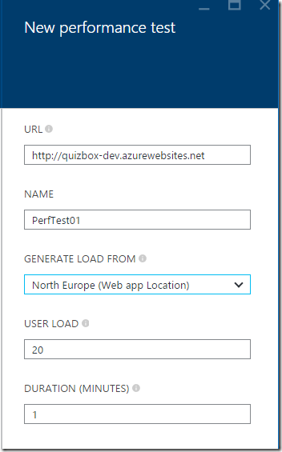
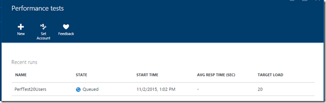
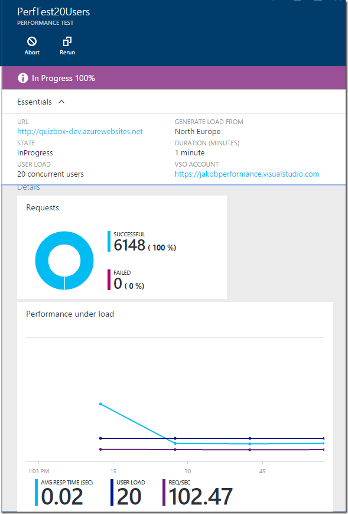

Anyone that has been involved with setting up the infrastructure that is needed to perform on premise load testing of a realistic number of users knows how much work that is to both setup and to maintain. With Visual Studio Ultimate/Enterprise you needed to create a test rig by creating multiple machines and then installing a test controller and test agents on all the machines and configure them to talk to each other.

Another aspect of if is that the typical team don’t run load tests of their applications on a regular basis, instead it is done during certain periods or sprints during the lifecycle of the project. So the rest of time those machines aren’t used for anything, so basically they are just using up your resources.

##

## Cloud Load Testing

With the introduction of [Cloud Load Testing](https://www.visualstudio.com/get-started/test/load-test-your-app-vs), that is part of Visual Studio Online, Microsoft added the possibility to use Azure for generating the load for your tests. This means that you no longer have to setup or configure any agents at all, you only need to specify the type of load that you want, such as the number of users and for how long the test should run. This makes it incredibly easy to run load tests, and you only pay for the resources that you use. You can even use it to [test internal application running behind a firewall](http://blogs.msdn.com/b/visualstudioalm/archive/2015/03/10/load-testing-applications-behind-firewall-using-trusted-ip.aspx).

So, this feature has been around for a couple of years, but there has always been a problem with discoverability due to it being available only from inside the Visual Studio Online portal. So for teams that uses Azure for running web apps but are not using Visual Studio Online for their development, they would most likely never see or use this feature.

But back in September Microsoft announced the [public preview of perfomance testing Azure Web Apps](http://blogs.msdn.com/b/visualstudioalm/archive/2015/09/15/announcing-public-preview-for-performance-load-testing-of-azure-webapp.aspx), fully integrated in the Azure Portal. It still needs a connection to a Visual Studio Online account, but as you will see this can easily be done as part of setting up the first performance test.

Let’s take a quick look at how to create and run a performance test for an Azure Web App.

## Azure Web App Performance Test

The new Performance Test functionality is available in the Tools blade for your web app, so go ahead and click that.

The first time you do this, you will be informed that you need to either create a Visual Studio Account or link to an existing one. Here I will create a new one called *jakobperformance*.

**Note that**:

- It must have a unique name since this will end up as <accountname>.visualstudio.com)
- It does not mean that you have to use this account (or any other VSO account for that matter) for your development.

Currently the location must be set to South Central US, this is most likely only the case during the public preview.

When you do this, you will receive a nice little email from Microsoft that includes a lot of links to more information \
about how to get started with cloud load testing.

A simple thing really, but things like this can really make a difference when you are trying a new technology for the first time.

So, once we have create or linked the VSO account we can go ahead and create a new performance test. Here is the information that you need to supply:

**URL** \
The public URL that the performance test should hit. It will be default be set to the URL of the current Azure Web App, but you can change this.

**Name** \
The name of this particular test run. As you will see, all test runs are stored and available in the Performance Test blade of your Azure Web App, so give it a descriptive name.

**Generate Load From \**Here you select from which region that the load should be generated from. Select the one that most closely represent the origin of your users.

**User Load** \
The number of users that should hit your site. While this feature is in public preview you don’t have to pay for running these load tests, but there will some limits in how much load you can generate. You can contact Microsoft if you need to increase this limit during the preview period.

**Duration (Minutes)** \
Specifies for how long (in minutes) that the load test should run

Once this is filled out, hit ***Run Test*** to start the load test. This will queue the performance test and then start spinning up the necessary resources in Azure for running the load test.

Clicking on the test run, you will see information start to come in after a short period of time, showing the number of requests generated and some key performance characteristics of how your application behaves under pressure.

Of course, this type of load testing doesn’t cover all you need in terms of creating realistic user load, but it is a great way to quickly hit some key pages of your site and see how it behaves. then you can move on and author more complex load tests using Visual Studio Enterprise, and run them using Azure as well.

Go ahead and try it out for yourself, it couldn’t be easier and during the public preview it is free of charge!

---

## Comments

*Imported from the original WordPress site. Closed for new replies.*

> **Chintan Shah** — 05 Nov 2015
>
> Originally posted on: <http://geekswithblogs.net/jakob/archive/2015/11/02/performance-tests-for-azure-web-apps.aspx#646934>
>
> Nice and technical information regarding Azure Web App Performance Test!!\
> \
> Thanks!!
