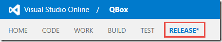
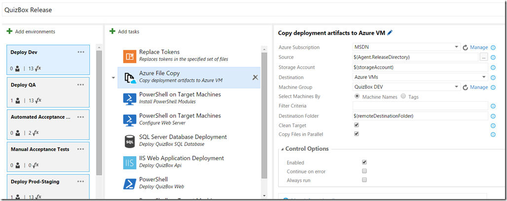
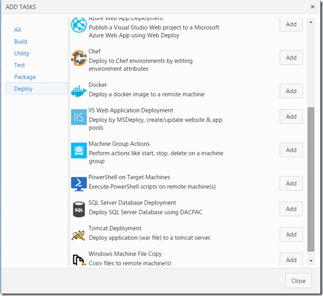
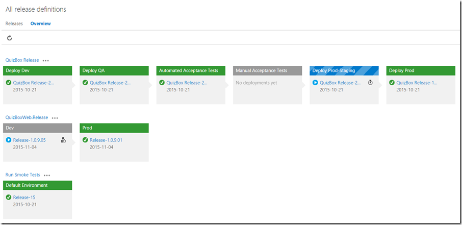
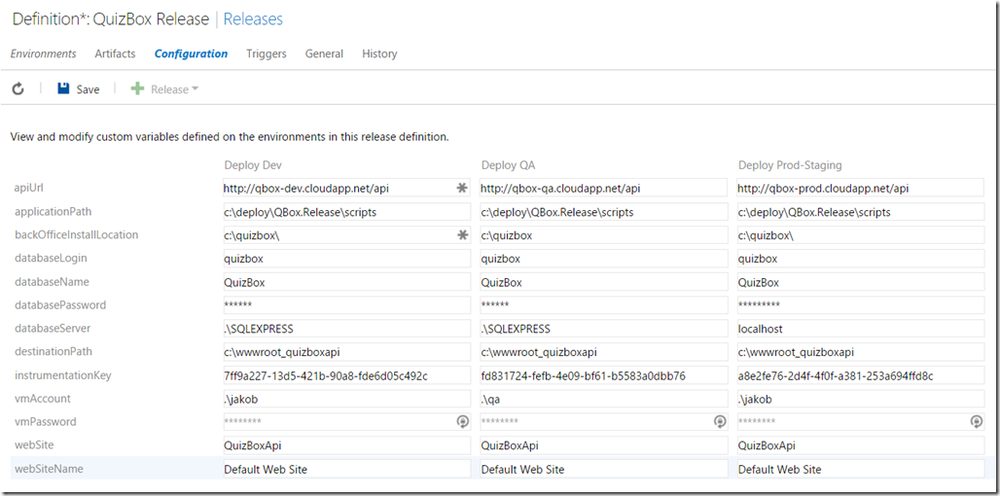
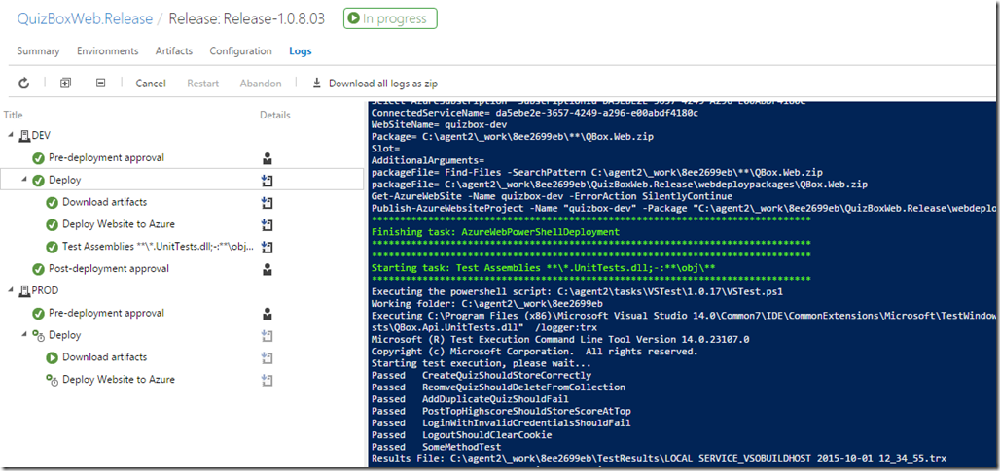
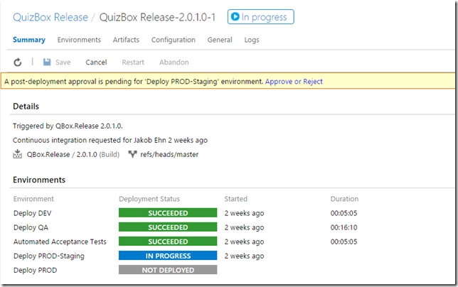
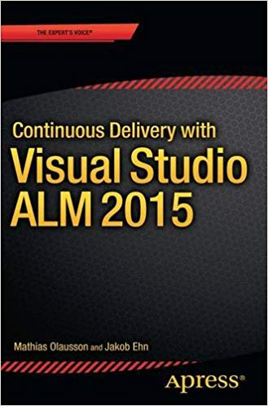

Today at the Microsoft Connect() event, Microsoft announced the public preview of the brand new version of Visual Studio Release Management. The public preview is available on ***Visual Studio Team Services*** (a.k.a. *Visual Studio Online*, in case you missed that announcement! :-)), and will debut on premise later in 2016.

So, what’s this new version about? Let’s summarize some of the major features about it:

## Web Based

The existing version of Visual Studio Release Management, that was originally acquired from InCycle back in 2013, uses a standalone WPF client for authoring, triggering and tracking releases. It always felt a bit awkward and wasn’t really integrated with the rest of TFS. The new version is completely rewritten to be a web based experience and is part of the web access, as a new “Release” tab.

From this hub you can author release definitions, manage approval workflows and trigger and track releases.

## Shared Infrastructure with TFS Build

With the new build system in TFS 2015, Microsoft already has a great automation platform that is scriptable, cross platform and easy to deploy and configure. So it makes sense that the new version of Visual Studio Release Management is build upon the same platform. So the build agent that is used for running builds can also be used for executing releases.

It also means that all the new build tasks that are available in TFS Build 2015 and also be used as part of a release pipeline.

###

## Cross Platform Support

As mentioned above, since the same agent is used for releases, it means that we can also run them on Linux and OS/X since these are supported platforms. There are many tasks out of the box for doing cross platform deployment, including Chef and Docker.

###

## Track Releases across Environments

The new web UI makes it easy to get an overview of the status of your existing environments, and which version of which application that is currently deployed. In the example below we can see that the new release of the “QuizBox” application has been deployed to Dev and QA, has gone through automated and manual acceptance tests, and is currently being deployed to the staging slot of the production environment.

##

## Configuration Management

One of the biggest challenges with doing staged deployments is the configuration management. The different environment often have different configuration settings, things like connection strings, account names and passwords. In Visual Studio Release Management vNext these configuration variables can be authored either on the environment level or on the release definition level, where it applies to all environments.

We can easily compare the configuration variables across our environments, as shown below.

## Live Release Log Output

As with the new build system in TFS 2015, VSRM vNext gives you excellent real time logging from the release agent, as the release is executing. \

## Release Approval

Every environment in the release pipeline can trigger approvals, either before the deployment starts or after. For example, before we want to deploy a new version of an application to the QA environment, the QA team should be able to approve it to make sure that the environment is ready.

Below you can see a release that has a pending approval. Every approver that should take action will receive a notification email with a link to this page.

# Do you want to learn more?

For the last 6 months, me and my fellow ALM MVP and good friend [Mathias Olausson](http://blogs.msmvps.com/molausson/) have been busy working on a book that covers among other things this new version of Visual Studio Release Management. The title of the book is ***Continuous Delivery with Visual Studio ALM 2015***, and covers how the process of continuous delivery can be implemented using the Visual Studio 2015 ALM tool suite.

I will write a separate blog post about the book, but here is the description from Amazon:

*\
This book is the authoritative source on implementing Continuous Delivery practices using Microsoft’s Visual Studio and TFS 2015. Microsoft MVP authors Mathias Olausson and Jakob Ehn translate the theory behind this methodology and show step by step how to implement Continuous Delivery in a real world environment.*

*Building good software is challenging. Building high-quality software on a tight schedule can be close to impossible. Continuous Delivery is an agile and iterative technique that enables developers to deliver solid, working software in every iteration. Continuous delivery practices help IT organizations reduce risk and potentially become as nimble, agile, and innovative as startups. \*

*In this book, you'll learn:*

- *What Continuous Delivery is and how to use it to create better software more efficiently using Visual Studio 2015 \*- *How to use Team Foundation Server 2015 and Visual Studio Online to plan, design, and implement powerful and reliable deployment pipelines \*- *Detailed step-by-step instructions for implementing Continuous Delivery on a real project*

You can find the book at  [http://www.amazon.com/Continuous-Delivery-Visual-Studio-2015/dp/1484212738](http://www.amazon.com/Continuous-Delivery-Visual-Studio-2015/dp/1484212738 "http://www.amazon.com/Continuous-Delivery-Visual-Studio-2015/dp/1484212738").

We hope that you will find it valuable!
