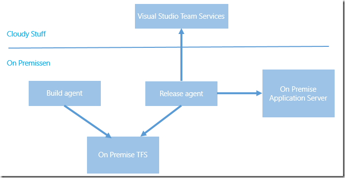
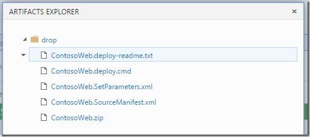
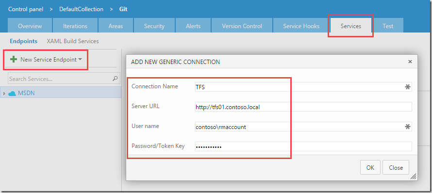
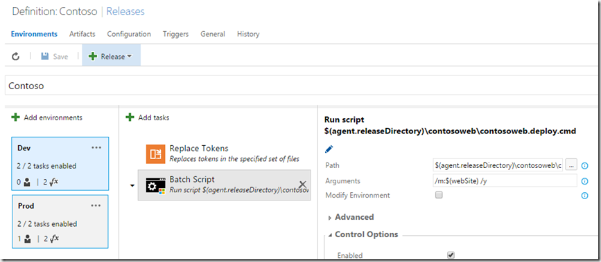
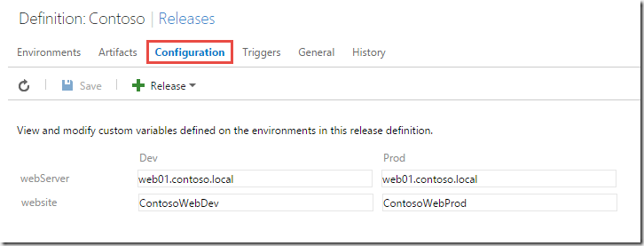
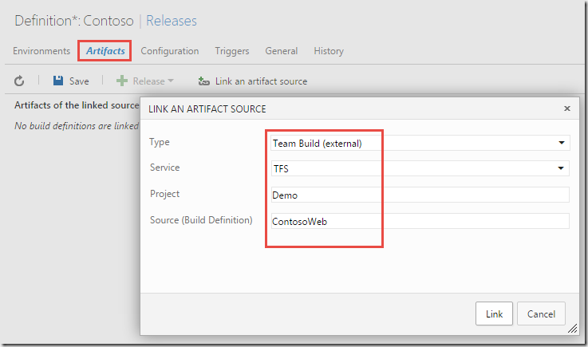
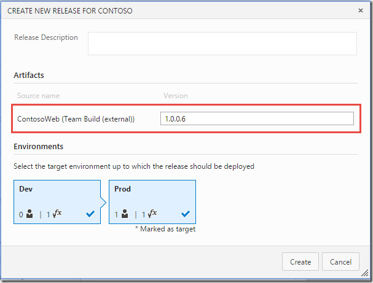
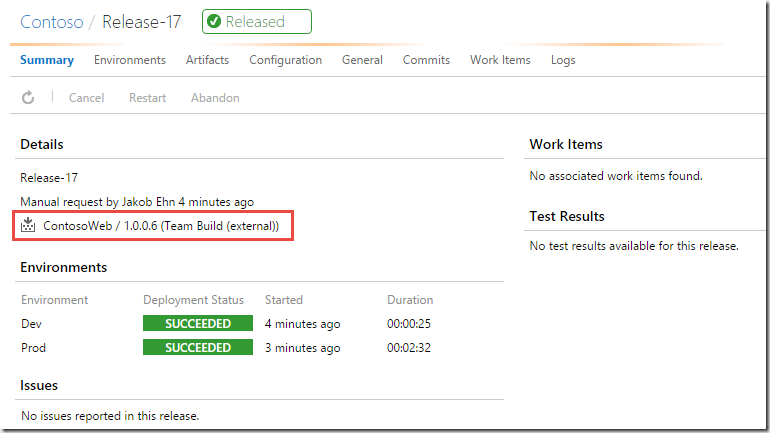

Microsoft's [new version of Visual Studio Release Management](/2015/12/microsoft-announces-next-generation-of-visual-studio-release-management/) is currently in public preview in VSTS. It is currently targeted for the TFS 2015 Update 2 version that should be shipped later this spring.

However, even if you are not all in on Visual Studio Team Services, you can still use this service! Since the build/release agents that are used can run on premise without any necessary firewall ports being opened inbound, you have full access to any internal TFS servers and application servers that you want to deploy to.

The following image illustrates the different components involved here.

As you can see everything is running on premise, except Visual Studio Team Services of course. Since the release agent is also running on premise, it can connect to the on premise TFS and download the build artifacts, and it can access the on premise application servers and deploy the artifacts.

Lets’s walk through how you can use Visual Studio Release Management today to deploy builds from your on premise TFS build server to an on premise web server.

### Creating the Release Definition

1. I’m not going to walk through how to create a build definition in TFS, there are plenty of documentation on that. Let’s just look at the artifacts of the build that we will deploy:\
    \
   - Nothing special here, this is the standard output from a build that runs msdeploy to create web deploy packages.\
     - \
       Now, to be able to consume the build artifacts from a release definition, we need to setup a service endpoint for the TFS server. In the new build and release management system, service endpoints are a fundamental concept. They encapsulate the information, including credentials, that is needed to integrate with an external system. Example of service endpoints include Azure subscriptions, Jenkins build servers and Chef servers. In addition we can create *Generic* service endpoints, which contains a server URL and a user name and a password. This is what we will use here. \
       - \
         Service endpoints also have there own security groups, which means that we can for example make sure that only certain people can use a service endpoint that points to the production Azure subscription\
         Service points are scoped to the team project level, and are available on a separate tab on the admin page. In this case, we will create a Team Build endpoint, where we supply the URL of the TFS server and the necessary credentials for it:\
          \
         - \
           With the service endpoint done, we can move on to create a release definition. In this example, I will define two environments, Dev and Prod that will just point to two different web sites on the same server.\
             \
           As you can see, I only have two tasks in each environment. The first task is a custom task that replaces any tokens found in the files that matches the supplied pattern.. This lets me apply environment specific values during the build. In this case, I will update the **.SetParameter.xml* file that is used together with web deploy.\
           Also, I use the configuration functionality to supply the machine name of the web server and the name of the web site that I will deploy this to. As you can see below, I will deploy both dev and production to the same server, but to different web sites. Not entirely realistic, but you should get the idea here. You can see that I use the variable ***$(webSite)*** in the task above, where I run the generated web deploy command file.\
            \
           - \
             Now, the part that is different here compared to a standard release definition is the linking of artifacts. Here we will select “*Team Build (external)*”, which in this context mean any TFS server that is defined as a service endpoint. In the Service dropdown we select the service endpoint that we created earlier (TFS).We also need to supply the name of the team project and the name of the build definition, as shown below.\
              \
             1. **\
                NOTE**: *When linking to an external build like this, we do it by name. This means that if you change the name of the build definition or the team project, you will have to change this artifact definition.*\- \
               Now we can save the release definition and start a release. A big difference compared to when you have linked to a VSTS build is that RM won’t locate the existing builds for you, so you have to supply the build number yourself of the build that you want to release.- \
                  \
                 - \
                   When the release has finished we can see that the selected build version (1.0.0.6) has been deployed to both environments:\
                   - 

### Summary

As you can see, there is nothing that stops you from start using the new version of Visual Studio Release Management, even if you have everything else on premise.

---

## Comments

*Imported from the original WordPress site. Closed for new replies.*

> **Venkat** — 27 Apr 2016
>
> Hi \
> This is really help full but, i have couple of doubts.\
> 1. on point #4 we are linking the tfs server. Here are we linking to on-premise tfs server by giving the onprem tfs url? If we are linking so, how will it be communicate with on-perm tfs server when it is not exposed to internet? and how it can it drive the release pipeline when agents are in onprem which is inside the organization network?\
> Can you please explain more about this?
