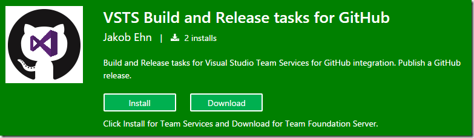
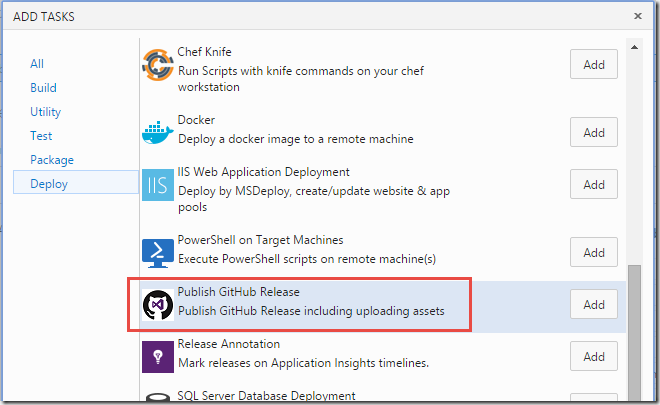
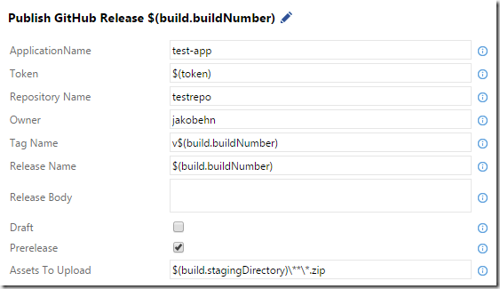

The new build system in Team Foundation Server 2015 and Visual Studio Team Services has from the start made it very easy to integrate with GitHub. This integration allows you to create a build in TFS/VSTS that fetches the source code from a GitHub repository. I have blogged about this integration before, at [http://blog.ehn.nu/2015/06/building-github-repositories-in-tfs-build-vnext/](/2015/06/building-github-repositories-in-tfs-build-vnext/ "http://blog.ehn.nu/2015/06/building-github-repositories-in-tfs-build-vnext/").

#### Publisinh a GitHubRelease from VSTS

This integration allows you to use GitHub for source code, but use the powerful build system in TFS/VSTS to run your automated builds. But, when maintaining the project at GitHub you often want to publish your releases there as well, with the output from your build.

To make this easy, I have developed a custom build task lets you publish your build artifacts into a release at GitHub.

> The task is available over at the new [Visual Studio Marketplace](https://marketplace.visualstudio.com), you can find the extension here: \
> [https://marketplace.visualstudio.com/items?itemName=jakobehn.jakobehn-vsts-github-tasks](https://marketplace.visualstudio.com/items?itemName=jakobehn.jakobehn-vsts-github-tasks "https://marketplace.visualstudio.com/items?itemName=jakobehn.jakobehn-vsts-github-tasks")

To use it, just press the Install button and select the VSTS account where you want to install it. After this, the Publish GitHub Release build task will be available in your build task catalog, in the Deploy category.

> From Team Foundation Server 2015 Update 2, it is possible to install the extensions from the VS Marketplace on premise. To do so, use the Download button and follow the instructions.

After adding the build task to a build definition, you need to configure a few parameters:

These parameters are:

- **Application Name\**You can use any name here, this is what is sent to the GitHub API in the request header.
- \
  **Token\**Your GitHub Personal Access Token (PAT). For more information about GitHub tokens, please see [https://help.github.com/articles/creating-an-access-token-for-command-line-use/](https://help.github.com/articles/creating-an-access-token-for-command-line-use/ "https://help.github.com/articles/creating-an-access-token-for-command-line-use/")\
  **Repository Name\**The name of the repository where the release should be created
- \
  **Owner** \
  The GitHub account of the owner of the release
- \
  **Tag Name**
- A unique tag for the release. Often it makes sense to include the build number here\
- **Release Name**\
  The name of the release. Also, including the build number here can make sense\
- **Draft**\
  Enable this to create a draft release\
- **Prerelease**\
  Enable this to create a prerelease\
  **Assets to upload**\
  Specified which files that should be included in the GitHub release

Hope that you will find this extension useful, if you find bugs or have feature suggestions, please report them on the GitHub site at [https://github.com/jakobehn/VSTSGitHubTasks](https://github.com/jakobehn/VSTSGitHubTasks "https://github.com/jakobehn/VSTSGitHubTasks")

---

## Comments

*Imported from the original WordPress site. Closed for new replies.*

> **[satish venkatakrishnan](https://medium.com/@satish1v/)** — 13 Jul 2016
>
> Very useful post . I am setting up a build for my open source project . Will be using this for the release .
>
> Thanks .
>
> There is a small typo in the post - It should be Publishing (In header)

> **Bruce Haley** — 30 Aug 2018
>
> Hints on filling out the build task form:\
> Application Name: You can use any name **as long as it contains no spaces**.
>
> Repository Name and Owner: Those values must match the values embedded in your target GitHub URL:\
> https://github.com/Owner/RepositoryName
