This post does not really cover something new, but since I find myself explain this to people now and then, I thought that I’d write a quick post on the subject.

So, we want to create a web deploy package as part of our automated build, and then take this package and deploy it to multiple environments, where each environment can have different configuration settings, using VSTS Release Management. Since we only want to build our package once, we have to apply the environment specific settings at deployment time, which means we will use [***Web Deploy parameters***](https://msdn.microsoft.com/en-us/library/ff398068(v=vs.110).aspx).

Here are the overall steps needed:

1. - Create a parameters.xml file in your web project- - Create a publish profile for the web deploy package- - Set up a VSTS build creates the web deploy package, and uploads the package to the server- - Create a Release definition in VSTS that consumes the web deploy package- - In each RM environment, replaces the tokens in the SetParameters file

Let’s run through these steps in detail:

### Create a parameters.xml file

As you will see later on, a publish profile contains configurable settings for the web site name and any connection strings,that will end up in the **.SetParameters.xml* file that is used when at deployment time. But in order for other configuration settings, like appSettings, to end up in this file, you need to define these settings. This is done by creating a file called *parameters.xml* in the root of your web application.

**Tip**: A fellow MVP, [Richard Fennell](https://blogs.blackmarble.co.uk/blogs/rfennell),  has created a nifty [Visual Studio extension](https://visualstudiogallery.msdn.microsoft.com/cbf2764d-d205-49d6-810f-25324402c3a9?SRC=Home) that simplifies the process of creating the parameters.xml file. It will look at your web.config file and the create a parameters.xml file with all the settings that it finds.

[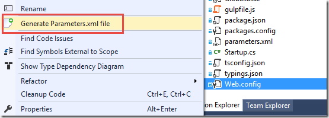](image-4.png)

In this case, I have three application settings in the web.config file, so I end up with this parameters.xml file. Note that I have set the *defaultvalue* attribute for all parameters to __TOKEN__. These are the configuration values that will end up in the *MyApp.SetParameters.xml* file, together with the web deployment package. We will replaced these values at deployment time, by a task in our release definition.

```
Code highlighting produced by Actipro CodeHighlighter (freeware)
http://www.CodeHighlighter.com/

<parameters>

      <parameter name="IsDevelopment" description="Description for IsDevelopment" defaultvalue="__ISDEVELOPMENT__" tags="">
      <parameterentry kind="XmlFile" scope="\\web.config$" match="/configuration/applicationSettings/MyApp.Properties.Settings/setting[@name='IsDevelopment']/value/text()" />
      </parameter>

      <parameter name="WebApiBaseUrl" description="Description for WebApiBaseUrl" defaultvalue="__WEBAPIBASEURL__" tags="">
      <parameterentry kind="XmlFile" scope="\\web.config$" match="/configuration/applicationSettings/MyApp.Properties.Settings/setting[@name='WebApiBaseUrl']/value/text()" />
      </parameter>

      <parameter name="SearchFilterDelta" description="Description for SearchFilterDelta" defaultvalue="__SEARCHFILTERDELTA__" tags="">
      <parameterentry kind="XmlFile" scope="\\web.config$" match="/configuration/applicationSettings/MyApp.Properties.Settings/setting[@name='SearchFilterDelta']/value/text()" />
      </parameter>

</parameters>
```

### Creating a Publish Profile

Now, let’s create a publish profile that define how the web deployment package should be created. Right-click on the web application project and then select Publish. Then select the Custom option:

[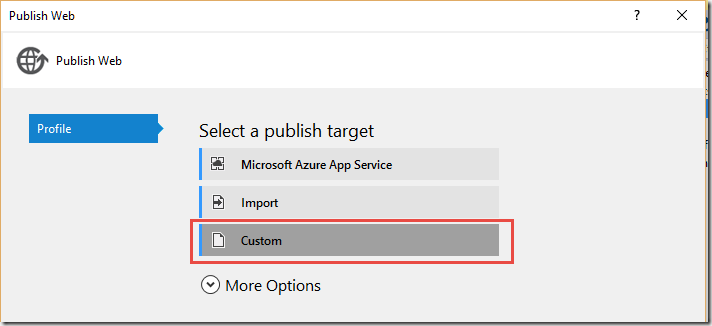](image-5.png)

Since the publish profile will be used to create a web deployment package, I like to call it CreatePackage (but you are of course free to call it whatever you want)

[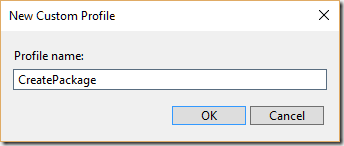](image-6.png)

On the Connection tab, select Web Deploy Package as the publish method, then give the generated package a name (including .zip).

As the Web Site name, we enter a tokenized value __WEBSITE__. This token will also end up in the MyApp.SetParameters.xml file.

[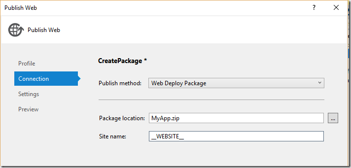](image-7.png)

Save the publish profile and commit and push your changes. Now it’s time to create a build definition.

### Create a Build Definition that generates a web deploy package

I won’t go through all the details of creating a build definition in VSTS, but just focus on the relevant parts for this blog post.

To generate a web deploy package, we need to pass some magic MSBuild parameters as part of the Visual Studio build task. Since we have a publish profile that contains our settings, we need to refer to this file. We also want to specify where the resulting files should be placed.

Enter the following string in the MSBuild Arguments field:

***/p:DeployOnBuild=true /p:PublishProfile=CreatePackage /p:PackageLocation=$(build.stagingDirectory)***

[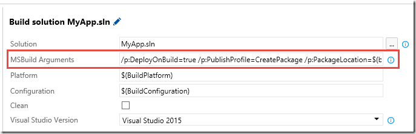](image-8.png)

*DeployOnBuild=true* is required to trigger the web deployment publishing process, and the we use the *PackageLocation* property to specify that the output should be places in the staging directory of the build. This will make it easy to upload the artifacts at the end of the build, like so:

[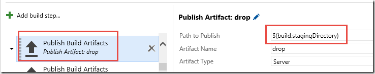](image-9.png)

This will generate an artifact called drop in the build that contains all files needed to deploy this application using MSDeploy:

[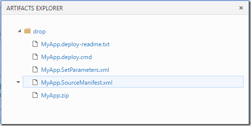](image-10.png)

As you can see, we have all the generated web deploy files here. We will use three of them:

**MyApp.zip** – The web deploy package

**MyApp.SetParameters.xml** – The parameterization file that contains our tokenized parameters

**MyApp.Deploy.cmd** – A command file that simplifies running MSDeploy with the correct parameters

### Creating a Release Definition

Finally, we will create a release definition that deploys this web deploy package to two different environments, let’s call them Test and Prod. In each environment we need to apply the correct configuration values. To do this, we have to replace the token variables in our MyApp.SetParameters.xml file.

There is no out of the box task to do this currently, but there are already several of them in the [**Visual Studio Marketplace**](https://marketplace.visualstudio.com/VSTS). Here, I will use the Replace Tokens task from Guillaume Rochon, available at [https://marketplace.visualstudio.com/items?itemName=qetza.replacetokens](https://marketplace.visualstudio.com/items?itemName=qetza.replacetokens "https://marketplace.visualstudio.com/items?itemName=qetza.replacetokens"). Install it to your Visual Studio Team Services account, and then the task will be available in the build/release task catalog, in the Utility category:

[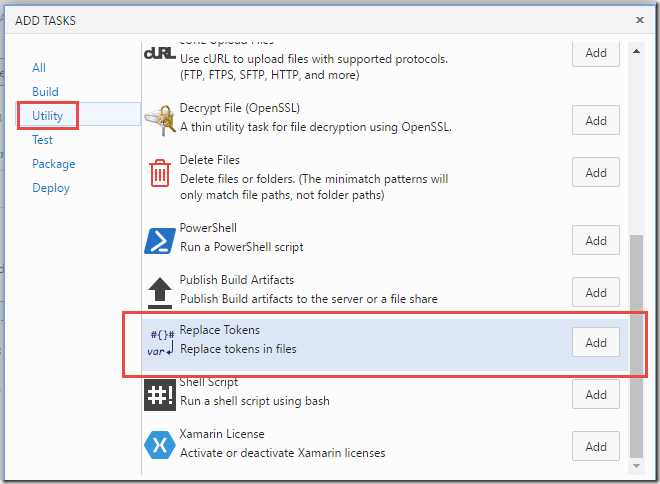](image-11.png)

Each environment in the release definition will just contain two tasks, the first one for the token replacement and the other one for deploying the web deploy package. To do this, we just run the *MyApp.deploy.cmd* file that was generated by the build. Since the parameters have already been set with the correct values, we can just run this without any extra arguments.

[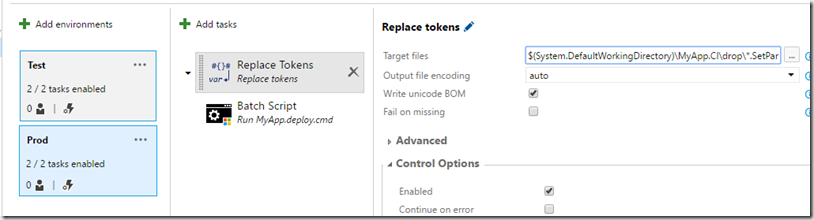](image-12.png)

Also, we must specify the values for each variable in the environment. Right click on the environment and the add these variables:

[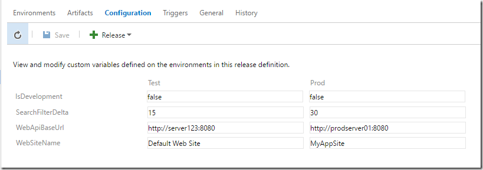](image-13.png)

> Tip: Create the Test environment first with all variables and tasks. Once it’s done, use the Clone environment feature to create a Prod environment, and then just replace the configuration values

That’s it, now you can run the release and it will deploy your web application with the correct configuration to each environment.

[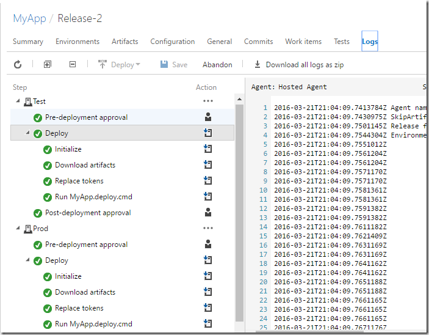](image-14.png)

---

## Comments

*Imported from the original WordPress site. Closed for new replies.*

> **Deepan** — 26 May 2016
>
> Hi, When you run the tokenizer task second time. It will not find the "tokens", lets say you first have one package deployed to development, then the setparameters.xml tokens already replaced. So the production release just after will deploy the same parameters again to PROD ?

> > **Jakob Ehn** — 09 May 2017
> >
> > Deepan, the production release is implemented in a different environment, so the artifacts (including the SetParameter.xml file) will be downloaded again with the new values.
> >
> > If you however deplloy the same package multiple times in the same RM environment, you will have this problem
