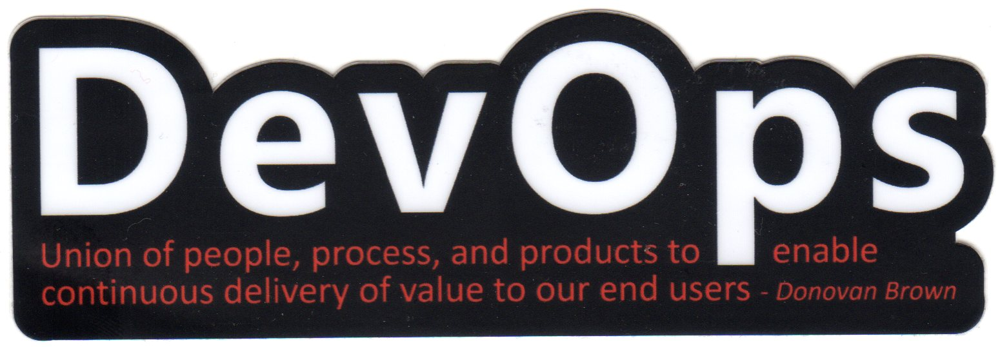

We have decided that it is time to create a meetup group for people that are interested in the Microsoft ALM and DevOps story!

Together with [Mathias Olausson](http://blogs.msmvps.com/molausson) and a few other people we have created a new Meetup group and announced the first meeting.

Our plan is to continue meeting every month or so to learn about and dicuss new concept and ideas in the area of ALRM and DevOps on the Microsoft stack. This is a wide area, which spans all roles in the development process, \
so there will be something for everyone.

# [First meetup: Microsoft Team Services Agile Transformation Story + VS ALM Update](http://www.meetup.com/swedish-ms-alm-devops/events/234449734/)

*The first meeting is set to **October 25th**, where we will have Jose Rady Allende, a Program Manager on the Visual Studio Team Services tean, join us online to talk about the Microsoft Team Service Agile Transformation story. \
We’ll also going to have a few lightning talks where we will talk about recent new additions to the TFS/VSTS platform*

### Meeting link:

### [http://www.meetup.com/swedish-ms-alm-devops/events/234449734/](http://www.meetup.com/swedish-ms-alm-devops/events/234449734/ "http://www.meetup.com/swedish-ms-alm-devops/events/234449734/")

There are already around 25 people that have signed up for it, so sign up before it gets full!

Heop to see you there!

