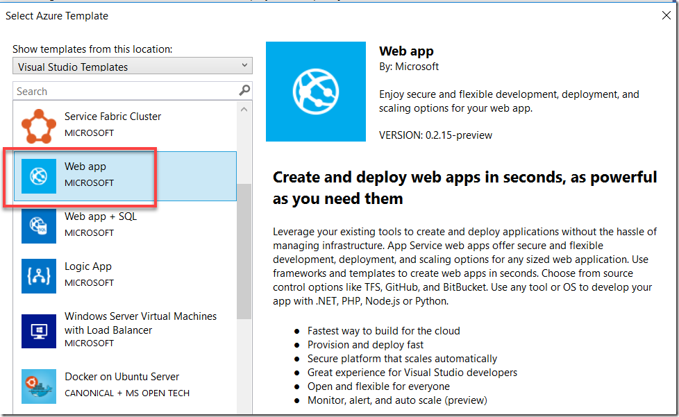
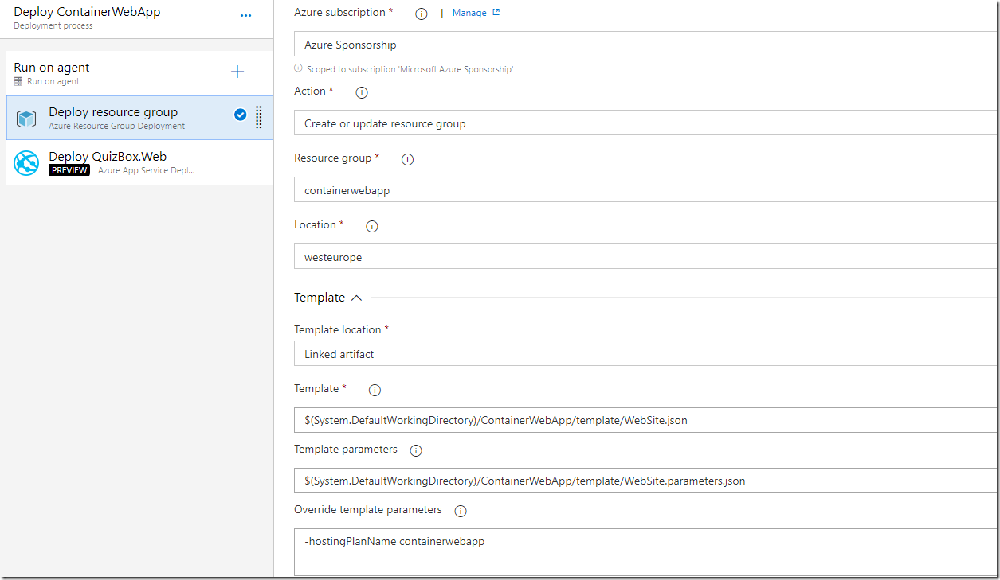
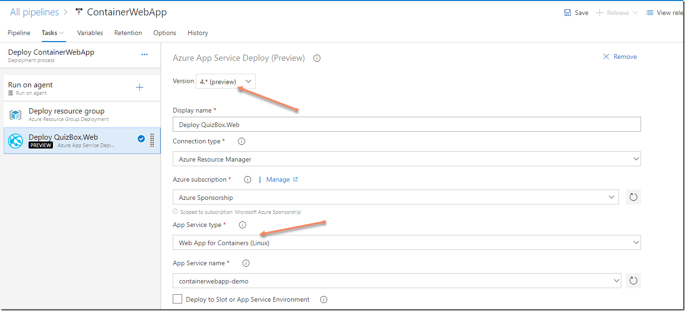
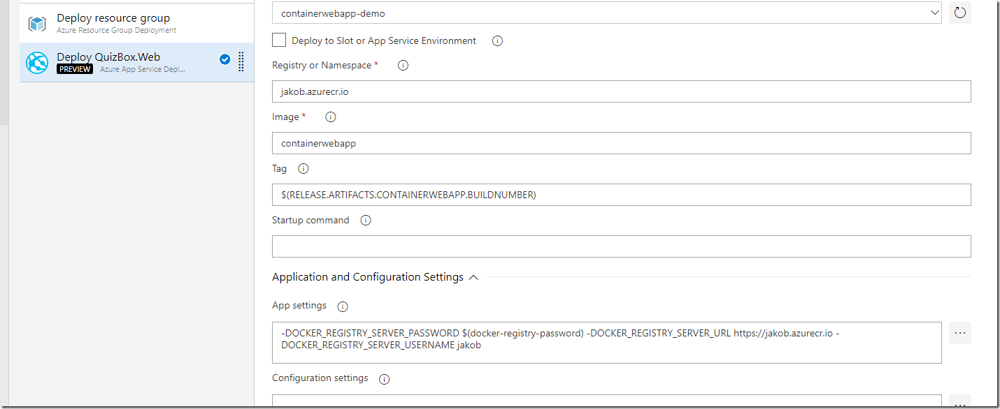
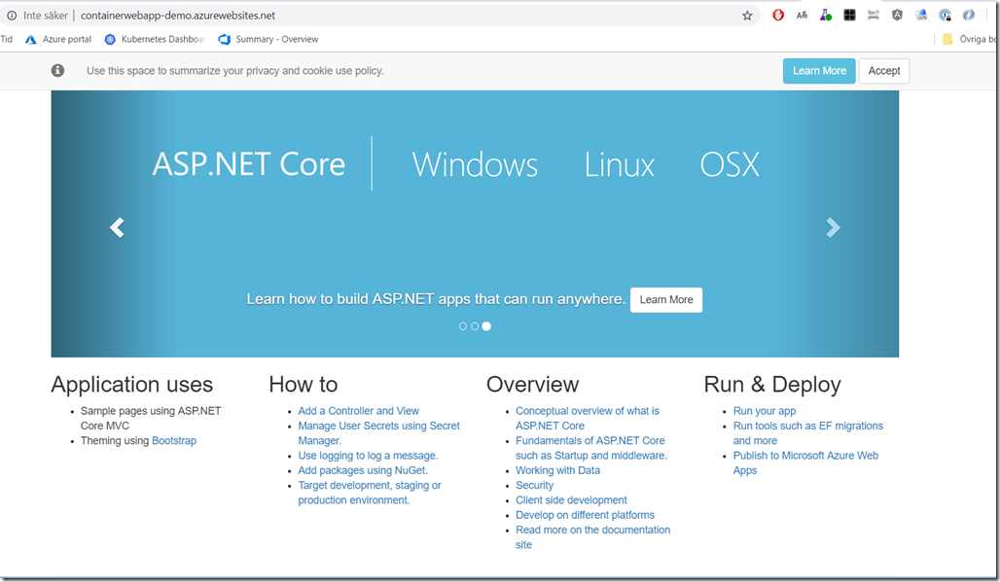

Using Docker containers  for building and running your applications has many advantages such as consistent builds, build-once run anywhere and easy standardized packaging and deployment format, just to name a few.

When it comes to running the containers you might look into container orchestrators such as Kubernetes or Docker Swarm. Sometimes though, these orchestrators can be overkill for your applications. If you are developing web applications that have only a few dependent runtime components, another options is to use **Azure Web App for Containers**, which is a mouthful for saying that you can use your beloved Azure Web Apps with all the functionality that comes with it (easy scaling, SSL support etc), but deploy your code in a container. Best of both worlds, perhaps?

In this post I will show how you can create an ARM template that creates the Azure Web App with the necessary setting to connect it to an Azure Container Registry, and how you setup a Azure Pipeline to build and deploy the container.

The code for this blog post is available on GitHub:

[https://github.com/jakobehn/containerwebapp](https://github.com/jakobehn/containerwebapp "https://github.com/jakobehn/containerwebapp")

The release definition is available here:\
[https://dev.azure.com/jakob/blog](https://dev.azure.com/jakob/blog "https://dev.azure.com/jakob/blog")

## Prerequisites

- An Azure subscription (duh)
- An Azure Container Registry
- An Azure DevOps project

## Creating the ARM Template

First up is creating an ARM template that will deploy the web app resource to your Azure subscription. Creating an ARM template for a web app is easy, you can use the **Azure Resource Group** project in Visual Studio (this template is installed with the Azure SDK) and select the Web app template:

[](image_thumb1.png)

[\](file:///C:/Users/jakobe/AppData/Local/Temp/OpenLiveWriter1510372289/supfiles126F4E9/image4.png)

Now, we need to make some changes in order to deploy this web app as a container. FIrst of all we will change some settings of the App Service Plan.

Set the “**kind**” property to “**linux**”, to specify that this is a Linux hosted web app (Windows containers for Web Apps are in preview at the moment).

Then we also need to set the “**reserved**” property to **true (**The documentation just says: ‘If Linux app service plan `true`, `false` otherwise’ 🙂 )

```json
{
   "apiVersion": "2015-08-01",
   "name": "[parameters('hostingPlanName')]",
   "type": "Microsoft.Web/serverfarms",
   "location": "[resourceGroup().location]",
   "kind":  "linux",
   "tags": {
     "displayName": "HostingPlan"
   },
   "sku": {
     "name": "[parameters('skuName')]",
     "capacity": "[parameters('skuCapacity')]"
   },
   "properties": {
     "name": "[parameters('hostingPlanName')]",
     "reserved": true
   }
},
```

For the web app definition, we need to set the “**kind**” property to “**app,linux,container**” to make this a containerized web app resource. We also need to set the **DOCKER_CUSTOM_IMAGE_NAME** to something. We will set the correct image later on from our deployment pipeline, but this property must be here when we create the web app resource.

```json
{
   "apiVersion": "2015-08-01",
   "name": "[variables('webSiteName')]",
   "type": "Microsoft.Web/sites",
   "kind": "app,linux,container",
   "location": "[resourceGroup().location]",
   "tags": {
     "[concat('hidden-related:', resourceGroup().id, '/providers/Microsoft.Web/serverfarms/', parameters('hostingPlanName'))]": "Resource",
     "displayName": "Website"
   },
   "dependsOn": [
     "[resourceId('Microsoft.Web/serverfarms/', parameters('hostingPlanName'))]"
   ],
   "properties": {
     "name": "[variables('webSiteName')]",
     "serverFarmId": "[resourceId('Microsoft.Web/serverfarms', parameters('hostingPlanName'))]",
     "siteConfig": {
       "DOCKER_CUSTOM_IMAGE_NAME": "containerwebapp"
     }
   }
},
```

Again, the full source is available over att GitHub (see link at top)

## Azure Pipeline

Let’s create a deployment pipeline that will build and push the image, and then deploy the ARM template and finally the web app container.

First up is the build definition, here I’m using YAML since it let’s me store the build definition in source control together with the rest of the application:

***NB: You need to change the azureSubscriptionEndpoint and azureContainerRegistry to the name of your service endpoint and Azure container registry***

***\***

***azure-pipelines.yml***

name: 1.0$(rev:.r)

trigger:

  - master

pool:

  vmImage: 'Ubuntu-16.04'

steps:

  - task: Docker@1

    displayName: 'Build image'

    inputs:

      azureSubscriptionEndpoint: 'Azure Sponsorship'

      azureContainerRegistry: jakob.azurecr.io

      dockerFile: ContainerWebApp/Dockerfile

      useDefaultContext: false

      imageName: 'containerwebapp:$(Build.BuildNumber)'

  - task: Docker@1

    displayName: 'Push image'

    inputs:

      azureSubscriptionEndpoint: 'Azure Sponsorship'

      azureContainerRegistry: jakob.azurecr.io

      command: 'Push an image'

      imageName: 'containerwebapp:$(Build.BuildNumber)'

  - task: PublishBuildArtifacts@1

    displayName: 'Publish ARM template'

    inputs:

      PathtoPublish: 'ContainerWebApp.ResourceGroup'

      ArtifactName: template

The build definition performs the following steps:

1. Build the container image using the Docker task, where we point to the Dockerfile and give it an imagename\
2. Pushes the container image to Azure Container Registry\
3. Publishes the content of the Azure resource group project back to Azure Pipelines. This will be used when we deploy the resource group in the release definition

Running this buid should push an image to your container registry.

Now we will create a release definition that deployes the resource group and then the container web app.

First up is the resource group deployment. Here we use the **Azure Resource Group Deployment** task, where we point to the ARM template json file and the parameters file. We also override the name of the app hosting plan since that is an input parameter to the template.

Then we use the **Azure App Service Deployment** task to deploy the container to the web app. Note that we are using the preview 4.* version since that has support for deploying to Web App for Containers.

In the rest of the parameters for this task we specify the name of the container registry, the name of the image and the specific tag that we want to deploy. The tag is fetched from the build number of the associated build.

Finally we set the following app settings:

- **DOCKER_REGISTRY_SERVER_URL**:                 *The URL to the Docker registry*\
- **DOCKER_REGISTRY_SERVER_USERNAME**:   *The login to the registry. For ACR, this is the name of the registry*\
- **DOCKER_REGISTRY_SERVER_PASSWORD**:   *The password to the registry. For ACR, you can get this in the **Access Keys** blade in the Azure portal*\

That’s it. Running the release deployes the resource group (will take 1-2 minutes the first time) and then the container to the web app. Once done, you can browse the site and verify that it works as expected:

[](image-5.png)

[](image-6.png)

[](image-7.png)

[](image-8.png)
