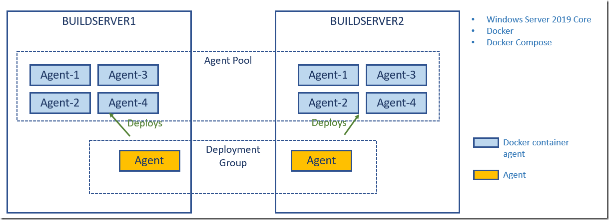
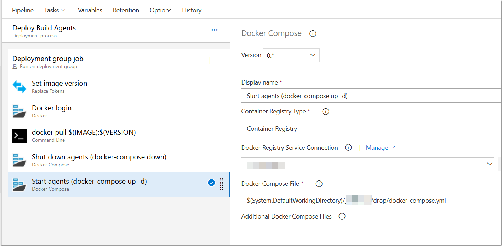
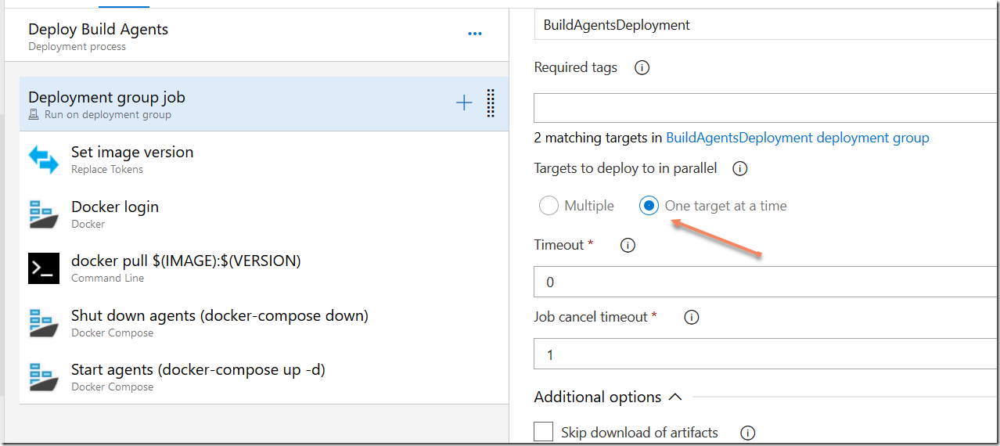

In [a previous post](/2019/01/creating-a-windows-container-build-agent-for-azure-pipelines/) I talked about how to create a build environment, including an Azure DevOps build agent, using Docker and Windows Containers. Using Dockerfiles, we can specify everything that we need in order to build and test our projects. Docker gives us Infrastructure as Code (no more snowflake build servers) and isolation which makes it easy to spin up multiple agents quickly on one or more machines without interfering with each other.

What I didn’t talk about in that post is to actually depoy and run the Windows containers in a production environment. I showed how to start the agent using docker run, but for running build agents for production workloads, you need something more stable and maintainable. There are also some additional aspects that you will need to handle when running build agents in containers.

For hosting and orchestrating Windows containers there are a few different options:

- Using Docker Compose\
- Docker Swarm\
- Kubernetes (which recently announced General Availability for running Windows Containers)

In this post I will show how to use [Docker Compose](https://docs.docker.com/compose/) to run the builds agents. In an upcoming post, I will use Azure Kubernetes services to run Windows container builds agents on multiple machines in the cloud (Support for Windows containers is currently in preview: <https://docs.microsoft.com/en-us/azure/aks/windows-container-cli>).

In addition to selecting the container hosting, there are some details that we want to get right:

- **Externalize build agent working directory**\
  We want to make sure that the working directory of the build agents is mapped to outside of the container. Otherwise we will loose all state when an agent is restarted, making all subsequent builds slower\
- **Enable “Docker in docker”**\
  Of course we want our build agent to be able to build Dockerfiles. While it is technically possible to install and run Docker engine inside a Docker container, it is not recommended. Instead, we install the Docker CLI in the container and use Named Pipes to bind the Docker API from the host. That means that all containers running on the host will share the same Docker engine. An advantage of this is that they will all benefit from the Docker image and build cache, improving build times overall, and reducing the amount of disk space needed\
- **Identity**\
  When accessing resources outside the container, the build agent will almost always need to authenticate against that resource. This could be for example a custom NuGet feed, or a network share. A Windows container can’t be domain joined, but we can use group Managed Service Accounts (gMSA) which is a special type of service account introduced in Windows Server 2012 designed to allow multiple computers to share an identity without needing to know its password.\
  You can follow this post from Microsoft on how to create and use group Managed Service Accounts for Windows containers:\
  <https://docs.microsoft.com/en-us/virtualization/windowscontainers/manage-containers/manage-serviceaccounts>\
  This post assumes that you have created a gMSA called *msa_BuildAgent* .

## Docker Compose

Docker compose makes it easy to start and stop multiple containers on a single host. All information is defined in a docker-compose.yml file, and then we can start everything using a simple docker-compose up command, and then docker-compose down to stop all containers, tearing down networks and so on.

We need to send in multiple parameters when starting the build agent containers, and to avoid making the docker-compose file too complex, we can extract all parameters to an external file. This also makes it easy to tokenize it when we run this from an automated process.

**\**

**docker-compose.yml**\

```
version: '2.4'
services:
agent1:
     image: ${IMAGE}:${VERSION}
     volumes:
       - type: npipe
         source: \\.\pipe\docker_engine
         target: \\.\pipe\docker_engine
       - type: bind
         source: d:\w\${WORKFOLDERNAME}1
         target: c:\setup\_work
     env_file: .env
     environment:
       TFS_AGENT_NAME: ${AGENTNAME}-1
     restart: always
agent2:
     image: ${IMAGE}:${VERSION}
     volumes:
       - type: npipe
         source: \\.\pipe\docker_engine
         target: \\.\pipe\docker_engine
       - type: bind
         source: d:\w\${WORKFOLDERNAME}2
         target: c:\agent\_work
     env_file: .env
     environment:
       TFS_AGENT_NAME: ${AGENTNAME}-2
     restart: always
```

As you can see, this file defines two containers (agent1 and agent2), you can easily add more here if you want to.

Some comments on this file:

- To enable “Docker in Docker”, we use the volume mapping of type npipe, which stands for named pipes. This binds to the Docker API running on the host\
- An addition volume is defined that maps c:\agent\_work to the defined path on the container host\
- We specify *restart: always* to make sure that these containers are restarted in case the build server is restarted

All values for the variables will be taken from an environment file (the env_file argument), that looks like this:

**.env (env_file)**

```
TFS_URL=<ORGANIZATIONURL>
TFS_PAT=<PERSONALACCESSTOKEN>
TFS_POOL_NAME=<AGENTPOOLNAME>
IMAGE=<BUILAGENTIMAGENAME>
VERSION=<BUILDAGENTIMAGETAG>
AGENTNAME=<CONTAINERNAME>
WORKFOLDERNAME=<WORKFOLDERNAME>
CREDENTIALSPEC=file://msa_BuildAgent.json
```

This file is placed in the same folder as the docker-compose.yml file.

Most of these parameters were covered in the previous post, the new ones here though are:\

- **WORKFOLDERNAME**\
  This is the path on the container host where the working directory should be mapped to. Internally in the container, the work directory in the agent is set to c:\agent\_work\
- **CREDENTIALSPEC**\
  This is the name of the credential specification file that you created if you followed the post that I linked to above, when creating the group Managed Service Account. That file is placed in the c:\ProgramData\Docker\CredentialSpec folder on your host

To start these build agents you simply run the following command in the same directory where you places the docker-compose.yml and the .env files:

docker-compose up –d

When you run this command, you will see something like:

Creating network "build_default" with the default driver\
Creating build_agent1_1 ... \
Creating build_agent2_1 ... \
Creating build_agent1_1 ... done\
Creating build_agent2_1 ... done

To stop all the containers, including tearing down the network that was created you run :

docker-compose down

## Automating the process

The process of deploying and updating builds agent containers on a server should of course be automated. So we need something that runs on our build servers that can pull the build agent container images from a container registry, and then start the agents on that machine.

One way to do this with Azure DevOps is to use [Deployment Groups](https://docs.microsoft.com/en-us/azure/devops/pipelines/release/deployment-groups/?view=azure-devops), which let you run deployments on multiple machines either sequentially or in parallell.

Here is an image that shows what this could look like:

[](image.png)

Here I have two build servers running Windows Server 2019 Core. The only things that are installed on these servers are Docker, Docker Compose and a Deployment Group agent. The deployment group agent will be used to stop the build agent containers, pull a new verison of the build agent image and then start them up again.

Here is the deployment process in Azure Pipelines:

[](image-1.png)

The process work like this:

1. The image version is updating by modifying the .env file that we defined before with the build number of the current build\
2. We run Docker login to authenticate to the container registry where we have the build agent container image. In this case we are using Azure Container Reigstry, but any registry will do\
3. The new version of the image is then pulled from the registry. This can take a while (Windows Containers are big) but usually only a few small layers need to be pulled after you have pulled the initial image the first time\
4. When we have the new image locally, we shut down the agents by running *docker-compose down\
   \*
5. And finally, we start the agents up again by running *docker-compose up –d*

Deployment groups are powerful in that they let you specify how to roll out new deployments oacross multiple servers.

If you do not want to restart all of your build agents at the same time, you can specify thise in the settings of the deployment group job:

[](image-2.png)

**Note:** One thing that is not handled by this process is graceful shutdown, e.g. if a build is currently running it will be stopped when shutting down the agents. It would be fully possible to utilize the Azure Pipelines API to first disable all agents (to prevent new builds from starting) and then wat until any currently running builds have finished, before shutting them down. I just haven’t done that yet 🙂

Hopefully this post was helpful if you want to run Windoes Continaer build agents for Azure Pipelines on your servers!
