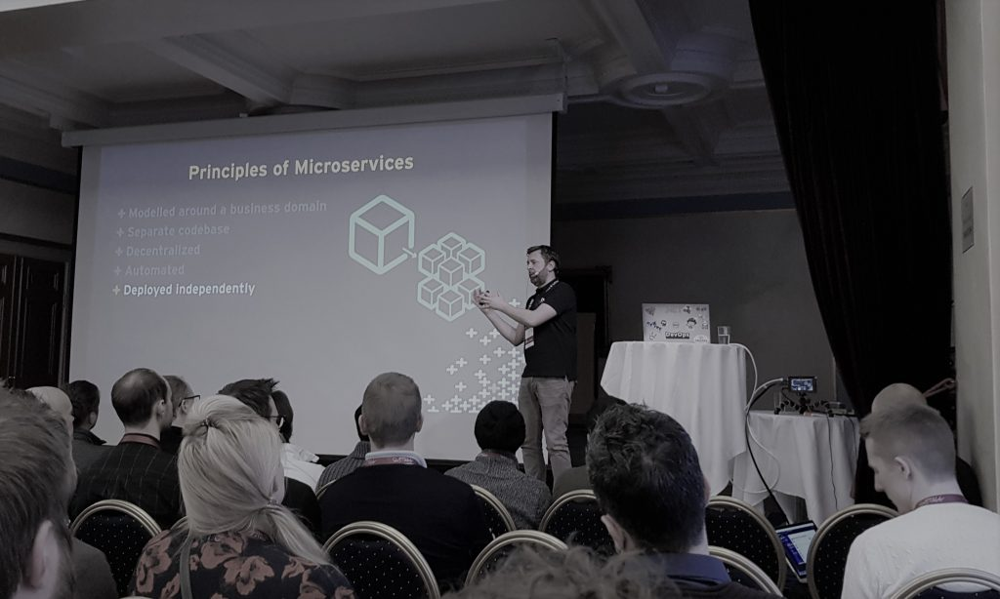

On this page I'm listing my coming and past speaking engagements.

If you are interested in talks around DevOps on the Microsoft stack, Azure DevOps, container technologies (Docker, Kubernetes, Azure Kubernetes Services..), cloud architecture or something else interesting, contact me on Twitter (@jakobehn) or through this blog.

## Coming Up

##### 2020/04/23  NDC Porto

Building resilient microservice applications with Dapr\
<https://ndcporto.com/talk/building-resilient-microservice-applications-with-dapr/>

##### 2020/05/5-6  Ignite the Tour Stockholm

DevOps with Azure Kubernetes Service\
Container Design Patterns\
<https://www.microsoft.com/sv-se/ignite-the-tour/stockholm>

##### 2020/05/28-29  DevSum Stockholm

TBD

## Past

##### 2020/02/27  Azure Community Live (online)

Event-driven computing with Kubernetes\
<https://www.youtube.com/watch?v=95HTszvGTZw>

##### 2020/02/03  Swetugg 2020- Stockholm

Keeping your builds green using Docker\
<https://swetugg.se/sthlm-2020>

##### 2019/12/13  CloudBrew 2019

Event-driven computing with Kubernetes\
[https://www.cloudbrew.be/](https://globaldevopsbootcamp.com/)

##### 2019/11/14-15  Update Conference Prague 2019

Event-driven computing with Kubernetes\
<https://www.updateconference.net/en/2019/speaker/jakob-ehn>

##### 2019/11/06  All Day DevOps (online)

Event-driven computing with Kubernetes\
<https://www.alldaydevops.com/addo-speakers/jakob-ehn>

##### 2019/10/23  Tech Days 2019- Stockholm

DevOps with Azure Kubernetes Service\
[https://www.tdswe.se/guest/jakob-ehn/](https://globaldevopsbootcamp.com/)

##### 2019/10/17  NDC Sydney 2019

Keeping your builds green using Docker\
[https://ndcsydney.com/talk/keeping-your-builds-green-using-docker/](https://globaldevopsbootcamp.com/)

##### 2019/06/15  Global DevOps Bootcamp 2019 - Stockholm

Hosting and coaching this worldwide event at the Solidify Stockholm office\
<https://globaldevopsbootcamp.com/>

##### 2019/05/23-24  DevSum 2019

A Lap around Azure DevOps\
<https://www.devsum.se/speakers/jakob-ehn/>

##### 2019-05-07 Swedish ALM/DevOps Meetup

Keeping your builds green using Docker\
<https://www.meetup.com/en-AU/swedish-ms-alm-devops/events/260111153/>

##### 2019/04/24-25  Microsoft Ignite Tour - Stockholm

Keeping your builds green using Docker\
Continuous Delivery with Azure Kubernetes Service\
[https://www.microsoft.com/sv-se/ignite-the-tour/stockholm](https://www.devsum.se/speakers/jakob-ehn/)

##### 2019/02/07  Swetugg 2019

Real Programmers Commit to Master\
<https://swetugg.se/swetugg-2019/speakers/jakob-ehn#real-programmers-commit-to-master>

##### 2019/01/31  NDC London 2019

A Lap around Azure DevOps\
[https://www.winops.org/london/](https://ndc-london.com/speaker/jakob-ehn/)

##### 2018/11/15   WinOps London 2018

Delivering Microservices with Visual Studio Team Services and Azure Kubernetes Services\
<https://www.winops.org/london/agenda/deliveringmicroservices.php>

##### 2018/11/08   IDG Code Night #13

Workshop: Secure code with the cloud (Swedish, with Peter Örneholm)\
[https://techworld.event.idg.se/event/codenight/](https://www.winops.org/london/)

##### 2018/10/24  Microsoft Tech Days

Introduction to Azure Kubernetes\
<https://tdswe.se/events/introduction-to-azure-kubernetes-services/>

##### 2018/10/17  All Day DevOps

Running Kubernetes on Microsoft Azure\
<https://www.alldaydevops.com/addo-speakers/jakob-ehn>

##### 2018/09/25  Stockholm Azure Meetup

Introducing Azure DevOps\
<https://www.meetup.com/Stockholm-Azure-Meetup/events/254383036/>

##### 2018/09/06  SweNug Stockholm

Micoservices with Visual Studio Team Services and Azure Kubernetes Services\
<https://www.meetup.com/Swenug-Stockholm/events/252444168/>

##### 2018/09/25  Swedish Microsoft ALM & DevOps Meetup

VSTS and Azure Kubernetes Services\
<https://www.meetup.com/swedish-ms-alm-devops/events/252113857/>

##### 2018/06/19  Microsoft Insider Dev Tour Stockholm

Creating DevOps Pipelines with Visual Studio Team Services\
<https://insiderdevtour.com/stockholm>

##### 2018/06/16  Global DevOps Bootcamp

Co-hosted event in Stockholm and helped preparing labs\
<https://globaldevopsbootcamp.com/>

##### 2018/05/31  DevSum 18

Introduction to Kubernetes and Azure Kubernetes Services\
<http://www.devsum.se>

##### 2018/02/18  Swetugg .NET Conference

Design your architecture for Continuous Deliverery\
<https://www.youtube.com/watch?v=ofvGnCU0MjU&t=230s>
