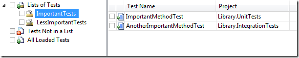
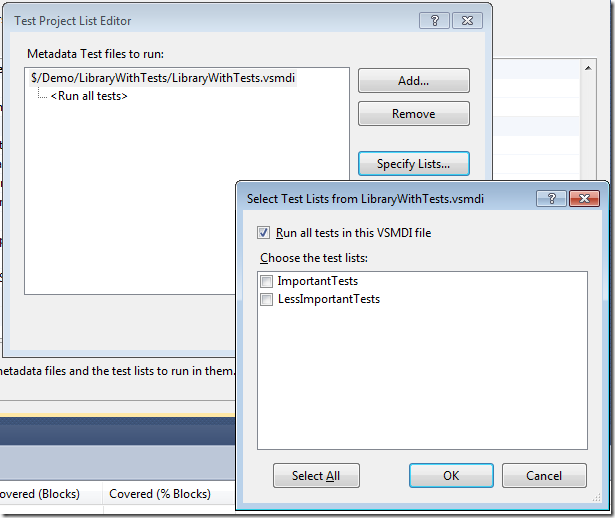
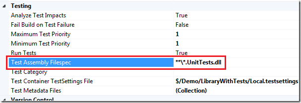
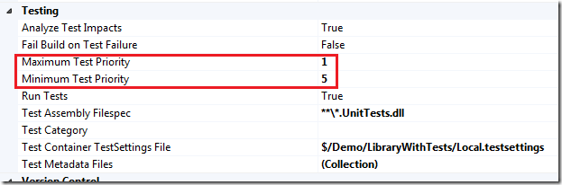
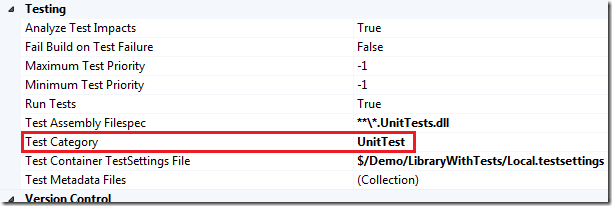
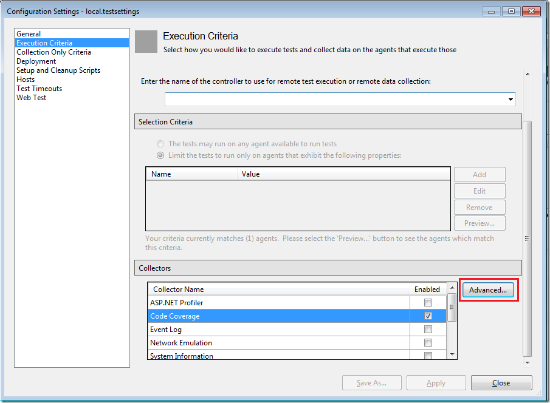
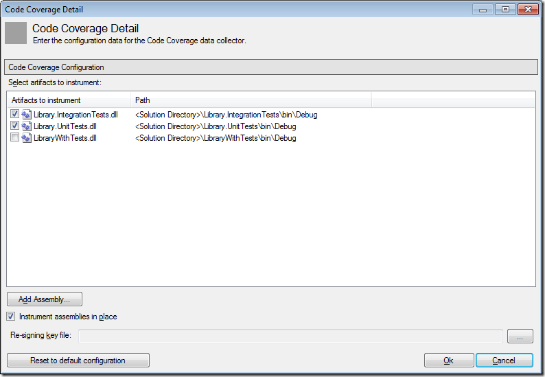
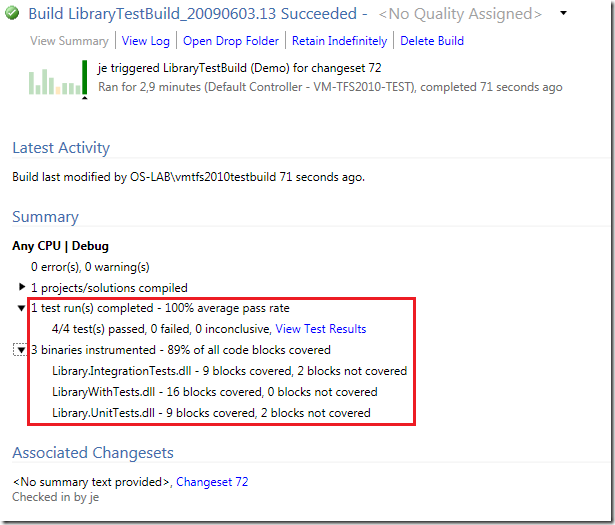

There are some changes and improvements in the area of executing unit tests in Team Build 2010. Mostly the changes make it easier to define **which** unit tests you want to execute as part of the build. In this post I will go through the different options that you have when it comes to running unit tests and enabling code coverage.

To configure test settings for a Team Build, you select Edit Build Definition in Team Explorer, and then go to the Build Process tab. In the Build process parameters box there is a section for the testing parameters. To change the parameters, just edit them and hit the save button. There is no need to check anything in or out to change the parameters. Only changes to the build process require you to check in the build process file (.xaml)

**Running Unit Tests from Test List(s) \**If you like to manage your tests using test lists (I don’t!), this option lets you run all the tests from one or more test lists. Here I have created two test lists, *ImportantTests* and *LessImportantTests*. Each test list contains two unit tests from two different assemblies.



To run all the tests from these test lists in a team build, locate the *Test Metadata Files* parameter and press the browse button to the right. This brings up a dialog that lets you choose which test metadata files (.vsmdi files) that you want to execute tests from. By default, all the tests will be executed. To filter this, click the *Specify Lists* button and you can select one or more test lists instead:



**Running Unit Tests from Test Assemblies (a.k.a. Test Containers) \**Since managing test lists in VSTS doesn’t scale very well, a common approach is to use *Test Assemblies* instead. In previous versions this was called Test Containers. So instead of creating different test lists to group your tests, you create several unit test assemblies and group your unit tests by adding them to the corresponding unit test assembly. For example you can have one (or more) assembly that contain pure unit tests, another set of assemblies that contain integration tests that you might only want to run in your nightly builds. To specify which test assemblies you want to execute, you use the *Test Assembly Filespec* parameter. This parameters contains a search pattern that should match the names of your test assemblies.



To use this approach in your company, you need to define a naming scheme for your unit test assemblies, such as Project.UnitTests.dll, Project.IntegrationTests.dll and so on.

**\
Running Unit Tests by Priority \**In addition to selecting which unit tests to execute, you can now further filter the tests by using the *Priority* attribute on your test methods. This is an attribute that has been around since .NET 2.0, but strangely enough there was no support of using it when running tests, neither in Visual Studio or in Team Build. In TFS 2010 however you can define a minimum and maximum test priority for your team build, meaning that all tests with a priority within that range will be executed as part of the build.

Here is how you decorate your test method with a priority.

```
/// <summary>
```

```
 ///A test for ImportantMethod
```

```
 ///</summary>
```

```
 [TestMethod()]
```

```
 [DeploymentItem("LibraryWithTests.dll")]
```

```
 [Priority(1)]
```

```
 public void ImportantMethodTest()
```

```json
 {
```

```
     Class1 target = new Class1(); // TODO: Initialize to an appropriate value
```

```
     string arg = "42"; // TODO: Initialize to an appropriate value
```

```
     int expected = 42; // TODO: Initialize to an appropriate value
```

```
     int actual;
```

```
     actual = target.ImportantMethod(arg);
```

```
     Assert.AreEqual(expected, actual);
```

```
 }
```

Then, set the priority range in your build definition \



Note that this is an additional filter that is applied to, in this case, all unit tests in all test assemblies that end with *UnitTests.dll*.

**\
Running Unit Tests by Category \**In addition to Priority, you can also filter your tests by using categories. This is very similar to priorities, but instead of working with numeric ranges, you define categories with meaningful names and apply them to your test methods.

To use this approach, decorate your test methods with the *TestCategory* attribute and then specify one or more test categories in your build definition.



According to the tooltip you should be able to construct the filter by using logical operators such as & and | , but this doesn’t seem to work in Beta 1.

**Enabling Code Coverage in a Team Build \**

When running unit tests you normally want to know how much of your code is actually tested, a.k.a. *code coverage*. The way you enable this for your tests and in your team build has changed a bit. First, the previous **.testrunconfig* files has been renamed into *.testsettings. To enable code coverage, double click on your .TestSettings file and select the *Execution Criteria* tab. Here you will see a totally new *Collectors* section that contains information about what data you want to collect when executing test. One of them is code coverage. The GUI is a bit weird in Beta 1, since you are supposed to first select the Code Coverage checkbox, and then click the *Advanced* button to specify which assemblies that should be instrumented for code coverage.





Next, in your team build definition you must specify the name of the test settings file you want to use. This is done using the *Test Container TestSettings File* parameter. Save the build definition, check in the test settings file and queue a new build. When it has finished, open the build summary that will show you the numbers on number of executed/passed/failed tests, and also the overall code coverage.



Very nice summary view indeed! If you want to look at the test results in detail, you click the “View Test Results” link which will download the test run to your local machine and then open it in the Test Results window.

---

## Comments

*Imported from the original WordPress site. Closed for new replies.*

> **Bob Hardister** — 24 Jul 2009
>
> Originally posted on: <http://geekswithblogs.net/jakob/archive/2009/06/03/tfs-team-build-2010-running-unit-tests.aspx#482723>
>
> Great post! Just what I was looking for. Where did you find the guidelines for this?

> **Mathieu H&#233;tu** — 11 Jun 2010
>
> Originally posted on: <http://geekswithblogs.net/jakob/archive/2009/06/03/tfs-team-build-2010-running-unit-tests.aspx#523673>
>
> However, it will only work if on the build machine Visual Studio 2010 Ultimate or Premium is installed.\
> Which is a silly requirement IMO.\
> Thanks for the documentation!

> **Dustin Andrews** — 14 Sep 2010
>
> Originally posted on: <http://geekswithblogs.net/jakob/archive/2009/06/03/tfs-team-build-2010-running-unit-tests.aspx#537814>
>
> What if I am building more than one solution file in my build? How can I add more assemblies to be instrumented in the build?

> **Jakob Ehn** — 14 Sep 2010
>
> Originally posted on: <http://geekswithblogs.net/jakob/archive/2009/06/03/tfs-team-build-2010-running-unit-tests.aspx#537881>
>
> Dustin: the output from all solutions will end up in the same location during team build, so if you use the Test Container extension (*Test*.dll for example) Team Build will find the test assemblies from all solutions

> **Sonali Noolkar** — 01 Feb 2011
>
> Originally posted on: <http://geekswithblogs.net/jakob/archive/2009/06/03/tfs-team-build-2010-running-unit-tests.aspx#560436>
>
> I am trying to execute unit tests as a post build event using TFS2010 upgrade template. I tried to modify the TFSBuild.proj file to include below lines.\
>  true\
>  \
>  \
> \
>  \
> \
>  \
> $(SolutionRoot)/LocalTestRun.testrunconfig\
>  \
> \
> After this, I am getting below errors:\
>  2 error(s), 0 warning(s)\
> $/AO SDMC.NET/TeamBuildTypes/WebApplicationStarterKit4_CI/TFSBuild.proj ('TestConfiguration' target(s)) - 2 error(s), 0 warning(s), View Log File\
>  C:Program Files (x86)MSBuildMicrosoftVisualStudioTeamBuildMicrosoft.TeamFoundation.Build.targets (1375): \
> The "Version" parameter is not supported by the "TestToolsTask" task. Verify the parameter exists on the task, and it is a settable public instance property.\
> \
>  C:Program Files (x86)MSBuildMicrosoftVisualStudioTeamBuildMicrosoft.TeamFoundation.Build.targets (1361): The "TestToolsTask" task could not be initialized with its input parameters. \
> \
> Please help.

> **Sonali Noolkar** — 01 Feb 2011
>
> Originally posted on: <http://geekswithblogs.net/jakob/archive/2009/06/03/tfs-team-build-2010-running-unit-tests.aspx#560440>
>
> To add further,\
> \
> As described in the article, why the Testing Parameters section is not visible to me?\
> I am using VS2010 Ultimate version.

> **Arunkumar** — 22 Feb 2011
>
> Originally posted on: <http://geekswithblogs.net/jakob/archive/2009/06/03/tfs-team-build-2010-running-unit-tests.aspx#564238>
>
> Hey I am not getting Execution Criteria option in visual studio 2010 ultimate.

> **Jakob Ehn** — 22 Feb 2011
>
> Originally posted on: <http://geekswithblogs.net/jakob/archive/2009/06/03/tfs-team-build-2010-running-unit-tests.aspx#564241>
>
> @Sonali: This post was written for the Beta 1 release so the GUI has changed since then. You'll find the settings in the process section, Build process parameters -> Basic -> Automated Tests. Click the "..." browse button and select the Criteria/Arguments tab\
> \
> Cheers\
> /Jakob

> **ibs symptoms** — 02 May 2011
>
> Originally posted on: <http://geekswithblogs.net/jakob/archive/2009/06/03/tfs-team-build-2010-running-unit-tests.aspx#576431>
>
> Thank you for the clarification. Regards, Larry

> **Nicolae** — 09 May 2011
>
> Originally posted on: <http://geekswithblogs.net/jakob/archive/2009/06/03/tfs-team-build-2010-running-unit-tests.aspx#577248>
>
> \
> Hello, thank you for the article,\
> \
> I have on question, why I can't see the "Automated Tests" under the "Build process parameters -> Basic" ?\
> \
> \
> -------------\
> @Sonali: This post was written for the Beta 1 release so the GUI has changed since then. You'll find the settings in the process section, Build process parameters -> Basic -> Automated Tests. Click the "..." browse button and select the Criteria/Arguments tab\
> \
> Cheers\
> /Jakob \
> \

> **VLetroye** — 23 Aug 2011
>
> Originally posted on: <http://geekswithblogs.net/jakob/archive/2009/06/03/tfs-team-build-2010-running-unit-tests.aspx#590934>
>
> Once you have clicked the “View Test Results” link which downloads the test run on your local machine and open it in the Test Results window, you can next open each test results. Assuming that you open a failed test, you can see the related error Stack Trace with hyperlinks for each line of your code. \
> \
> Unfortunatelly, these hyperlinks are referencing sources in local paths on the Build server... Isn't there a way to replace this with a link to the Symbol Server, so that one can open the sources from our workstations ? (Indeed, we possibly don't have the same version of the sources in our workspace and anyway, our workspace does not map the sources on the same path as the various Build agents)...

> **Gangadhar** — 20 Oct 2011
>
> Originally posted on: <http://geekswithblogs.net/jakob/archive/2009/06/03/tfs-team-build-2010-running-unit-tests.aspx#597354>
>
> Hi Jakob,\
> \
> I have a task to integrate unit tests with TFS build\
> I have followed all the steps as you mentioned in the above article. when i queue the build it is successful but the test runs are showing up as zero.\
> \
> I didn't find any flag like testrun='True' in the tool. so i made true  in the TFSBUild and queued the build, no test runs :(.\
> \
> can u please help me in this. \
> \
> \
> Regards,\
> Gangadhar.
