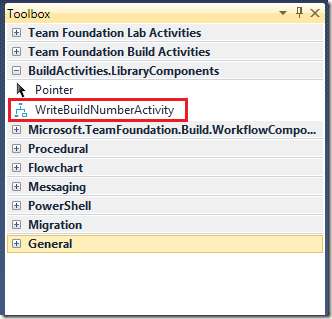
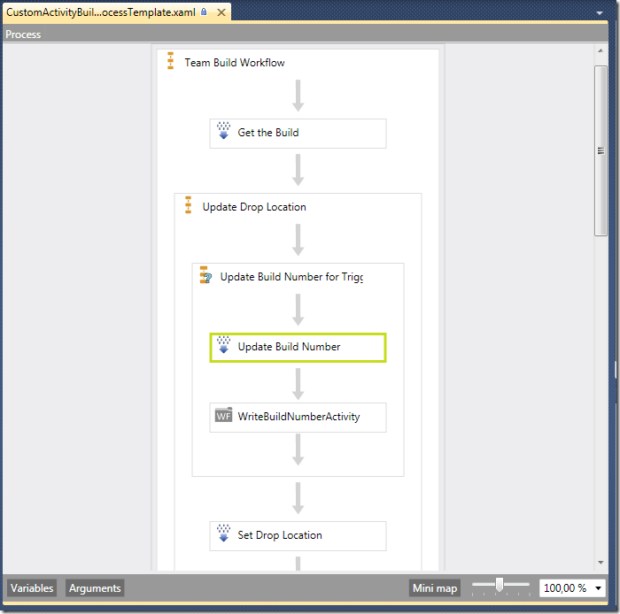
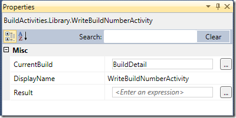
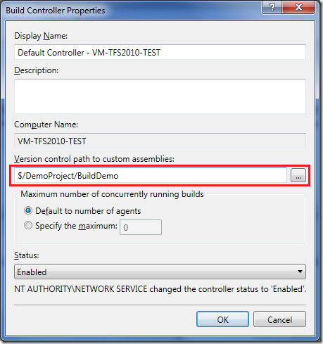
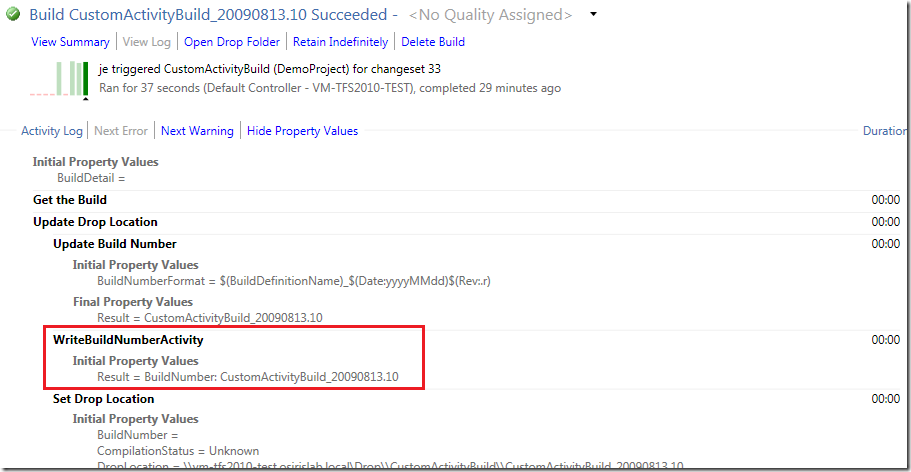

*Disclaimer: This blog post discusses features in the TFS 2010 Beta 1 release. Some of these  features might be changed in the RTM release.*

In TFS 2010, Microsoft has changed the build orchestration language in Team Build from MSBuild to Windows Workflow 4.0. [Aaron Hallberg](http://blogs.msdn.com/aaronhallberg/default.aspx) has written a [post](http://blogs.msdn.com/aaronhallberg/archive/2009/06/01/writing-custom-activities-for-tfs-build-2010-beta-1.aspx) on how to implement a custom workflow activity using either the workflow designer or using a code activity that composes an activity. In this post, I will show how to implement a “pure” code activity, i.e. no workflow elements,and how to add this activity to a build process definition. Note, this is still Beta 1, and some things will definitely change when Beta2 and RTM arrives but this will get you started with customizing your builds in TFS 2010.

Here is a very simple custom activity that has one input variable, *CurrentBuild* of type *IBuildDetail*, and has a string result value. All it does is return the build number of the IBuildDetail object as a string result. This is of course quite useless, but never the less it shows you how to send in variables from your build process workflow and return result back:

```csharp
public class WriteBuildNumberActivity : CodeActivity<String>
```

```json
{
```

```
    [Browsable(true)]
```

```
    [DefaultValue(null)]
```

```
    public InArgument<IBuildDetail> CurrentBuild { get; set; }
```

```
    protected override void Execute(CodeActivityContext context)
```

```json
    {
```

```
        string buildNumber = "BuildNumber: " + this.CurrentBuild.Get(context).BuildNumber;
```

```
        context.SetValue(Result, buildNumber);
```

```
    }
```

```
}
```

Note that the class inherits from CodeActivity<String>, which basically gives it a string return value (OutArgument) called *Result*.

Now, to add this activity to a build process, you need to open the build process designer and drag your activity and configure it. This might be a Beta 1 issue, but the only way I got this to work is to include the build process XAML template in the same project that contains the custom activities. This is of course far from ideal, but I am sure that this will resolved in Beta 2.

So, first of all create a new build process. Check out my [previous blog post](http://geekswithblogs.net/jakob/archive/2009/05/27/working-with-build-definitions-in-tfs-team-build-2010.aspx) on how to do this. Note that since you will customize your build process, you’ll want to create a copy of the standard DefaultTemplate XAML process file. You should never modify the DefaultTemplate.xaml project file. Too make it easy for the sample, you can just place the xaml file in the same folder as your custom activity project.

Next, include the build process XAML in your library project  and then double click the XAML file. This opens up the designer, and of you open the toolbox you should see your custom activity in a separate toolbox tab:



Next step is to add the activity to your build process. Drag the activity from the toolbox and place it after the *UpdateBuildNumber* actity:



Since the activity has an input variable of type IBuildDetail, we need to pass the current BuildDetail object into this variable. To do this, select the activity and edit the *CurrentBuild*property in the properties window to contain the value *BuildDetail*:



The BuildDetail is a variable that is initialized previously in the *Get the Build* activity at the start of the build process.

Now save the build process and check it into source control. To be able to run this build on your build agent, the library must of course be available to the build agent. A new approach in TFS 2010 is that you can specify a version control path for custom assemblies on each build controller. This path is where you would store the assemblies that contain custom activities that you want to use in your builds.



Unfortunately, there seem to be a caching issue in Beta 1 which complicates development. If you modify your activity library and check it in, the old version seem to be cached on the build controller. The only work around that I have found is to clear the version control path field, close the dialog and the reopen it and put the old value back. This seem to cause the build controller to reload the custom assemblies.

Ok, if you have checked in everything, including the custom activity library and configured the build controller, you can now run the build and verify that your activity is being called. In the default log view, you will only see the name of the activity in the list. Too view more info, click on the *Show Property Values*. This will show all input and output variables for each activity. Note though that it only shows variables that is of standard value types, so it won’t show the CurrentBuild variable:



As you can see, the result property contains the string”BuildNumber: “ plus the generated build number that was created previously in the *UpdateBuildNumber* activity.

Ok, this was a rather contrived and crude example, but it shows how you can create custom code activities and incorporate them into your builds in TFS 2010 Team Build Beta 1. I know many people are interested in how to write “pure” code activites in TFS 2010 for different scenarios, hopefully this post is helpful to get you started!

For more on working with custom code activities in WF4.0, read this walkthrough from Guy Burstein: [http://blogs.msdn.com/bursteg/archive/2009/05/19/wf-4-0-code-only-custom-activities-for-atomic-actions-codeactivity-codeactivity-t.aspx](http://blogs.msdn.com/bursteg/archive/2009/05/19/wf-4-0-code-only-custom-activities-for-atomic-actions-codeactivity-codeactivity-t.aspx "http://blogs.msdn.com/bursteg/archive/2009/05/19/wf-4-0-code-only-custom-activities-for-atomic-actions-codeactivity-codeactivity-t.aspx")

---

## Comments

*Imported from the original WordPress site. Closed for new replies.*

> **David** — 13 Aug 2009
>
> Originally posted on: <http://geekswithblogs.net/jakob/archive/2009/08/13/tfs-team-build-2010-working-with-custom-code-activities.aspx#484633>
>
> Nice to see that you are digging into the 2010 details, keep posting!

> **madhurig(msft)** — 05 Oct 2009
>
> Originally posted on: <http://geekswithblogs.net/jakob/archive/2009/08/13/tfs-team-build-2010-working-with-custom-code-activities.aspx#489332>
>
> <Unfortunately, there seem to be a caching issue in Beta 1 which complicates development. If you modify your activity library and check it in, the old version seem to be cached on the build controller. The only work around that I have found is to clear the version control path field, close the dialog and the reopen it and put the old value back.> \
> \
> Workaround is to restart the Build Service Host on the build machine where the controller is running. This issue has been fixed but hasn't made it into Beta2.

> **Craig Tadlock** — 27 Nov 2009
>
> Originally posted on: <http://geekswithblogs.net/jakob/archive/2009/08/13/tfs-team-build-2010-working-with-custom-code-activities.aspx#496242>
>
> Im trying to create and use an assembly for custom build workflow activities. Ive followed your instructions above but am unable to get it to work. No matter what I do, I can not get the build process to find my custom assembly. Is there some logging I can turn on for the build service to help debug?\
> \
> Other Errors and Warnings\
>  1 error(s), 0 warning(s)\
>  TFB210503: An error occurred while initializing a build for build definition TestSunnyside_1.0: Cannot create unknown type '{clr-namespace:TadlockEnterprises.TeamFoundation.Build.Workflow.Activities}DeleteFiles'.

> **David Bishop** — 30 Nov 2009
>
> Originally posted on: <http://geekswithblogs.net/jakob/archive/2009/08/13/tfs-team-build-2010-working-with-custom-code-activities.aspx#496486>
>
> I'm having the same issue as the above comment:\
> \
> TFB210503: An error occurred while initializing a build for build definition ReedBuildActivities: Cannot create unknown type '{clr-namespace:BuildActivities}ReedDeploymentActivity'.\
> \
> Driving me bonkers - been trying to find a workaround for this for some time, now.

> **Markus Schneiders** — 01 Dec 2009
>
> Originally posted on: <http://geekswithblogs.net/jakob/archive/2009/08/13/tfs-team-build-2010-working-with-custom-code-activities.aspx#496683>
>
> I believe you have not Signed your Assembly with an Strong Name. Try this out.

> **Aleksey Fomichenko** — 04 Dec 2009
>
> Originally posted on: <http://geekswithblogs.net/jakob/archive/2009/08/13/tfs-team-build-2010-working-with-custom-code-activities.aspx#497124>
>
> Please ensure that you are editing the Process XAML in a ~separate~ project, NOT in the same project where you develop your custom build activity.\
> \
> So, under the same solution I have two projects: ActivityLibrary and ProcessTemplates\
> \
> Hope this helps.

> **uk.cv.com** — 14 Jun 2010
>
> Originally posted on: <http://geekswithblogs.net/jakob/archive/2009/08/13/tfs-team-build-2010-working-with-custom-code-activities.aspx#523986>
>
> Great Post, you’ve done a very nice article, thanks a lot.

> **UGG Boots Sale UK** — 10 Nov 2010
>
> Originally posted on: <http://geekswithblogs.net/jakob/archive/2009/08/13/tfs-team-build-2010-working-with-custom-code-activities.aspx#546875>
>
> \
> It's my first time to post a reply, thanks for your sharing

> **Recruitment Agency** — 24 Nov 2010
>
> Originally posted on: <http://geekswithblogs.net/jakob/archive/2009/08/13/tfs-team-build-2010-working-with-custom-code-activities.aspx#549127>
>
> Leading IT recruitment agency based in London, the UK which recruits IT skilled peoples throughout London. Register now!
