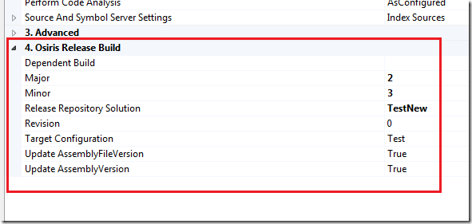
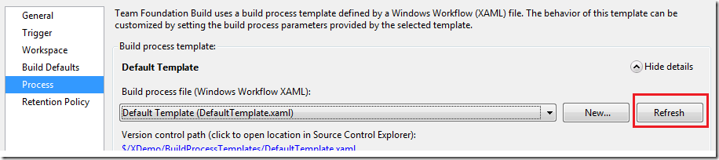

When embracing Team Build 2010, you typically want to define several different build process templates for different scenarios. Common examples here are CI builds, QA builds and release builds. For example, in a contiuous build you often have no interest in publishing to the symbol store, you might or might not want to associate changesets and work items etc. The build server is often heavily occupied as it is, so you don’t want to have it doing more that necessary. Try to define a set of build process templates that are used across your company. In previous versions of TFS Team Build, there was no easy way to do this. But in TFS 2010 it is very easy so there is no excuse to not do it! :-)

I ran into a scenario today where I had an existing build definition that was based on our release build process template. In this template, we have defined several different build process parameters that control the release build. These are placed into its own sectionin the Build Process Parameters editor. This is done using the ProcessParameterMetadataCollection element, I will explain how this works in a future post.

[](http://gwb.blob.core.windows.net/jakob/WindowsLiveWriter/GettingTF215097erroraftermodifyingabuild_C31E/image_2.png)

I won’t go into details on these parametes, the issue for this blog post is what happens when you modify a build process template so that it is no longer compatible with the build definition, i.e. a breaking change. In this case, I removed a parameter that was no longer necessary. After merging the new build process template to one of the projects and queued a new release build, I got this error:

**TF215097: An error occurred while initializing a build for build definition <Build Definition Name>: \****The values provided for the root activity's arguments did not satisfy the root activity's requirements: 'DynamicActi****vity': \
The following keys from the input dictionary do not map to arguments and must be removed: <Parameter Name>.  \
Please note that argument names are case sensitive. Parameter name: rootArgumentValues**

<Parameter Name> was the parameter that I removed so it was pretty easy to understand why the error had occurred. However, it is not entirely obvious how to fix the problem. When open the build definition everything looks OK, the removed build process parameter is not there, and I can open the build process template without any validation warnings.

The problem here is that all settings specific to a particular build definition is stored in the TFS database. In TFS 2005, everything that was related to a build was stored in TFS source control in files (TFSBuild.proj, WorkspaceMapping.xml..). In TFS 2008, many of these settings were moved into the database. Still, lots of things were stored in TFSBuild.proj, such as the solution and configuration to build, wether to execute tests or not. In TFS 2010, all settings for a build definition is stored in the database. If we look inside the database we can see what this looks like. The table **tbl_BuildDefinition** contains all information for a build definition. One of the columns is called **ProcessParameters** and contains a serialized representation of a Dictionary that is the underlying object where these settings are stoded. Here is an example:

```
<Dictionary x:TypeArguments="x:String, x:Object" xmlns="clr-namespace:System.Collections.Generic;assembly=mscorlib" xmlns:mtbwa="clr-namespace:Microsoft.TeamFoundation.Build.Workflow.Activities;assembly=Microsoft.TeamFoundation.Build.Workflow" xmlns:x="http://schemas.microsoft.com/winfx/2006/xaml">

<mtbwa:BuildSettings x:Key="BuildSettings" ProjectsToBuild="$/PathToProject.sln">
    <mtbwa:BuildSettings.PlatformConfigurations>
        <mtbwa:PlatformConfigurationList Capacity="4">
        <mtbwa:PlatformConfiguration Configuration="Release" Platform="Any CPU" />
        </mtbwa:PlatformConfigurationList>
    </mtbwa:BuildSettings.PlatformConfigurations>
</mtbwa:BuildSettings>
<mtbwa:AgentSettings x:Key="AgentSettings" Tags="Agent1" />
<x:Boolean x:Key="DisableTests">True</x:Boolean>
<x:String x:Key="ReleaseRepositorySolution">ERP</x:String>
<x:Int32 x:Key="Major">2</x:Int32>
<x:Int32 x:Key="Minor">3</x:Int32>
</Dictionary>
```

Here we can see that it is really only the non-default values that are persisted into the databasen. So, the problem in my case was that I removed one of the parameteres from the build process template, but the parameter and its value still existed in the build definition database. The solution to the problem is to refresh the build definition and save it. In the process tab, there is a Refresh button that will reload the build definition and the process template and synchronize them:

[](http://gwb.blob.core.windows.net/jakob/WindowsLiveWriter/GettingTF215097erroraftermodifyingabuild_C31E/image_4.png)

After refreshing the build definition and saving it, the build was running successfully again.

---

## Comments

*Imported from the original WordPress site. Closed for new replies.*

> **Sean Stolberg** — 25 Jun 2010
>
> Originally posted on: <http://geekswithblogs.net/jakob/archive/2010/04/21/getting-tf215097-error-after-modifying-a-build-process-template-in.aspx#525573>
>
> Thanks, Jakob. Just ran into this error too where I removed the BuildSettings default parameter for an auto-deploy build I setup (nothing to build on this one, it's tests deployment of our installer). I did the refresh, but hadn't done the save (not totally intuitive).\
> \
> Anyhow, saving did the trick and the build is running normally now.\
> \
> Thanks,\
> Sean

> **afsharm** — 16 Jul 2010
>
> Originally posted on: <http://geekswithblogs.net/jakob/archive/2010/04/21/getting-tf215097-error-after-modifying-a-build-process-template-in.aspx#528779>
>
> Many thanks Jakob. You save me plenty of time.

> **Gus** — 08 Feb 2011
>
> Originally posted on: <http://geekswithblogs.net/jakob/archive/2010/04/21/getting-tf215097-error-after-modifying-a-build-process-template-in.aspx#561723>
>
> Cheers mate, saved me some time there!

> **Gokul** — 28 Apr 2011
>
> Originally posted on: <http://geekswithblogs.net/jakob/archive/2010/04/21/getting-tf215097-error-after-modifying-a-build-process-template-in.aspx#575741>
>
> Thanks a lot! Saved my time!!

> **Shurik Shin** — 04 Aug 2011
>
> Originally posted on: <http://geekswithblogs.net/jakob/archive/2010/04/21/getting-tf215097-error-after-modifying-a-build-process-template-in.aspx#588644>
>
> Thanks to you.\
> It was very useful for me.

> **dz** — 28 Feb 2012
>
> Originally posted on: <http://geekswithblogs.net/jakob/archive/2010/04/21/getting-tf215097-error-after-modifying-a-build-process-template-in.aspx#608943>
>
> Thanks a lot

> **Robert** — 05 Mar 2012
>
> Originally posted on: <http://geekswithblogs.net/jakob/archive/2010/04/21/getting-tf215097-error-after-modifying-a-build-process-template-in.aspx#609541>
>
> Thanks, I've been banging my head against this for a few days... I had the exact same scenario.

> **Kent** — 15 Mar 2012
>
> Originally posted on: <http://geekswithblogs.net/jakob/archive/2010/04/21/getting-tf215097-error-after-modifying-a-build-process-template-in.aspx#610297>
>
> Thanks for this information. You just kept me from aging about 10 years. I have been struggling to make changes to the xaml file and had it working with a test project. However, when I applied it to the real project, I began to see this error and thought I had really screwed up. Thanks again for sharing.

> **Dele O** — 11 Sep 2012
>
> Originally posted on: <http://geekswithblogs.net/jakob/archive/2010/04/21/getting-tf215097-error-after-modifying-a-build-process-template-in.aspx#618936>
>
> Any advice on how to do this for 40 different builds that seem to have the same error? is it possible via TFS API?

> **Brian** — 06 Oct 2012
>
> Originally posted on: <http://geekswithblogs.net/jakob/archive/2010/04/21/getting-tf215097-error-after-modifying-a-build-process-template-in.aspx#619894>
>
> Had this same error using TFS2012. Found that refreshsave didn't work. Had to change the template, save and then change it back and save again... YMMV.

> **deadlydog** — 10 Jan 2013
>
> Originally posted on: <http://geekswithblogs.net/jakob/archive/2010/04/21/getting-tf215097-error-after-modifying-a-build-process-template-in.aspx#623641>
>
> This issue also has a MSDN Forums question about it with additional steps if the ones here alone don't do the trick. http://social.msdn.microsoft.com/Forums/en-US/tfsbuild/thread/bc94f25d-e22d-4342-bfdb-28408d9e2a29/

> **dr memals** — 10 May 2013
>
> Originally posted on: <http://geekswithblogs.net/jakob/archive/2010/04/21/getting-tf215097-error-after-modifying-a-build-process-template-in.aspx#628606>
>
> refersh and save did not work for me. Had to go back to the build template and readd the argument, then delete the value from the build definition, then go back and remove it again.\
> But your post pointed me in the right direction, so thanks.
