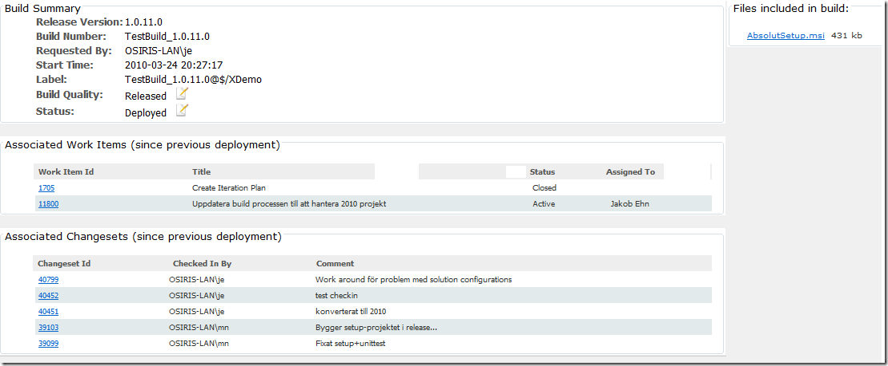
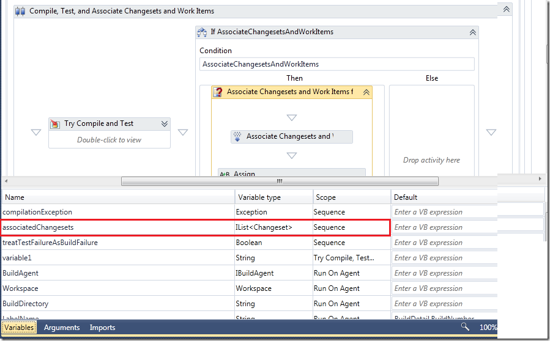
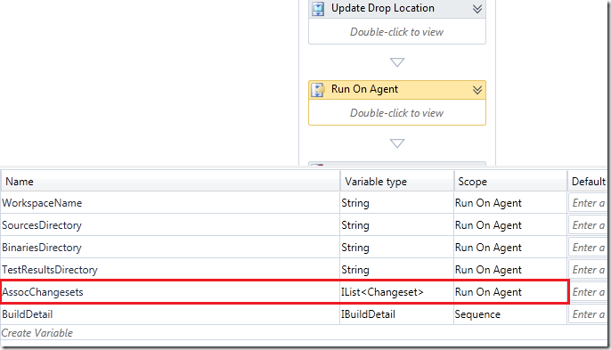
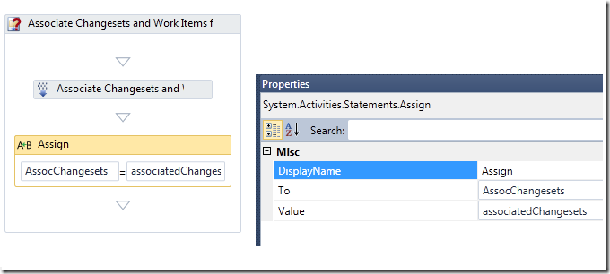

In TFS Team Build (all versions), each build is associated with changesets and work items. To determine which changesets that should be associated with the current build, Team Build finds the label of the “Last Good Build” an then aggregates all changesets up unitl the label for the current build. Basically this means that if your build is failing, every changeset that is checked in will be accumulated in this list until the build is successful.

All well, but there uis a dimension missing here, regarding to releases. Often you can run several release builds until you actually deploy the result of the build to a test or production system. When you do this, wouldn’t it be nice to be able to send the customer a nice release note that contain all work items and changeset since **the previously deployed version**?

At our company, we have developed a *Release Repository*, which basically is a siple web site with a SQL database as storage. Every time we run a Release Build, the resulting installers, zip-files, sql scripts etc, gets pushed into the release repositor together with the relevant build information. This information contains things such as start time, who triggered the build etc. Also, it contains the associated changesets and work items.

When deploying the MSI’s for a new version, we mark the build as *Deployed*in the release repository. The depoyed status is stored in the release repository database, but it could also have been implemented by setting the Build Quality for that build to Deployed.

When generating the release notes, the web site simple runs through each release build back to the previous build that was marked as Deplyed, and aggregates the work items and changesets:

Here is a sample screenshot on how this looks for a sample build/application

[](http://gwb.blob.core.windows.net/jakob/WindowsLiveWriter/ImplementingReleaseNotesinTFSTeamBuild20_C1AE/image_4.png)

The web site is available both for us and also for the customers and testers, which means that they can easily get the latest version of a particular application and at the same time see what changes are included in this version. \
There is a lot going on in the Release Build Process that drives this in our TFS 2010 server, but in this post I will show how you can access and read the changeset and work item information in a custom activity. \

Since Team Build associates changesets and work items for each build, this information is (partially) available inside the build process template. The **Associate Changesets and Work Items for non-Shelveset Builds** activity (located inside the **Try**  **Compile, Test, and Associate Changesets and Work Items** activity) defines and populates a variable called associatedWorkItems

[](http://gwb.blob.core.windows.net/jakob/WindowsLiveWriter/ImplementingReleaseNotesinTFSTeamBuild20_C1AE/image_6.png)

You can see that this variable is an IList containing instances of the [Changeset](http://msdn.microsoft.com/en-us/library/microsoft.teamfoundation.versioncontrol.client.changeset(VS.80).aspx) class (from the Microsoft.TeamFoundation.VersionControl.Client namespace). Now, if you want to access this variable later on in the build process template, you need to declare a new variable in the corresponding scope and the assign the value to this variable. In this sample, I declared a variable called assocChangesets in the RunAgent sequence, which basically covers the whol compile, test and drop part of the build process:

[](http://gwb.blob.core.windows.net/jakob/WindowsLiveWriter/ImplementingReleaseNotesinTFSTeamBuild20_C1AE/image_8.png)

Now, you need to assign the value from the AssociatedChangesets to this variable. This is done using the [Assign](http://msdn.microsoft.com/en-us/library/system.activities.statements.assign(VS.100).aspx) workflow activity:

[](http://gwb.blob.core.windows.net/jakob/WindowsLiveWriter/ImplementingReleaseNotesinTFSTeamBuild20_C1AE/image_10.png)

Now you can add a custom activity any where inside the RunAgent sequence and use this variable. **NB:** Of course your activity must place somewhere after the variable has been poplated. To finish off, here is code snippet that shows how you can read the changeset and work item information from the variable.

First you add an InArgumet on your activity where you can pass i the variable that we defined.

```
        [RequiredArgument]
        public InArgument<IList<Changeset>> AssociatedChangesets { get; set; }
```

Then you can traverse all the changesets in the list, and for each changeset use the **WorkItems** property to get the work items that were associated in that changeset:

```json
            foreach (Changeset ch in associatedChangesets)
            {
                // Add change
                theChangesets.Add(
                    new AssociatedChangeset(ch.ChangesetId,
                                            ch.ArtifactUri,
                                            ch.Committer,
                                            ch.Comment,
                                            ch.ChangesetId));

                foreach (var wi in ch.WorkItems)
                {
                        theWorkItems.Add(
                            new AssociatedWorkItem(wi["System.AssignedTo"].ToString(),
                                                   wi.Id,
                                                   wi["System.State"].ToString(),
                                                   wi.Title,
                                                   wi.Type.Name,
                                                   wi.Id,
                                                   wi.Uri));

                }
            }
```

***NB:** AssociatedChangeset* and *AssociatedWorkItem* are custom classes that we use internally for storing this information that is eventually pushed to the release repository.

---

## Comments

*Imported from the original WordPress site. Closed for new replies.*

> **Saravanan** — 21 Apr 2010
>
> Originally posted on: <http://geekswithblogs.net/jakob/archive/2010/04/15/implementing-release-notes-in-tfs-team-build-2010.aspx#516197>
>
> Can i display these changesets with all workitems as a formatted output ?

> **Founder** — 17 Nov 2010
>
> Originally posted on: <http://geekswithblogs.net/jakob/archive/2010/04/15/implementing-release-notes-in-tfs-team-build-2010.aspx#547992>
>
> Can u get also the complete workitem list for a certain iteration. To show all the open requirements or backlog items?

> **Mike Paterson** — 14 Dec 2010
>
> Originally posted on: <http://geekswithblogs.net/jakob/archive/2010/04/15/implementing-release-notes-in-tfs-team-build-2010.aspx#552290>
>
> Can we get the source code for this?

> **Mush** — 08 Jul 2011
>
> Originally posted on: <http://geekswithblogs.net/jakob/archive/2010/04/15/implementing-release-notes-in-tfs-team-build-2010.aspx#584885>
>
> Hi,\
> \
> Can we invoke this from tfs command line. currently we are not using the teambuild and use the cruisecontrol for continuous integration. we would like to generate a report between two releases which will list the changesets and teh workitems. Using the TF History, I could get the changesets and looking to get the workitems as well. Any help would be appreciated. Thanks.

> **Mush** — 11 Jul 2011
>
> Originally posted on: <http://geekswithblogs.net/jakob/archive/2010/04/15/implementing-release-notes-in-tfs-team-build-2010.aspx#585142>
>
> can you share the code for this implementation?

> **Thangarajan** — 30 Aug 2011
>
> Originally posted on: <http://geekswithblogs.net/jakob/archive/2010/04/15/implementing-release-notes-in-tfs-team-build-2010.aspx#591837>
>
> Could you please share source code for this?

> **Dharmesh Shah** — 26 Apr 2012
>
> Originally posted on: <http://geekswithblogs.net/jakob/archive/2010/04/15/implementing-release-notes-in-tfs-team-build-2010.aspx#612741>
>
> I really like idea of release repository but there are couple points that I would like to add here.\
> \
> 1. What will happen if people forgot to link WorkItems to a given changeset and the build was sucessful? Will this method miss out on such WorkItems which were linked at a later date?\
> \
> 2. Generally you have several levels of branches. i.e. Main branch >>> Integration Branch >>> Development Branch in a given hierarchy. Developers check-in against Tasks in development branch and then merge those changesets into integration branch against CR / User Story / Product Backlog Item / etc. In this case, you want to generate release report from Integration / Main branch based on merged changeset which are linked to given type of workitem.\
> \
> 3. Finally, different stakeholders / users / teams will be interested in different type of information. Build activity task generates "associated workitem" information but with limited amount of data in it. \
> \
> I would suggest you to try out an external application that can generate changelog / release notes automatically from TFS. You can find it at http://tfschangelog.codeplex.com/ \
> \
> TFSChangeLog application does not integrate with your automated build process (atleast not at this stage) but it can produce changelog on demand. One good thing about this application is that it does allow users to specify their changeset range (i.e. starting point and ending point within a given branch) and then it generates report by extranding changeset information and associated workitems information from the specified range. \
> \
> TFSChangeLogCL.exe is the command line interface to this very same functionality. You will have to pass in XML file as parameter which has TFS server, project, branch, FromChangeSet and EndChangeSet information. It can then generate output in XML and then transform it using XSLT 2.0 into HTML. \
> \
> TFSChangeLog is tested against TFS 2010 at this stage as it uses newly supported Branch Objects.\
> \
> Hope this will be useful for your projects.\
> \
> Best Regards,\
> Dharmesh Shah.\
