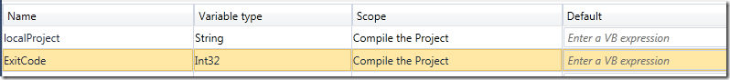
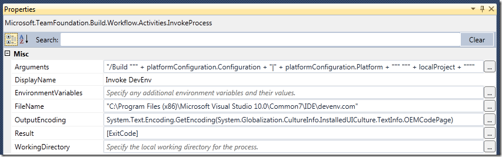
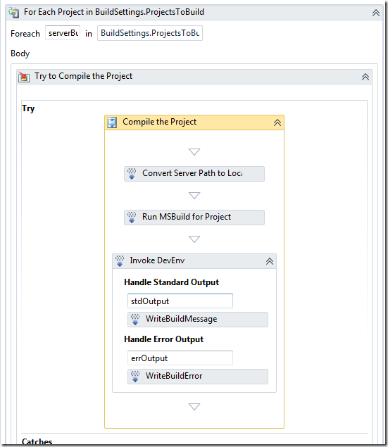
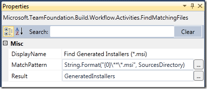
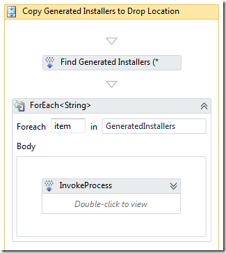

UPDATE: 2010-09-15 – Added details about the use of the ExitCode variable

One of the most common complaints from people starting to use Team Build is that is doesn’t support building Microsoft’s own Setup and Deployment project (*.vdproj). When creating a default build definition that compiles a solution containing a setup project, you’ll get the following warning:

*The project file "MyProject.vdproj" is not supported by MSBuild and cannot be built.*

This is what the problem is all about. MSBuild, that is used for compiling your projects, does not understand the proprietary vdproj format defined by Microsoft quite some time ago. Unfortunately there is no sign that this will change in the near future, in fact the setup projects has barely changed at all since they were introduced. VS 2010 brings no new features or improvements hen it comes to the setup projects.

VS 2010 **does** include a limited version of InstallShield which promises to be more MSBuild friendly and with more or less the same features as VS setup projects. I hope to get a closer look at this installer project type soon.

But, how do we go about to build a Visual Studio setup project and produce an MSI as part of a Team Build process? Well, since only one application known to man understands the vdproj projects, we will have to installa copy of Visual Studio on the build server. Sad but true. After doing this, we use the [Visual Studio command line interface](http://msdn.microsoft.com/en-us/library/xee0c8y7(v=VS.80).aspx) (devenv) to perform the build.

In this post I will show how to do this by using the InvokeProcess activity directly in a build workflow template. You’ll want to run build your setup projects after you have successfully compiled the projects.

1. Install Visual Studio 2010 on the build server(s) \
2. Open your build process template /remember to branch or copy the xaml file before modifying it!) \
3. Locate the *Compile the Project* activity \
4. Select the activity and open the *Variables* tab at the lower right \
5. Add a new variable called *ExitCode* of type Int32. This variable will contain the exit code from the devenv process and can be validated for errors. \
    \
6. Drop an instance of the *InvokeProcess* activity from the toolbox onto the designer, after the *Run MSBuild for Project* activity \
7. Drop an instance of the *WriteBuildMessage* activity inside the *Handle Standard Output* section.
   - Set the *Importance* property to Microsoft.TeamFoundation.Build.Client.BuildMessageImportance.High \
     (**NB:** This is necessary if you want the output from devenv to show up in the build log when running the build with the default verbosity)
   - Set the *Message* property to *stdOutput* \
8. Drop an instance of the *WriteBuildError* activity to the *Handle Error Output* section
   - Set the *Message* property to *errOutput* \
9. Select the InvokeProcess activity and set the values of the parameters to: \
     \
    Note that the Result is piped to the ExitCode variable. \
10. The finished workflow should look like this: \
      \
11. This will generate the MSI files, but they won’t be copied to the drop location. This is because we are using devenv and not MSBuild, so we have to do this explicitly \
12. Drop a *Sequence* activity somewhere after the Copy to Drop location activity. \
13. Create a variable in the Sequence activity of type *IEnumerable<String>* and call it *GeneratedInstallers* \
14. Drop a *FindMatchingFiles* activity in the sequence activity and set the properties to: \
      \
15. Drop a *ForEach<String>* activity after the FindMatchingFiles activity. Set the *Value* property to *GeneratedInstallers* \
16. Drop an *InvokeProcess* activity inside the ForEach activity.
    - *FileName:* *“xcopy.exe”*
    - *Arguments:* *String.Format("""{0}"" ""{1}""", item, BuildDetail.DropLocation) \
       \*
17. The Sequence activity should look like this: \
      \
18. Save the build process template and check it in. \
19. Run the build and verify that the MSI’s is built and copied to the drop location.

**Note 1:** One of the drawback of using devenv like this in a team build is that since all the output from the default compilations is placed in the *Binaries* folder, the outputs is not avaialable when devenv is invoked, which causes the whole solution to rebuild again. In TFS 2008, this was pretty simple to fix by using the *CustomizableOutDir* property. In TFS 2010, the same feature is not avaialble. Jim Lamb blogged about this recently, have a look at it if you have a problem with this: [http://blogs.msdn.com/jimlamb/archive/2010/04/13/customizableoutdir-in-tfs-2010.aspx](http://blogs.msdn.com/jimlamb/archive/2010/04/13/customizableoutdir-in-tfs-2010.aspx "http://blogs.msdn.com/jimlamb/archive/2010/04/13/customizableoutdir-in-tfs-2010.aspx")

**Note 2:** Although the above solution works, a better approach is to wrap this in a custom activity that you can use in your builds. I will come back to this in a future post.

---

## Comments

*Imported from the original WordPress site. Closed for new replies.*

> **Rob** — 06 Jul 2010
>
> Originally posted on: <http://geekswithblogs.net/jakob/archive/2010/05/14/building-visual-studio-setup-projects-with-tfs-2010-team-build.aspx#527045>
>
> I'm trying to follow these steps but I'm stuck on step 7. Alongside where I've entered [ExitCode] in the Result property there's a Compiler error stating: "Compiler error(s) encountered processing expression "[ExitCode]". 'ExitCode' is not declared. It may be inaccessible due to its protection level."\
> \
> Please help.

> **Steve** — 15 Jul 2010
>
> Originally posted on: <http://geekswithblogs.net/jakob/archive/2010/05/14/building-visual-studio-setup-projects-with-tfs-2010-team-build.aspx#528299>
>
> I have created a build agent on another server so I can take the load off compiling on the TFS Server itself. I guess I need to install VS 2010 on the Build Server to get my applications to compile correctly. You mentioned installing VS 2010 on the build server, but what edition did you end up installing. I am cheap, I want to install the least expensive edition that I can. Can I install the Shell and get by with that?

> **eswar** — 28 Jul 2010
>
> Originally posted on: <http://geekswithblogs.net/jakob/archive/2010/05/14/building-visual-studio-setup-projects-with-tfs-2010-team-build.aspx#530094>
>
> excellent.\
> can you give an example or a step by step procedure of how to proceed ,for the same scenario?\
> Appreciate your help!\
> \
> Thanks,\
> eswar

> **Jeremy** — 01 Aug 2010
>
> Originally posted on: <http://geekswithblogs.net/jakob/archive/2010/05/14/building-visual-studio-setup-projects-with-tfs-2010-team-build.aspx#531143>
>
> Thanks for the article, very well laid out and very helpful!\
> \
> I get the same problem as Rob at step #7. If i just leave that field blank, though, instead of putting "[ExitCode]" in there then everything seems to work fine. I'm curious if I even need to do anything about it.\
> \
> Also, on a side note, it seems to expect VB code in all the configuration properties. Is there an option somewhere to make it use C# ?\
> \
> Thanks,\
> Jeremy

> **Chris** — 04 Aug 2010
>
> Originally posted on: <http://geekswithblogs.net/jakob/archive/2010/05/14/building-visual-studio-setup-projects-with-tfs-2010-team-build.aspx#531563>
>
> Thanks for the help, I managed to get this working, *except* that when the devenv command runs on the build server, the following error is logged. Package 'Microsoft.VisualStudio.TestTools.TestCaseManagement.QualityToolsPackage, Microsoft.VisualStudio.QualityTools.TestCaseManagement, Version=10.0.0.0, Culture=neutral, PublicKeyToken=b03f5f7f11d50a3a' failed to load.\
> \
> Any ideas, can provide more info if necessary.

> **Rudi** — 18 Aug 2010
>
> Originally posted on: <http://geekswithblogs.net/jakob/archive/2010/05/14/building-visual-studio-setup-projects-with-tfs-2010-team-build.aspx#533667>
>
> I was able to solve The package load failure by just using the arguments: "/Build " + localProject on the InvokeProcess activity

> **Rudi** — 18 Aug 2010
>
> Originally posted on: <http://geekswithblogs.net/jakob/archive/2010/05/14/building-visual-studio-setup-projects-with-tfs-2010-team-build.aspx#533685>
>
> addendum: switching to devenv.exe did the trick.

> **Jakob Ehn** — 14 Sep 2010
>
> Originally posted on: <http://geekswithblogs.net/jakob/archive/2010/05/14/building-visual-studio-setup-projects-with-tfs-2010-team-build.aspx#537886>
>
> All: i have updated the post with the details about the ExitCode variable, sorry for that. Note that in this example I do not actually check the variable afterwards. Do this by adding an If- or Switch activity after the InvokeProcess activity.

> **Kenn** — 21 Sep 2010
>
> Originally posted on: <http://geekswithblogs.net/jakob/archive/2010/05/14/building-visual-studio-setup-projects-with-tfs-2010-team-build.aspx#539311>
>
> Absolutely brilliant, this little article solved several issues that the MS documentation was useless for.\
> \
> Thanks!

> **Rob** — 28 Sep 2010
>
> Originally posted on: <http://geekswithblogs.net/jakob/archive/2010/05/14/building-visual-studio-setup-projects-with-tfs-2010-team-build.aspx#540257>
>
> Excellent post, very helpful. The trouble is I also have the QualityTools.TestCaseManagement issue mentioned above by Chris.\
> \
> I think Rudi's solution above is a red herring, it actually results in devenv failing but it doesn't fail the build so it looks like the build has passed (check the log).\
> \
> I think the issue is that I'm using VS2010 Premium instead of Ultimate and that the QualityTools.TestCaseManagement.DLL is failing to load because the LoadTest.DLL file isn't installed (I'm not trying to do Load Testing btw).\
> \
> Does anyone have a solution to this problem?\
> \
> I'm currently participating in a thread on it, but we don't seem to be getting anywhere, over here: http://social.msdn.microsoft.com/Forums/en-US/tfsbuild/thread/cbfb80ed-0c8f-4f2a-889c-635ccca9db8c/

> **Rob** — 09 Nov 2010
>
> Originally posted on: <http://geekswithblogs.net/jakob/archive/2010/05/14/building-visual-studio-setup-projects-with-tfs-2010-team-build.aspx#546646>
>
> The issue I mentioned above seems to be resolved by using devenv.exe instead of devenv.com\
> \
> If you know of or find a problem with this method then please, please, please post a comment on the MSDN thread mentioned in my above comment.

> **MattC** — 02 Dec 2010
>
> Originally posted on: <http://geekswithblogs.net/jakob/archive/2010/05/14/building-visual-studio-setup-projects-with-tfs-2010-team-build.aspx#550463>
>
> This is very good and helpful but I still have a problem. I'm using devenv to build some non-Microsoft compiler projects (e.g., C, Fortran) that MSBuild can't handle. I see the logged output and in some cases I see errors (e.g., no such source file), but the devenv errors don't seem to come in as error output so the TFS build says no errors (even though the devenv log clearly shows compile and link errors). What are people doing for this?

> **Rob** — 15 Dec 2010
>
> Originally posted on: <http://geekswithblogs.net/jakob/archive/2010/05/14/building-visual-studio-setup-projects-with-tfs-2010-team-build.aspx#552638>
>
> MattC, see Jakob's post from 9/21/2010 7:17 PM\
> \
> I think you'll need to check the ExitCode variable and then raise errors accordingly. Does that help?

> **Nachiket** — 23 Dec 2010
>
> Originally posted on: <http://geekswithblogs.net/jakob/archive/2010/05/14/building-visual-studio-setup-projects-with-tfs-2010-team-build.aspx#554115>
>
> Thanks for such a comprehensive post. I am able to get the .msi's but I am unable to get the dll's which are a result of building this project... I have tried to copy the ExitCode at some location but I found no success... can you please help me through this.

> **Senthilraj** — 11 Jan 2011
>
> Originally posted on: <http://geekswithblogs.net/jakob/archive/2010/05/14/building-visual-studio-setup-projects-with-tfs-2010-team-build.aspx#557413>
>
> This is a good work around. \
> But as a permanent solution if you share an article/steps how to leverage the free install shield version comes with VS2010 it will be more help ful..\

> **Sonali Noolkar** — 15 Feb 2011
>
> Originally posted on: <http://geekswithblogs.net/jakob/archive/2010/05/14/building-visual-studio-setup-projects-with-tfs-2010-team-build.aspx#562867>
>
> Hi,\
> \
> I tried these steps to build the .vdproj. Unfortunately, no msi's are generated/copied to the drop folder.\
> I've checked in the process template after making changes.\
> Can you guide..what could be wrong?

> **Jakob Ehn** — 15 Feb 2011
>
> Originally posted on: <http://geekswithblogs.net/jakob/archive/2010/05/14/building-visual-studio-setup-projects-with-tfs-2010-team-build.aspx#562869>
>
> Sonali: Make sure that you are building the solution configuration that contains the setup project. By default, this is the Release configuration, but it might be different in your setup. Otherwise, run the build in diagnostic mode and check the log for details

> **Sonali Noolkar** — 21 Feb 2011
>
> Originally posted on: <http://geekswithblogs.net/jakob/archive/2010/05/14/building-visual-studio-setup-projects-with-tfs-2010-team-build.aspx#563887>
>
> Thanks Jakob for the reply.\
> \
> The solution file contains the setup project. The issue was that I had space in the folder name in TFS. enclosed the variable localproject in queotes like ...+ """" + localProject + """" and it worked.\
> \
> However I am getting below errors:\
> C:Program Files (x86)Microsoft Visual Studio 10.0Common7IDEdevenv.com /Build Debug "D:Builds5AO SDMC.NETWebApplicationStarterKit4_CISourcesWebApplication.sln"\
>  \
>  Microsoft (R) Visual Studio Version 10.0.30319.1.\
>  Copyright (C) Microsoft Corp. All rights reserved.\
>  \
>  Package 'Microsoft.VisualStudio.TestTools.TestCaseManagement.QualityToolsPackage, Microsoft.VisualStudio.QualityTools.TestCaseManagement, Version=10.0.0.0, Culture=neutral, PublicKeyToken=b03f5f7f11d50a3a' failed to load.\
>  \
>  Package 'Microsoft.VisualStudio.TestTools.TestCaseManagement.QualityToolsPackage, Microsoft.VisualStudio.QualityTools.TestCaseManagement, Version=10.0.0.0, Culture=neutral, PublicKeyToken=b03f5f7f11d50a3a' failed to load.\
> \
> Also there are 4 other errors with no message associated.\
> \
> Can you please guide for these unknown errors?

> **Sumit** — 24 Feb 2011
>
> Originally posted on: <http://geekswithblogs.net/jakob/archive/2010/05/14/building-visual-studio-setup-projects-with-tfs-2010-team-build.aspx#564642>
>
> Jakob,\
> It looks like I am missing something. Would you please let me know the parameters to be passed as part of MSBuild argument? \
> \
> I am trying to get the msi deployed onto destination server from TFS.

> **Maciej Wolniewicz** — 04 Mar 2011
>
> Originally posted on: <http://geekswithblogs.net/jakob/archive/2010/05/14/building-visual-studio-setup-projects-with-tfs-2010-team-build.aspx#566200>
>
> Hi,\
> \
> at the begining, thanks for the post, it helped me a lot.\
> \
> I got similar problem with "Package 'Microsoft.VisualStudio.TestTools.TestCaseManagement.QualityToolsPackage, Microsoft.VisualStudio.QualityTools.TestCaseManagement, Version=10.0.0.0, Culture=neutral, PublicKeyToken=b03f5f7f11d50a3a' failed to load.". \
> \
> I resolved it by changing devenv.com to devenv.exe in path to visual studio.\
> \
> Hope this will help somebody.\
> \
> Best regards,\
> Maciej

> **Dave** — 18 Mar 2011
>
> Originally posted on: <http://geekswithblogs.net/jakob/archive/2010/05/14/building-visual-studio-setup-projects-with-tfs-2010-team-build.aspx#569026>
>
> I came across a fairly simple way to have the output of each project end up in their respective bin/[configuration] so that when compiling the .vdproj, the entire solution is not rebuilt. In step 10 listed above, find "Run MSBuild for Project". Select this activity, and in the properties window, clear the property OutDir. This will enable the normal OutputPath of project. However, none of the output files will be copied to the Binaries directory and will then not end up in the drop folder. There will be a warning about in the tfs build log. However, what you will see in the drop folder is the log file and the .msi/.exe, depending on which files were specified to be copied over the drop folder in step 14 when defining the "Find generated installers" activity.

> **Nate** — 22 Mar 2011
>
> Originally posted on: <http://geekswithblogs.net/jakob/archive/2010/05/14/building-visual-studio-setup-projects-with-tfs-2010-team-build.aspx#569660>
>
> I can't figure out where the Copy to Drop activity is... Maybe I am just blind. Is it possible that the label is something else? Also, could you tell me what high-level parent this is supposed to be in?

> **Paresh** — 24 Mar 2011
>
> Originally posted on: <http://geekswithblogs.net/jakob/archive/2010/05/14/building-visual-studio-setup-projects-with-tfs-2010-team-build.aspx#570075>
>
> Hi Jakob,\
> \
> Thanks for the post. It is really helpful. I have a couple of questions though:\
> \
> (1) Regarding the ExitCode variable, I'm still not quite sure with what condition should I use with a If or switch because I'm getting "Compiler error(s) encountered processing expression "[ExitCode]". 'ExitCode' is not declared. It may be inaccessible due to its protection level." error.\
> (2) Also, I'm getting the same error for localProject. \
> \
> I would really appreciate if you could help me fix these errors. I'm new to MSBuild 4.0.\
> \
> Thanks a ton,\
> Paresh\

> **Paresh** — 26 Mar 2011
>
> Originally posted on: <http://geekswithblogs.net/jakob/archive/2010/05/14/building-visual-studio-setup-projects-with-tfs-2010-team-build.aspx#570464>
>
> Hi Jakob,\
> \
> I'm still waiting for your response on the two queries I have above. Please please help me, its real urgent.\
> \
> Can anyone else help me out please?\
> \
> Thanks a ton,\
> Paresh

> **Jakob Ehn** — 29 Mar 2011
>
> Originally posted on: <http://geekswithblogs.net/jakob/archive/2010/05/14/building-visual-studio-setup-projects-with-tfs-2010-team-build.aspx#570865>
>
> @Paresh: Sorry for the late answer. \
> \
> If you can't reference a workflow variable (such as localProject), the reason is usually that you the variable is not in the current scope. localProject is declared inside the "Compile the Project" sequence activity,\
> which means that you can only reference the variable within that activity.\
> \
> Reagarding the ExitCode variable, have you added the variable to the "Compile the Project" sequence activity (Step 5 above). If so, you should be able to reference the variable later in the same scope.\

> **eric** — 21 Apr 2011
>
> Originally posted on: <http://geekswithblogs.net/jakob/archive/2010/05/14/building-visual-studio-setup-projects-with-tfs-2010-team-build.aspx#574955>
>
> Hi Jakob,\
> \
> I'm still waiting for your response on the two queries I have above. Please please help me, its real urgent.\
> \
> Can anyone else help me out please?\
> \
> [folding mountain bike](http://challengerlc.org/category/folding-mountain-bike)

> **Rami** — 03 Jul 2011
>
> Originally posted on: <http://geekswithblogs.net/jakob/archive/2010/05/14/building-visual-studio-setup-projects-with-tfs-2010-team-build.aspx#584248>
>
> Hi. I have some problems. I think that I misunderstood some section. \
> Until section 11 you describe how to create msi, but where can I find created files?\
> In section 12 you wrote drop a sequence somewhere after "copy to drop", but where should I find "copy to drop" sequence? Where do you mean by "somewhere"?\

> **Mush** — 25 Jul 2011
>
> Originally posted on: <http://geekswithblogs.net/jakob/archive/2010/05/14/building-visual-studio-setup-projects-with-tfs-2010-team-build.aspx#587360>
>
> Hi,\
> \
> I have configured the TFS system in my client Win 7 machine and the MSIs are not getting built and the error is showing as "These files could not be found and will not be loaded.\
> The operation could not be completed". I modified the argument for devenv as String.Format("{0} /build {1}|{2}", localProject, platformConfiguration.Configuration, platformConfiguration.Platform) as the argument shown in this article was showing error to "use devenv [solutionfile | projectfile | anyfile.ext] [switches]""\
> \
> When I invoke the command from console it builds the MSI But not from the Teambuild system.\
> \
> Please let me know what could be the error.\
> \
> Earlier I was always

> **Mush** — 25 Jul 2011
>
> Originally posted on: <http://geekswithblogs.net/jakob/archive/2010/05/14/building-visual-studio-setup-projects-with-tfs-2010-team-build.aspx#587373>
>
> Hi - \
> \
> When I removed the build configurations, the error is not shown and the project is getting built, but throws error related to DLL reference path. Please elt me know the best way to fix this.

> **GratefulCoder** — 08 Aug 2011
>
> Originally posted on: <http://geekswithblogs.net/jakob/archive/2010/05/14/building-visual-studio-setup-projects-with-tfs-2010-team-build.aspx#589118>
>
> Thank you! this is exactly what I was looking for and your steps are very detailed!

> **Jas** — 17 Aug 2011
>
> Originally posted on: <http://geekswithblogs.net/jakob/archive/2010/05/14/building-visual-studio-setup-projects-with-tfs-2010-team-build.aspx#590106>
>
> Whole solution is getting copied into the sources folder but i fo not see the compiled files under bin folder...

> **Jas** — 17 Aug 2011
>
> Originally posted on: <http://geekswithblogs.net/jakob/archive/2010/05/14/building-visual-studio-setup-projects-with-tfs-2010-team-build.aspx#590112>
>
> I found the problem. I was trying to build a business intelligence solution. For some reason it does not like to specify the project configuration.I set it as default. But how can i specify the solution and the project to build inside a single build definition?\

> **TJ** — 23 Aug 2011
>
> Originally posted on: <http://geekswithblogs.net/jakob/archive/2010/05/14/building-visual-studio-setup-projects-with-tfs-2010-team-build.aspx#590813>
>
> Xcopy does not work when a build is scheduled in TFS 2010\

> **Amanda** — 13 Sep 2011
>
> Originally posted on: <http://geekswithblogs.net/jakob/archive/2010/05/14/building-visual-studio-setup-projects-with-tfs-2010-team-build.aspx#593623>
>
> I'm trying to follow these steps but I'm stuck on step 16. Returned message is saying: 'Item' is a type and cannot be used as an expression.

> **Gandalf** — 05 Oct 2011
>
> Originally posted on: <http://geekswithblogs.net/jakob/archive/2010/05/14/building-visual-studio-setup-projects-with-tfs-2010-team-build.aspx#596027>
>
> This is just awesome!\
> \
> For those wondering where to find the "Copy To Drop" activity, this is where I found it\
> Run On Agent-->Try Compile, Test...(Finally Block)-->Revert Workspace and Copy Files to Drop Location\
> \
> Cheers!

> **Bill** — 07 Oct 2011
>
> Originally posted on: <http://geekswithblogs.net/jakob/archive/2010/05/14/building-visual-studio-setup-projects-with-tfs-2010-team-build.aspx#596206>
>
> This is awesome!\
> \
> I do have a few questions though. I have implemented this for one of our projects and it was successfully building the MSI files and copying them, however it has stopped working. Any ideas on how to update this to handle any potential errors?\
> \
> The MSI files doesn't seem to be generated by the invoking of DevEnv. However when we build manually on TFS machine running DevEnv the MSI file is found in the release folder for our setup project. Any ideas?

> **Jakob Ehn** — 10 Oct 2011
>
> Originally posted on: <http://geekswithblogs.net/jakob/archive/2010/05/14/building-visual-studio-setup-projects-with-tfs-2010-team-build.aspx#596375>
>
> @Bill: Make sure that you are building the correct solution configuration, e.g. Release|Any CPU for example, and that this configuration includes the setup project. Otherwise you need to check the output from devenv, run the build with diagnostic verbosity and examine the output from devenv

> **james** — 11 Oct 2011
>
> Originally posted on: <http://geekswithblogs.net/jakob/archive/2010/05/14/building-visual-studio-setup-projects-with-tfs-2010-team-build.aspx#596556>
>
> great post, one of the few on tfs 2010

> **Lin** — 13 Oct 2011
>
> Originally posted on: <http://geekswithblogs.net/jakob/archive/2010/05/14/building-visual-studio-setup-projects-with-tfs-2010-team-build.aspx#596773>
>
> Hi there,\
> for step 13, i couldn't find type "IEnumerable" from the dropdown window to create the variable. am i missing some assamplies?\
> thanks!

> **J. Meyer** — 17 Oct 2011
>
> Originally posted on: <http://geekswithblogs.net/jakob/archive/2010/05/14/building-visual-studio-setup-projects-with-tfs-2010-team-build.aspx#597007>
>
> Which edition of Visual Studio is needed on the build system?\
> Does the Express Edition also work?

> **Darren** — 01 Nov 2011
>
> Originally posted on: <http://geekswithblogs.net/jakob/archive/2010/05/14/building-visual-studio-setup-projects-with-tfs-2010-team-build.aspx#598510>
>
> For xcopy failing on scheduled builds, check permissions for the Build Service account on the sourcecode folder (e.g. C:Builds). I use the Network Service account and so gave Full Control to Network Service on C:Builds. The scheduled build was then successful.

> **Ransch** — 11 Nov 2011
>
> Originally posted on: <http://geekswithblogs.net/jakob/archive/2010/05/14/building-visual-studio-setup-projects-with-tfs-2010-team-build.aspx#599634>
>
> Lin\
> The IEnumerable is found by; Browse for types. find IEnumerable. Then there will be a combo slection allowing you to change the 't' to String.\
> Now when you select OK it will fill that cell and there will be an additional entry for that cell that will be "system.collections.generic.ienumerable<System.String>\
> \
> Randy

> **Philip Ammann** — 09 Dec 2011
>
> Originally posted on: <http://geekswithblogs.net/jakob/archive/2010/05/14/building-visual-studio-setup-projects-with-tfs-2010-team-build.aspx#602318>
>
> Can you post the xaml file you used for this project?\

> **Ken** — 19 Mar 2012
>
> Originally posted on: <http://geekswithblogs.net/jakob/archive/2010/05/14/building-visual-studio-setup-projects-with-tfs-2010-team-build.aspx#610523>
>
> It worked great for me. However,as a side note, I did run into a problem with just building it in a command prompt on the build server. Turns out there is a hot fix for this for Visual studio 2010: https://connect.microsoft.com/VisualStudio/Downloads/DownloadDetails.aspx?DownloadID=30681

> **Vilas Tajane** — 10 Jul 2012
>
> Originally posted on: <http://geekswithblogs.net/jakob/archive/2010/05/14/building-visual-studio-setup-projects-with-tfs-2010-team-build.aspx#616249>
>
> Looking assistance for build/automate process in TFS2010. Is there any article shows end -end process which will help to setup the project.

> **DL** — 12 Jul 2012
>
> Originally posted on: <http://geekswithblogs.net/jakob/archive/2010/05/14/building-visual-studio-setup-projects-with-tfs-2010-team-build.aspx#616444>
>
> Works great. The only issue I have is that it's creating setups for each referenced project in the solution (that have setups defined) such as webservices. Not a big deal, I'm working on modifying the template to build the setup for a specific project within the solution.

> **Balu** — 09 Oct 2012
>
> Originally posted on: <http://geekswithblogs.net/jakob/archive/2010/05/14/building-visual-studio-setup-projects-with-tfs-2010-team-build.aspx#619999>
>
> Hey there, thanks for the great article! It worked like charm! Let me suggest two small improvements (hopefully I did not overlooked some in the other comments): \
> 1) It would be really great if you could show up the path to the activities mentioned in the article, I have searched some time to find \
> (Compile the Project = Process -> Sequence -> Run on Agent -> Try Compile, Test... -> Sequence -> Compile, Test, an... -> \
> Try Compile and Test -> Compile and Test -> For Each Configur... -> Compile and Test ... -> \
> If BuildSettings.HasProjectsTo -> For Each Proejct in BuildSettin… -> Try to Compile the Project -> Compile the Project)\
> 2) If you set an relative "Output file name" on the setup project properties you can skip steps 12-17 because the msi file will be automatically build to the right location and is included in the normal Copy to Drop Location. \
> I am not pretty sure with the 2) improvement because I already modified the template slightly concerning source and binary directory but if someone could try it would be a pleasure!\
> \
> Anyway great job and thanks for the solution! Hopefully we can get this working also in VS & TFS 2012 where deployment project type is kicked out completely!\
> Best Regards\
> Balu\
> \

> **valyas** — 21 Jun 2013
>
> Originally posted on: <http://geekswithblogs.net/jakob/archive/2010/05/14/building-visual-studio-setup-projects-with-tfs-2010-team-build.aspx#630331>
>
> Thanks for the very helpful article with clear explanations!\
> Though, I got a problem :(\
> \
> The VS2010 is installed on the Build Server, but when running the build (all steps as described above OK, modified the devenv.exe path for real one on the build server), I get the error:\
> \
> "File not found: C:Porgram FilesMicrosoft Visual Studio 10.0Common7IDEdevenv.com"\
> \
> (The file is there, I've checked)\
> Does any body know why and how to fix it?\
> \
> Thanks,\
> ValyaS

> **Rama** — 04 Aug 2013
>
> Originally posted on: <http://geekswithblogs.net/jakob/archive/2010/05/14/building-visual-studio-setup-projects-with-tfs-2010-team-build.aspx#631190>
>
> Thanks a lot! It was beautiful to see this work at my end :-) I thought I was dead in the water.

> **Kedar** — 06 Sep 2013
>
> Originally posted on: <http://geekswithblogs.net/jakob/archive/2010/05/14/building-visual-studio-setup-projects-with-tfs-2010-team-build.aspx#631830>
>
> i followed all the steps. But vdproj is not build with devenv. It is building with MSBuild and gives a warning and showing build is partially succeeded. So can you please help me to resolve the problem

> **Arturo** — 12 Sep 2013
>
> Originally posted on: <http://geekswithblogs.net/jakob/archive/2010/05/14/building-visual-studio-setup-projects-with-tfs-2010-team-build.aspx#631969>
>
> I have problems in the 14 step, when setting the SourceDirectory variable, this appear unavailable.\
> \
> Any know why i can't set this variable?\
> \
> Thanks

> **aujong** — 18 Nov 2013
>
> Originally posted on: <http://geekswithblogs.net/jakob/archive/2010/05/14/building-visual-studio-setup-projects-with-tfs-2010-team-build.aspx#633724>
>
> Thank you for the post. It works great.\
> But, is there a way to increase the setup project Version number (and change the Product code ? Without it, if I try to install the installer, I get the error “Another version of this product is already installed. Installation of this version cannot continue. To configure or remove the existing version of this product, use Add/Remove programs on the control panel.”

> **Jakob Ehn** — 18 Nov 2013
>
> Originally posted on: <http://geekswithblogs.net/jakob/archive/2010/05/14/building-visual-studio-setup-projects-with-tfs-2010-team-build.aspx#633725>
>
> @Aujong: You have to add another activity to do that. There is no out of the box though for do that so you have to write your own that increases the version number in the vdproj and also changes the product code.

> **Chinnu** — 29 Nov 2013
>
> Originally posted on: <http://geekswithblogs.net/jakob/archive/2010/05/14/building-visual-studio-setup-projects-with-tfs-2010-team-build.aspx#633976>
>
> Hi,\
> \
> I have the setup project containing the solution build in VS 2010.\
> I have setup the Workflow template as per the steps mentioned above and only issue im facing while building the project is File not found for devenv.exe. VS 2010 is not installed in the Build server but VS 2012 is installed. Can i give the devenv path of 2012? I tried giving that path also but giving the same exception as File Not Foud. Please help

> **Jakob Ehn** — 29 Nov 2013
>
> Originally posted on: <http://geekswithblogs.net/jakob/archive/2010/05/14/building-visual-studio-setup-projects-with-tfs-2010-team-build.aspx#633988>
>
> @Chinnu: Yes, just change the path to 11.0 instead of 10.0 and it should work just fine\
> \
> /Jakob

> **Chinnu** — 04 Dec 2013
>
> Originally posted on: <http://geekswithblogs.net/jakob/archive/2010/05/14/building-visual-studio-setup-projects-with-tfs-2010-team-build.aspx#634057>
>
> Hi Jakob,\
> \
> Thanks for the input. Build is working fine.\
>  But it seems like MSI is not found in the dropped location. do we need to build the.vdproj [msi project] in Process tab in the build definition. or Only building the solution will work. since solution contains two projects one which creates exe and another msi. i have modified the solution configuration for this solution by checking that Build option for vdproj project. \
> but ended in a warning saying that .vdproj is not supported by MSBuild and cannot be built.

> **Prashant** — 07 Feb 2014
>
> Originally posted on: <http://geekswithblogs.net/jakob/archive/2010/05/14/building-visual-studio-setup-projects-with-tfs-2010-team-build.aspx#635517>
>
> Hi All, I have a question.... Do the server hosting the TFS Server 2012 also needs to have VS2005 installed for providing "devenv.exe" path for invoke method? Also, can you please let me know how to get the reports that are part of the project be included in the build

> **Prashant** — 11 Feb 2014
>
> Originally posted on: <http://geekswithblogs.net/jakob/archive/2010/05/14/building-visual-studio-setup-projects-with-tfs-2010-team-build.aspx#635578>
>
> Hi,\
> Can you please let me know how can i build projects created in VS2005?\
> Also, if possible please let me know exactly where can i find the step 3 details, as i am not able to find it in the default.xaml file that is been used

> **zuzu** — 20 Feb 2014
>
> Originally posted on: <http://geekswithblogs.net/jakob/archive/2010/05/14/building-visual-studio-setup-projects-with-tfs-2010-team-build.aspx#635722>
>
> Thank you for the detailed steps above. However, I am getting a compile error saying: Compile error(s) encountered processing expression "GeneratedInstallers". 'String' cannot be converted to 'System.Collections.Generic.IEnumerable(Of String)' because 'Char' is not derived from 'String', as required for the 'Out' generic parameter 'T' in 'Interface IEnumerable(Of Out T)'. \
> Please let me know how this can be fixed.

> **Jakob Ehn** — 20 Feb 2014
>
> Originally posted on: <http://geekswithblogs.net/jakob/archive/2010/05/14/building-visual-studio-setup-projects-with-tfs-2010-team-build.aspx#635723>
>
> @zuzu: You probably have used the wrong variable type for the GeneratedInstallers variable. Make sure that you use IEnumerable for this variable, since that is what the FindMatchingFiles activity returns\
> \
> /Jakob

> **zuzu** — 20 Feb 2014
>
> Originally posted on: <http://geekswithblogs.net/jakob/archive/2010/05/14/building-visual-studio-setup-projects-with-tfs-2010-team-build.aspx#635727>
>
> Thank very much for your quick response. How do i select this option? When I create variable "GeneratedInstallers", the IEnumerable is not an option in the drop down window. I have String, Int32, etc...

> **Jakob Ehn** — 21 Feb 2014
>
> Originally posted on: <http://geekswithblogs.net/jakob/archive/2010/05/14/building-visual-studio-setup-projects-with-tfs-2010-team-build.aspx#635735>
>
> @zuzu: You need to select the browse button that allows you to select any type that is currenty referenced. Browse to the IEnumerable type and the select string as the parameterized type\
> \
> /Jakob

> **B.Y. Pang** — 02 May 2014
>
> Originally posted on: <http://geekswithblogs.net/jakob/archive/2010/05/14/building-visual-studio-setup-projects-with-tfs-2010-team-build.aspx#637475>
>
> With 2013 supporting setup project, can the same procedure work for 2013 TFS? Thank you very much.\
