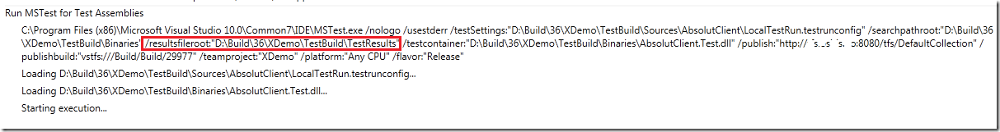

I still see people complaining about the long time it takes to load test results from a TFS build in Visual Studio. And they make a valid point, it **does** take a very long time to load the test results, even for a small number of tests. The reason for this is that the test results is not just the result of the test run but also all the binaries that were part of the test run. This often also means that the debug symbols (*.pdb) will be downloaded to your local machine. This reason for this behaviour is that it letsyou re-run the tests locally.

However, most of the times this is not what the developer will do, they just want to know which tests failed and why. They can then fix the tests and rerun them locally. It turns out there is a way to load **only** the test results, which is much faster. The only tricky bit is to find the location of the .trx file that is generated during the build. Particularly in TFS 2010 where you often have multiple build agents, which of corse results in different paths to the trx file. \
**Note:** To use this you must have read permission to the build folder on the build agent where the build was executed.

1. Open the build result for the build \
2. Click *View Log* \
3. Locate the part where MSTest is invoked. When using test containers, it looks like this: \
     \
   **Note:** You can actually search in the log window, press Ctrl+F and you will get a little search box at the bottom. Nice! \
4. On the MSTest command line call, locate the /*resultsfileroot* parameter, which points to the folder where the test results are stored \
5. Note that this path is local for the build server, so you need to replace the drive letter with the server name: \
   `D:\Builds\Project\TestResults` \
   to \
   `\\<BuildServer>\Builds\Project\TestResults`
6. Double-click on the .trx file and you will notice that it loads much faster compared to opening it from the build log window

---

## Comments

*Imported from the original WordPress site. Closed for new replies.*

> **Ross Johnston** — 25 May 2010
>
> Originally posted on: <http://geekswithblogs.net/jakob/archive/2010/05/09/speed-up-loading-of-test-results-from-builds-in-visual.aspx#521170>
>
> Hi Jakob, thanks for the tip. But just to make sure I understand how it works, this will only work for the latest build right? You can't use this workaround to load test results for previous builds right?\
> \
> Because the TestResults folder on the build machine will be deleted and recreated for each build run.\
> \
> Thanks,\
> Ross

> **Jakob Ehn** — 28 May 2010
>
> Originally posted on: <http://geekswithblogs.net/jakob/archive/2010/05/09/speed-up-loading-of-test-results-from-builds-in-visual.aspx#521603>
>
> Ross: That is correct, it only works for the latest test run.
