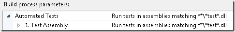
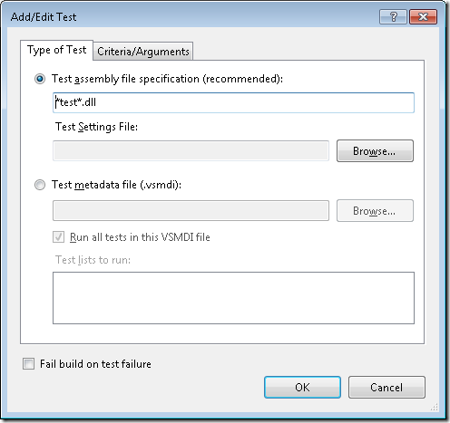

Recently I’ve come across this error a couple of times when running builds that exeucte unit tests using Test containers:

***API restriction: The assembly 'file:///C:Builds<path>myassembly.dll' has already loaded from a different location. It cannot be loaded from a new location within the same appdomain.***

Every time I’ve got this error, the project has been a web application, and the path to the assembly points down to the _PublishedWebsites directory that is created beneath the Binaries folder during a team build.

The error description really says it all (although slightly cryptic), when using test containers, MSTest needs to load all assemblies and see if they contain any unit tests. During this serach, it finds the ‘myassembly.dll’ in two different locations. First it is found directly beneth the Binaries folder, and then it is alos found beneath the _PublishedWebsitesProjectbin folder. The reason is that the default setting for test containers in a TFS 2010 build definition is *****test*.dll**:

This pattern means that MSTest will search recursively for all assemblies beneath the Binaries folder, and during the search it will find the MyAssembly.dll twice. \
The solution is simple, set the Test assembly file specification property to **test*.dll* instead, this will disable the recursive search:

---

## Comments

*Imported from the original WordPress site. Closed for new replies.*

> **afsharm** — 08 Jun 2010
>
> Originally posted on: <http://geekswithblogs.net/jakob/archive/2010/06/08/tfs-2010-build-dealing-with-the-api-restriction-error.aspx#523278>
>
> It worked for me. tnks!

> **Afshar Mohebbi** — 17 Aug 2010
>
> Originally posted on: <http://geekswithblogs.net/jakob/archive/2010/06/08/tfs-2010-build-dealing-with-the-api-restriction-error.aspx#533545>
>
> Thanks Jakob. Your solution solved my problem too. I had a web project named "WebTest" that contained no unit test.

> **Suneel** — 31 Aug 2010
>
> Originally posted on: <http://geekswithblogs.net/jakob/archive/2010/06/08/tfs-2010-build-dealing-with-the-api-restriction-error.aspx#535636>
>
> Thanks for the solution. it worked...:)

> **Vijay** — 27 Oct 2010
>
> Originally posted on: <http://geekswithblogs.net/jakob/archive/2010/06/08/tfs-2010-build-dealing-with-the-api-restriction-error.aspx#544810>
>
> Thanks. It solved my problem too.

> **archpulse** — 26 Nov 2010
>
> Originally posted on: <http://geekswithblogs.net/jakob/archive/2010/06/08/tfs-2010-build-dealing-with-the-api-restriction-error.aspx#549367>
>
> Jakob's post helped me look at the right places for the problem. But there is more to this problem then just the above fix. Visit my blog at\
> http://archpulse.wordpress.com/2010/11/24/tfs-2010-customize-build-output-changes-and-ms-tests/\
> \
> Look at the tailend for possible other causes of this issue.

> **Wamiq Ansari** — 18 Mar 2011
>
> Originally posted on: <http://geekswithblogs.net/jakob/archive/2010/06/08/tfs-2010-build-dealing-with-the-api-restriction-error.aspx#568932>
>
> Great solution!, Thank you.

> **Jonathan Mc Namee** — 04 May 2011
>
> Originally posted on: <http://geekswithblogs.net/jakob/archive/2010/06/08/tfs-2010-build-dealing-with-the-api-restriction-error.aspx#576684>
>
> it took me ages to figure out how to apply this setting, I couldn't find the dialog in the screenshot above. I eventually changed it by doing the following:\
> \
> 1: Open Team Explorer\
> 2: Expand tree until you see builds for your project\
> 3: Select the build in question\
> 4: Right Click > Edit Build Definition\
> 5: Click 'Process' on side bar on left\
> 6: Expand '2. Basic' > Automated tests\
> 7: Modify value or delete altogether if needs be

> **Vijay** — 26 Aug 2011
>
> Originally posted on: <http://geekswithblogs.net/jakob/archive/2010/06/08/tfs-2010-build-dealing-with-the-api-restriction-error.aspx#591357>
>
> Thanks for the post, helped quickly to resolve the issue.

> **DAvid sundstr&#246;m** — 29 Sep 2011
>
> Originally posted on: <http://geekswithblogs.net/jakob/archive/2010/06/08/tfs-2010-build-dealing-with-the-api-restriction-error.aspx#595438>
>
> Thanks Jakob, in my case we included a dll called JSTest.dll for unit-testing javascripts...

> **Shashank** — 03 Jan 2012
>
> Originally posted on: <http://geekswithblogs.net/jakob/archive/2010/06/08/tfs-2010-build-dealing-with-the-api-restriction-error.aspx#604610>
>
> Thank you so much its great.

> **WayneRazor** — 20 Mar 2012
>
> Originally posted on: <http://geekswithblogs.net/jakob/archive/2010/06/08/tfs-2010-build-dealing-with-the-api-restriction-error.aspx#610646>
>
> Excellent explanation and great solution, Thanks.\
> \
> To Jonathan Mc Namee:\
> The place to apply this setting is actually in your project build definition, right click "your build definition", "Edit build definition...", click "Process", the setting is in "2 Basic" - > Automated Tests

> **Marco** — 19 Apr 2012
>
> Originally posted on: <http://geekswithblogs.net/jakob/archive/2010/06/08/tfs-2010-build-dealing-with-the-api-restriction-error.aspx#612252>
>
> Great, thanks a lot!

> **Pawan** — 01 May 2012
>
> Originally posted on: <http://geekswithblogs.net/jakob/archive/2010/06/08/tfs-2010-build-dealing-with-the-api-restriction-error.aspx#612976>
>
> This worked for me. Thank you.

> **Azhar** — 17 Sep 2012
>
> Originally posted on: <http://geekswithblogs.net/jakob/archive/2010/06/08/tfs-2010-build-dealing-with-the-api-restriction-error.aspx#619097>
>
> Well done , it worked for me as well

> **Hamid** — 03 Oct 2012
>
> Originally posted on: <http://geekswithblogs.net/jakob/archive/2010/06/08/tfs-2010-build-dealing-with-the-api-restriction-error.aspx#619786>
>
> Many thanks,\
> I was getting this error and the solution in your post solved it.\

> **Craig** — 04 Oct 2012
>
> Originally posted on: <http://geekswithblogs.net/jakob/archive/2010/06/08/tfs-2010-build-dealing-with-the-api-restriction-error.aspx#619827>
>
> Ahh, I had a project named 'datatest' that had no tests in it. Nice find.

> **Dave** — 09 Oct 2012
>
> Originally posted on: <http://geekswithblogs.net/jakob/archive/2010/06/08/tfs-2010-build-dealing-with-the-api-restriction-error.aspx#619988>
>
> Thank you, worked for me.

> **Ghyath** — 23 Dec 2012
>
> Originally posted on: <http://geekswithblogs.net/jakob/archive/2010/06/08/tfs-2010-build-dealing-with-the-api-restriction-error.aspx#622990>
>
> Thank you, Worked for me also

> **RaviS** — 25 Feb 2013
>
> Originally posted on: <http://geekswithblogs.net/jakob/archive/2010/06/08/tfs-2010-build-dealing-with-the-api-restriction-error.aspx#625418>
>
> Thanks. Worked for me.

> **Harishwar** — 16 May 2013
>
> Originally posted on: <http://geekswithblogs.net/jakob/archive/2010/06/08/tfs-2010-build-dealing-with-the-api-restriction-error.aspx#628748>
>
> Cool.. this helped me to get through the error.

> **Sreeni** — 27 Apr 2015
>
> Originally posted on: <http://geekswithblogs.net/jakob/archive/2010/06/08/tfs-2010-build-dealing-with-the-api-restriction-error.aspx#644002>
>
> It worked for me for VS 2013 too. Thank you.

> **Andrew** — 25 Jun 2015
>
> Originally posted on: <http://geekswithblogs.net/jakob/archive/2010/06/08/tfs-2010-build-dealing-with-the-api-restriction-error.aspx#644986>
>
> I am using VS2013 and same issue with API restriction error.\
> I cannot find project build definition.\
> Solution Explorer shows tree of project.\
> Is that the place to find definition ?\
> \

> **Ekir Atari** — 12 Jan 2018
>
> 2018 and this is still fixing things...
