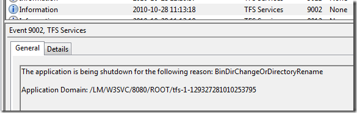
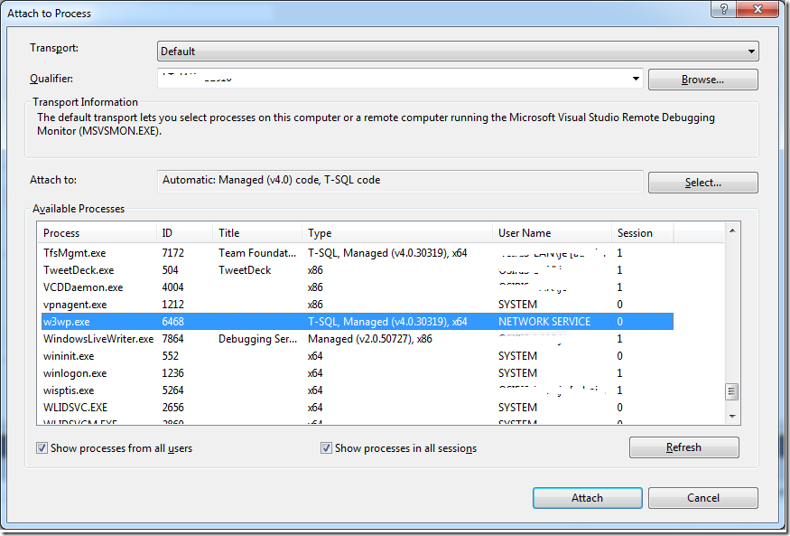
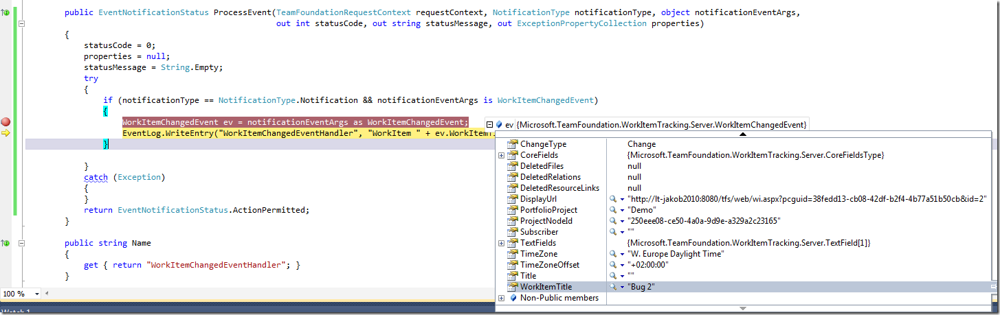

\
**Update 2012-01-23: Added note about .NET framework**

[Martin Hinshelwood](http://geekswithblogs.net/hinshelm/Default.aspx) wrote an excellent post recently  <http://nakedalm.com/team-foundation-server-2010-event-handling-with-subscribers/> ) about a new type of integration \
available in TFS 2010, namely server side event handlers, that is executed within the TFS context. I wasn’t aware of this new feature and as Martin notes, there doesn’t seem to be any material/documentation of it at all. \
Previously, when you wanted some custom action to be executed when some event occurs in TFS (check-in, build completed…) you wrote a web/WCF service with a predefined signature and subscribed to the event using bissubscribe.exe. \
Usually you want to get more information from TFS than what is available in the event itself so you would have to use the TFS client object model to make new requests back to TFS to get that information. \
The deployment of these web services is always a bit of a hassle, especially around security. Also there is no way to affect the event itself, e.g. to stop the event from finishing depending on some condition. This can be done using \
server side events.

The deployment of a server side event handler couldn’t be simpler, just drop the assembly containing the event handlers into the Plugins folder of TFS, which is located at  \
**C:Program FilesMicrosoft Team Foundation Server 2010Application TierWeb ServicesbinPlugins.** TFS monitors this directory from any change and will restart itself automatically, so the latest version will \
always be executed.

In this first post on this subject, I will describe how to set up your development environment to make it easy to both deploy and debug your event handler. 

1. **Install TFS 2010 \**I recommend that you install a local copy of TFS 2010 on your development machine. For this scenario, you only need the Basic version which is a breeze to install. It took me about 10-15 minutes to install and configure it the last time I did it. \
   This will make your TFS development and customization much more efficient than using a share remote server, and you can pretty much assault it as much as you want since it is your private server! 🙂 \
2. **Run Visual Studio 2010 as admin \**To be able to deploy your event handler automatically (see next step), you need to run Visual Studio in administration mode \
3. **Create the Event Handler project \**To setup the project, create a standard C# class library. \
   **Note** that the project must be .NET 3.5 (or lower), NOT .NET 4.0 since TFS is running on .NET 2.0 it can’t load a .NET 4.0 assembly in the same app domain. \
   Martin has written about what you need to reference in his post. Since he was using VB.NET in his sample, I thought that I include a C# version of a minimal WorkItemChanged event handler: \

   ```csharp
   Code highlighting produced by Actipro CodeHighlighter (freeware)
   http://www.CodeHighlighter.com/

   using System;
   using System.Diagnostics;
   using Microsoft.TeamFoundation.Common;
   using Microsoft.TeamFoundation.Framework.Server;
   using Microsoft.TeamFoundation.WorkItemTracking.Server;

   namespace TFSServerEventHandler
   {
    public class WorkItemChangedEventHandler : ISubscriber
    {
        public Type[] SubscribedTypes()
        {
            return new Type[1]{typeof(WorkItemChangedEvent)};
        }

        public EventNotificationStatus ProcessEvent(TeamFoundationRequestContext requestContext, NotificationType notificationType, object notificationEventArgs,
                                                    out int statusCode, out string statusMessage, out ExceptionPropertyCollection properties)
        {
            statusCode = 0;
            properties = null;
            statusMessage = String.Empty;
            try
            {
                if (notificationType == NotificationType.Notification && notificationEventArgs is WorkItemChangedEvent)
                {
                    WorkItemChangedEvent ev = notificationEventArgs as WorkItemChangedEvent;
                    EventLog.WriteEntry("WorkItemChangedEventHandler", "WorkItem " + ev.WorkItemTitle + " was modified");
                }

            }
            catch (Exception)
            {
            }
            return EventNotificationStatus.ActionPermitted;
        }

        public string Name
        {
            get { return "WorkItemChangedEventHandler"; }
        }

        public SubscriberPriority Priority
        {
            get { return SubscriberPriority.Normal; }
        }
    }
   }
   ```

   This event handler doesn’t do enything interesting, but just logs information about the modified work item in the event log.
4. **Deploy your event handler
   \**Open the project properties and go to the Build tab. Modify the Output Path by browsing to the Plugins directory (see above). This will result in a new
   deployment of your event handler every time you build. Neat! :-)
   If you look in the Event log after you compile your project, you will see entries from TFS Services that looks like this:

   [](http://gwb.blob.core.windows.net/jakob/Windows-Live-Writer/Debugging_917F/image_4.png)

   As you can see, TFS has noticed that a new version of the event handler has been dropped in the plugins folder and therefor it is performing a restart. You will notice that TFS becomes temporarily unavailable while this happens.
   Try modifying a work item and verify that information about it is written in the event log. (Note: You will need to create a event source called “WorkItemChangedEventHandler”, otherwise the EventLog.WriteEntry call will fail.
5. **Debug the event handler**
   Since these types of events aren’t very well documented it’s useful to debug the event handlers just to find out how your handler is called and what the parameters contain.
   To do this, to to the Debug menu och select *Attach to Process*. Check both *Show processes from all users* and *Show processes in all sessions* and locate the w3wp process that hosts TFS.
   [](http://gwb.blob.core.windows.net/jakob/Windows-Live-Writer/Debugging_917F/image_15.png)
   Select Attach to start the debugging session. Set a break point in the ProcessEvent method and then modify a work item in TFS. This should cause your event handler to be executed immediately:

   [](http://gwb.blob.core.windows.net/jakob/Windows-Live-Writer/Debugging_917F/image_12.png)

---

## Comments

*Imported from the original WordPress site. Closed for new replies.*

> **Rasheed** — 14 Nov 2010
>
> Originally posted on: <http://geekswithblogs.net/jakob/archive/2010/10/27/devleoping-and-debugging-server-side-event-handlers-in-tfs-2010.aspx#547417>
>
> Hello Jacob:\
> \
> This is very helpful. I'm trying to implement a custom check-in event handler and trying to leverage your idea. Our check-in handler should extract some meta data from the checked-in file and push it to application database. I exactly followed your approach for CheckinEvent with no luck. For some reason, it does not break the debug point. However, when I ran your sample for "WorkItemChangedEvent" is works just fine. Am I missing something? Appreciate your feedback. Please see below the my code:\
> \
> using System;\
> using System.Diagnostics;\
> using Microsoft.TeamFoundation.Common;\
> using Microsoft.TeamFoundation.Framework.Server;\
> using Microsoft.TeamFoundation.VersionControl.Common;\
> using Microsoft.TeamFoundation.WorkItemTracking.Server;\
> \
> namespace TFSServerEventHandler\
> {\
>  public class CheckinEventHandler : ISubscriber\
>  {\
>  public Type[] SubscribedTypes()\
>  {\
>  return new Type[1] {typeof(CheckinEvent) };\
>  }\
> \
>  public EventNotificationStatus ProcessEvent(TeamFoundationRequestContext requestContext, NotificationType notificationType, object notificationEventArgs,\
>  out int statusCode, out string statusMessage, out ExceptionPropertyCollection properties)\
>  {\
> \
> \
> \
> \
>  statusCode = 0;\
>  properties = null;\
>  statusMessage = String.Empty;\
>  try\
>  {\
>  {\
>  CheckinEvent ev = notificationEventArgs as CheckinEvent;\
>  EventLog.WriteEntry("ChekinEventHandler", "CheckinComment " + ev.Comment );\
>  }\
> \
>  }\
>  catch (Exception)\
>  {\
>  }\
>  return EventNotificationStatus.ActionPermitted;\
>  }\
> \
>  public string Name\
>  {\
> \
>  get { return "CheckinEventHandler"; }\
>  }\
> \
>  public SubscriberPriority Priority\
>  {\
>  get { return SubscriberPriority.Normal; }\
>  }\
>  }\
> }\

> **Subodh Sohoni** — 12 Jan 2011
>
> Originally posted on: <http://geekswithblogs.net/jakob/archive/2010/10/27/devleoping-and-debugging-server-side-event-handlers-in-tfs-2010.aspx#557629>
>
> Excellent Stuff! I was looking for something similar and your post with Martin Hinshelwood's post gives right directions! Thanks.

> **Stephen** — 20 Jan 2011
>
> Originally posted on: <http://geekswithblogs.net/jakob/archive/2010/10/27/devleoping-and-debugging-server-side-event-handlers-in-tfs-2010.aspx#558831>
>
> Should the debugging part work remotely? I setup the remote debugger, but I keep getting "no symbols have been loaded for this document".

> **Christian** — 11 Feb 2011
>
> Originally posted on: <http://geekswithblogs.net/jakob/archive/2010/10/27/devleoping-and-debugging-server-side-event-handlers-in-tfs-2010.aspx#562144>
>
> I am trying to get this sample working but for some reason it doesn't seem to fire this event at all. And I used exactly the same code as in the post? Any ideas what might be stopping it? Also trying to remotely debug and breakpoints don't get hit?\
> \
> Note for Stephen: have you compiled your plug in in debug and copied the .pdb file over?

> **Christian** — 11 Feb 2011
>
> Originally posted on: <http://geekswithblogs.net/jakob/archive/2010/10/27/devleoping-and-debugging-server-side-event-handlers-in-tfs-2010.aspx#562146>
>
> Me again: ignore the first part of my post from before - i ended up getting it working. I also got the Check in Event working if anyone is interested. Code below - One thing I had to do though to succesfully debug it was put System.Diagnostics.Debugger.Break(); in the code - without it it wouldn't break ever?\
> \
> using System;\
> using System.Diagnostics;\
> using Microsoft.TeamFoundation.Common;\
> using Microsoft.TeamFoundation.Framework.Server;\
> using Microsoft.TeamFoundation.WorkItemTracking.Server;\
> using Microsoft.TeamFoundation.VersionControl.Common;\
> using Microsoft.TeamFoundation.VersionControl.Server;\
> \
> \
> namespace TFSCheckInEventHandler\
> {\
>  public class TFSCheckInEventHandler : ISubscriber\
>  {\
>  public Type[] SubscribedTypes()\
>  {\
>  return new Type[1] { typeof(CheckinNotification) };\
>  }\
> \
>  public EventNotificationStatus ProcessEvent(TeamFoundationRequestContext requestContext, NotificationType notificationType, object notificationEventArgs,\
>  out int statusCode, out string statusMessage, out ExceptionPropertyCollection properties)\
>  {\
>  statusCode = 0;\
>  //System.Diagnostics.Debugger.Break();\
>  properties = null;\
>  statusMessage = String.Empty;\
>  try\
>  {\
>  if (notificationType == NotificationType.Notification && notificationEventArgs is CheckinNotification)\
>  {\
>  CheckinNotification ev = notificationEventArgs as CheckinNotification;\
>  }\
>  }\
>  catch (Exception)\
>  {\
>  }\
>  return EventNotificationStatus.ActionPermitted;\
>  }\
> \
>  public string Name\
>  {\
>  get { return "TFSCheckInEventHandler"; }\
>  }\
> \
>  public SubscriberPriority Priority\
>  {\
>  get { return SubscriberPriority.Normal; }\
>  }\
>  }\
> }\
> \
> \

> **Leo** — 18 Feb 2011
>
> Originally posted on: <http://geekswithblogs.net/jakob/archive/2010/10/27/devleoping-and-debugging-server-side-event-handlers-in-tfs-2010.aspx#563542>
>
> in the case i need to deny the event (EventNotificationStatus.ActionDenied), it is possible to give to the user a custom message??

> **Vaccano** — 20 Feb 2011
>
> Originally posted on: <http://geekswithblogs.net/jakob/archive/2010/10/27/devleoping-and-debugging-server-side-event-handlers-in-tfs-2010.aspx#563744>
>
> Thanks for the Post. I was able to use your stuff combined with Martin's to make my own aggregation code.\
> \
> I posted it on codeplex here: http://tfsaggregator.codeplex.com/ if any one else is interested

> **Bruce Cutler** — 20 Apr 2011
>
> Originally posted on: <http://geekswithblogs.net/jakob/archive/2010/10/27/devleoping-and-debugging-server-side-event-handlers-in-tfs-2010.aspx#574786>
>
> How can I tell what type of work item is being modified?

> **Alex** — 20 Aug 2011
>
> Originally posted on: <http://geekswithblogs.net/jakob/archive/2010/10/27/devleoping-and-debugging-server-side-event-handlers-in-tfs-2010.aspx#590584>
>
> Library is loading but did not work on event. What can it be? Configuration TFS SP1 RU. I am trying CheckinNotification and WorkItemChangedEvent.

> **Richard Roberts** — 05 Oct 2011
>
> Originally posted on: <http://geekswithblogs.net/jakob/archive/2010/10/27/devleoping-and-debugging-server-side-event-handlers-in-tfs-2010.aspx#596000>
>
> great information but I am getting errors when my component tries to access and read an element in a app.config file.\
> ConfigurationManager.AppSettings["somekey"]; Any Ideas why?

> **Bill Lock** — 11 Jan 2012
>
> Originally posted on: <http://geekswithblogs.net/jakob/archive/2010/10/27/devleoping-and-debugging-server-side-event-handlers-in-tfs-2010.aspx#605350>
>
> I was able to successfully record all the CheckinNotification properties to a file when a checkin was performed on TFS via a custom plugin. (thanks)\
> Currently I want to know the project name of the checkin. I currently preface the comment with the project name, but I am looking for an automatic way of retrieving this information.\
> If anyone has any ideas please let me know.\
> Have a great day!\
> Bill\

> **Jakob Ehn** — 23 Jan 2012
>
> Originally posted on: <http://geekswithblogs.net/jakob/archive/2010/10/27/devleoping-and-debugging-server-side-event-handlers-in-tfs-2010.aspx#606238>
>
> @Bill: Do you mean the Team Project name or the VS project that the file is included in?

> **Jakob Ehn** — 23 Jan 2012
>
> Originally posted on: <http://geekswithblogs.net/jakob/archive/2010/10/27/devleoping-and-debugging-server-side-event-handlers-in-tfs-2010.aspx#606239>
>
> @Richard: You is no application configuration file associated with a server side event handler, since it is hosted inside TFS. If you need configurablility, you need to resort to either the Windows or the TFS registry

> **Jakob Ehn** — 23 Jan 2012
>
> Originally posted on: <http://geekswithblogs.net/jakob/archive/2010/10/27/devleoping-and-debugging-server-side-event-handlers-in-tfs-2010.aspx#606240>
>
> @Alex, see my note about .NET Framework, that one bit me recently

> **Lilia** — 09 Feb 2012
>
> Originally posted on: <http://geekswithblogs.net/jakob/archive/2010/10/27/devleoping-and-debugging-server-side-event-handlers-in-tfs-2010.aspx#607465>
>
> @Jakob I am also looking for the same info as @Bill - I can't figure out how to get the Team Project name programmatically from in the CheckinNotification scenario. Any ideas? \
> Thanks

> **Dino** — 10 May 2012
>
> Originally posted on: <http://geekswithblogs.net/jakob/archive/2010/10/27/devleoping-and-debugging-server-side-event-handlers-in-tfs-2010.aspx#613474>
>
> I followed the steps you listed but when I try to debug the code by attaching to the process, I get the following error eventhough the project is .NET 3.5.\
> \
> {"Microsoft SharePoint is not supported with version 4.0.30319.261 of the Microsoft .Net Runtime."}\
> \
> I have tried creating new project from scratch to make sure it is .NET 3.5 based, but it gives same error.\
> \
> Any idea or suggestion?

> **Vel** — 18 Jul 2012
>
> Originally posted on: <http://geekswithblogs.net/jakob/archive/2010/10/27/devleoping-and-debugging-server-side-event-handlers-in-tfs-2010.aspx#616676>
>
> Hi Jakob,\
> I am working with event handler for extracting check-in information and was able to develop and dropped in plugins, but I would also require additional info such as check-in filename, project name od check-in file, etc.\
> any kind of help on this would be really greatly appreciated Mr. Jakob.\
> Thanks

> **Rajesh** — 24 Aug 2012
>
> Originally posted on: <http://geekswithblogs.net/jakob/archive/2010/10/27/devleoping-and-debugging-server-side-event-handlers-in-tfs-2010.aspx#618255>
>
> Thanks a lot. This really helped me...

> **rayco** — 24 Oct 2012
>
> Originally posted on: <http://geekswithblogs.net/jakob/archive/2010/10/27/devleoping-and-debugging-server-side-event-handlers-in-tfs-2010.aspx#620720>
>
> Work this ISubscriber event even on TFS 2012?

> **Jakob Ehn** — 24 Oct 2012
>
> Originally posted on: <http://geekswithblogs.net/jakob/archive/2010/10/27/devleoping-and-debugging-server-side-event-handlers-in-tfs-2010.aspx#620721>
>
> @Rayco: Yes it does, in fact I recently updated the source on CodePlex with a TFS 2012 version. I will add a note in this post about that

> **Jakob Ehn** — 24 Oct 2012
>
> Originally posted on: <http://geekswithblogs.net/jakob/archive/2010/10/27/devleoping-and-debugging-server-side-event-handlers-in-tfs-2010.aspx#620722>
>
> @Rayco: Yes it does, you just need to compile against the TFS 2012 assemblies and it will work just fine

> **Rayco** — 26 Oct 2012
>
> Originally posted on: <http://geekswithblogs.net/jakob/archive/2010/10/27/devleoping-and-debugging-server-side-event-handlers-in-tfs-2010.aspx#620809>
>
> thanx, i recompiled with tfs2012 asseblies and works fine!

> **Sriharsha** — 06 Nov 2012
>
> Originally posted on: <http://geekswithblogs.net/jakob/archive/2010/10/27/devleoping-and-debugging-server-side-event-handlers-in-tfs-2010.aspx#621156>
>
> how to call the ProcessEvent method by giving the details of my work items.. Pls explain.

> **Nico** — 31 Jan 2013
>
> Originally posted on: <http://geekswithblogs.net/jakob/archive/2010/10/27/devleoping-and-debugging-server-side-event-handlers-in-tfs-2010.aspx#624560>
>
> where can I get those 2012 assemblies? We have a 2010 production server but we plan to migrate soon so I installed a tfs 2012 express on my dev machine. But your example doesn't work against that version when compiled with 2010 assemblies. Unfortunately I cannot find the needed assemblies on my local server. Maybe because it's an express version?

> **Jakob Ehn** — 31 Jan 2013
>
> Originally posted on: <http://geekswithblogs.net/jakob/archive/2010/10/27/devleoping-and-debugging-server-side-event-handlers-in-tfs-2010.aspx#624561>
>
> @Nico: If you look at the codeplex site, the Main branch is compiled against the TFS 2012 assemblies. \
> \
> The assemblies are typically located at;\
> C:Program FilesMicrosoft Team Foundation Server 11.0Application TierWeb Servicesbin

> **Peter** — 14 Mar 2013
>
> Originally posted on: <http://geekswithblogs.net/jakob/archive/2010/10/27/devleoping-and-debugging-server-side-event-handlers-in-tfs-2010.aspx#626066>
>
> Indeed a good article \
> Recently I have tested a tool called Lepide Event Log Manager its really a nice management of all event log in your machine \
> Check it once you will surely like its functionalities \
> http://www.windowseventlogmonitor.com/

> **Hardik** — 28 Aug 2013
>
> Originally posted on: <http://geekswithblogs.net/jakob/archive/2010/10/27/devleoping-and-debugging-server-side-event-handlers-in-tfs-2010.aspx#631624>
>
> Hi, \
> \
> Thats an awsome article. i have used your code and i am able to use TFS Plugins. That works as expected. \
> \
> But when i upload TFS plugins, Other TFS Users start facing performance problem while using TFS.\
> They get TFS running very slow.\
> \
> So what could be the reason behind this ? \
> \
> Regards\
> Hardik

> **Dany** — 29 Oct 2013
>
> Originally posted on: <http://geekswithblogs.net/jakob/archive/2010/10/27/devleoping-and-debugging-server-side-event-handlers-in-tfs-2010.aspx#633106>
>
> @hardik\
> A TFS Server plug-in works synchronous. So when you do a lot of stuff in your plug-in then you are getting Performance Problems.

> **suresh** — 02 Jan 2014
>
> Originally posted on: <http://geekswithblogs.net/jakob/archive/2010/10/27/devleoping-and-debugging-server-side-event-handlers-in-tfs-2010.aspx#634645>
>
> it was a good article.\
> I have sued this in my sample application and here is what I need.\
> Ima ble to capture events, but only after saving the work item.\
> So when I change a state from new to close and click save, the event is fired. But the work item is already saved, and history for the work item is logged. now the event handler changes the status from close to new, due to some business logic, and again the history is logged. I would like to eliminate two history events, which would confuse the developer.\
> It typically means, I should not be capturing the workitem event, but event of the field. in my case status field on change. Let me know if any one has any insight in this direction. Any help is appreciated.

> **Sumukh** — 13 Jun 2014
>
> Originally posted on: <http://geekswithblogs.net/jakob/archive/2010/10/27/devleoping-and-debugging-server-side-event-handlers-in-tfs-2010.aspx#638340>
>
> Hi Jacob,\
> \
> Thanks for this article. I wanted to ask if this is possible with Java SDK for TFS? My end goal is to call a external web service when a work item is changed in TFS. Is this possible through Java SDK provided by Microsoft? Please HELP.\
> \
> Thanks.

> **Faith** — 26 Jun 2014
>
> Originally posted on: <http://geekswithblogs.net/jakob/archive/2010/10/27/devleoping-and-debugging-server-side-event-handlers-in-tfs-2010.aspx#638539>
>
> For TFS 2012, where would the Plugins folder of TFS be? I can't find anything even remotely like that for 2010 on my server, but really need it to work on 2012 and 2013...\
> \
> Thanks,\
> Faith

> **Jakob Ehn** — 18 Nov 2014
>
> Originally posted on: <http://geekswithblogs.net/jakob/archive/2010/10/27/devleoping-and-debugging-server-side-event-handlers-in-tfs-2010.aspx#641458>
>
> @Faith: For TFS 2013, the folder is located at C:Program FilesMicrosoft Team Foundation Server 12.0Application TierWeb ServicesbinPlugins\
> \
> For TFS 2012, replace 12.0 with 11.0\
> \

> **Jakob Ehn** — 18 Nov 2014
>
> Originally posted on: <http://geekswithblogs.net/jakob/archive/2010/10/27/devleoping-and-debugging-server-side-event-handlers-in-tfs-2010.aspx#641459>
>
> @sumukh: This technique is not possible using Java, but you can use the standard alert mechanism in TFS by invoking a SOAP web service when a work item is changed.\
> \
> See http://msdn.microsoft.com/en-us/magazine/cc507647.aspx for some details on this

> **Dong nGuyen** — 05 Aug 2015
>
> Originally posted on: <http://geekswithblogs.net/jakob/archive/2010/10/27/devleoping-and-debugging-server-side-event-handlers-in-tfs-2010.aspx#645661>
>
> on TFS 2015 \
> requestContext.GetService() => alway null. \
> \
> Can you help me fix it ?
