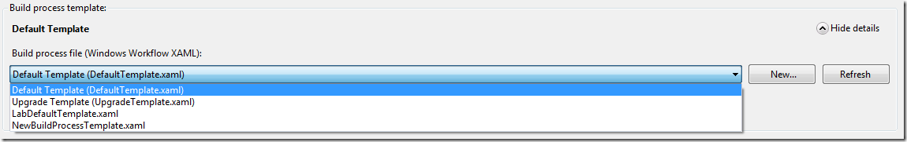
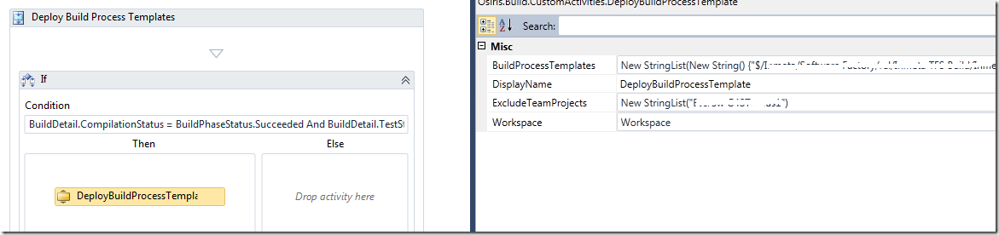
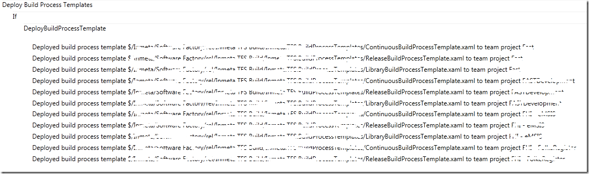

One of the great new features in TFS 2010 Build was the ability to define Build Process Templates that can be reused across build definitions. The Build Process Template file itself is a Windows Workflow 4.0 xaml file \
and can be stored anywhere in source control. When a developer creates a new build definition in Team Explorer, he can choose from a list of Build Process Templates:

[](http://gwb.blob.core.windows.net/jakob/Windows-Live-Writer/Managing-Build-Process-Templates-in-TFS-_CF49/image_2.png)

This list is populated with the following build process templates:

- The ones that come out of the box (DefaultTemplate.xaml, UpgradetTemplate.xaml and LabDefaultTemplate.xaml). These are created for every new team project (this can be changed by modifying the process template)
- Any build process templates that have previously been added for any other build definitions in the same team project.

The last bullet is a bit unintuitive, but it means that if a developer creates a new build definition in team project A, and adds a new build process template (for example by by selecting New and then browse to an existing .xaml file), this \
build process template will be available in the process dropdown list for all other build definitions in team project A. It will not be available in team project B, but has to be added in the same way.

**Managing Build Process Templates** \
So, how do you manage your build process templates? If you only have a couple of team projects, this night not be a big problem, but if you like us create a team project for every customer this becomes a problem!. We have created a set \
of default build process templates (CI builds, release builds etc..) that we want to use across all team projects, but this requires developers to know where these .xaml files are located. We do not want to duplicate or branch them unless necessary \
but instead we store inside a special, internal, team project where all of our software factory related stuff is located.

Fortunately, there is an API that lets you manage build process templates per team project. This API is described by Jason Pricket here [http://blogs.msdn.com/b/jpricket/archive/2010/04/08/tfs-2010-managing-build-process-templates-what-are-those.aspx](http://blogs.msdn.com/b/jpricket/archive/2010/04/08/tfs-2010-managing-build-process-templates-what-are-those.aspx "http://blogs.msdn.com/b/jpricket/archive/2010/04/08/tfs-2010-managing-build-process-templates-what-are-those.aspx"). \
I have used the source from his blog post to create a custom activity that lets you deploy your build process templates across all team projects using TFS 2010 Build. This means that when you have added a new team project, or a new build process template, \
you just run the build and it will automatically update all team projects with the build process templates.

**Custom Activity \**The custom activitiy is called DeployBuildProcessTemplates and has 3 parameters:

- BuildProcessTemplates – The list with the source control paths to the build process templates that you want to deploy
- ExcludeTeamProjects – A list that lets you exclude one or more team projects, in case you do not want to deploy the build process templates to all team projects
- Workspace – This is the workspace property from the build process template, and is used to retrieve the list of team projects (using the VersionControlServer property)

(Note that the custom activity inherits from an internal base class that among other things contain the TrackBuildMessage method which is just a helper method for writing to the build output log)

```json
Code highlighting produced by Actipro CodeHighlighter (freeware)
http://www.CodeHighlighter.com/

    [BuildActivity(HostEnvironmentOption.All)]
    public sealed class DeployBuildProcessTemplate : BaseCodeActivity
    {
        // Define an activity input argument of type string
        [BrowsableAttribute(true)]
        [RequiredArgument]
        public InArgument<StringList> BuildProcessTemplates { get; set; }

        // Define an activity input argument of type string
        [BrowsableAttribute(true)]
        public InArgument<StringList> ExcludeTeamProjects { get; set; }

        [RequiredArgument]
        [BrowsableAttribute(true)]
        // Define an activity input argument of type string
        public InArgument<Workspace> Workspace { get; set; }

        // If your activity returns a value, derive from CodeActivity<TResult>
        // and return the value from the Execute method.
        protected override void Execute(CodeActivityContext context)
        {
            IBuildDetail currentBuild = context.GetExtension<IBuildDetail>();
            var vcs = this.Workspace.Get(context).VersionControlServer;

            foreach (var teamProject in vcs.GetAllTeamProjects(true))
            {
                TeamProject project = teamProject;
                if( !ExcludeTeamProjects.Get(context).Any(tp => tp == project.Name))
                {
                    // Deploy templates to team project
                    BuildProcessTemplateHelper helper = new BuildProcessTemplateHelper(currentBuild.BuildServer, project.Name);

                    foreach (var processTemplate in BuildProcessTemplates.Get(context))
                    {
                        if (helper.AddTemplate(processTemplate, ProcessTemplateType.Custom))
                        {
                            TrackMessage(context, string.Format("Deployed build process template {0} to team project {1}", processTemplate, project.Name));
                        }
                    }

                }
            }
        }
    }
```

The custom activity just loops through all team projects that are not part of the ExcludeTeamProjects list, and the calls AddTemplate on another class. This method looks like this:

```csharp
Code highlighting produced by Actipro CodeHighlighter (freeware)
http://www.CodeHighlighter.com/

    public class BuildProcessTemplateHelper
    {
        private readonly IBuildServer buildServer;
        private readonly string teamProject;

        public BuildProcessTemplateHelper(IBuildServer buildServer, string teamProject)
        {
            this.buildServer = buildServer;
            this.teamProject = teamProject;
        }

        public bool AddTemplate(String serverPath)
        {
            bool templateAdded = false;
            var template = GetBuildProcessTemplate(serverPath);
            if (template == null)
            {
                template = buildServer.CreateProcessTemplate(teamProject, serverPath);
                template.Save();
                templateAdded = true;
            }
            return templateAdded;
        }

        public IProcessTemplate GetBuildProcessTemplate(string serverPath)
        {
            IProcessTemplate[] templates = buildServer.QueryProcessTemplates(teamProject);
            return templates.FirstOrDefault(pt => pt.ServerPath.Equals(serverPath, StringComparison.OrdinalIgnoreCase));
        }
    }
```

**Build Process Template**

To use the custom activity, just drop it somewhere inside the Run on Agent activity and define the list of build process templates that you want to deploy.
**\
Note:** The build service account must have the *Edit Build Definition* permission in all team projects, otherwise it won’t be able to modify this information.

[](http://gwb.blob.core.windows.net/jakob/Windows-Live-Writer/Managing-Build-Process-Templates-in-TFS-_CF49/image_6.png)

The AddTemplate method first checks to see if the build process template already exists, otherwise it adds the path to the list of build process templates for the team project.
Rather simple, thanks to Jason for the sample code in his blog post.

When running the build, we can see in the build log which team projects that have been updated:

[](http://gwb.blob.core.windows.net/jakob/Windows-Live-Writer/Managing-Build-Process-Templates-in-TFS-_CF49/image_4.png)

---

## Comments

*Imported from the original WordPress site. Closed for new replies.*

> **Betty** — 09 Apr 2011
>
> Originally posted on: <http://geekswithblogs.net/jakob/archive/2010/11/03/managing-build-process-templates-in-tfs-2010-build.aspx#573077>
>
> You may not care, but it's fairly easy to recreate your obscured text by overlaying all the rows on top of each other.
