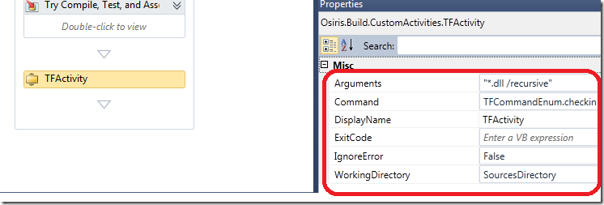
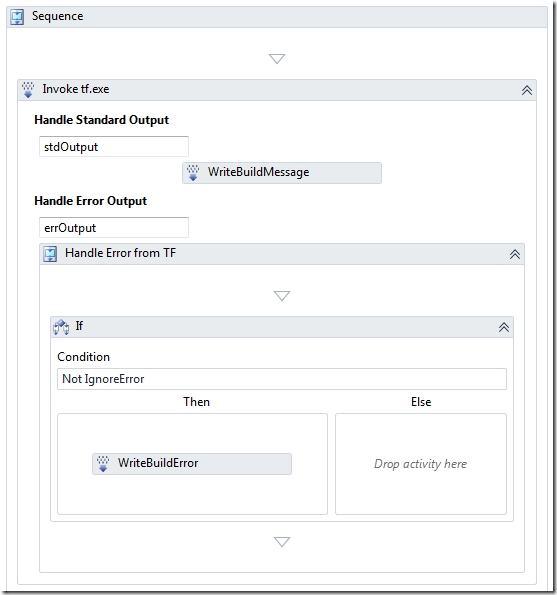

Update 15.03.2014 - Fixed broken link to download

*** The custom activity is availabe for download here: [https://onedrive.live.com/redir?resid=EE034C9F620CD58D%21168](http://cid-ee034c9f620cd58d.office.live.com/browse.aspx/BlogSamples?uc=1 "http://cid-ee034c9f620cd58d.office.live.com/browse.aspx/BlogSamples?uc=1") ***

Often when creating different types of release builds (e.g. where you build something that should be installed or consumed by other applications) there is a need to check in the results of the build back \
to source control. A common build type for us at Inmeta is *Library Builds*, which we use for common libraries that are shared among several applications. We have created a special build process template \
for this scenario that handles versioning, copying of the resulting binaries to a pre-defined folder, optionally merges the assemblies using ILMerge, and finally checking that binaries back to TFS as part of the build.

When it comes to communicating with TFS source control during a build, I find that the most flexible appraoch is to wrap the command line tool *tf.exe*. This tool has all the functionality you need, and if you choose \
to implement custom activities for the same functionality you would need to expose a lot of functionality that is very simple to call using tf.exe. There are two major drawbacks of this approach however:

- You need tf.exe on the build server, e.g. you must install Team Explorer. Generally it is a very good principle to keep the build server as minimal as possible.
- It is not that easy to invoke command line tools in TFS 2010 Build, it is hard to get the syntax and the paths correct.

If you can live with the first drawback, then we can at least reduce the problems of the other drawback by creating a simple custom activity that wraps some of the nitty gritty details of calling tf.exe. \
This is a simple activity, but I have found it useful and hopefully some of you will too.

Here is an example of how it looks when it is used in a build process template:

Note:

- The property *Command* is an enum type which just enumerates all possible commands to tf.exe. This makes it easy to select the correct command and stop you from getting syntax errors. \
  The enum is available as well in the download packages \
- You don’t need to know about how tf.exe is called \
- There is an IgnoreError boolean property that will ignore any errors if true (default is false) \
- The Arguments property is the argument to the tf.exe command. In this case, the resulting command will be *tf.exe checkin *.dll /recursive \*
- WorkingDirectory is mapped to the InvokeProcess.WorkingDirectory. Generally when performing source control operations using tf.exe, you should point the working directory somewhere inside the workspace. \
  By doing so, you don’t need to bother about spefcifying workspace or collection [URL:s.](s.)

The custom activity itself is pretty simple, it just wraps the call to InvokeProcess, with the standard output/error logging and error checking:

This activity is very simple, and can definitely be exended. Let me know if you find it useful and if you have any suggestions for improvements.

---

## Comments

*Imported from the original WordPress site. Closed for new replies.*

> **Aaron Kowall** — 03 Nov 2010
>
> Originally posted on: <http://geekswithblogs.net/jakob/archive/2010/11/03/performing-checkins-in-tfs-2010-build.aspx#545896>
>
> Jakob,\
> Would you consider submitting your activity to this community project?\
> http://tfsbuildextensions.codeplex.com/\

> **Ren&#233; Titulaer** — 17 Dec 2010
>
> Originally posted on: <http://geekswithblogs.net/jakob/archive/2010/11/03/performing-checkins-in-tfs-2010-build.aspx#552877>
>
> Hi, this is exactly what I needed. But I really struggled to get it working. Finnaly I found out that WorkingDirectory should be set to [SourcesDirectory] instead of SourcesDirectory.\
> SourcesDirectory appears to be a variable which should be used with brackets

> **Jakob Ehn** — 17 Dec 2010
>
> Originally posted on: <http://geekswithblogs.net/jakob/archive/2010/11/03/performing-checkins-in-tfs-2010-build.aspx#552880>
>
> @Rene: If you are using the workflow editor, as in the example above, you only need to type SourcesDirectory. If you look at the underlying XML, then it uses [] to reference workflow variables

> **Jakob Ehn** — 17 Dec 2010
>
> Originally posted on: <http://geekswithblogs.net/jakob/archive/2010/11/03/performing-checkins-in-tfs-2010-build.aspx#552881>
>
> @Aaron: Sure, I will add it to the codeplex project.

> **Nitin** — 09 Jan 2012
>
> Originally posted on: <http://geekswithblogs.net/jakob/archive/2010/11/03/performing-checkins-in-tfs-2010-build.aspx#605151>
>
> Hi Jacob, could you Pl send me the link where custom activity "TFActivity" is there.

> **Jakob Ehn** — 09 Jan 2012
>
> Originally posted on: <http://geekswithblogs.net/jakob/archive/2010/11/03/performing-checkins-in-tfs-2010-build.aspx#605154>
>
> @Nitin: The link is at the top of the blog post :-)

> **Y&#233;y&#233;** — 02 Feb 2012
>
> Originally posted on: <http://geekswithblogs.net/jakob/archive/2010/11/03/performing-checkins-in-tfs-2010-build.aspx#606978>
>
> Hi Jacob,\
> \
> SourcesDirectory in workflow editor don't works! not declared !\
> \
> Could you help me ? :-)

> **sachin** — 14 Mar 2014
>
> Originally posted on: <http://geekswithblogs.net/jakob/archive/2010/11/03/performing-checkins-in-tfs-2010-build.aspx#636320>
>
> could you Pl send me the link where custom activity "TFActivity" is there.\
> \
> the Top link is not running now.

> **Jakob Ehn** — 15 Mar 2014
>
> Originally posted on: <http://geekswithblogs.net/jakob/archive/2010/11/03/performing-checkins-in-tfs-2010-build.aspx#636340>
>
> @sachin: I have fixed the broken link

> **sachin** — 15 Mar 2014
>
> Originally posted on: <http://geekswithblogs.net/jakob/archive/2010/11/03/performing-checkins-in-tfs-2010-build.aspx#636345>
>
> Hi Jakob,\
> \
> Still same issue. can u share the custom activity TFActivity on my email id.

> **sachin** — 15 Mar 2014
>
> Originally posted on: <http://geekswithblogs.net/jakob/archive/2010/11/03/performing-checkins-in-tfs-2010-build.aspx#636346>
>
> Service Unavailable\
> We are currently experiencing technical difficulties.\
> Please try again later.\
> \
> On top link

> **sachin** — 15 Mar 2014
>
> Originally posted on: <http://geekswithblogs.net/jakob/archive/2010/11/03/performing-checkins-in-tfs-2010-build.aspx#636347>
>
> Hi,\
> \
> Thanks Jacob. Now below link is accessible for me\
> \
> https://onedrive.live.com/redir?resid=EE034C9F620CD58D%21168\
> \

> **sachin** — 15 Mar 2014
>
> Originally posted on: <http://geekswithblogs.net/jakob/archive/2010/11/03/performing-checkins-in-tfs-2010-build.aspx#636356>
>
> Hi Jacob,\
> \
> Invoked attached custom activity after try compile, Test and assembly activity in Build template but i am getting below error in build.\
> \
> 3 error(s), 0 warning(s)\
>  TF14079: The item D:Builds1*.msi is not part of your workspace. Please perform a get operation on this item.\
>  There are no pending changes matching the specified items.\
>  No files checked in.\
> \
> Please let me know how i can resolve.
