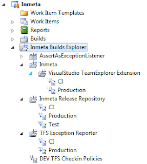
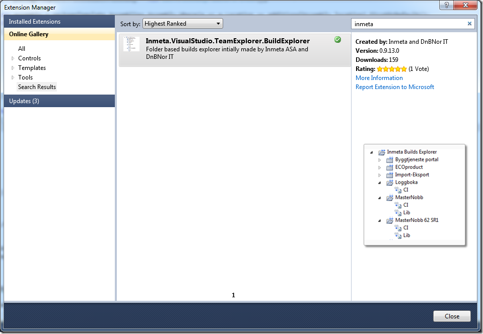

This weekend we at Inmeta release a free Visual Studio 2010 Team Explorer extensions that solves the problem with the Builds node in the Team Explorer not being hierarchic. For some reason, this part of the Team Explorer didn’t get the nice hierarchical folder structure that the Work items node got in 2010. The result is that, for a company that has several hundreds of builds in the same team project, it becomes very hard to navigate.

The solution that we implemented is very simple and uses a naming convention to group the build definitions in folders. The default separator is ‘.’ (dot) which is prabably the most common convention used anyway. As it turns out, Microsoft DevDiv uses this convention internally, as posted \
by [Brian Harry](http://blogs.msdn.com/b/bharry/archive/2011/04/01/build-folders.aspx). And they have a _lot_ of build definitions…. 🙂

This is what the build explorer looks like:

As you can see, if you have a multi-part name, such as *Inmeta.TFS Exception Reporter.Production*, you get two folders in the hierarchy.

The Build Explorer is available in the Visual Studio Gallery, either download it from [http://visualstudiogallery.msdn.microsoft.com/35daa606-4917-43c4-98ab-38632d9dbd45](http://visualstudiogallery.msdn.microsoft.com/35daa606-4917-43c4-98ab-38632d9dbd45 "http://visualstudiogallery.msdn.microsoft.com/35daa606-4917-43c4-98ab-38632d9dbd45"), or use the Visual Studio Extension Manager directly (search for Inmeta): \

The extension was developed mostly by [Lars Nilsson](http://larzjoakimnilzzon.blogspot.com/2011/04/inmeta-build-explorer.html), with some smaller additions by myself and [Terje Sandström](http://geekswithblogs.net/terje/archive/2011/04/01/visual-studiondashbuild-folders-extension-for-team-explorer.aspx).

The source code is available at <http://tfsbuildfolders.codeplex.com>. Let us know what you think and if you want to contribute, contact me or Terje at the Codeplex site.
