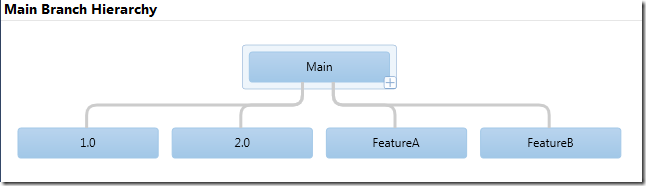
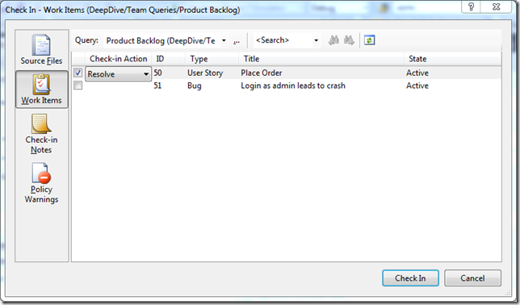
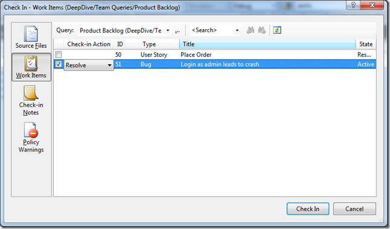
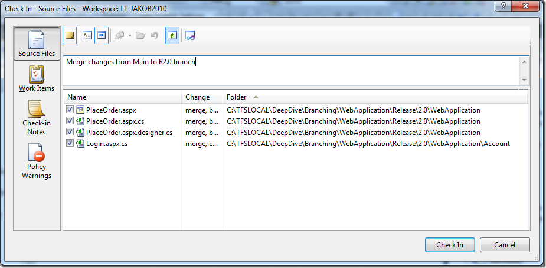
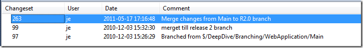
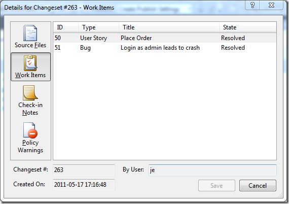
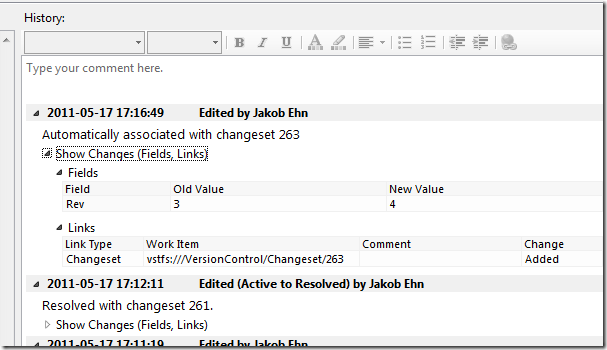
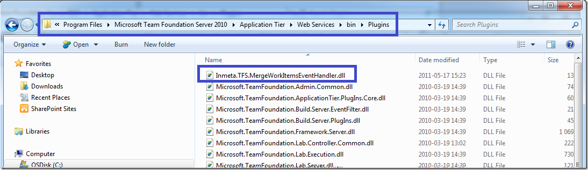

** Source available at [http://mergeworkitems.codeplex.com/](http://mergeworkitems.codeplex.com/ "http://mergeworkitems.codeplex.com/") **

Half a year ago I wrote about about [Merging Work Items](http://geekswithblogs.net/jakob/archive/2010/10/27/merging-work-items-in-tfs-2010.aspx) with a custom check-in policy. The policy evaluated the pending changes and for all pending merges, it traversed the merge history to find the associated work items and let the user add them to the current changeset.

I promised to post the source to the check-in policy (and I’ve got a lot of requests for it), but I never did. This was primary for two reasons:

1. The technical solution turned out to be a bit complicated. The problem was/is that it is not possible to modify the list of associated work items in the current pending changes using the API. This was a show stopper and the only way around it was to add another component that was executed on the server after the check-in that did the actual association. The information about the selected work items was temporarily stored in the comments of the changeset. This worked, but complicated the deployment. \
2. The feedback internally at [Inmeta](http://www.inmeta.com) was that why should the developer be allowed to select which work items that should be associated? If a work item was associated with a changeset in a Main branch, it should always be associated with the merge changeset when merging to a Release branch. So the association should be done automatically.

For these reasons I changed the implementation and converted the check-in policy to a TFS server side event handler instead (for more info on work with these event handlers, check out my post about them here: [Server Side Event Handlers in TFS 2010](http://geekswithblogs.net/jakob/archive/2010/10/27/devleoping-and-debugging-server-side-event-handlers-in-tfs-2010.aspx))

By having the association done server side, the process is very smooth for the developer. When a changeset that contains merges is checked in, the event handler evaluates all merges and associates the work items. If a work item has already been associated by the developer, it is of course not associated again. Since it is implemented with a server side event handler, it runs instantly without the user ever really noticing it.

Let’s look at how this works. Lets say that we have the following branch hierarchy: \

Now, one of our finest developers have both fixed a bug and added a new user story in the Main branch. That was two changesets, each changeset was associated with a corresponding work item:

Now, we want to push these changes to the 2.0 Release branch. So the developer performs a merge from Main to the 2.0 branch.

At this point, instead of manually adding the work items, the developer just checks in the changes. After this, lets take a look at the source history

Double-clicking on the latest changeset, we can see the following information on the work items tab: \

The work items associated with the original changesets that was merged to the R2.0 branch, have been associated with the new changeset. Also, double-clicking on one of the work items, we can see that the server event handler has added a link to the changeset for this work item: \

Note the following:

- The changeset has been linked in the same way as when you associate a work item manually. \
- The change was done by the developer account (myself in this sample), and not the TFS service account. This is because the event handler uses the new TFS Impersonation API to impersonate the user who committed the check-in. \
- The history comment is a bit different than the usual (“Associated with changeset XXX”), just to highlight the reason for the change. \
- If the changeset would contain both merges and other types of pending changes, the merges would still be traversed, the other changes are just ignored.

**Deployment \**Deploying the server side event handler couldn’t be easier, just drop the *Inmeta.TFS.MergeWorkItemsEventHandler.dll* assembly into the plugin directory of the TFS AT server. This path is usually %PROGRAMFILES%*Microsoft Team Foundation Server 12.0Application TierWeb ServicesbinPlugins*. **Note**: This will cause TFS to recycle to load the new assembly, so in production you might want to schedule this to minimize problems for your users. \
See my [post](http://geekswithblogs.net/jakob/archive/2010/10/27/devleoping-and-debugging-server-side-event-handlers-in-tfs-2010.aspx) more details on this.

**\
Implementation \**I have uploaded the source code to CodePlex at: [http://mergeworkitems.codeplex.com/](http://mergeworkitems.codeplex.com/ "http://mergeworkitems.codeplex.com/") so you can check out the details there. One thing that is worth mentioning is that I had to resort to the TFS Client API to access and modify the associated work items. The TFS Server Side object model is not very documented, and according to Grant Holiday (in [this post](http://stackoverflow.com/questions/4762845/updating-a-tfs-work-item-using-server-side-methods)) the server object mode for work item tracking is not very useful. So instead of going down that road, I used the client object model to do the work Not as efficient, but it gets the job done. \
Note that the event handler hooks into the Notification decision point, which is executed asynchronously **after** the check-in has been done, and therefor it doesn’t have a negative impact on the overall check-in process.

Hope that you find the event handler useful, contact me either through this blog or via the CodePlex site if you have any questions and/or feature requests.

---

## Comments

*Imported from the original WordPress site. Closed for new replies.*

> **Thiago** — 17 May 2011
>
> Originally posted on: <http://geekswithblogs.net/jakob/archive/2011/05/17/automatically-merging-work-items-in-tfs-2010.aspx#578244>
>
> You couldn't have posted this at a better time! Thanks!

> **M Hamlin** — 18 May 2011
>
> Originally posted on: <http://geekswithblogs.net/jakob/archive/2011/05/17/automatically-merging-work-items-in-tfs-2010.aspx#578267>
>
> Ditto! Thanks so much!

> **Ren&#233; Hjorth** — 18 May 2011
>
> Originally posted on: <http://geekswithblogs.net/jakob/archive/2011/05/17/automatically-merging-work-items-in-tfs-2010.aspx#578327>
>
> Your a lifesaver! :)

> **Maxim** — 27 May 2011
>
> Originally posted on: <http://geekswithblogs.net/jakob/archive/2011/05/17/automatically-merging-work-items-in-tfs-2010.aspx#579910>
>
> Wow! This is great job! Thank you!

> **Pradeep Y** — 23 Jun 2011
>
> Originally posted on: <http://geekswithblogs.net/jakob/archive/2011/05/17/automatically-merging-work-items-in-tfs-2010.aspx#583076>
>
> Good Post. Can you locate me the sources to learn TFS programming? I found very less documentation on this.\
> \
> And, I have as old ASP.NET Issue tracker application to manage all bugs. Now I would like to integrate my legacy application with TFS such a way that, TFS work items should be created automatically, whenever I create a bug in my ASP.NET issue tracker application. If status updated in TFS WI, the same should reflect in ASP.NET application.\
> \
> Can you suggest me the high level design for this integration?\

> **Jed** — 30 Jun 2011
>
> Originally posted on: <http://geekswithblogs.net/jakob/archive/2011/05/17/automatically-merging-work-items-in-tfs-2010.aspx#584003>
>
> You should do a blog series explaining getting merge info since all I could find on how to do this was some massive series on what was required for an older TFS version, and TFS2010 MergeSources was always empty. Someone else ran into this:\
> \
> http://stackoverflow.com/questions/3772674/how-is-the-change-mergesources-field-populated-in-tfs\
> \
> Here is a summary of the blog series on getting merge info:\
> \
> http://blogs.msdn.com/b/buckh/archive/2006/02/21/bobmergeapi.aspx

> **Fanija** — 15 Sep 2011
>
> Originally posted on: <http://geekswithblogs.net/jakob/archive/2011/05/17/automatically-merging-work-items-in-tfs-2010.aspx#593955>
>
> I am really looking forward to implementing this. The only question I have is currently we are still running TFS 2008, and although we have in plan to upgrade to TFS 2010 in the next few months, I want to implement this sooner. \
> \
> Will this work with TFS 2008? \
> And if so, do I place the Inmeta.TFS.MergeWorkItemsEventHandler.dll in Microsoft Visual Studio 2008 Team Foundation ServerWeb ServicesVersionControlbin? \
> \
> Thanks a lot in advance.

> **Jakob Ehn** — 15 Sep 2011
>
> Originally posted on: <http://geekswithblogs.net/jakob/archive/2011/05/17/automatically-merging-work-items-in-tfs-2010.aspx#593956>
>
> @Fanija: Server event handlers are new in TFS 2010, so this will not work in TFS2008. You could however extract the source and place it in a standard web service event handler that you can create a subscription for. It will not be as immediate as this solution but it should work

> **Sven** — 18 Oct 2011
>
> Originally posted on: <http://geekswithblogs.net/jakob/archive/2011/05/17/automatically-merging-work-items-in-tfs-2010.aspx#597126>
>
> Hi,\
> \
> I have a question. When I resolve a bug in a release branch and merge it into the main branch and later merge it again in the release branch is the work item always associated?\
> \
> Regards,\
> Sven

> **Larry** — 09 Nov 2011
>
> Originally posted on: <http://geekswithblogs.net/jakob/archive/2011/05/17/automatically-merging-work-items-in-tfs-2010.aspx#599403>
>
> Awesome post! This should definitely be included as part of the base functionality of TFS...

> **nikita** — 24 Dec 2011
>
> Originally posted on: <http://geekswithblogs.net/jakob/archive/2011/05/17/automatically-merging-work-items-in-tfs-2010.aspx#603759>
>
> Thanks! Works perfect!

> **Mani** — 31 Jan 2012
>
> Originally posted on: <http://geekswithblogs.net/jakob/archive/2011/05/17/automatically-merging-work-items-in-tfs-2010.aspx#606822>
>
> http://geekswithblogs.net/jakob/archive/2011/05/17/automatically-merging-work-items-in-tfs-2010.aspx\
> \
> This brings duplicate when you merge the main branch back into the development branch.\
> \
> is there anyway we can eliminate it?\
> \
> Thanks,\
> Mani

> **Jaleel** — 27 Mar 2012
>
> Originally posted on: <http://geekswithblogs.net/jakob/archive/2011/05/17/automatically-merging-work-items-in-tfs-2010.aspx#611071>
>
> Appreciate your code. It is simply great!\
> I have a question though. I was debugging the source code of yours. I get the changeset number as -1 . Any idea about this?\
> \
>  public EventNotificationStatus ProcessEvent(TeamFoundationRequestContext requestContext, NotificationType notificationType,\
>  object notificationEventArgs, out int statusCode, out string statusMessage, out ExceptionPropertyCollection properties)\
>  {\
>  statusCode = 0;\
>  properties = null;\
>  statusMessage = string.Empty;\
> \
>  if (notificationType == NotificationType.DecisionPoint)\
>  {\
>  try\
>  {\
>  if (notificationEventArgs is CheckinNotification)\
>  {\
>  CheckinNotification notification = notificationEventArgs as CheckinNotification;\
> \
>  Changeset cs = requestContext.GetChangeset (notification.Changeset); // I get changeset number as -1 here

> **John Ames** — 18 Apr 2012
>
> Originally posted on: <http://geekswithblogs.net/jakob/archive/2011/05/17/automatically-merging-work-items-in-tfs-2010.aspx#612200>
>
> Question?\
> How is this reflected on Build reports? \
> I thought a Work Item will only reflect one "Fixed in" build. How then if one Work Item is associated with multiple changesets in different release branchs do you account for what build this was fixed in?

> **Jakob Ehn** — 18 Apr 2012
>
> Originally posted on: <http://geekswithblogs.net/jakob/archive/2011/05/17/automatically-merging-work-items-in-tfs-2010.aspx#612203>
>
> @John: If you associate several work items with a changeset, they will all appear in the "Associated Work Items" section of the build summary, and the build will update all work items with the Fixed in build information.\
> \
> And as you note, every new build will update the same work item with the new build number. If this is not what you want, you can take the route where you simple create a new work item for each branch.

> **Jakob Ehn** — 18 Apr 2012
>
> Originally posted on: <http://geekswithblogs.net/jakob/archive/2011/05/17/automatically-merging-work-items-in-tfs-2010.aspx#612204>
>
> @Jaleel: This is because you are responding to a DecisionPoint event, which is _before_ the checkin is persisted. You should check for NotificationType.Notification instead, which will be executed after the checkin has been stored to the database

> **Pradeep Y** — 22 Jun 2012
>
> Originally posted on: <http://geekswithblogs.net/jakob/archive/2011/05/17/automatically-merging-work-items-in-tfs-2010.aspx#615415>
>
> Is this addressed in TFS 2012? Any Idea.?

> **Carl O** — 25 Jul 2012
>
> Originally posted on: <http://geekswithblogs.net/jakob/archive/2011/05/17/automatically-merging-work-items-in-tfs-2010.aspx#616980>
>
> Thank you for this contribution to the community. I have implemented the plugin in our Test TFS environment and validated that it will work for our branching/merging scenarios. This small plugin is extremely useful to the company i'm at! I will be sure to follow the development posted at http://tfsbuildextensions.codeplex.com/\
> \
> Thanks again!

> **Jakob Ehn** — 20 Aug 2012
>
> Originally posted on: <http://geekswithblogs.net/jakob/archive/2011/05/17/automatically-merging-work-items-in-tfs-2010.aspx#618043>
>
> @Carl: Thanks, glad that it helped!\

> **Jakob Ehn** — 20 Aug 2012
>
> Originally posted on: <http://geekswithblogs.net/jakob/archive/2011/05/17/automatically-merging-work-items-in-tfs-2010.aspx#618044>
>
> @Pradeep: No, thre is no change around this in TFS 2012. I just uploaded a TFS 2012 compatible version to CodePlex\

> **Town** — 17 Dec 2013
>
> Originally posted on: <http://geekswithblogs.net/jakob/archive/2011/05/17/automatically-merging-work-items-in-tfs-2010.aspx#634367>
>
> Hi,\
> This plugin looks like exactly what I need... :)\
> \
> Is the version available on CodePlex from March this year compatible with both 2010 and 2012? \
> \
> Cheers.

> **Jakob Ehn** — 17 Dec 2013
>
> Originally posted on: <http://geekswithblogs.net/jakob/archive/2011/05/17/automatically-merging-work-items-in-tfs-2010.aspx#634368>
>
> @Town: Serverside plugins are bound to the version of the TFS server. I upgraded the Main branch to TFS 2012 in march, but the old version for TFS 2010 is still available in a separate branch called TFS2010. You can either get that branch and build it, or you can download the original 1.0.0.0 version that supports TFS 2010.\
> \

> **Ren&#233; Hjorth** — 25 Feb 2014
>
> Originally posted on: <http://geekswithblogs.net/jakob/archive/2011/05/17/automatically-merging-work-items-in-tfs-2010.aspx#635851>
>
> This was the most important plugin in my TFS2010 installation - but now I have upgraded to TFS2013.\
> \
> How to I a) use this plugin with 2013, b) use this plugin with 2013? :)\
> \
> Many thanks Jakob - you're a hero!

> **Jakob Ehn** — 28 Feb 2014
>
> Originally posted on: <http://geekswithblogs.net/jakob/archive/2011/05/17/automatically-merging-work-items-in-tfs-2010.aspx#635947>
>
> Hi Rene, and thanks! \
> \
> I upgraded the project to TFS 2012 a year ago, but in order to use it with TFS 2013 you need to recompile it against the TFS 2013 object model. I'll see if I get the time to do that this weekend\
> \
> /Jakob

> **Rene&#039; Hjorth** — 03 Mar 2014
>
> Originally posted on: <http://geekswithblogs.net/jakob/archive/2011/05/17/automatically-merging-work-items-in-tfs-2010.aspx#635983>
>
> Thanks in advance, I'll cross my fingers :)

> **Rene&#039; Hjorth** — 03 Mar 2014
>
> Originally posted on: <http://geekswithblogs.net/jakob/archive/2011/05/17/automatically-merging-work-items-in-tfs-2010.aspx#635983>
>
> Thanks in advance, I'll cross my fingers :)

> **Rene&#039; Hjorth** — 10 Mar 2014
>
> Originally posted on: <http://geekswithblogs.net/jakob/archive/2011/05/17/automatically-merging-work-items-in-tfs-2010.aspx#636188>
>
> I keep crossing my fingers for a weekend to come, where customers, family or other interests doesn't comes in the way :)

> **Rene&#039; Hjorth** — 10 Mar 2014
>
> Originally posted on: <http://geekswithblogs.net/jakob/archive/2011/05/17/automatically-merging-work-items-in-tfs-2010.aspx#636188>
>
> I keep crossing my fingers for a weekend to come, where customers, family or other interests doesn't comes in the way :)

> **Jakob Ehn** — 12 Mar 2014
>
> Originally posted on: <http://geekswithblogs.net/jakob/archive/2011/05/17/automatically-merging-work-items-in-tfs-2010.aspx#636244>
>
> @Rene, it worked, I just uploaded a new release (1.1.0) that supports TFS 2013 :-)

> **Rene&#039; Hjorth** — 20 Mar 2014
>
> Originally posted on: <http://geekswithblogs.net/jakob/archive/2011/05/17/automatically-merging-work-items-in-tfs-2010.aspx#636457>
>
> Brilliant! Many thanks Jakob - it's really works!

> **Rene&#039; Hjorth** — 20 Mar 2014
>
> Originally posted on: <http://geekswithblogs.net/jakob/archive/2011/05/17/automatically-merging-work-items-in-tfs-2010.aspx#636457>
>
> Brilliant! Many thanks Jakob - it's really works!

> **Vin&#237;cius Almeida** — 15 Jul 2014
>
> Originally posted on: <http://geekswithblogs.net/jakob/archive/2011/05/17/automatically-merging-work-items-in-tfs-2010.aspx#638830>
>
> Hi Jackob,\
> \
> First of all, congratulations for the well done job. It worked perfect in our TFS 2013.\
> But, in our environment, we have various Git repositories alongside TFVS repos, which of course the developers wanted to use your plugin with. Of course it didn't worked, and digging around in MSDN I've noticed that Git repositories has its own classes in TFS API.\
> For example, instead check-ins there is pushes, and instead changesets there is commits.\
> Do you already have plans to implement in your plugin the ability to work in Git repositories? Sorry for my question, that's because I'm an infrastructure specialist, and I'm a newbie in development... \
> \
> Thanks for your attention, and again, great work!

> **vletroye** — 08 Sep 2014
>
> Originally posted on: <http://geekswithblogs.net/jakob/archive/2011/05/17/automatically-merging-work-items-in-tfs-2010.aspx#640628>
>
> Works fine also on our TFS 2013.. Really a great feature !\
> \
> Notice: the username associated with the workitems on the target branch is the tfs build service account when there is a gated build defined on that branch... The actual check-in is indeed executed from the build server. \
> \
> Is there any trick to retrieve the name of the user who did the initial check-in ?

> **Jakob Ehn** — 18 Nov 2014
>
> Originally posted on: <http://geekswithblogs.net/jakob/archive/2011/05/17/automatically-merging-work-items-in-tfs-2010.aspx#641462>
>
> @vletroye: Good question, I'll look into that

> **Fred** — 10 Feb 2015
>
> Originally posted on: <http://geekswithblogs.net/jakob/archive/2011/05/17/automatically-merging-work-items-in-tfs-2010.aspx#642908>
>
> Hi Jakob,\
> \
> We intend to use your plugin which seems to perfectly fit our needs. \
> However before deploying it, i'd have a question.\
> We use today in my company a branching policy for our bug fixes where the developers merge themselves their changesets from a "Fixes" branch to a "Servicing" branch" then from the "Servicing" branch to the "Main" branch and finally from the "Main" branch into the "Dev" branch.\
> Thus as you've certainly guessed each time they have to re-associate the same WIs for each merge which is i have to confess very painful for them!\
> That's why your plugin may be the key for our problem. \
> \
> However to simplify their work, many developers merge several changesets (and the associated WIs) at the same time from the "Fixes" branch" to the "Servicing" branch and once it's done, have only the resulting changeset to merge in the "Main" branch and finally into the "Dev" branch". \
> Here is my question. In the particular case described just above, will your plugin allow us to find all the required WIs into the final branch (ie the "Dev" branch).\
> \
> Thanks in advance for your answer :) !\
> \
>  Fred

> **Jakob Ehn** — 13 Feb 2015
>
> Originally posted on: <http://geekswithblogs.net/jakob/archive/2011/05/17/automatically-merging-work-items-in-tfs-2010.aspx#642963>
>
> @Fred: Yes, the extension will look at the merge and then traverse all changesets (recursivelty) that was part of that merge and aggregate the associated work items for each changeset.\
> \
> So it should work just fine for your case

> **Alex Vezenkov** — 26 Jun 2015
>
> Originally posted on: <http://geekswithblogs.net/jakob/archive/2011/05/17/automatically-merging-work-items-in-tfs-2010.aspx#644995>
>
> What about Visual Studio Online? \
> \
> Do you suggest to use a service hook? \
> \
> IMO the best solution is to have a tool where you could select multiple changesets and with one click merge them all separate merge changesets, so that each commit has the same description and workitem association as well. This is the ideal, otherwise it's just a complication. Immagine 100 changesets, merged and conflict resolved at once in one merge changeset. Even if this single merge changeset is associated to all the workitems of the original changsets, it's still an ugly mess to track what was merged and if merged properly. So think about it. In case you are interested in developing such a client tool, please contact me. I'm interested in contributing.\
> \
> Regards,\
> Alex Vezenkov\
> DevOps Ltd., Bulgaria

> **ronald** — 15 Oct 2015
>
> Originally posted on: <http://geekswithblogs.net/jakob/archive/2011/05/17/automatically-merging-work-items-in-tfs-2010.aspx#646665>
>
> Thanks a lot for this solution. worked fine for me.\
> do have also the tfs 2015 in your planning ;) ?\
> \
> thanks,\
> ronald
